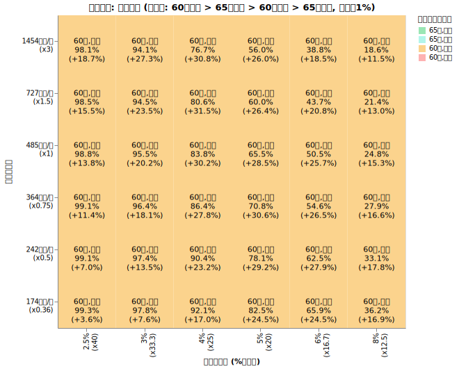
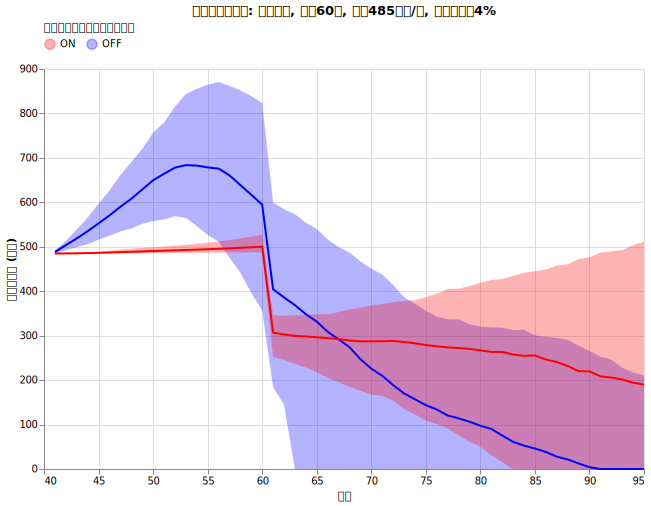
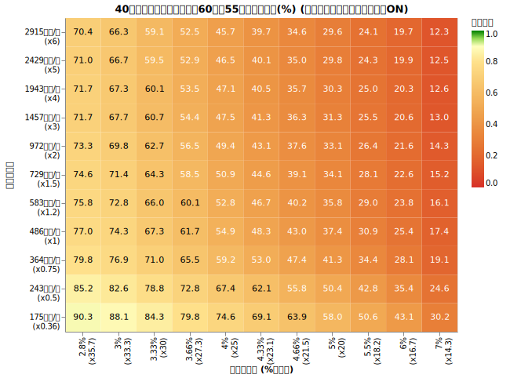
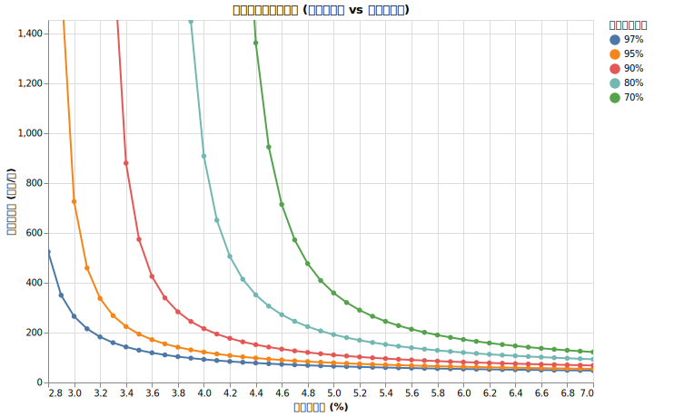
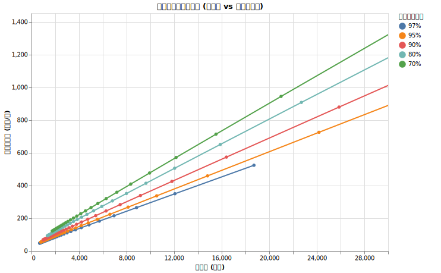

# 40歳の取り崩し最適戦略では何%ルールなのか

<!--
DO NOT DELETE:
python3 src/all_40yr_grid_main.py --exp_type P-D-RANGE
python3 src/all_40yr_grid_main.py --exp_type P60-D
python3 src/analyze_all_40yr_grid_main.py 
-->

40歳でリタイア。それは多くの人にとって夢のような響きですが、同時に「その後55年間、本当に資産は持つのか？」という大きな不安も伴います。人生の半分以上を資産の取り崩しで過ごすには、極めて慎重な戦略が必要です。安易に「4%ルール」を信じていいのでしょうか。

結論から言えば、40歳リタイアにおける「何％ルール」が適切かは、あなたの年支出によって大きく変わります。支出が極めて少ないケースであれば 4%ルールでも通用する可能性がありますが、一般的な支出水準では 4%ルールはリスクが高すぎます。

今回は ==総資産から適切な年出費を求める公式も提示します。==

戦略だけ知りたい方は[40歳の最適戦略ガイド](#40歳の最適戦略ガイド)へどうぞ。

## 40歳から取り崩しを開始し95歳まで破綻しない確率を最大化する

55年という、半世紀を超える取り崩し期間において、資産を枯渇させないためには、運用、インフレ、そして年金受給までの「空白の20年間」をどう設計するかが決定的に重要です。

ちなみに95歳まで生きられる人は男性で約9%, 女性で約26%です。

!!! info "シミュレーション共通条件"

    * **試行回数**: 2000回
    * **シミュレーション期間**: 55年 (40歳〜95歳)
    * **投資先**:
        * オルカン ([ファットテールを考慮し](fat_tails.md)、[S&P500から補完した悲観的なモデル](sp500_vs_acwi.md), [信託報酬 0.05775%](trust_fee.md))
        * ゼロリスク資産 [(利回り4%)](zero_risk.md)
    * **ダイナミックリバランス**: [毎年行う](dynamic_rebalance.md)
    * **為替リスク**: [USDJPY (期待リターン0%, リスク10.53%)](forex.md)
    * **インフレ率**: [AR(12)粘着モデル (平均1.77%)](cpi.md)
    * **税率**: [20.315%](tax.md)
    * **年金保険料**: 40歳から60歳まで国民年金保険料を支払い (約20.4万/年)。
    * **年金受給**: 60歳から前倒し受給を開始。
        * 基礎年金 + 厚生年金 = 年約99.4万円 (前倒し24%減少)
        * マクロ経済スライドを考慮
    * **SIDE FIRE**: 働かない前提だが、後で考慮する。

!!! info "シミュレーション可変条件"

    * **初期年支出の倍率**: あなたの40歳時の想定年支出。40歳の平均的な年支出（国民年金保険料込）約485万円を1倍とした時の倍率。
    * **初期支出率 (何％ルールか)**: 2.8% から 7%ルールまで検証。
    * **[ダイナミックスペンディング](dynamic_spending.md)**:
        * なし: 出費のトレンドを [家計調査報告](retired_spending.md) のデータに基づき推移させる。 
        * あり: 年出費率が2.63%に近づくように、上限+3%, 下限+0%（絶対に額面は減らさない）で支出を毎年決定。

!!! warning "加味していない条件"

    * NISA, iDeco の非課税枠の詳細は考慮せず、一律の税率を適用
    * 年金にかかる所得税・住民税
    * 生活防衛資金の確保（別途確保を推奨）
    * あなたが一人暮らしか二人暮らしか、年金を２人分もらえるかどうか
    * [あなたが死ぬ確率](mortality.md)

## 実験1: ダイナミックスペンディングと年金受け取りの最適組み合わせを探す

個人の戦略として、以下の組み合わせのどれが最も生存確率を高めるのかを検証しました。

* 年金受給のタイミングを65歳にするか、60歳前倒し受給にするか
* ダイナミックスペンディングをするかしないか

全パターンを試行した結果、95歳時点の生存確率は以下のようになりました。

縦軸は40歳時点での年出費、横軸は何%ルールで切り崩しを開始するかを表しています。

40歳リタイアにおいても、==**年金を60歳に前倒し受給してダイナミックスペンディングを行う**== 戦略が、生存確率を最大化することがわかります。これは、早期リタイアにおいて「いかに早くキャッシュフロー（年金）を確保し、運用資産の取り崩しを抑えるか」が重要であることを示しています。

## 実験2: ダイナミックスペンディングの効果と実際の暮らし方

今回のダイナミックスペンディング戦略を詳しく見ると、以下のようになります。

!!! info "40歳からのダイナミックスペンディング"

    * 今年の支出を $X$円 とする
    * 来年の支出の上限を $(X + 3\%)$円、下限を $X$ と設定
    * 来年の支出の目標値を (総資産 × $2.63\%$) とする
    * 目標値が下限〜上限の範囲内ならその値を、範囲外なら上限または下限を採用する

これは、支出を前年比 +0% 〜 +3% の範囲に収めつつ、総資産の 2.63% という「安全圏」を目指す戦略です。

40歳時に年485万の支出、4%ルールで開始した場合の支出推移を見てみましょう。

**青線（ダイナミックスペンディングなし）**

青線は、ダイナミックスペンディングをしなかった場合の取り崩し量 (=年支出 - 年金受給) の推移の中央値です。我慢をしない素直な支出と考えて下さい。支出は、生活水準を[家計調査に基づいた支出トレンド](retired_spending.md#年齢ごとの支出の推移のグラフ)と物価上昇率をかけ合わせた値になっています。トレンドに従って55歳までは支出が増えていき、60歳で年金受給が始まることで、取り崩し額（通算支出）が減少します。青い背景は25, 75のパーセンタイルで、物価が上がる世界線と下がる世界線があることに起因します。

**赤線（ダイナミックスペンディングあり）**

赤線はダイナミックスペンディングを行った場合の中央値、赤い背景は25%, 75%のパーセンタイルです。

!!! important "**成功の鍵は、60歳までの「20年間の我慢」です。**"

    40歳からリタイアする場合、4%ルール（支出率4%）は依然として目標の2.63%よりも高い支出をしています。そのため、最初の20年間は、運用益が十分に積み上がるまで、額面上の支出を極力増やさずに「耐える」時期となります。60歳になり年金が手に入ると、状況は一気に好転し、その後の支出を増やしていく余裕が生まれます。

## 実験3: 生存確率を最大化する「何％ルール」の公式

「60歳受給、ダイナミックスペンディングあり」を前提に、55年後の生存確率の分布を精査しました。

このデータを元に、初期支出率と初期支出額から生存確率を予想するモデルを作成しました。
97%から70%までの生存確率のラインを示したのが以下のグラフです。

x軸を総資産に置き換えたものが以下です。

### 生存確率に基づいて初期出費額を決める公式

シミュレーションの結果から、以下の公式が導き出されました。40歳リタイアという長期戦においては、資産額だけでなく「年金」の支えが相対的に小さくなる（受給までが遠い）ため、50歳・60歳リタイアよりも係数が厳しめになっています。

| 目標生存確率 | 初期支出額を求める公式 |
| --: | --- |
| 97% | 総資産の 2.7% + 35万円 |
| 95% | 総資産の 2.9% + 38万円 |
| 90% | 総資産の 3.2% + 43万円 |
| 80% | 総資産の 3.7% + 50万円 |
| 70% | 総資産の 4.2% + 55万円 |

例えば、40歳時点で総資産が1億円あり、生存確率95%を目指す場合：
$10000 \times 0.029 + 38 = 328$ 万円/年
の支出額に抑えることができれば、95歳まで資産が枯渇しない確率が95%となります。これは約3.3%ルールに相当します。

## 40歳の最適戦略ガイド

**1. 無リスク資産の構築**

税引前4%程度の利回りが期待できる無リスク資産を確保してください。詳細は[無リスク資産](zero_risk.md)を参照。

**2. 自分の支出許容額を算出する**

1. 現在の総資産（税引き後評価額）を把握します。
2. 目指したい生存確率を決め、[上記の公式](#生存確率に基づいて初期出費額を決める公式)を使って「許容される初年度の支出額」を計算します。
3. もし現在の支出がその額を超えているなら、その差額が「40歳リタイアの代償」です。
    * 支出を削るか、資産をさらに積み増すまでリタイアを待つか、[サイドFIRE](side_fire.md)で補う必要があります。

**3. リタイア後の実行ルール**

1. **毎年年初にダイナミックスペンディングを行い、その年の支出を決める**
    * 実行のルール
        * 毎年年初に昨年の支出額 $X$ を確認します。
        * 今年の支出の上限を $X \times 1.03$、下限を $X$ とします。
        * 目標支出を **(現在の総資産 $\times$ 2.63%)** とし、上限・下限の範囲内で今年の支出を決定します。
    * 目標支出率(2.63%)に達するまでは、額面上の支出を維持し、「実質的な節約」を行いながら資産の成長を待ちます。
2. **毎年年初に資産配分を最適化する（[ダイナミックリバランス](dynamic_rebalance.md)）**
    * [最適オルカン比率シミュレーター](optimal_ratio_calc.html)を使用します。
    * 残り年数 = $95 - 現在の年齢$。
    * 支出率 = (昨年の実支出額 $\div$ 現在の総資産) を入力し、導き出された比率に従ってオルカンと無リスク資産をリバランスします。
3. **年金は60歳から前倒し受給を開始する**
4. 60歳になったら [60歳の取り崩し最適戦略では何%ルールなのか](all_60yr.md) も参考にしてください。

!!! warning "生活防衛資金の確保"
    このシミュレーションは、55年間のあらゆる不測の事態をカバーしているわけではありません。シミュレーションで使う「総資産」とは別に、数年分を賄える生活防衛資金を現金で確保しておくことを強く推奨します。
