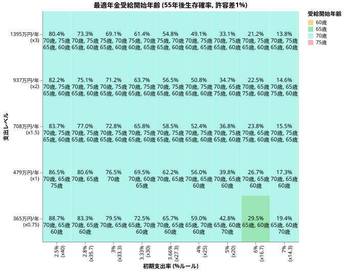
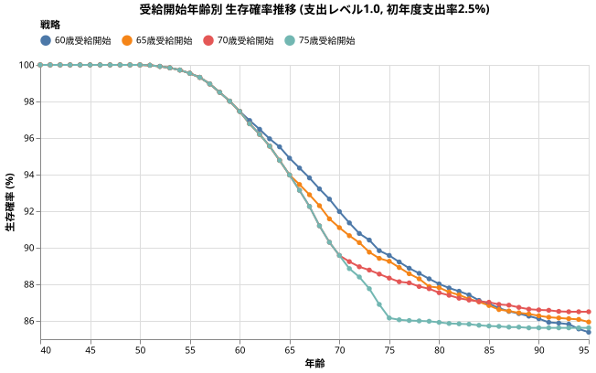
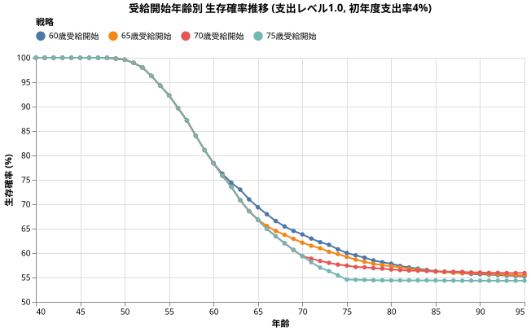
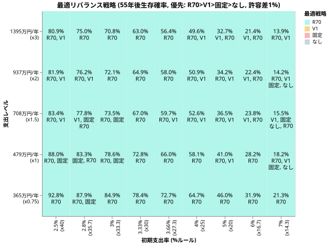
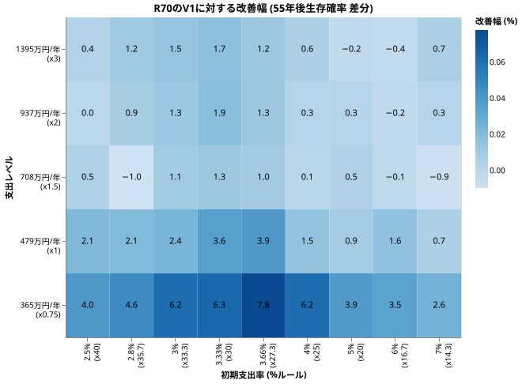
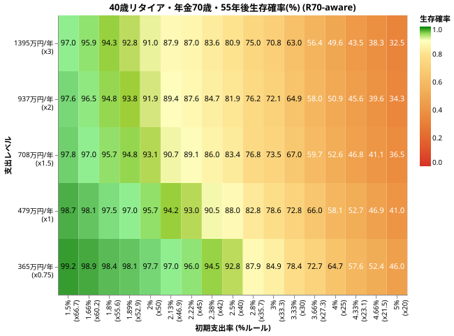
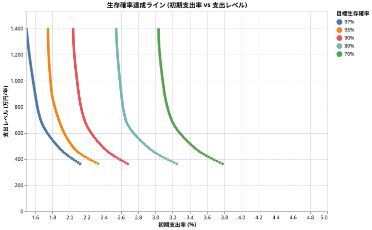
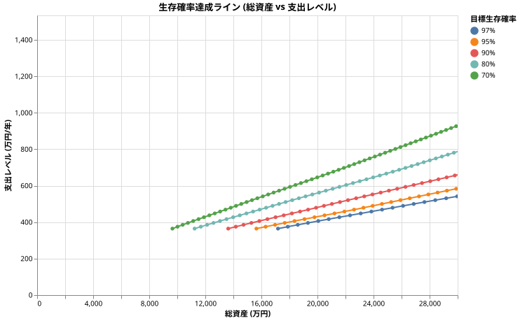
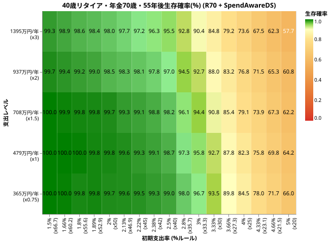
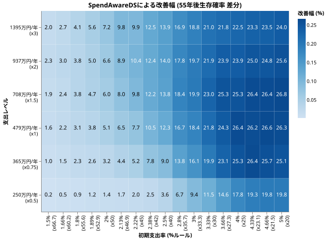

# 40歳からの取り崩しの最適戦略は何%ルールなのか (2人世帯以上・FAT FIRE編)

<!--
DO NOT DELETE:

src/all_yr.sh execute_all_40yr
-->

本稿では、支出額が多めの (例: 2人以上世帯やFAT FIREでの) 場合の40歳からの取り崩し戦略を検証し、最適戦略を提示します。

結論として、「4%ルール」かどうかは支出レベルによります。2人以上世帯の平均的な支出額である479万円で95歳までの生存確率95%を達成するには2億3,200万くらい必要です (支出率2.0%)。一方、40歳時に年350万の支出額である場合、95歳までの生存確率95%を達成するには約1億4,500万くらい必要です (支出率2.4%)。

!!! abstract "重要なポイント"
    * **年金は70歳受給が最適**: (2人以上世帯)40歳リタイアの場合、長期間の生存確率を最大化するには70歳まで受給を遅らせるのが有利なケースが多かった。
    * **ライフプランに応じたリバランスが効果的**: 70歳の年金受給開始を含めた95歳までのライフプランを確定させることで、生存確率を1~10%上昇させることができる。
    * **資産額と支出額から生存確率を算出可能**: 55年間の生存確率に応じた最適な支出額を導き出す公式やツールを作成したので使ってみてね。
    * サイドFIREとして副収入を稼ぐ効果は、生存確率が低いときほど有効。しかし、生存確率が低いままアーリーリタイアをすることの危険性は認識するべき。
    * 「生存確率が低い場合に支出を毎年2%ずつ削る」という事ができる場合は、生存確率をかなり上げることができる。

戦略だけ知りたい方は[40歳の最適戦略ガイド](#40歳の最適戦略ガイド)へ進んでください。

## 40歳から取り崩しを開始し95歳まで破綻しない確率を最大化する

ちなみに現在40歳の人が95歳まで生きられる確率は男性で13.0%, 女性で31.0%です ([寿命・健康寿命予測ツール | たきびFIRE](https://takibi-fire.com/app/life-expectancy-calculator/))。

55年という長期の取り崩し期間において、生存確率を上げるために個人ができることは主に以下の3点です。

* 年金の受給タイミングの最適化
* ライフプランに合わせたリバランス（資産配分の変更）
* 状況に応じた支出の調整

これらの要素を組み合わせた、最適な戦略を検証しました。

!!! info "シミュレーション共通条件"

    * **シミュレーション期間**: 55年 (40歳最初〜95歳最初)
    * **投資先**:
        * オルカン ([ファットテールを考慮し](fat_tails.md)、[S&P500から補完した悲観的なモデル](sp500_vs_acwi.md), [信託報酬 0.05775%](trust_fee.md))
        * ゼロリスク資産 [(利回り4%)](zero_risk.md)
    * **ダイナミックリバランス**: [毎年行う](dynamic_rebalance.md)
    * **為替リスク**: [USDJPY (期待リターン0%, リスク10.53%)](forex.md)
    * **インフレ率**: [AR(12)粘着モデル (平均1.77%)](cpi.md)
    * **税率**: [20.315%](tax.md)
    * **支出**: [40歳以降の国民平均支出のカーブ](retired_spending.md#年齢ごとの支出の推移のグラフ)に沿って穏やかに減っていく
    * **年金**: 年130.8万円 (65歳受給時のベース)、ただし受給タイミングを変える
        * 40歳から60歳までの20年間、1号国民年金保険料 (年21.5万円) を支払う
        * 基礎年金: 満額81.6万
        * 厚生年金: 49.2万円 (= 2.736 × 18年), 年収500万相当 (22歳〜39歳まで勤務)
        * マクロ経済スライドを考慮
    * **SIDE FIRE**: [しない。働かない前提。](side_fire.md)
    * **死亡率**: [考慮しない](mortality.md)

!!! warning "加味していない条件"

    * 何人暮らしか、二人暮らしの場合に世帯の出費を賄っているか、年金を２人分受給しているかなどは考慮していません
    * NISA, iDeco の非課税枠の詳細は考慮せず、一律の税率を適用
    * 年金にかかる所得税・住民税
    * 生活防衛資金の確保（別途確保を推奨）

## 実験1: 40歳リタイアに特化した年金受取りの戦略を探す

40歳からリタイアする場合、年金受給開始（最短60歳）まで少なくとも20年の空白期間があります。この長期間の取り崩しに耐えつつ、その後の年金受給をどう設定するのが最適かを解析します。

!!! info "シミュレーション可変条件"

    * **初期年支出の倍率**: あなたの40歳時の想定年支出。40歳の平均支出479.3万 (生活費457.8万 + 保険料21.5万) を1倍とした時の倍率。
    * **初期支出率 (何％ルールか)**: 2.5% から 7%ルールまで検証。
    * **[年金受給タイミング](pension.md)**:
        * 60歳から繰上げ受給を開始 (繰上げ・24%減少) → 年99.4万円
        * 65歳から受給 → 年130.2万円
        * 70歳 繰下げ・42%増加 → 年185.7万円
        * 75歳 繰下げ・84%増加 → 年240.7万円

!!! warning ""

    このシミュレーションでは、4%の支出率というのは初年度のみです。それ以降は[支出率のカーブ](retired_spending.md#年齢ごとの支出の推移のグラフ)と物価上昇率によって決まります。

### 実験1の結果

全パターンを試行した結果、95歳時点の生存確率は以下のようになりました。

!!! info "ヒートマップの読み方"

    縦軸は40歳時点での年間支出、横軸は何%ルールで取り崩しを開始するかを表しています。

    例えば「4%ルール」「479万」の地点を見ると、

    *40歳時に年479万の支出だった人が4%ルール（総資産 1.2億円）で取り崩すと、95歳までの生存確率は 56.0% でした。最適戦略は "70歳受給" でした。*

    という意味です。実際には60歳, 62歳, ... 75歳の生存確率はわずかに違うのですが、細かい違いを気にすると結論が出しづらいので、(生存確率の最大値 - 1%) に入る戦略を全てヒートマップ内に表示しています。

こう見ると、==一番頻出するのが70歳受給== ということがわかります。

具体的に何が起きているのか時系列で見てみましょう。

まずは**総資産1億9172万、初年度年支出 479万 (2.5%)の場合**です。

このグラフを見ると、実は年金の受給タイミングは微々たる差しかないことがわかります。60歳から85歳までの生存確率には受給タイミングによって影響があることがわかるものの、95歳生存確率を見ると、差異が少なくなっていることがわかります。

次は**総資産1億1983万、初年度年支出 479万 (4%)の場合**です。

95歳時点での生存確率が最大なのは70歳受給ですが、4%の支出ルールがそもそも厳しすぎるため、年金受給タイミングではそこまで差がなくなっているのがわかりますね。

「70歳受給が全体的にはわずかに良いが、どれも似たりよったり」という解釈でいましょう。

### まとめと提案

==40歳リタイアであっても、最適な年金受取開始時期はほぼ多くのケースで 70歳という結論が出ました。==

ただしこれは2人以上世帯を想定した支出です。単身世帯やもっと倹約できる場合は違った結果となります。

## 実験2: 年金受給70歳固定の時のリバランスの最適戦略を探す

==年金受給を70歳に固定させるといいことがあります。それはライフプランが確定することです。== 将来の物価上昇率はわかりませんが、現在の物価価値における将来の予想がとりあえずたつことになります。

実験1では、「V1 ダイナミックリバランス」という、ライフプランを考慮しない方法を用いていました。しかし、[ライフプランを考慮した最適配分](spend_aware_dynamic_rebalance.md)で紹介したように、ライフプランが確定すると、そこから逆算してオルカンと無リスク資産の最適配分戦略をシミュレーションから事前に求めることができます。

このアイデアが「40歳リタイア・70歳年金受給」でもうまく機能するか実験してみます。

!!! info "シミュレーション可変条件"

    * **初期年支出の倍率**: 40歳の平均支出479.3万を基準とした倍率。
    * **初期支出率 (何％ルールか)**: 2.5% から 7%ルールまで検証。
    * **リバランス戦略**:
        1. **「なし」・リバランスなし**: 初年度にオルカンに100%投資
        2. **「固定」・固定最適比率**: [最適配分を繰り返す](dynamic_rebalance.md) の時に求めた「毎年全く同じ支出レベルを維持する場合に特化した最適化関数」を使い、55年生存確率を一番高める配分を一度だけ計算し、毎年その配分になるようにリバランスします。
        3. **「V1」・ダイナミックリバランス**: [最適配分を繰り返す](dynamic_rebalance.md) の時に求めた「毎年同じ支出レベルを維持する場合に特化した最適化関数」を使い、毎年年初に残り年数と年間支出から求めた最適配分にリバランスする戦略。実験1の設定と一緒。
        4. **「R70」・ライフプランを考慮した最適リバランス**: [ライフプランを考慮した動的支出](spend_aware_dynamic_spending.md)で紹介した方法を用いて、「40歳から緩やかに支出が減り、70歳から年金を受給する」ライフプランに合わせてバランスを最適化する関数を求めて、それに従って毎年リバランスする戦略。

### 実験2の結果

全パターンを試行した結果、95歳時点の生存確率は以下のようになりました。

ヒートマップの読み方は[実験1](#実験1の結果)と一緒です。

各｛初年度年支出率, 支出レベル｝ごとに4つの手法を比較するシミュレーションを行い、最高生存確率とそれに近い手法を抽出して列挙しました。

==どれもライフプランを考慮した最適リバランス(R70)が生存確率が一番高い== ことがわかります。

==40歳リタイアにおいても、ライフプランを考慮した最適リバランス(R70)が最も高い生存確率を達成しました。==

参考までに V1 と R70 の差を表したヒートマップがこちらです。

全体的に効果的ですが、支出レベルが低いほうがより効果的なことがわかります。

## 解析: 40歳リタイアの最適戦略の「公式」を探す

実験1,2 で「70歳での年金受給」「そのライフプランに最適化させたリバランス戦略」が最適であることを示しました。

さて、この戦略でもっと細かい年支出率、支出レベルの組み合わせを行った結果がこちらです。

「年支出額が上がれば上がるほど、初期総資産が下がれば下がるほど、生存確率が下がる」という当たり前の結果ではありますが、目をこらすと、反比例の双曲線が現れているのがわかるでしょうか。

例えば生存率97%を取りそうな場所、90%を取りそうな場所、などをうまく補間 (PCHIPを使いました) して線を結ぶとこのようになります。

この曲線を変換して、x=総資産、y=40歳の支出にすると驚くほど綺麗な関係が確認できました。

直線的な関係が確認できます。

??? info "なぜこれが驚きなのかの詳しい解説"

    今回のシミュレーションはとても複雑な現象を扱っています。

    * オルカンの株価はファットテールを加味した複雑な値動きを使っていて、レアな大暴落も再現します。
    * 物価上昇率も粘着モデル (AR(12)) を使い、物価上昇も下落も再現します。
    * 年支出額は40歳から国民の平均に従い徐々に下がるグラフとなっています。これは全く数学的ではない動き方をします。
    * 年金受給額も物価上昇＋マクロ経済スライドを考慮した値動きになっています。
    * その上で、毎年オルカンと無リスク資産をうまくリバランスする関数を(randomシードを別にして)学習し、それを本番環境で実行しています。
    * 実際に得られた得られた85の確率を3次曲線で補完した97%生存ライン、などが上記のグラフです。

### 資産と支出の公式

55年間のシミュレーション結果から導き出された公式です。

| 目標生存確率 | Spendを求める公式 | R2 Score |
| --: | --- | --- |
| 97% | Spend = M の 1.36% + 133万円 | 0.9991 |
| 95% | Spend = M の 1.61% + 105万円 | 0.9999 |
| 90% | Spend = M の 1.88% + 102万円 | 1.0000 |
| 80% | Spend = M の 2.36% + 90万円 | 0.9999 |
| 70% | Spend = M の 2.84% + 85万円 | 1.0000 |

R2 Score というのは、この公式のデータへのマッチ具合を表していて、0.999 はほぼパーフェクトな直線であったことを示しています。

==この公式は以下の使い方ができます。==

#### 総資産と目標生存確率から支出額を求める

例えばあなたの総資産が1億円だとします。この時、95歳まで95%の確率で生存できるような初年度支出額は

$$
10000\text{万} \times 1.61\% + 105 = 266\text{万}
$$

ということがわかります。これは**2.66%ルール**に相当します。

#### 支出額と目標生存確率から総資産を求める

逆に初年度支出を400万にして、95歳まで90%の生存確率にするプランを選ぶなら、

$$
400\text{万} = \text{総資産} \times 1.88\% + 102\text{万}
$$

を解いて

$$
\text{総資産} = (400 - 102) / 1.88\% \approx 1\text{億}5851\text{万}
$$

ということがわかります。

### 戦略を計算・評価するツール

そんなのまどろっこしいよ！という人のために簡易ツールを作りました。

ちょっと簡易版なので上の表に載せた数字とわずかにずれますが、全ての生存確率で計算できるようにしてあります。

「計算モード」を選んでから入力して下さい。

<iframe 
  src="./retire_formula.html?data=all_40yr" 
  width="100%" 
  height="400" 
  frameborder="0" 
  scrolling="no" 
  style="max-width: 500px; display: block; margin: 0 auto; border: none;"
></iframe>

??? info "技術的な詳細：内部で使っている詳しい計算式"

    色々なモデルを試した結果

    $$
    logit(P) = \frac{a \times \text{初期支出} + b \times \text{総資産} + c}{d \times \text{初期支出} + e \times \text{総資産} + 1}
    $$

    という式が、適合度の高い結果となったので、そのモデルを使って計算しています。

このツールを使うと、例えば、**40歳時点で(2人以上世帯での)平均的な支出額479万を目指す場合、生存確率95%で必要な総資産は22,852万円 (2.0%ルール)、98%で必要な総資産は27,099万円となっています。**

### 40歳リタイアで考慮するべき点

40歳からの取り崩し戦略では以下の点に注意しましょう。

* **支出の上昇と低下**: 平均的な世帯では40歳以降支出は上昇し続け、支出のピークが55歳です。60歳以降は支出が低下していきます。これを事前に織り込むことが大事です。
* **厚生年金の減少**: 40歳で仕事をやめるため、厚生年金が減ります。70歳からの増額でカバーする面はありますが、70歳までに悪い状態になっていない必要があります。
* **支出レベル**: 40歳時点の支出レベルが低い人のほうが長期生存確率は高いです。支出レベルを無視する「4％ルール」は鵜呑みにしてはいけません。

## 40歳の最適戦略ガイド
以上のまとめとして、具体的な戦略を詳しく解説します。

### 1. 無リスク資産の設定

この戦略は税引前4%程度の利回りが期待できる無リスク資産をポートフォリオに組み込むことを想定しています。

詳細は[日本国内における「無リスク・低ボラティリティ資産」の候補](zero_risk_options.md)を参考にして下さい。

### 2. 自分のライフプランを算出する

1. 現在の総資産（税引き後評価額）を把握します。
2. 40歳時点での年支出を想定します。

### 3. このシミュレーションの想定と沿っているかを確認する

1. 今回のシミュレーションでは40歳以降のあなたの消費支出(税・保険料以外の支出)がだいたい[このグラフの水色線](retired_spending.md#年齢ごとの支出の推移のグラフ)に**比例して**沿うことを仮定しています。つまり、物価上昇率を除いて75歳まで緩やかに支出が低下していきます。この仮定があなたに合っているか確認して下さい。
2. 今回のシミュレーションでは22歳から39歳までの18年間会社員として働き、その後40歳から60歳まで1号国民年金保険料を支払うと仮定しています。

### 4. 自分の生存確率を確認する

[上記のツール](#戦略を計算評価するツール)を使って「許容される初年度の支出額」を計算します。

* 例えば税抜き総資産が10000万で、年支出が479万とすると、95歳生存確率は42.6%となります。これを許容するかどうかを検討する必要があります。
* どんな戦略をとっても、あなたが目にするのはシミュレーションが出す95歳時の生存確率です。つまり ==最終的に重要になってくるのが**あなたは何％の生存確率で満足するか**という部分です。==

    この「確率」というのは、「いくつものシナリオを仮想的に作った時、何％で資金枯渇しないかどうか」という数字です。しかし、現実にはそのうちの一つのシナリオしか経験しません。95%で安心していても、運が悪ければ5%の枯渇パターンを引くかもしれません。生存確率が10%だとしても、運が良い結果になるかもしれません。
    
    この「何％で満足するか」という数字は人による部分です。例えばあなたが97%の生存確率の戦略で満足できなければ、より資産を増やすか、支出を減らす努力が必要です。例えばあ50%の生存確率で満足できるのであれば、必要な資産もだいぶ楽観的にできるでしょう。

* それを理解したうえで、例えば生存確率が低いのが嫌であれば、支出を下げる努力をしてみましょう。「総資産と目標生存確率から支出額を求める」という計算モードを使うと、生存確率を指定して支出額を求めることができます。

* とはいえ、この「満足できる数字」をきちんと決めることは難しいかと思います。大事なのは、この確率を時々気にしながら生活をすることかと思います。例えば **「確率が下がってきたら支出を抑えてみる」** という風に、**将来のあなたは戦略を変えられる**ということも忘れてはいけません。

    最後の章の[支出制限を行う最適戦略](#支出制限を行う最適戦略)で、この徐々に下げるアイデアの効果を検証します。

### 5. 毎年年初に資産配分を最適化する

年初に、以下のツールに従ってオルカンと無リスク資産を配分します。

あなたの支出レベル (40歳時点での取り崩し額) によって結果が変わるので、近い数字を選んで下さい。

<iframe 
  src="./retire_dp_calc.html?data=all_40yr" 
  width="100%" 
  height="680" 
  frameborder="0" 
  scrolling="no" 
  style="max-width: 500px; display: block; margin: 0 auto; border: none;"
></iframe>

### 6. 年金は70歳から受給を開始する

忘れないようにしましょう。

!!! warning "生活防衛資金の確保"
    このシミュレーションは、医療費や冠婚葬祭などの予期せぬ大きな出費を想定していません。シミュレーションで使う「総資産」とは別に、数ヶ月以上を賄える生活防衛資金を現金で確保しておくことを強く推奨します。

ここまでの戦略を行えば、最初のツールで求めた生存確率に達することができます。

---

## 支出制限を行う最適戦略

上の戦略はあくまでライフプランを固定し、物価上昇は許容するものの、支出削減は一切しない場合の話でした。

もしあなたがある程度の支出削減をしても良いなら、生存確率はさらに上がります。

[ライフプランを考慮した支出制限](spend_aware_dynamic_spending.md)をもとに、次の戦略を行ってみます。

!!! tips "支出削減のアルゴリズム"

    毎年年初に、支出を以下の方法で決定する。

    * その年の「自然な支出」を $\text{自然な支出} = \text{去年の支出} \times \text{自然な支出推移率} \times \text{物価上昇率}$ として計算する。
        * 自然な支出推移率: [このグラフの水色線](retired_spending.md#年齢ごとの支出の推移のグラフ)に従って、$N-1$歳から$N$歳になるときの上昇率か減少率を掛け算する。例えば70歳から71歳になる時は、支出が350万から340万くらいに減っているので、去年の支出に 0.971を掛ける
        * 物価上昇率: 去年の1月の物価と今年の1月の物価を比較して、物価上昇率を計算し、その値を掛け算する。
    * 上記のツールに従ってリバランスの割合を決定する。その時一番右に現れる「生存確率」の緑色の数字を見る。
        * それが 100% ならば、自然な支出を最大+1%まで贅沢を許す。
        * それが 97% 以下ならば、自然な支出を最大-2%まで倹約する。

これを行うとさらに生存確率が上がります。

支出制限を行わない時と比べた生存確率の伸び（改善幅）は以下の通りです。

40歳リタイアのように期間が長い場合、この動的な支出調整の効果は劇的です。

!!! warning ""

    ただし、内部的にはかなり支出レベルを削減していることを忘れてはいけません。「物価上昇率を加味した後で毎年2%ずつ支出を削る」がどれくらい現実的か検討しましょう。

## 副収入にたよる戦略

副収入(サイドFIRE)を行う場合、一番大事なのは「どれくらいの額が必要か」という話になります。

以前[サイドFIRE](side_fire.md)で行った解析結果も有用ではありますが、**ライフプランを確定させるともっと合理的な戦略**が行えると思います。

今回行った「ライフプランを確定させることで生存確率を上げる」戦略を取る場合、サイドFIREの収入は「取り崩し額を減らす」ことに使うのではなく「総資産を上げる部分」に使います。

仮に40歳で1億円持っている人が今年479万の取り崩しをするとして、副収入で100万稼ぐとすると、総資産が1億100万の人が479万の取り崩しをするようなシミュレーションを行えばよいのです。

??? "なぜ取り崩し額を減らすことに使えないか"

    これは私の作ったツールの前提による部分なので、気にする必要はありません。

    このツールは「ライフプランを確定させる」ことを前提としています。ツールには年齢と取り崩し額を入力する欄がありますが、取り崩し額は(物価上昇率を考えない)実質額としてはもう決まっている前提となります。そのため、479万の取り崩しをする人が100万の収入があるからと言って取り崩しを379万円にしてしまうと、ツールの内部では「20%物価が下がった世界線」での計算が行われてしまいます。今後95歳になるまで、取り崩し額がかなり減っていると勘違いするので、生存確率が異様に高くなります。

[「40歳リタイア用 最適オルカン配分計算機」](#5-毎年年初に資産配分を最適化する)のツールを見てみましょう。

40歳の時に1億1975円 (x25) もっているとして、479万の出費をする場合の生存確率は67.4%ですが、この生存確率が副収入によって以下のように変化していきます。

| 手取り副収入 | 総資産 | 95歳生存確率 |
|--:|--:|--:|
|  0万|     11,975万 | 48.5% |
| 48万 (10%) | 12,023万 | 48.2% |
| 96万 (20%) | 12,071万 | 49.3% |
| 144万 (30%) | 12,119万 | 49.7% |
| 192万 (40%) | 12,167万 | 50.0% |
| 240万 (50%) | 12,215万 | 50.4% |

支出の半分を稼げるとすると、生存確率が2%ほど上昇することがわかります。

ちなみに、あなたの総資産が1億9160万 (x40) だと、副収入が与える効果は減っていきます。

| 手取り副収入 | 総資産 | 95歳生存確率 |
|--:|--:|--:|
|  0万| 19160万 | 78.0% |
| 48万 (10%) | 19208万 | 78.1% |
| 96万 (20%) | 19256万 | 78.1% |
| 144万 (30%) | 19304万 | 78.2% |
| 192万 (40%) | 19352万 | 78.2% |
| 240万 (50%) | 19400万 | 78.3% |

このように考えると、副収入は生存確率が低いときには効果があります。

しかし、生存確率が低いままの状態で取り崩し生活を始めるということ自体の危険性を認識しておく必要があります。

## まとめ

40歳からのリタイアで、(2人以上世帯の)平均的な支出額である479万で取り崩し生活を開始する場合、95%生存できる必要額は 2億2,852万 (年支出率2.0%)となりました。

一方、350万くらいの支出に抑えられるのであれば、95%生存できる必要額は 1億4,548万 (年支出率2.4%)となりました。

あなたが40歳付近であれば、まずは一度[戦略を計算・評価するツール](#戦略を計算評価するツール)で試算してみて下さい。どれだけ現状が楽観的か悲観的かがわかるかと思います。

あなたが40歳以前であれば、40歳到達時点でどのような状態になっていたいか、の指針になるかもしれません。

ライフプラン（将来の支出）を確定させることが生存確率を上げる最善手です。現実的には予測できない支出もありますが、それも含めてしまって構いません。それが決まれば逆にリバランス戦略が確定します。

「生存確率が低い場合に支出を毎年2%ずつ削る」という事ができる場合は、生存確率をかなり上げることができます。

サイドFIREとして副収入を稼ぐ効果は、生存確率が低いときほど有効です。しかし、生存確率が低いままアーリーリタイアをすることの危険性は認識しましょう。
