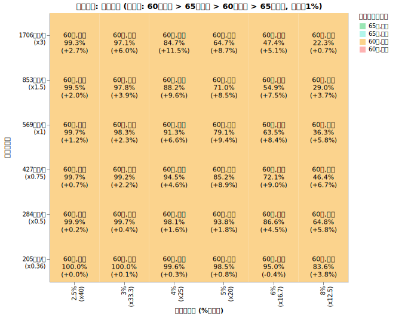
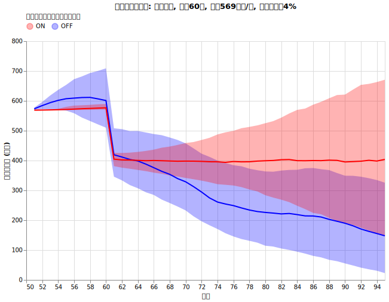
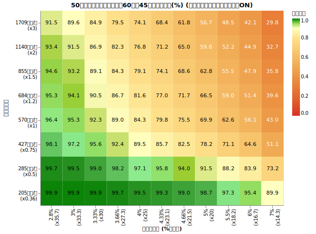
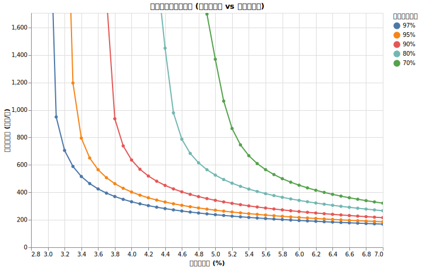
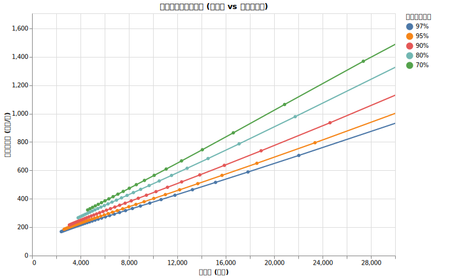

# 50歳の取り崩し最適戦略では何%ルールなのか

<!--
DO NOT DELETE.
python3 src/all_50yr_grid_main.py --exp_type P-D-RANGE-H1
python3 src/all_50yr_grid_main.py --exp_type P60-D1-H1
python3 src/analyze_all_50yr_grid_main.py
-->

50歳という、多くの人がキャリアの円熟期を迎えつつリタイアを意識し始める時期。ここから95歳までの45年間を、いかに資産を枯渇させずに過ごすか。これは60歳リタイアよりもさらに難易度が上がり、より精緻な戦略が求められます。

結論だけ先に書くと、「何％ルール」でやればいいのかはあなたの年支出によります。あなたの年出費が相当少ない Lean FIRE であれば 4%ルールでも安泰ですが、年出費が上がれば上がるほど、「何％ルール」は下げないといけません。

今回は ==総資産を元に適切な年出費を求める公式も提示します。==

戦略だけ知りたい方は[50歳の最適戦略ガイド](#50歳の最適戦略ガイド)へどうぞ。

## 50歳から取り崩しを開始し95歳まで破綻しない確率を最大化する

45年という長期の取り崩し期間において、市場の暴落、インフレ、そして年金受給開始までの空白期間をどう乗り切るかが鍵となります。

ちなみに95歳まで生きられる人は男性で9.46%, 女性で25.99%です。

!!! info "シミュレーション共通条件"

    * **試行回数**: 3000〜5000回
    * **シミュレーション期間**: 45年 (50歳〜95歳)
    * **投資先**:
        * オルカン ([ファットテールを考慮し](fat_tails.md)、[S&P500から補完した悲観的なモデル](sp500_vs_acwi.md), [信託報酬 0.05775%](trust_fee.md))
        * ゼロリスク資産 [(利回り4%)](zero_risk.md)
    * **ダイナミックリバランス**: [毎年行う](dynamic_rebalance.md)
    * **為替リスク**: [USDJPY (期待リターン0%, リスク10.53%)](forex.md)
    * **インフレ率**: [AR(12)粘着モデル (平均1.77%)](cpi.md)
    * **税率**: [20.315%](tax.md)
    * **年金保険料**: 50歳から60歳まで国民年金保険料を支払い (第1号: 20.4万/年)。22~50歳まで年収500万で厚生年金を収めていた想定。
    * **年金受給**: 60歳から前倒し受給を開始。
        * 基礎年金 = 約62万 (= 満額81.6万 × 前倒し24%減少)
        * 厚生年金 = 約58万 (前倒し24%減少、50歳リタイアのため加入期間が短い想定)
        * マクロ経済スライドを考慮
    * **SIDE FIRE**: 働かない前提だが、後で考慮する。

!!! info "シミュレーション可変条件"

    * **初期年支出の倍率**: あなたの50歳時の想定年支出。50歳の平均的な年支出（国民年金保険料込）約569万円を1倍とした時の倍率。
    * **初期支出率 (何％ルールか)**: 2.5% から 8%ルールまで検証。
    * **[ダイナミックスペンディング](dynamic_spending.md)**:
        * なし: 出費のトレンドを [家計調査報告](retired_spending.md) のデータに基づき推移させる。 
        * あり: 年出費率が3.02%に近づくように、上限+3%, 下限+0%（絶対に額面は減らさない）で支出を毎年決定。

!!! warning "加味していない条件"

    * NISA, iDeco の非課税枠の詳細は考慮せず、一律の税率を適用
    * 年金にかかる所得税・住民税
    * 生活防衛資金の確保（別途確保を推奨）
    * あなたが一人暮らしか二人暮らしか、年金を２人分もらえるかどうか
    * [あなたが死ぬ確率](mortality.md)

## 実験1: ダイナミックスペンディングと年金受け取りの最適組み合わせを探す

個人の戦略として、以下の4パターンのどれが最も生存確率を高めるのかを検証しました。

* 年金受給のタイミングを65歳にするか、60歳前倒し受給にするか
* ダイナミックスペンディングをするかしないか

全パターンを試行した結果、95歳時点の生存確率は以下のようになりました。

縦軸は50歳時点での年出費、横軸は何%ルールで切り崩しを開始するかを表しています。カッコ内の数字はダイナミックスペンディングの「なし」と「あり」を比較した際の生存確率の向上幅です。

例えば「4%ルール」「569万」の地点を見ると、
*50歳時に年569万の支出だった人が4%ルール（総資産 1.42億円）で取り崩すと、95歳までの生存確率は 91.3% でした。最適戦略は "60歳受給, あり" であり、ダイナミックスペンディングを行わない場合に比べて生存確率が 6.6% 向上しました。*

グラフがオレンジ一色であることから、==**年金を60歳に前倒し受給してダイナミックスペンディングを行う**== 戦略が、全てのケースで最適であることがわかります。

## 実験2: ダイナミックスペンディングの効果と実際の暮らし方

今回のダイナミックスペンディング戦略を詳しく見ると、以下のようになります。

!!! info "50歳からのダイナミックスペンディング"

    * 今年の支出を $X$円 とする
    * 来年の支出の上限を $(X + 3\%)$円、下限を $X$ と設定
    * 来年の支出の目標値を (総資産 × $3.02\%$) とする
    * 目標値が下限〜上限の範囲内ならその値を、範囲外なら上限または下限を採用する

これは、支出を前年比 +0% 〜 +3% の範囲に収める戦略です。インフレ下では実質的な購買力が低下する可能性がありますが、額面上の支出は維持されます。

ダイナミックスペンディングは効果的な戦略ですが、実態を見ると非現実的な生活に陥る可能性もあるので検証していきます。

50歳時に年569万の支出、4%ルールで開始した場合の支出推移を見てみましょう。

**青線（ダイナミックスペンディングなし）**
青線はダイナミックスペンディングをせず、[50歳からの国民の支出推移](retired_spending.md#年齢ごとの支出の推移のグラフ)に合わせた時の年間通算支出 (=年支出-年金受給) の中央値です。ただし、物価上昇率 (AR(12)モデル) を加味しています。青い背景は25%, 75%のパーセンタイルで、物価が上がる世界線と下がる世界線があることに起因します。60歳でがくっと下がるのは、国民年金保険料の支払いが止まるのと、年金の受給が始まるためです。

そこから74歳くらいまで支出が下がっていきますが、これは特に消費支出が74歳くらいまで急激に下がり、それいこうも穏やかに減少していくためです ([平均支出推移グラフ](retired_spending.md#年齢ごとの支出の推移のグラフ))。25%パーセンタイルでの通算支出が50~100万と低い値になっていますが、これは通算支出(取り崩さなくてはいけなかった金額)であり、年金受給した分を減算した値です。ダイナミックリバランスを行い、無リスク資産を多めにしている場合で、利回り配当＋年金で支出のほとんどをまかなっている状態と考えられます。

**赤線（ダイナミックスペンディングあり）**

赤線はダイナミックスペンディングを行った場合の中央値、赤い背景は25%, 75%のパーセンタイルです。

一見すると青い線よりも支出が多く見えますが、なぜこれで生存確率が6.6%も上がってたのでしょうか。

!!! important "**一番の要因は最初の10年間の我慢といえます。**"

    今回用いたダイナミックスペンディングは、内部目標として「年支出の仮目標を総資産の3.02%にする」「それに満たない場合年支出を上げない」という戦略です。最初が4%の支出なので、資産運用の伸びを待ちながら年支出が3.02%までひたすら待って耐える戦略です。**最初の10年間の耐えは、青線と比較すると微々たるものですが、生存率に大きく影響しています。**60歳になって急に年金の支払いが減り受給が始まると、耐えた分状況が急に明るくなります。年支出3.02%というのは、ゼロリスク資産を増やせば絶対に死なないラインなので、それで100%生存を確保しつつ、残りをオルカンに割り振っていったと考えられます。支出の中央値が伸びていくのはそのためです。ただ、資産運用が芳しくない場合もあるので、25%パーセンタイルの場合はずっと支出を変えずに耐える戦略になっています。ただし、それでもダイナミックスペンディングを行わない青線よりもいい暮らしができているので、これが効果と言えます。

つまり、重要なポイントとしては、

* **そもそも4%ルールはほんの少し無理をしている**
* **そのため最初の10年間は額面上の支出を抑えるような生き方が必要**
* **ともかく60歳まで耐える**

というのが肝です。

## 実験3: 生存確率を最大化する「何％ルール」の公式

「60歳受給、ダイナミックスペンディングあり」を前提に、生存確率の分布を精査しました。

このデータを元に初期支出率と初期支出額から生存確率を予想するモデルを作りました。
97%, 95%, 90%, 80%, 70% の生存確率のラインを作ったのが以下のグラフです。

例えば「4%ルールで90%生きられる初期年支出は600万くらい (つまり総資産は1.5億必要)」というのがわかります。
このグラフは「4%ルール」は大半の人にとってちょっと厳しいのではないか、という状況も示唆しています。

少し見づらいので x軸を総資産に置き換えてみました。

### 生存確率に基づいて初期出費額を決める公式

上のグラフは複雑なシミュレーションの結果としては驚くべきほど綺麗な直線が得られました。==ここから以下の公式が導き出されました。==

| 目標生存確率 | 初期支出額を求める公式 |
| --: | --- |
| 97% | 総資産の 2.8% + 107万円 |
| 95% | 総資産の 3.0% + 114万円 |
| 90% | 総資産の 3.3% + 126万円 |
| 80% | 総資産の 3.7% + 142万円 |
| 70% | 総資産の 4.1% + 155万円 |

例えば、50歳時点で総資産が7000万円あり、生存確率80%を目指す場合：
$7000 \times 0.037 + 142 = 401$ 万円/年
の支出額に抑えることができれば、95歳まで資産が枯渇しない確率が80%となります。

## 50歳の最適戦略ガイド

**1. 無リスク資産の構築**

税引前4%程度の利回りが期待できる無リスク資産を確保してください。詳細は[無リスク資産](zero_risk.md)を参照。

**2. 自分の支出許容額を算出する**

1. 現在の総資産（税引き後評価額）を把握します。
2. 目指したい生存確率を決め、[上記の公式](#生存確率に基づいて初期出費額を決める公式)を使って「許容される初年度の支出額」を計算します。
3. もし現在の支出がその額を超えているなら、差額を計算しましょう。
    * 支出削減で賄える程度であれば、削減していきましょう
    * 差額が稼げる程度ならば[サイドFIRE](side_fire.md)という選択肢もありでしょう
    * そうでなければリタイア時期を遅らせる必要がありそうです

**3. リタイア後の実行ルール**

1. **毎年年初にダイナミックスペンディングを行い、その年の支出を決める**
    * 実行のルール
        * 毎年年初に昨年の支出額 $X$ を確認します。
        * 今年の支出の上限を $X \times 1.03$、下限を $X$ とします。
        * 目標支出を **(現在の総資産 $\times$ 3.02%)** とし、上限・下限の範囲内で今年の支出を決定します。
    * これは目標支出率が3.02%になるまでは、極力額面上の年支出を据え置く方針です。厳しめのFIREをする人は、「年金受給まで10年耐える」という気持ちで頑張りましょう。
2. **毎年年初に資産配分を最適化する（[ダイナミックリバランス](dynamic_rebalance.md)）**
    * [最適オルカン比率シミュレーター](optimal_ratio_calc.html)を使用します。
    * 残り年数 = $95 - 現在の年齢$。
    * 支出率 = (昨年の実支出額 $\div$ 現在の総資産) を入力し、導き出された比率に従ってオルカンと無リスク資産をリバランスします。
    * 現金は生活防衛資金以外ほとんど持たないことが前提です。
3. **年金は60歳から前倒し受給を開始する**
4. もし60歳になったら [60歳の取り崩し最適戦略では何%ルールなのか](all_60yr.md) も参考にして状況を確認しましょう。

!!! warning "生活防衛資金の確保"
    このシミュレーションは、医療費や冠婚葬祭などの予期せぬ大きな出費を想定していません。シミュレーションで使う「総資産」とは別に、数年分を賄える生活防衛資金を現金で確保しておくことを強く推奨します。
