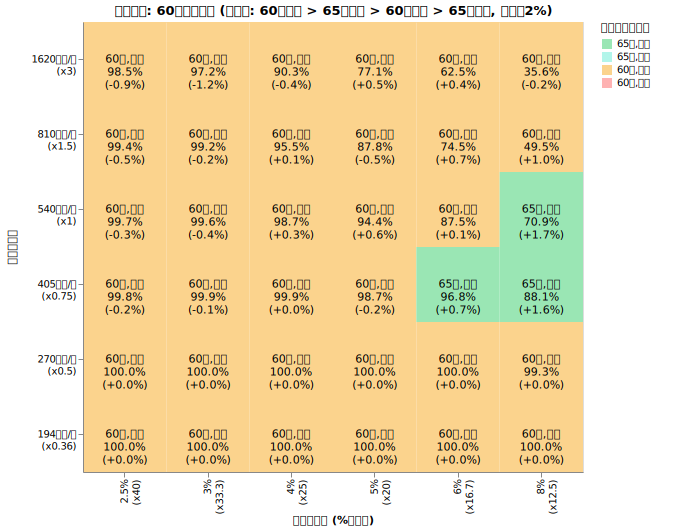
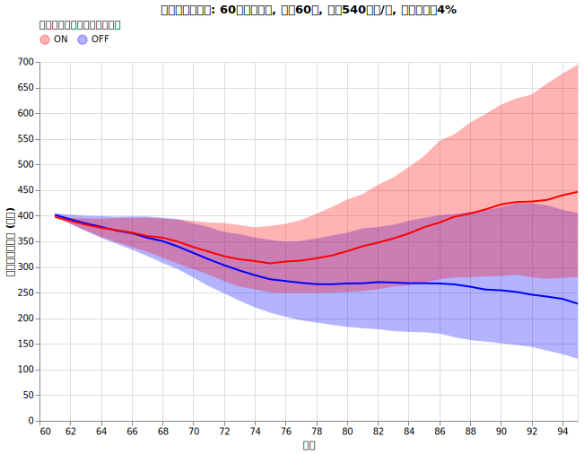
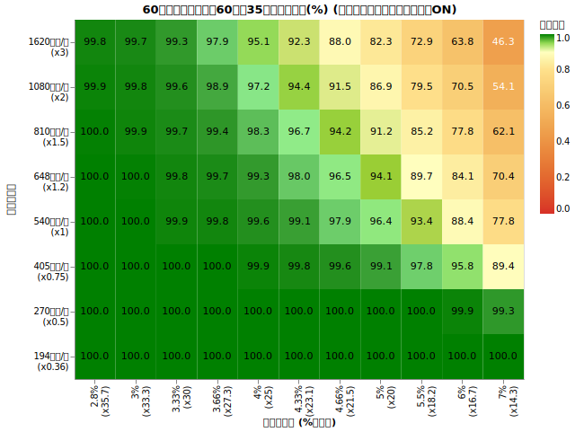
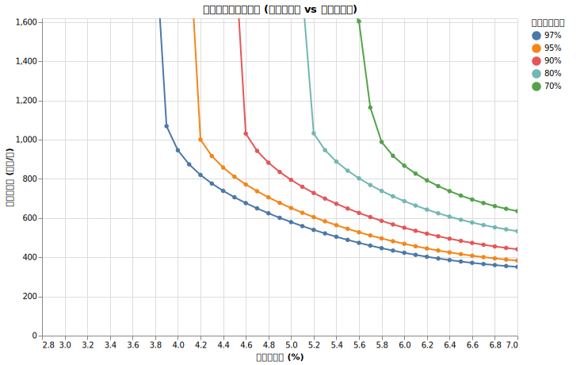
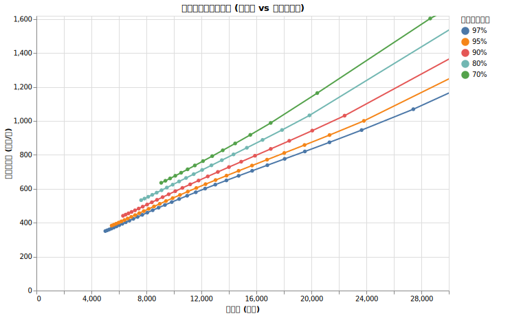

# 60歳の取り崩し最適戦略では何%ルールなのか

<!--
DO NOT DELETE:

python3 src/all_60yr_grid_main.py --exp_type P-D-RANGE
python3 src/all_60yr_grid_main.py --exp_type P60-D1
python3 src/analyze_all_60yr_grid_main.py
-->

今まで資産の取り崩しに関する様々なトピックを扱いました。集大成として、60歳の取り崩し戦略、得に「4%ルールでいいのか」を、60歳に合わせて細かく検証していきます。

結論から言えば、「何％ルール」が適切かは、あなたの年支出によって決まります。支出が少なければ 4%ルールでも十分余裕がありますが、支出が増えるにつれて、許容される「何％」は低くなっていきます。

今回は ==総資産から適切な年出費を求める公式も提示します。==

戦略だけ知りたい方は[60歳の最適戦略ガイド](#60歳の最適戦略ガイド)へどうぞ。

## 60歳から取り崩しを開始し95歳まで破綻しない確率を最大化する

35年という取り崩し期間において、年金受給をどのタイミングで開始し、変動する市場とインフレにどう立ち向かうかが鍵となります。

ちなみに95歳まで生きられる人は男性で9.84%, 女性で26.54%です ([寿命・健康寿命予測ツール | たきびFIRE](https://takibi-fire.com/app/life-expectancy-calculator/))。

!!! info "シミュレーション共通条件"

    * **試行回数**: 2000回
    * **シミュレーション期間**: 35年 (60歳〜95歳)
    * **投資先**:
        * オルカン ([ファットテールを考慮し](fat_tails.md)、[S&P500から補完した悲観的なモデル](sp500_vs_acwi.md), [信託報酬 0.05775%](trust_fee.md))
        * ゼロリスク資産 [(利回り4%)](zero_risk.md)
    * **ダイナミックリバランス**: [毎年行う](dynamic_rebalance.md)
    * **為替リスク**: [USDJPY (期待リターン0%, リスク10.53%)](forex.md)
    * **インフレ率**: [AR(12)粘着モデル (平均1.77%)](cpi.md)
    * **税率**: [20.315%](tax.md)
    * **年金**: 年185.6万円 (約月15.5万)、ただし受給タイミングを2通り試す
        * 基礎年金: 満額81.6万
        * 厚生年金: 104万円 (= 2.736 × 38年)
        * マクロ経済スライドを考慮
    * **SIDE FIRE**: [しない。働かない前提。](side_fire.md)
    * **死亡率**: [考慮しない](mortality.md)

!!! info "シミュレーション可変条件"

    * **初期年支出の倍率**: あなたの60歳時の想定年支出。2人以上の世帯の60歳の平均支出540万を1倍とした時の倍率。
    * **初期支出率 (何％ルールか)**: 1.5% から 6%ルールまで検証。
    * **[年金受給タイミング](pension.md)**:
        * 65歳から受給 → 年185.6万円 (約月15.5万)
        * 60歳から前倒し受給を開始 (前倒し24%減少) → 年141万円 (約月11.7万)
    * **[ダイナミックスペンディング](dynamic_spending.md)**:
        * なし: 出費のトレンドを [家計調査報告](retired_spending.md) のデータに基づき推移させる
        * あり: 年出費率が3.63%に近づくように、上限+3%, 下限+0%（絶対に額面は減らさない）で支出を毎年決定。

!!! warning "加味していない条件"

    * 何人暮らしか、二人暮らしの場合に世帯の出費を賄っているか、年金を２人分受給しているかなどは考慮していません
    * NISA, iDeco の非課税枠の詳細は考慮せず、一律の税率を適用
    * 年金にかかる所得税・住民税
    * 生活防衛資金の確保（別途確保を推奨）

## 実験1: ダイナミックスペンディングと年金受け取りの最適組み合わせを探す

個人の戦略として、以下の4パターンのどれが最も生存確率を高めるのかを検証しました。

* 年金受給のタイミングを65歳にするか、60歳前倒し受給にするか
* ダイナミックスペンディングをするかしないか

全パターンを試行した結果、95歳時点の生存確率は以下のようになりました。

縦軸は60歳時点での年出費、横軸は何%ルールで切り崩しを開始するかを表しています。カッコ内の数字はダイナミックスペンディングの「なし」と「あり」を比較した際の生存確率の向上幅です。

例えば「4%ルール」「540万」の地点を見ると、
*60歳時に年540万の支出だった人が4%ルール（総資産 1.35億円）で取り崩すと、95歳までの生存確率は 99.5% でした。最適戦略は "60歳受給, あり" であり、ダイナミックスペンディングを行わない場合に比べて生存確率が +0.2% 向上しました。*

グラフの右上の一部（資産に余裕がない高支出層）を除き、==**年金を60歳に前倒し受給してダイナミックスペンディングを行う**== 戦略が、多くのケースで生存確率を最大化することがわかります。

## 実験2: ダイナミックスペンディングの効果と実際の暮らし方

今回のダイナミックスペンディング戦略を詳しく見ると、以下のようになります。

!!! info "60歳からのダイナミックスペンディング"

    * 今年の支出を $X$円 とする
    * 来年の支出の上限を $(X + 3\%)$円、下限を $X$ と設定
    * 来年の支出の目標値を (総資産 × $3.63\%$) とする
    * 目標値が下限〜上限の範囲内ならその値を、範囲外なら上限または下限を採用する

これは、支出を前年比 +0% 〜 +3% の範囲に収める戦略です。インフレ下では実質的な購買力が低下する可能性がありますが、額面上の支出は維持されます。

60歳時に年540万の支出、4%ルールで開始した場合の支出推移を見てみましょう。

**青線（ダイナミックスペンディングなし）**

青線は、ダイナミックスペンディングをしなかった場合の取り崩し量 (=年支出 - 年金受給) の推移の中央値です。我慢をしない素直な支出と考えて下さい。支出は、生活水準を[家計調査に基づいた支出トレンド](retired_spending.md#年齢ごとの支出の推移のグラフ)と物価上昇率をかけ合わせた値になっています。60歳になった瞬間から年金受給が始まっています。その後トレンドに従って消費支出が減少していきます。青い背景は25, 75のパーセンタイルで、物価が上がる世界線と下がる世界線があることに起因します。

**赤線（ダイナミックスペンディングあり）**

赤線はダイナミックスペンディングを行った場合の中央値、赤い背景は25, 75パーセンタイルです。

60歳リタイアの場合、50歳リタイアと決定的に違うのは、**開始直後から年金を受給できる点**です。そのため、4%ルール程度であれば最初から「耐える」必要性は低く、運用益が出て総資産が増えるに従って、ダイナミックスペンディングの「上限+3%」の枠内でゆったりと支出を増やしていけることがわかります。

25パーセンタイル（運用が芳しくない世界線）でも、青線と同等かそれ以上の支出を維持できており、生存確率を高めながらもQOLを維持できる非常に優れた戦略と言えます。

しかも、この戦略のほうがわずかに生存確率が高いというおまけ付きです。(99.3% → 99.5%)

## 実験3: 生存確率を最大化する「何％ルール」の公式

「60歳受給、ダイナミックスペンディングあり」を前提に、生存確率の分布を精査しました。

このデータを元に初期支出率と初期支出額から生存確率を予想するモデルを作りました。
97%, 95%, 90%, 80%, 70% の生存確率のラインを作ったのが以下のグラフです。

このグラフから、年支出が高い人ほど「何％ルール」を厳しく（＝支出率を低く）設定しなければならない傾向が読み取れます。

x軸を総資産に置き換えたものが以下です。

### 生存確率に基づいて初期出費額を決める公式

上のグラフは複雑なシミュレーションの結果としては驚くべきほど綺麗な直線が得られました。==ここから以下の公式が導き出されました。==

| 目標生存確率 | 初期支出額を求める公式 |
| --: | --- |
| 97% | 総資産の 3.4% + 187万円 |
| 95% | 総資産の 3.7% + 200万円 |
| 90% | 総資産の 4.1% + 222万円 |
| 80% | 総資産の 4.6% + 252万円 |
| 70% | 総資産の 5.1% + 276万円 |

例えば、60歳時点で総資産が8000万円あり、生存確率95%を目指す場合：
$8000 \times 0.037 + 200 = 496$ 万円/年
の支出額に抑えることができれば、95歳まで資産が枯渇しない確率が95%となります。なんと 6.2%ルールで大丈夫ということになります。

### なぜ60歳リタイアは良い結果になるか

そもそもとして、60歳からの取り崩しは若い年代の人と比べて圧倒的に有利です。

* **期間の短さ**: そもそも95歳まで35年しかありません。
* **年金即時受給**: 国民年金保険料の支払いが終わり、最初から年金が手に入ります。
* **支出トレンド**: 日本人の平均支出は60歳から急激に減少していきます。
* **年金の比重**: 支出を抑えられる人ほど、年金だけで生活の大部分がカバーされます。

## 60歳の最適戦略ガイド

**1. 無リスク資産の構築**

税引前4%程度の利回りが期待できる無リスク資産を確保してください。詳細は[無リスク資産](zero_risk.md)を参照。

**2. 自分の支出許容額を算出する**

1. 現在の総資産（税引き後評価額）を把握します。
2. 目指したい生存確率を決め、[上記の公式](#生存確率に基づいて初期出費額を決める公式)を使って「許容される初年度の支出額」を計算します。
3. もし現在の支出がその額を超えているなら、差額を計算しましょう。
    * 支出削減で賄える程度であれば、削減していきましょう。
    * 差額が大きい場合は、リタイア時期を数年遅らせるか、[サイドFIRE](side_fire.md)で補うことを検討しましょう。

**3. リタイア後の実行ルール**

1. **毎年年初にダイナミックスペンディングを行い、その年の支出を決める**
    * 実行のルール
        * 毎年年初に昨年の支出額 $X$ を確認します。
        * 今年の支出の上限を $X \times 1.03$、下限を $X$ とします。
        * 目標支出を **(現在の総資産 $\times$ 3.63%)** とし、上限・下限の範囲内で今年の支出を決定します。
2. **毎年年初に資産配分を最適化する（[ダイナミックリバランス](dynamic_rebalance.md)）**
    * [最適オルカン比率シミュレーター](optimal_ratio_calc.html)を使用します。
    * 残り年数 = $95 - 現在の年齢$。
    * 支出率 = (昨年の実支出額 $\div$ 現在の総資産) を入力し、導き出された比率に従ってオルカンと無リスク資産をリバランスします。
3. **年金は60歳から前倒し受給を開始する**

!!! warning "生活防衛資金の確保"
    このシミュレーションは、医療費や冠婚葬祭などの予期せぬ大きな出費を想定していません。シミュレーションで使う「総資産」とは別に、数ヶ月以上を賄える生活防衛資金を現金で確保しておくことを強く推奨します。
