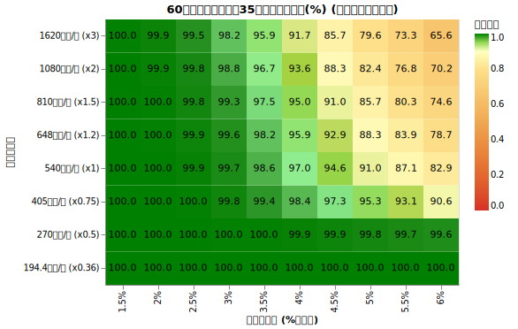
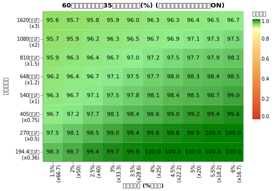
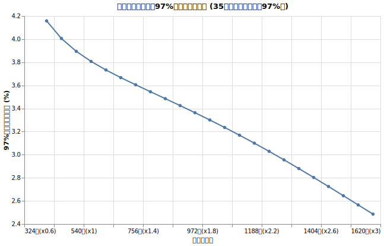

# 60歳の取り崩し最適戦略では何%ルールなのか

<!--
DO NOT DELETE:

$ python3 src/all_60yr_grid_main.py
$ python3 src/analyze_all_60yr_grid_main.py
-->

今まで生存確率を上げる数多くの戦略を見てきました。その集大成として色々施策を組み合わせて見ていきましょう。

戦略だけ知りたいせっかちさんは[60歳の最適戦略ガイド](#60歳の最適戦略ガイド)へどうぞ。

## 60歳から取り崩しを開始し95歳まで破綻しない確率を最大化する

ちなみに95歳まで生きられる人は男性で9.84%, 女性で26.54%です。

!!! info "シミュレーション共通条件"

    * **試行回数**: 5000回
    * **シミュレーション期間**: 35年 
    * **投資先**:
        * オルカン ([ファットテールを考慮し](fat_tails.md)、[S&P500から補完した悲観的なモデル](sp500_vs_acwi.md), [信託報酬 0.05775%](trust_fee.md))
        * ゼロリスク資産 [(利回り4%)](zero_risk.md)
    * **ダイナミックリバランス**: [毎年行う](dynamic_rebalance.md)
    * **為替リスク**: [USDJPY (期待リターン0%, リスク10.53%)](forex.md)
    * **インフレ率**: [AR(12)粘着モデル (平均1.77%)](cpi.md)
    * **税率**: [20.315%](tax.md)
    * **年金**: [60歳から前倒し受給を開始](pension.md), 年141万円 (約月11.7万)
      * 基礎年金 = 62.02万 (= 満額81.6万 × 前倒し24%減少)
      * 厚生年金 = 79.02万 (2.736 × 38年 × 前倒し24%減少)
      * マクロ経済スライドを考慮
    * **SIDE FIRE**: [しない。働かない前提。](side_fire.md)
    * **死亡率**: [考慮しない](mortality.md)

!!! info "シミュレーション可変条件"

    * **初期年支出の倍率**: あなたの60歳時の想定年支出。2人以上の世帯の60歳の平均支出540万を1倍とした時の倍率。
    * **初期出費額 (何％ルールか)**: 1.5% から 6%ルールまで試す
        * 年支出を先に決めているので、このパラメータで総資産を決めている。
    * **ダイナミックスペンディング**:
        * なし: 出費のトレンドを [家計調査報告](retired_spending.md) のデータに基づき推移させる
            * 年齢を取ると少しずつ出費が下がっていく想定。 
        * あり: 年出費率が3.63%に近づくように、上限+3%, 下限-0% (一切支出は減らさないが、物価上昇込みの実質支出は下がる可能性がある) で支出を毎年決定。

!!! warning "加味していない条件"

    * 何人暮らしか、二人暮らしの場合に世帯の出費を賄っているかなどは考慮していません
    * NISA, iDeco の話
    * 年金にかかる税金
    * 生活防衛資金の確保

## 結果

### 支出トレンドベース (ダイナミックスペンディングなし) の場合

95歳の生存確率は以下のようになりました。

この読み方は、例えば下から4行目左から6行目を見ると、

*60歳時に年540万の支出だった人が4%ルールで (= つまり総資産は 540万 × 25 = 1.35億円) 取り崩しを行うと95歳まで資金が枯渇しない割合が 97%*

という風に読みます。

使い方としては、まず60歳の年支出から確定させます。ヒートマップの横軸が決まります。

そうするとあなたの総資産 (できれば全て現金化したとして税抜き計算する) がわかれば何％ルールかがわかります。そうするとどれくらいの生存確率かがわかります。

逆に目標の生存確率があれば、何％ルールにすればいいかが分かるので、それによって必要な総資産がわかります。

### ダイナミックスペンディングありの場合

[ダイナミックスペンディング](dynamic_spending.md)は物価上昇率には関係なく昨年の年支出率から今年の支出を決める方法です。

今回試した作戦は

* 今年の支出を $X$円 とする
* 来年の支出の上限を $(X + 3\%)$円、下限を $X$ とする
* 来年の支出の目標値を (総資産 × $3.63\%$) とする
* 目標値が下限〜上限のなかに入っていればその値を、はみ出していたら上限か下限値を使う

という作戦です。結果はこちらです。

特に右側 5%, 6% ルールでも十分生きていけるという結果になりました。

これは作戦の目標値が 3.63% のため、相場が上振れない限り、かなりの間支出を上げないように抑える (インフレ下では実質的な購買力は目減りします) 努力をしている状態です。残り年数にもよりますが、年出費 3.63% くらいまで下げると、ゼロリスク資産を100%にしても生きていける状態になります。

### 考察 A. 97%の生存確率を達成するのは「何％ルール」

ダイナミックスペンディングをしなかった場合、97%の生存確率を達成するのは「何％ルール」か、をグラフにするとこのようになります。

わりと綺麗な直線になっていて面白いですね。

### 考察 B. なぜ良い結果になるか

60歳からの取り崩し戦略は、他の年代と比べて良い条件が揃っていると言えます

* そもそも95歳まで生きるまでに35年しか(!)必要ありません。
* 国民年金保険の支払いが終わり、年金受給がスタートします。
* 日本人平均の支出トレンドは60歳からどんどん減ります。
* 年支出がもともと少ない節約家の人ほど、年金の重みが増します。

## 60歳の最適戦略ガイド

**無リスク資産を決める**

このシミュレーションは4%の利回り(税引前)がある無リスク資産の存在を仮定しています。[無リスク資産](zero_risk.md)の回を参考にして下さい。

**何%ルールで行くか確定させる**

1. まず**60歳時点の年支出**を現在の生活水準から決定します。参考値として：

    * 65歳の二人暮らしの年支出の平均が540万円 (45万円/月)
    * 65歳以上単身無職世帯の平均が194.4万円 (16.2万円/月)

    です。ただこれは全国平均であることに注意して下さい。

1. 60歳時点での総資産が分かっている人 (なるべく現金化した時・税金考慮後) は、(年支出÷総資産)を計算すると何%ルールかがわかります。上記のダイナミックスペンディングなし、ありの図を見て生存確率の数字が大きい方を選びましょう。
1. その生存確率で満足できなければ、年支出を下げる工夫をしましょう。

**リタイア後**

1. 年金は60歳から前倒し受給をする
1. ダイナミックスペンディングを使用する人は**2年目以降の年初**に以下を計算します。
    * 去年の支出を $X$円 とする
    * 今年の支出の上限を $(X + 3\%)$円、下限を $X$ とする
    * 今年の支出の目標値を (総資産 × $3.63\%$) とする
    * 目標値が下限〜上限のなかに入っていればその値を、はみ出していたら上限値か下限値を使う
    * ここで決めた今年の支出額を守る
1. **毎年年初に**オルカンと無リスク資産の配分を変える。
    * 年支出 = (去年の支出 ÷ 現在の総資産)
    * 目標年数 = 95 - 現在の年齢
    * 上で求めた値を[最適オルカン比率シミュレーター](optimal_ratio_calc.html)に入れてオルカンと無リスク資産の割合を求めます。リバランスする時に発生する税金は考慮済みです

!!! warning "生活防衛資金の確保"
    このシミュレーションは生活防衛資金(万が一の大病・大怪我に備えて数ヶ月分の生活資金を現金として持つ)を加味していません。あらかじめ確保しておいて、上記の総資産からは引き算してあらかじめ別枠で取っておきましょう。

