# 2人世帯以上やFAT FIREでの60歳の取り崩し最適戦略では何%ルールなのか

<!--
DO NOT DELETE:

src/all_yr.sh execute_all_60yr
-->

本稿では、資産取り崩しが370万を超える (例: 2人世帯以上や FAT FIRE) 場合の60歳からの取り崩し戦略を検証し、最適戦略を提示します。

資産取り崩しが400万以下の場合は [単身世帯・LEAN FIREの60歳取り崩し戦略](single_60yr.md) を参考にして下さい。

結論として、60歳からの取り崩しであれば「6%ルール」でも十分に成立する可能性があります。もちろん適切な支出率は本人の支出額によりますが、多くのケースで4%ルールよりも高い支出率が許容されることがわかりました。

!!! abstract "重要なポイント"
    * **年金は70歳受給が最適**。シミュレーションの結果、多くのケースで95歳までの生存確率が最大となる。
    * **ライフプランに応じたリバランスが効果的**。将来の支出低下や年金受給を事前に考慮することで、資産の枯渇リスクを抑制できる。
    * **資産額と支出額から生存確率を算出可能**。目標とする生存確率に応じた最適な支出額を導き出す公式やツールを作成した。実際の戦略も紹介。

戦略だけ知りたい方は[60歳の最適戦略ガイド](#60歳の最適戦略ガイド)へ進んでください。

## 60歳から取り崩しを開始し95歳まで破綻しない確率を最大化する

ちなみに現在60歳の人が95歳まで生きられる人は男性で9.84%, 女性で26.54%です ([寿命・健康寿命予測ツール | たきびFIRE](https://takibi-fire.com/app/life-expectancy-calculator/))。

35年という取り崩し期間において、生存確率を上げるために個人ができることは主に以下の3点です。

* 年金の受給タイミングの最適化
* ライフプランに合わせたリバランス（資産配分の変更）
* 状況に応じた支出の調整

これらの要素を組み合わせた、最適な戦略を検証しました。

!!! info "シミュレーション共通条件"

    * **シミュレーション期間**: 35年 (60歳最初〜95歳最初)
    * **投資先**:
        * オルカン ([ファットテールを考慮し](fat_tails.md)、[S&P500から補完した悲観的なモデル](sp500_vs_acwi.md), [信託報酬 0.05775%](trust_fee.md))
        * ゼロリスク資産 [(利回り4%)](zero_risk.md)
    * **ダイナミックリバランス**: [毎年行う](dynamic_rebalance.md)
    * **為替リスク**: [USDJPY (期待リターン0%, リスク10.53%)](forex.md)
    * **インフレ率**: [AR(12)粘着モデル (平均1.77%)](cpi.md)
    * **税率**: [20.315%](tax.md)
    * **支出**: [60歳以降の国民平均支出のカーブ](retired_spending.md#年齢ごとの支出の推移のグラフ)に沿って穏やかに減っていく
    * **年金**: 年185.6万円 (約月15.5万)、ただし受給タイミングを変える
        * 基礎年金: 満額81.6万
        * 厚生年金: 104万円 (= 2.736 × 38年), 年収500万相当
        * マクロ経済スライドを考慮
    * **SIDE FIRE**: [しない。働かない前提。](side_fire.md)
    * **死亡率**: [考慮しない](mortality.md)

!!! warning "加味していない条件"

    * 何人暮らしか、二人暮らしの場合に世帯の出費を賄っているか、年金を２人分受給しているかなどは考慮していません
    * NISA, iDeco の非課税枠の詳細は考慮せず、一律の税率を適用
    * 年金にかかる所得税・住民税
    * 生活防衛資金の確保（別途確保を推奨）

## 実験1: 60歳リタイアに特化した年金受取りの戦略を探す

[「年金支払いと受給の効果」]の回では「60歳から前倒し受給を開始する」が最適だと解説しましたが、その時は4%ルール固定で、老後の支出低下を加味していませんでした。今回は60歳からの支出カーブを再現しながら、色々な資産額・支出率のもとで、年金の受け取り戦略を解析します。

!!! info "シミュレーション可変条件"

    * **初期年支出の倍率**: あなたの60歳時の想定年支出。2人以上の世帯の60歳の平均支出489万を1倍とした時の倍率。
    * **初期支出率 (何％ルールか)**: 1.5% から 6%ルールまで検証。
    * **[年金受給タイミング](pension.md)**:
        * 60歳から前倒し受給を開始 (繰り上げ・24%減少) → 年141万円 (約月11.7万)
        * 65歳から受給 → 年185.6万円 (約月15.5万)
        * 70歳 繰り下げ・42%増加 → 年263.6万円 (約月22万)
        * 75歳 繰り下げ・84%増加 → 年341.5万円 (約月28.5万)

!!! warning ""

    このシミュレーションでは、4%の支出率というのは初年度のみです。それ以降は[支出率のカーブ](retired_spending.md#年齢ごとの支出の推移のグラフ)と物価上昇率によって決まります。

### 実験1の結果

全パターンを試行した結果、95歳時点の生存確率は以下のようになりました。

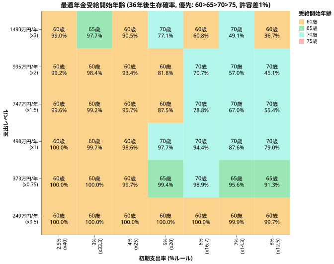

!!! info "ヒートマップの読み方"

    縦軸は60歳時点での年出費、横軸は何%ルールで切り崩しを開始するかを表しています。

    例えば「4%ルール」「747万」の地点を見ると、

    *60歳時に年747万の支出だった人が4%ルール（総資産 1.87億円）で取り崩すと、95歳までの生存確率は 95.9% でした。最適戦略は "60歳, 70歳, 75歳受給" でした。*

    という意味です。細かい数値を見ると60歳, 70歳, 75歳の生存確率はわずかに違うのですが、細かい違いを気にすると結論が出しづらいので、(生存確率の最大値 - 1%) に入る戦略を全てヒートマップ内に表示しています。

こう見ると、==すべての場合で70歳受給が良さそう== ということがわかります。

具体的に何が起きているのか時系列で見てみましょう。

まずは**総資産1億2450万、初年度年支出 498万 (4%)の場合**です。

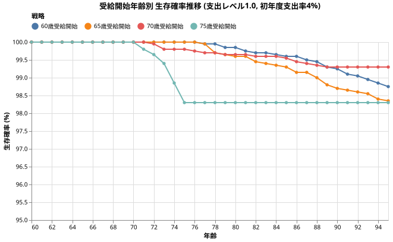

そもそもの生存確率が高いため、グラフは95%以上の範囲しか描画していません。

しかしよく見ると、以下がわかります

* 75歳受給にすると、*75歳まで*に暴落や物価急上昇が起きた場合のケースに対処できず生存確率が少し減っている
* 60歳や65歳の受給では、約80歳以降、じわじわ生存確率が減っている
* 70歳の受給はじわじわ減る生存確率の減り幅が小さい

ことがわかります。

次は**総資産9960万、初年度年支出 498万 (5%)の場合**です。

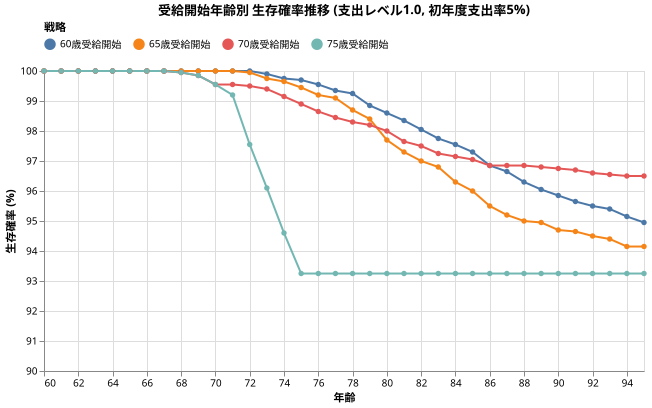

以前生存確率は高い範囲にあります。ただし、4%の支出率の場合と比べて若干高めの支出率でスタートしていることが効いてきます。

この場合で60~65歳での受給を行うと、75歳くらいまでは生存確率はほぼ下がりませんが、それ以降少しずつ一定の割合で生存確率が落ちていきます。これは暴落や物価急上昇などの運が悪い場合に耐えられていないことを表しています。一方70歳受給の場合、収入は65歳受給の年185.6万円から年263.6万円へとアップするため、70歳以降の破綻率が緩やかになり、95歳生存確率では上回る結果となりました。(注: この文章の数字は全て初年度換算の名目値です。年金は物価上昇に依存しており、モンテカルロシミュレーション内部では各世界線ごとに別の物価上昇が適用されています)

次は**総資産3.73億、初年度年支出 1493万 (5%)の場合**です。支出額が非常に高いケースです。

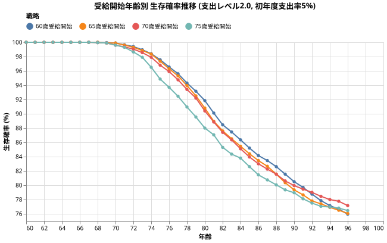

ここまで支出額が高いと、基本年金の受給額の影響は限定的となります。一応年金の受け取りの時期によって若干の違いは出ますが、そこを気にするよりも、支出率の管理のほうが重要ということがわかります。

!!! warning "同じ5%ルールを採用しても、支出レベルが違うと生存確率は変わる。"

    これは見落としやすい事実だと思います。上記の初年度年支出 1493万の場合は、年金所得によって取り崩しの減る額が微々たるものになるので、「年金を全く考慮しないシミュレーション」に近くなります。

### まとめと提案

==最適な年金受取開始時期はほぼ多くのケースで 70歳という結論が出ました。==

一部の例外は、とても倹約する年249万出費のケースで、この場合は、早めの受給だけで支出の大半がカバーできていたためかと思います。

## 実験2: 年金受給70歳固定の時のリバランスの最適戦略を探す

==年金受給を70歳に固定させるといいことがあります。それはライフプランが確定することです。== 将来の物価上昇率はわかりませんが、現在の物価価値における将来の予想がとりあえずたつことになります。

実験1では、「V1 ダイナミックリバランス」という、ライフプランを考慮しない方法を用いていました。しかし、[ライフプランを考慮した最適配分](spend_aware_dynamic_rebalance.md)で紹介したように、ライフプランが確定すると、そこから逆算してオルカンと無リスク資産の最適配分戦略をシミュレーションから事前に求めることができます。

このアイデアが「60歳リタイア・70歳年金受給」でもうまく機能するか実験してみます。

!!! info "シミュレーション可変条件"

    * **初期年支出の倍率**: あなたの60歳時の想定年支出。2人以上の世帯の60歳の平均支出489万を1倍とした時の倍率。
    * **初期支出率 (何％ルールか)**: 2.5% から 8%ルールまで検証。
    * **リバランス戦略**:
        1. **「なし」・リバランスなし**: 初年度にオルカンに100%投資
        2. **「固定」・固定最適比率**: [最適配分を繰り返す](dynamic_rebalance.md) の時に求めた「毎年全く同じ支出レベルを維持する場合に特化した最適化関数」を使い、35年生存確率を一番高める配分を一度だけ計算し、毎年その配分になるようにリバランスします。支出率が3%の場合はオルカンに15%を、4%の場合は59%を配分します。
        3. **「V1」・ダイナミックリバランス**: [最適配分を繰り返す](dynamic_rebalance.md) の時に求めた「毎年同じ支出レベルを維持する場合に特化した最適化関数」を使い、毎年年初に残り年数と年出費から求めた最適配分にリバランスする戦略。実験1の設定と一緒。
        4. **「R70」・ライフプランを考慮した最適リバランス**: [ライフプランを考慮した動的支出](spend_aware_dynamic_spending.md)で紹介した方法を用いて、「60歳から緩やかに支出が減り、70歳から年金を受給する」ライフプランに合わせてバランスを最適化する関数を求めて、それに従って毎年リバランスする戦略。

### 実験2の結果

全パターンを試行した結果、95歳時点の生存確率は以下のようになりました。

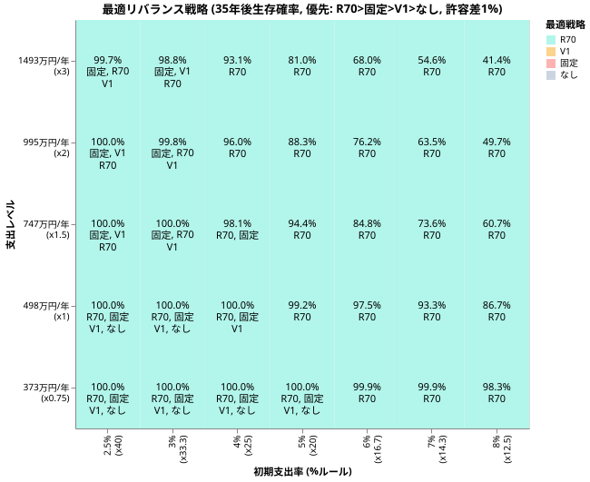

ヒートマップの読み方は[実験1](#実験1の結果)と一緒です。

各｛初年度年支出率, 支出レベル｝ごとに4つの手法を比較するシミュレーションを行い、最高生存確率とそれに近い手法を抽出して列挙しました。

==どれもライフプランを考慮した最適リバランス(R70)が生存確率が一番高い== ことがわかります。実験1はどれも上記の3番目の「V1」という手法を使っていましたが、例えば「総資産9960万、初年度年支出 498万 (5%)の場合」の場合の実験1での生存確率は96.5%でしたが、R70を使うと99.2%まで上がりました。つまり、ライフプランが確定することで、リバランスはもっと最適化できるということです。

参考までに V1 と R70 の差 (上の2つのヒートマップの差) を表したヒートマップがこちらです。

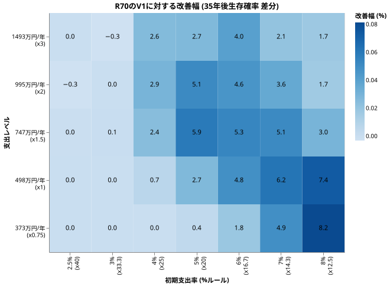

ヒートマップの左側は「そもそも生存確率が高く、どんなリバランス手法を使っても差が出ない領域」で、右上は「そもそも生存確率が低くて、リバランス手法程度では差が出ない領域」です。それ以外の部分で大きく生存確率を上昇させていることがわかります。

## 解析: 60歳リタイアの最適戦略の「公式」を探す

実験1,2 で「70歳での年金受給」「そのライフプランに最適化させたリバランス戦略」が最適であることを示しました。

さて、この戦略でもっと細かい年支出率、支出レベルの組み合わせを行った結果がこちらです。

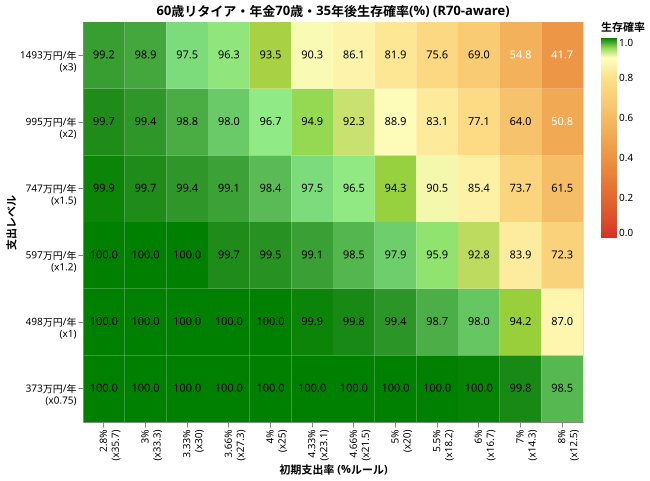

「年支出額が上がれば上がるほど、初期総資産が下がれば下がるほど、生存確率が下がる」という当たり前の結果ではありますが、目をこらすと、反比例の双曲線が現れているのがわかるでしょうか。

例えば生存率97%を取りそうな場所、90%を取りそうな場所、などをうまく補間 (PCHIPを使いました) して線を結ぶとこのようになります。

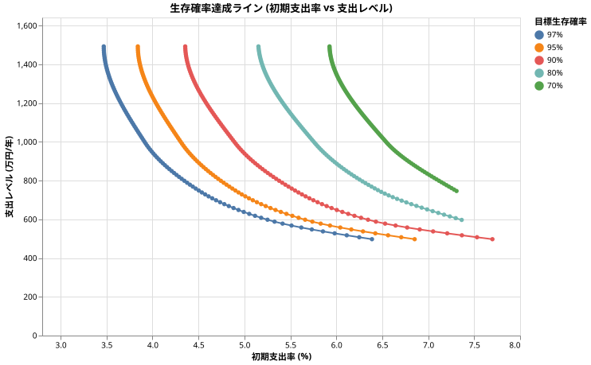

この曲線を変換して、x=総資産、y=60歳の支出にすると明確な関係が確認できました。

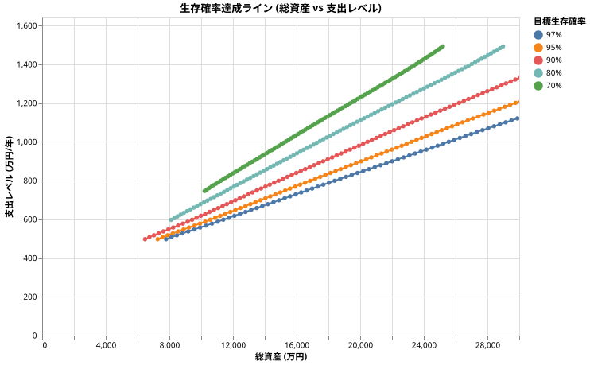

直線的な関係が確認できます。

??? info "なぜこれが驚きなのかの詳しい解説"

    今回のシミュレーションはとても複雑な現象を扱っています。

    * オルカンの株価はファットテールを加味した複雑な値動きを使っていて、レアな大暴落も再現します。
    * 物価上昇率も粘着モデル (AR(12)) を使い、物価上昇も下落も再現します。
    * 年支出額は60歳から国民の平均に従い徐々に下がるグラフとなっています。これは全く数学的ではない動き方をします。
    * 年金受給額も物価上昇＋マクロ経済スライドを考慮した値動きになっています。
    * その上で、毎年オルカンと無リスク資産をうまくリバランスする関数を(randomシードを別にして)学習し、それを本番環境で実行しています。
    * 実際に得られた72の確率を3次曲線で補完した97%生存ライン、などが上記のグラフです。

### 資産と支出の公式

ここまで綺麗だと、公式が作れてしまいます。

| 目標生存確率 | Spendを求める公式 | R2 Score |
| --: | --- | --- |
| 97% | Spend = M の 2.83% + 278万円 | 1.0000 |
| 95% | Spend = M の 3.15% + 267万円 | 1.0000 |
| 90% | Spend = M の 3.59% + 264万円 | 1.0000 |
| 80% | Spend = M の 4.29% + 251万円 | 1.0000 |
| 70% | Spend = M の 4.98% + 238万円 | 1.0000 |

R2 Score というのは、この公式のデータへのマッチ具合を表していて、1.0000 はほぼパーフェクトな直線であったことを示しています。

==この公式は以下の使い方ができます。==

#### 総資産と目標生存確率から支出額を求める

例えばあなたの総資産が6000万だとします。この時、95歳開始時点で97%生存できるような初年度支出額は

$$
6000\text{万} \times  2.83\% + 278 = 447.8\text{万}
$$

ということがわかります。

#### 支出額と目標生存確率から総資産を求める

逆に初年度支出を400万にして、95歳開始時点で90%の生存確率にするプランを選ぶなら、

$$
400\text{万} = \text{総資産} \times 3.59\% + 264\text{万}
$$

を解いて

$$
\text{総資産} = (400 - 264) / 3.59\% = 3788\text{万}
$$

ということがわかります。

### 戦略を計算・評価するツール

そんなのまどろっこしいよ！という人のために簡易ツールを作りました。

ちょっと簡易版なので上の表に載せた数字とわずかにずれますが、全ての生存確率で計算できるようにしてあります。

「計算モード」を選んでから入力して下さい。

<iframe 
  src="./retire_formula.html?data=all_60yr" 
  width="100%" 
  height="400" 
  frameborder="0" 
  scrolling="no" 
  style="max-width: 500px; display: block; margin: 0 auto; border: none;"
></iframe>

??? info "技術的な詳細：内部で使っている詳しい計算式"

    色々なモデルを試した結果

    $$
    logit(P) = \frac{a \times \text{初期支出} + b \times \text{総資産} + c}{d \times \text{初期支出} + e \times \text{総資産} + 1}
    $$

    という式が、生存確率60~98%のデータ上で R2=0.995 という適合度の高い結果となったので、そのモデルを使って計算しています。

このツールを使うと、例えば、**60歳時点で(2人以上世帯での)平均的な支出額498万を目指す場合、生存確率95%で必要な総資産は7,261万円 (6.9%ルール)、98%で必要な総資産は8,184万円 (6.1%ルール)となっています。**

逆に年支出1000万円という支出額が高い場合、生存確率95%で必要な総資産は23,442万円 (4.3%ルール)となり、4%に近くなります。

### なぜ60歳リタイアは良い結果になるか

そもそもとして、60歳からの取り崩しは若い年代のアーリーリタイアと比べて圧倒的に有利です。

* **期間の短さ**: そもそも95歳まで35年しかありません。
* **年金受給の近さ**: 国民年金保険料の支払いが終わり、年金が早めに手に入ります。
* **支出トレンド**: 日本人の平均支出は60歳から急激に減少していきます。
* **年金の比重**: 支出を抑えられる人ほど、年金だけで生活の大部分がカバーされます。

## 60歳の最適戦略ガイド

以上のまとめとして、具体的な戦略を詳しく解説します。

### 1. 無リスク資産の設定

この戦略は税引前4%程度の利回りが期待できる無リスク資産をポートフォリオに組み込むことを想定しています。

詳細は[日本国内における「無リスク・低ボラティリティ資産」の候補](zero_risk_options.md)を参考にして下さい。

### 2. 自分のライフプランを算出する

1. 現在の総資産（税引き後評価額）を把握します。
2. 60歳時点での年支出を想定します。

### 3. このシミュレーションの想定と沿っているかを確認する

1. 今回のシミュレーションでは60歳以降のあなたの消費支出(税・保険料以外の支出)がだいたい[このグラフの水色線](retired_spending.md#年齢ごとの支出の推移のグラフ)に**比例して**沿うことを仮定しています。つまり、物価上昇率を除いて75歳まで緩やかに支出が低下していきます。この仮定があなたに合っているか確認して下さい。
2. 今回のシミュレーションではあなたの平均年収が500万と仮定して厚生年金を算出しています。どれくらいずれているかで、生存確率が変わることを承知おき下さい。

### 4. 自分の生存確率を確認する

[上記のツール](#戦略を計算評価するツール)を使って「許容される初年度の支出額」を計算します。

* 例えば税抜き総資産が5000万で、年支出が498万とすると、95歳生存確率は64%となります。これを許容するかどうかを検討する必要があります。
* どんな戦略をとっても、あなたが目にするのはシミュレーションが出す95歳時の生存確率です。つまり ==最終的に重要になってくるのが**あなたは何％の生存確率で満足するか**という部分です。==

    この「確率」というのは、「いくつものシナリオを仮想的に作った時、何％で資金枯渇しないかどうか」という数字です。しかし、現実にはそのうちの一つのシナリオしか経験しません。95%で安心していても、運が悪ければ5%の枯渇パターンを引くかもしれません。生存確率が10%だとしても、運が良い結果になるかもしれません。
    
    この「何％で満足するか」という数字は人による部分です。例えばあなたが97%の生存確率の戦略で満足できなければ、より資産を増やすか、支出を減らす努力が必要です。例えばあ50%の生存確率で満足できるのであれば、必要な資産もだいぶ楽観的にできるでしょう。

* それを理解したうえで、例えば生存確率64%が嫌であれば、支出を下げる努力をしてみましょう。「総資産と目標生存確率から支出額を求める」という計算モードを使うと、生存確率を指定して支出額を求めることができます。例えば 85%の生存確率に上げるためには年支出を454万まで下げないといけません。月4万ほど削る必要があります。それが可能かどうか検討しましょう。

* とはいえ、この「満足できる数字」をきちんと決めることは難しいかと思います。大事なのは、この確率を時々気にしながら生活をすることかと思います。例えば **「確率が下がってきたら支出を抑えてみる」** という風に、**将来のあなたは戦略を変えられる**ということも忘れてはいけません。

    最後の章の[支出制限を行う最適戦略](#支出制限を行う最適戦略)で、この徐々に下げるアイデアの効果を検証します。

### 5. 毎年年初に資産配分を最適化する

年初に、以下のツールに従ってオルカンと無リスク資産を配分します。

あなたの支出レベル (60歳時点での取り崩し額) によって結果が変わるので、近い数字を選んで下さい。

<iframe 
  src="./retire_dp_calc.html?data=all_60yr" 
  width="100%" 
  height="680" 
  frameborder="0" 
  scrolling="no" 
  style="max-width: 500px; display: block; margin: 0 auto; border: none;"
></iframe>

### 6. 年金は70歳から受給を開始する

忘れないようにしましょう。

!!! warning "生活防衛資金の確保"
    このシミュレーションは、医療費や冠婚葬祭などの予期せぬ大きな出費を想定していません。シミュレーションで使う「総資産」とは別に、数ヶ月以上を賄える生活防衛資金を現金で確保しておくことを強く推奨します。

ここまでの戦略を行えば、最初のツールで求めた生存確率に達することができます。

---

## 支出制限を行う最適戦略

上の戦略はあくまでライフプランを固定し、物価上昇は許容するものの、支出削減は一切しない場合の話でした。

もしあなたがある程度の支出削減をしても良いなら、生存確率はさらに上がります。

[ライフプランを考慮した支出制限](spend_aware_dynamic_spending.md)をもとに、次の戦略を行ってみます。

!!! tips "支出削減のアルゴリズム"

    毎年年初に、支出を以下の方法で決定する。

    * その年の「自然な支出」を $\text{自然な支出} = \text{去年の支出} \times \text{自然な支出推移率} \times \text{物価上昇率}$ として計算する。
        * 自然な支出推移率: [このグラフの水色線](retired_spending.md#年齢ごとの支出の推移のグラフ)に従って、$N-1$歳から$N$歳になるときの上昇率か減少率を掛け算する。例えば70歳から71歳になる時は、支出が350万から340万くらいに減っているので、去年の支出に 0.971を掛ける
        * 物価上昇率: 去年の1月の物価と今年の1月の物価を比較して、物価上昇率を計算し、その値を掛け算する。
    * 上記のツールに従ってリバランスの割合を決定する。その時一番右に現れる「生存確率」の緑色の数字を見る。
        * それが 100% ならば、自然な支出を最大+1%まで贅沢を許す。
        * それが 97% 以下ならば、自然な支出を最大-2%まで倹約する。

これを行うとさらに生存確率が上がります。

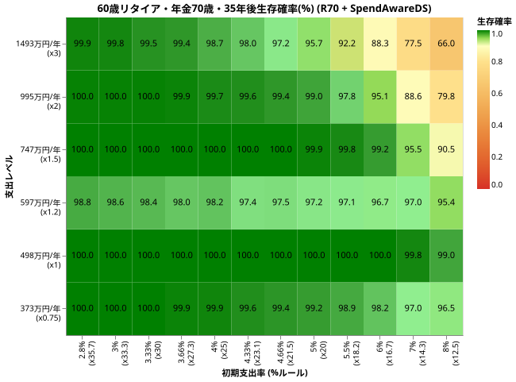

支出制限を行わない時と比べた生存確率の伸びはこれくらいです。

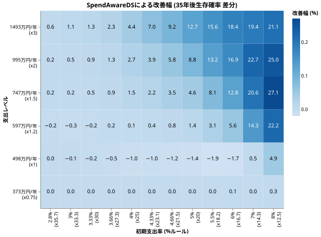

右上の領域の支出率7%や8%という支出額が高い人の辺りでは特に顕著に生存確率が伸びています。

これは、予測生存確率が低いので、(物価上昇率を反映させた上で更に)2%の倹約を毎年行っているからです。

!!! warning "特異な挙動について"

    y=373万円の箇所だけ他の場所と違った挙動をしています。おそらくあまりに生存確率が高いので支出を毎年1%ずつどんどん上げていき過ぎる行動を取ったことが原因かと思います。

## まとめ

[なぜ60歳リタイアは良い結果になるか](#なぜ60歳リタイアは良い結果になるか)で示したように、60歳からのリタイアであれば、支出レベルが高くない限り、6%ルール (総資産が年支出の16倍)くらいでもやっていける可能性は大いにあります。

あなたが60歳付近であれば、まずは一度[戦略を計算・評価するツール](#戦略を計算評価するツール)で試算してみて下さい。どれだけ現状が楽観的か悲観的かがわかるかと思います。

あなたが60歳以前であれば、60歳到達時点でどのような状態になっていたいか、の指針になるかもしれません。

ライフプラン（将来の支出）を確定させることが生存確率を上げる最善手です。現実的には予測できない支出もありますが、それも含めてしまって構いません。それが決まれば逆にリバランス戦略が確定します。

<!--

後、個人が行えることとしては

* 働いて収入を得る ([サイドFIRE](side_fire.md))
* 支出を切り詰める ([ライフプランを考慮した支出制限](spend_aware_dynamic_spending.md))
* オルカンではない投資先を探す ([違う投資先を検討する](sp500_vs_acwi.md))

などがありますが、一度それは後回しにして、現状をもっと調べてみましょう。

-->