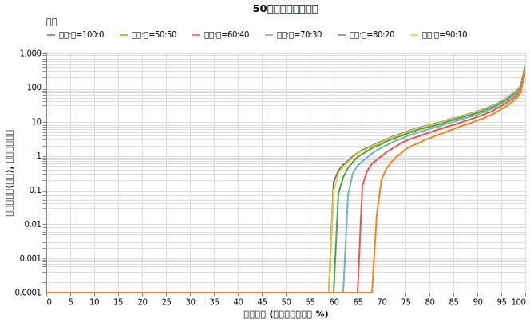
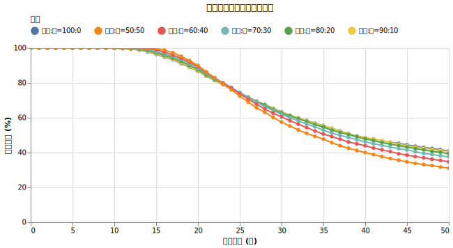
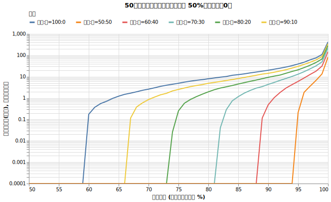
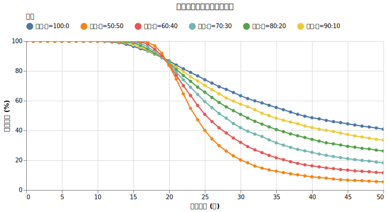

# 資産防衛のアイデア？ 現金を持つ効果

4%ルールの基本は「資産を成長させながら取り崩す」ことですが、暴落への備えとして現金を併用する戦略も一般的です。本記事では、現金の保有比率と取り崩し順序が生存確率に与える影響を検証します。

!!! abstract "重要なポイント"
    * **現金を持つことで、短期（~20年）の生存確率が向上する。** 運用初期に暴落が起きた際、現金を優先的に取り崩すことで株式の安値売りを回避し、20年目付近までの破産リスクを抑制できる。
    * **長期（20年以上）では現金比率が高いほど生存確率が下がる。** 現金はリターンを生まず、インフレで目減りするため、複利成長の機会損失が長期的なリスクとなる。
    * **現金を先に取り崩す方が、オルカンを先に取り崩すよりも生存確率が高くなる。** 現金を温存するのではなく、下落時のクッションとして優先的に消費することで、初期の資産目減りを抑制できる。

## 初年度に100%つぎ込むのは正解か？

今まで以下のような設定でシミュレーションを行ってきました。

!!! info "シミュレーションの設定"
    * **初期資産**: 1億円
    * **投資先**: オルカンに ==初年度全額投資==
    * **為替リスク**: あり（ドル円 リターン0%, リスク10.53% を合成）
    * **取り崩し額**: 毎年400万円（物価連動）
    * **物価上昇率**: 年率 1.77%固定
    * **譲渡所得税**: 20.315%
    * **信託報酬**: 0.05775%

==今回はこの全額投資が正解かを検証していきましょう。==

そもそも米国で考案された「4%ルール（トリニティ・スタディ）」のオリジナル設定は、本サイトのこれまでの検証とは少し異なります。

- **資産構成**: S&P500と債券を組み合わせる（例：75:25）。
- **検証内容**: 過去の時系列データに基づき、30年間の生存確率を計算する。

この研究により「S&P500と債券を75:25で持ち、資産の4%を定額（物価連動）で引き出す」というルールが導き出されました。

本来であれば、私たちも債券をポートフォリオに組み入れるべきです。しかし、債券は利回りの変化、株式との逆相関、為替リスクなどの要素を正確にシミュレーションすることが難しく、モデルが複雑化します。

**そこで今回は、債券の代替として、よりシンプルな「現金」の比率を変えることで、資産防衛の効果を検証します。**

## 現金を持つことの効果

資産形成期によく言われるのは「普通の人が持つリスク資産は株式 100％で十分です」という話です。

参考: [リスク資産として株式だけでなく「債券」も入れたほうがよいと言われたのですが?](https://hayatoito.github.io/2020/investing/#f797)

しかし今まで見てきたように、資産形成期と取り崩し期では戦略が違います。

[「取り崩し期と積立期は全く違う：収益率配列のリスク」](sequence.md)の回でも見てきたように、破綻が起こる原因の一つは、運用開始直後の10〜15年間に暴落や停滞が発生するケースでした。この期間の生活費を確保するために一定の現金を残し、株式を売らずに生活できれば、資産の枯渇を遅らせることができるはずです。

一方で4%ルールの基本は「資産を成長させながら取り崩す」ことです。リターンを生まない現金を保有することは、暴落への備えになる一方で、複利による資産成長の機会を失い、インフレによって実質的な価値が目減りするというリスクも孕んでいます。

## 実験

今回は、1億円の初期資産に対し、現金の保有比率を0%から50%まで変化させたとき、生存確率がどのように推移するかをシミュレーションしました。また、現金を「先に使う」か「最後まで取っておく」かという取り崩し順序の重要性についても検証します。

!!! info "シミュレーションの設定"
    * **初期資産**: 1億円
    * **投資先**: オルカン155年近似 (7%, 15%)。[S&P500よりも悲観的な設定。](sp500_vs_acwi.md)
    * **為替リスク**: あり（ドル円 リターン0%, リスク10.53% を合成）
    * **取り崩し額**: 毎年400万円（物価連動）
    * **物価上昇率**: 年率 1.77%固定
    * **譲渡所得税**: 20.315%
    * **信託報酬**: 0.05775%

!!! info "試した設定"
    * 初期資産1億円のうち何%をオルカンに割り当てるか（100%〜50%）
    * 取り崩しする際に現金を先に取り崩すか、オルカンを先に取り崩すか

初年度の一括投資、リバランスなし、為替リスクありという設定は前回までと同様です。

### 実験1: 現金を先に使う

取り崩しが必要な際、まず手元の現金を使い切り、現金がなくなってからオルカンを売却する戦略です。これは運用初期の暴落時に株式を売却せずに済む効果を狙ったものです。

{!data/cash_ratio/exp1_result.md!}

グラフから、**現金比率を高めるほど23年目までの生存確率は向上するが、23年目以降は逆に生存確率が下がる**ことがわかります。

### 実験2: オルカンを先に使う

取り崩しが必要な際、まずオルカンを売却し、オルカンが底をついてから初めて現金を使う戦略です。

{!data/cash_ratio/exp2_result.md!}

こちらの戦略でも、**現金比率を高めるほど19年目までの生存確率は上がるが、19年目以降は生存確率が下がる**という結果になりました。

## 考察

今回の実験で興味深いのは、**どちらの戦略でも「ある年数」を境に、現金保有のメリットとデメリットが逆転している**点です。

ちなみにこの「ある年数」で状況が変化する現象は今後たくさん出てきますので覚えておきましょう。

シミュレーションの結果から、現金を持つことの二面性が明確になりました。

1. **短期的な安全策としての現金**: 現金比率を高めることで、シミュレーション前半の破産確率をわずかに下げられます。これは運用初期の暴落時に、安値で株式を売却せずに済む効果によるものです。
2. **長期的なリスクとしての現金**: 20年以上の長期で見ると、いずれの実験においても現金比率が高いほど破産確率が上昇します。現金がリターンを生まず、インフレによって実質価値が目減りするため、複利成長の機会を失うデメリットが上回ってしまいます。
3. **取り崩し順序の重要性**: 実験1（現金を先に使う）の方が実験2よりも生存確率が高くなりました。現金を温存するだけでは資産成長を阻害するだけであり、下落時のクッションとして積極的に活用して初めて、現金を保有する意味が生まれます。

結局のところ、何年先までの生存を目指すかによって最適な戦略は変わります。30年〜50年という超長期の取り崩しを前提とするなら、過度な現金保有はむしろリスクとなります。安全を期すなら、現金をただ持っておくのではなく、資産を成長させ続けるための工夫が必要です。

次回は、[リバランスをしていく効果](cash_rebalance.md)を確認していきます。