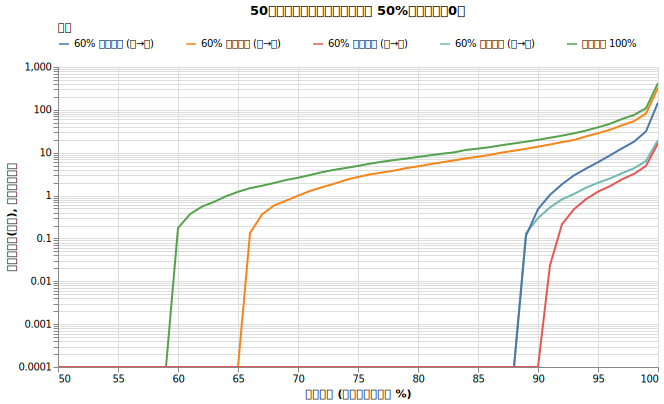
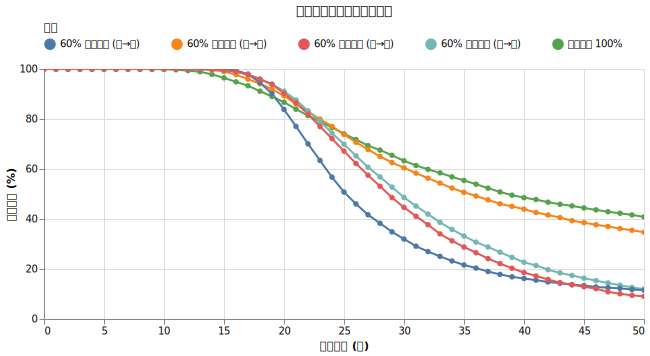
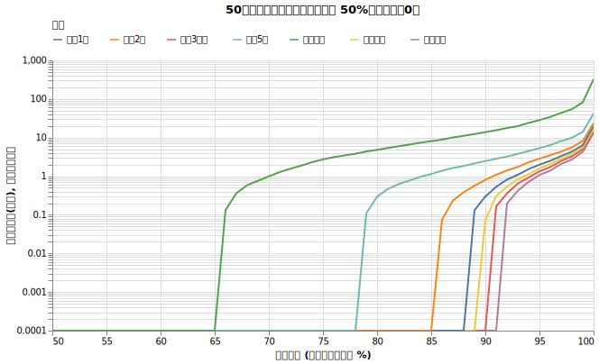
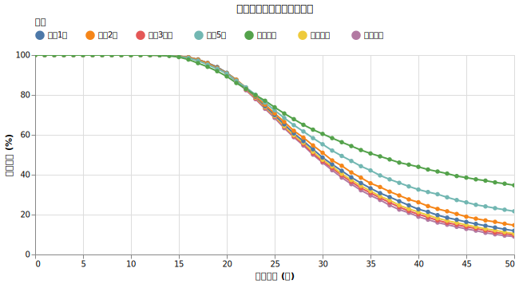

# 資産防衛のアイデア？ 現金比率をリバランスする

[「資産防衛のアイデア？ 現金を持つ効果」](cash_ratio.md)の回では、初年度一括投資した際の現金比率を変えてみて、現金保有の効果を検証しました。しかし、どんなに状況が良くなったり悪くなったりしても一切アセットアロケーションの比率を変えない方針でした。

今回は定期的にリバランスを行うことの効果を検証します。

!!! abstract "重要なポイント"
    * **インフレ環境下で現金を持てば持つほど、長期取り崩しは不利になる。** 物価が上昇する中で利回り0%の現金を維持し続けること自体が不利。
    * **そのため、現金との定率リバランスは長期的には不利。** リターンを生まない現金へ定期的に資金を移すことは、ポートフォリオ全体の成長力を削ぐ要因となる。リバランスの頻度を上げるほどその影響が現れる。

## リバランスとその価値

資産形成期においては、リバランスは重要な要素です。リバランスは現代ポートフォリオ理論に基づき、自身のリスク許容度に合わせた「最適なリスク・リターンの配分（アセットアロケーション）」を維持するために行われます。相場の変動によって株式比率が高まりすぎた（リスクが高まりすぎた）際に、元の最適な比率に戻すことで、想定外の大きな損失を防ぐことができます。

参考: [資産配分はリバランスが前提 | 普通の人が資産運用で99点をとる方法とその考え方](https://hayatoito.github.io/2020/investing/#dab4)

しかし、資産取り崩し期において、戦略が変わる話をたくさん見てきました。今回は現金とのリバランスの効果を取り崩し環境で見ていきましょう。

## 実験1: リバランスの有無と売却順序

取り崩し期において、オルカン（株式）と現金（無リスク資産）の比率を一定に保つようにリバランスを行うことが、生存確率にどのような影響を与えるかを検証します。また、現金を先に使うか、株式を先に使うかという売却順序との組み合わせについても再度確認します。

!!! info "シミュレーションの設定"
    * **初期資産**: 1億円
    * **投資先**: オルカン155年近似 (7%, 15%)
    * **為替リスク**: あり（ドル円 リターン0%, リスク10.53% を合成）
    * **現金資産**: 利回り 0%
    * **取り崩し額**: 毎年400万円（物価連動）
    * **物価上昇率**: 年率 1.77%固定
    * **譲渡所得税**: 20.315%
    * **信託報酬**: 0.05775%

リバランスのたびに取得費・譲渡所得を計算し、翌年に譲渡所得税を払う設定になっています。譲渡所得を払う際にも切り崩しが発生します。

!!! info "試した設定"
    * オルカンの比率（100%、60%）
    * リバランスの有無（毎年リバランスする、まったくしない）
    * 売却順序（現金を先に使う、オルカンを先に使う）

オルカン:現金 = 60%:40% はすこし極端ですが、グラフが見やすくなるために設定しました。

### 結果

{!data/cash_rebalance/rebalance_effect_result.md!}

### 考察

以前確認したように、ここでも「ある年を境に傾向が変わる」現象が見られます。

グラフを見ると、赤や水色の線が示す「毎年リバランスを行う戦略」は、23年目付近までは生存確率を上げる効果があります。この期間に関しては、リバランスによって株式を安値で売却する事態を防げるためです。

しかし、23年目以降になると状況が逆転し、リバランスを行う戦略の生存確率は著しく低下します。23年目以降の長期的な生存確率を優先するのであれば、緑の線が示す「そもそも現金を持たず、リバランスもしない（オルカン100%）」という戦略が最も適しています。

もしあえて現金を保有する場合でも、長期の生存確率を高めたいのであれば、現金を優先して取り崩し、リバランスは行わない選択が有利になります。

全体を通して見ると、長期的な取り崩しにおいては「現金は持たない」「リバランスはしない」という方針が最も理にかなっているという結論が読み取れます。

## 実験2: リバランスの頻度

次に、オルカン 80% / 現金 20% のポートフォリオにおいて、リバランスの頻度が生存確率に与える影響を検証します。

!!! info "試した設定"
    * リバランス頻度を変える（毎月、3ヶ月、半年、1年、2年、5年、なし）
    * 売却順序：現金を先に使う（現→オ）
    * ※その他の設定は実験1と同じです。

### 結果

{!data/cash_rebalance/rebalance_freq_result.md!}

### 考察

ここでも、実験1と同様に「ある年を境に傾向が変わる」現象が確認できます。

23年目付近までは、リバランスの頻度が高い（毎月や3ヶ月など）ほど生存確率はわずかに高くなります。しかし、23年目以降はその傾向が完全に逆転し、リバランスの頻度が高ければ高いほど生存確率は圧倒的に低くなっていきます。

この結果からも、長期の生存を目的とする場合、現金との間で頻繁なリバランスを行うことは不利に働くことが分かります。

## 結論

以上のシミュレーション結果から、長期の取り崩しにおいて「現金との定率リバランス」を考えること自体が不利な戦略であると言えます。現金は持てば持つほど、そしてリバランスをすればするほど、長期的な生存確率を下げる結果となりました。

その最大の理由は、インフレ環境下における価値の目減りです。物価上昇が続く世界において、利回りが0%の現金を一定比率で持ち続けるということは、確実に実質価値が低下する資産をポートフォリオに補充し続けることを意味します。これが長期間にわたって資産全体にマイナスの影響を与え、致命的な結果をもたらします。

また、リバランスを行わずに成り行きに任せると、株式が成長するにつれてポートフォリオに占める株式の割合が自然と増えていきます。これが結果的に、長期間の取り崩しに必要なリターンを確保するための合理的な配分変化となっていました。

したがって、取り崩し期において現金との比率を一定に保つ戦略は避け、無リスク資産を組み入れるなど、より適した方法を検討する必要があります。