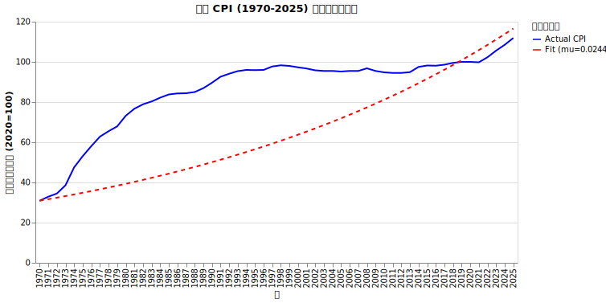
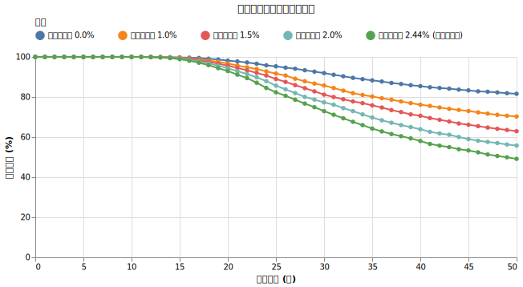
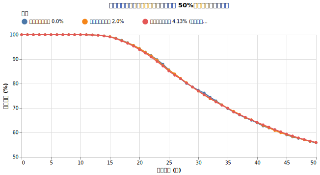
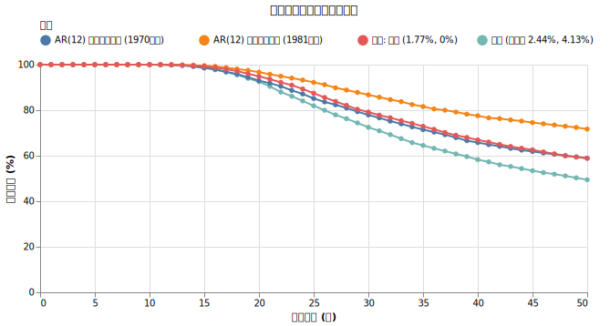

# 物価上昇率が取り崩しに与える影響

<!--
DO NOT DELETE:
python3 src/sequence_comp_main.py
-->

物価上昇は、長期の取り崩しにおいて将来の生活水準を左右する大きな要因です。

!!! abstract "重要なポイント"
    * **物価上昇は取り崩し成功率を大幅に下げる。** シミュレーションに物価上昇を組み込まない場合、結果は極めて楽観的になります。2.44%のインフレを考慮するだけで破産確率は 18% から 50% 超へ上昇します。
    * **平均的なインフレトレンドが最も重要であり、年々の変動（ボラティリティ）の影響は小さい。** インフレ率が独立して変動する場合、その幅自体は長期的な生存確率を大きく変えません。
    * **現実のインフレには強い粘着性（自己相関）がある。** 歴史的データを分析すると、インフレは一度始まると数年続く傾向が顕著です。本プロジェクトでは詳細な AR(12) モデルでこの挙動を検証しました。
    * **今後のシミュレーションでは「年率 1.77%（ボラティリティ 0%）」を基準とする。** 粘着性モデルの定常平均であるこの値を用いることで、過度に複雑な計算を避けつつ現実的なリスクを評価できます。

## インフレ率（CPI）とは

物価上昇率（インフレ率）とは、ある期間において物価がどれくらい上がったかを示す割合です。シミュレーションでは消費者物価指数（CPI）を用いて近似します。

CPIは総務省統計局が毎月公表し、日常生活で購入するモノやサービスの価格をカバーしています。生活費の変動を測る上で適した指標ですが、医療費や介護費などはCPI全体の伸び率よりも高く上昇する傾向がある点には注意が必要です。

## 日本の物価上昇率の歴史

1970年から2025年までのCPIの実際のデータ（[政府統計の総合窓口 e-Stat](https://dashboard.e-stat.go.jp/)）に基づき、過去の物価変動を確認します。直近の動きを見ると、基準年である2020年を100とした場合、2025年には「112.0」まで上昇しています。つまり、たった5年間で私たちが普段買っているものの価格が平均して12%も上がったということであり、短期間でも物価変動が家計に与える影響は小さくありません。

過去55年分のデータから計算した日本の物価上昇率の統計値は以下の通りです。

*   **算術平均（年率）**: 2.44%
*   **標準偏差（ボラティリティ）**: 4.13%

1970年代の高いインフレ率が含まれているため、平均値は高めになっています。この歴史的な平均値とボラティリティを基準に、シミュレーションを行います。（初期資産1億円、初年度取り崩し400万円、オルカン100%投資の設定）

## 実験1：インフレ率（平均値）の影響

インフレ率のボラティリティを0%とし、平均値（年率）のみを変化させた場合の影響を検証します。

!!! info "シミュレーションの設定"
    *   **初期資産**: 1億円（オルカン 100%）
    *   **取り崩し額**: 初年度400万円（物価連動）
    *   **その他**: 税金や信託報酬は考慮しない

{!data/cpi/experiment1.md!}

インフレ率が0%から歴史的平均の2.44%に上昇すると、50年後の破産確率は 18.4% から 50.9% へ上昇します。物価上昇は長期の取り崩しにおける支配的なリスク要因です。

## 実験2：インフレ率のボラティリティの影響

インフレ率の平均値を2.0%に固定し、ボラティリティ（毎年のブレ幅）を変化させた場合の影響を検証します。

{!data/cpi/experiment2.md!}

ボラティリティが0%の場合と、歴史的標準偏差の4.13%の場合を比較しても、50年後の破産確率は 44.2% から 43.4% へとわずかに変化するのみです。インフレ率の毎年の変動自体は、長期的な成功確率にほとんど影響を与えません。

??? info "数学的な解説：なぜボラティリティが上がると破産確率がわずかに下がるのか"
    資産の成長と同じく、$\mu - \frac{\sigma^2}{2}$（ボラティリティ・ドラッグ）の性質によります。

    インフレ率に変動がある場合、長期間経過後の物価水準の中央値は、算術平均 $\mu$ よりも少し低い幾何平均 $\mu - \frac{\sigma^2}{2}$ に収束します。ボラティリティが4.13%あることで、長期的なインフレ率の中央値は約1.91%へと低下し、生活費の増加ペースが抑えられるため、資産の枯渇がわずかに遅れます。

## 実験3：インフレの粘着性（自己相関）の影響

現実の経済では「去年物価が上がったから、今年も上がりやすい」という粘着性が存在します。月次CPIデータを分析したところ、日本のインフレ率は **AR(12) モデル（12ヶ月前までの値に影響されるモデル）** で説明できることが分かりました。

??? info "AR(12) モデルによる推計"
    自己回帰（AR: Autoregressive）モデルを用いて、現在のインフレ率が過去12ヶ月の状態にどう依存するかを数式化しています。
    
    $$ r_t = c + \sum_{i=1}^{12} \phi_i r_{t-i} + \epsilon_t $$
    
    ここで $r_t$ は月次の対数リターン（$\ln(CPI_t / CPI_{t-1})$）です。シミュレーションは対数空間で行い、最終的な取り崩し額の計算時に算術リターンに戻します。

年次ベースでの自己相関（前年のインフレ率との相関）も強力です。

| 対象期間 | 年次自己相関 | 意味 |
| :--- | :--- | :--- |
| **1970年〜現在** | **0.77** | オイルショック時の激しい物価上昇を含む全期間。高いインフレが持続しやすい。 |
| **1981年〜現在** | **0.55** | 物価が安定した時期。低下はしているが、依然として「波」がある。 |

2026年4月現在、世界的な資源高や円安によって「オイルショックの再来」も囁かれる中、1970年からのデータを用いたモデルは非常に参考になるデータです。1981年からのデータは、物価が安定していた特殊な期間としての参考値となります。

!!! info "シミュレーションの初期値"
    ARモデルでは「今がどうであるか」が将来に影響します。本シミュレーションの開始時点の状態として、直近12ヶ月（2025年3月〜2026年2月）の実際のCPI変動率を初期値として与えています。

{!data/cpi/experiment3.md!}

### 結果の考察

ARモデルを用いたシミュレーション結果から、以下の事実が分かりました。

1.  **平均回帰性による影響**: ARモデルには、一時的にインフレ率が上昇しても中心値に引き戻される「平均回帰性」があります。1970年代の激しいインフレはモデル上では一時的なショックと解釈され、その後は安定した期待値（定常平均）へと収束します。このため、シミュレーション上の平均インフレ率は実績平均(2.44%)より低くなり（1970年ベースで約1.77%）、生存確率が改善します。
2.  **粘着性よりも平均トレンドが支配的**: 実験3の4番目のケース（独立モデル 1.77%）とAR(12)モデル（期待値 1.77%）を比較すると、生存確率はほぼ同じです。**インフレの粘着性そのもののリスクよりも、長期的なインフレの平均的な高さが、資産寿命に対して圧倒的な影響力を持つ**ことを示しています。

## 結論

ライフプランのシミュレーションにおいて、将来の物価上昇率の設定は結果を大きく左右します。

*   物価上昇を考慮しないシミュレーションは極めて危険である
*   インフレ率の期待値（平均値）が高ければ高いほど、資産寿命は短くなる
*   インフレ率のボラティリティ自体は、長期的な成功確率に大きな影響を与えない
*   インフレの粘着性は存在するが、長期シミュレーションにおいては**「平均的なインフレトレンド」**を正しく設定できていれば、ARモデルを用いた複雑な推計と結果は大きく変わらない

今後のシミュレーションでは、複雑なモデル計算を避けるための合理的な近似として、粘着性モデルの期待値である**「年率 1.77%（ボラティリティ 0%）」**を基準値として採用します。
