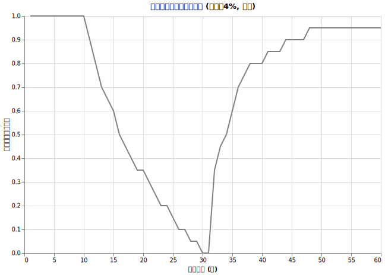
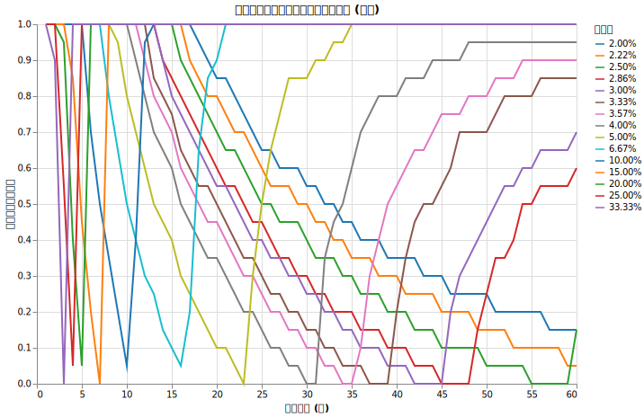
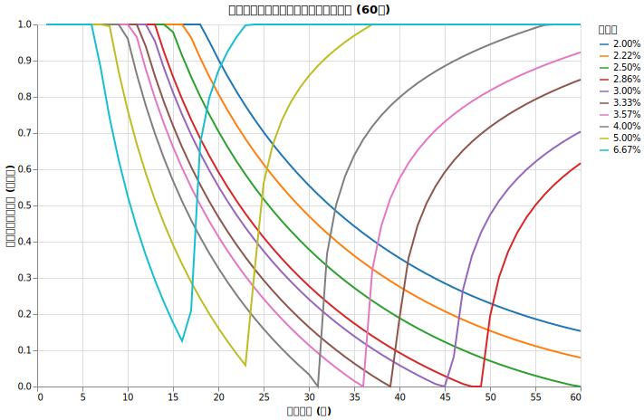
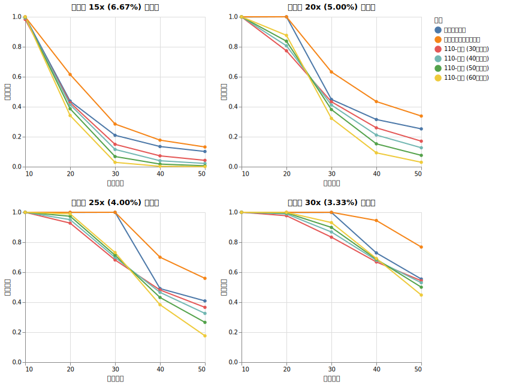

# 最適配分を繰り返す (ダイナミックリバランス)

<!--
DO NOT DELETE.

再現するには以下を実行して下さい。

1. `python src/withdrawal_rate_grid_comp.py`: 支出率と経過年数ごとの生存確率のグリッドシミュレーションを実行します。
2. `python src/analyze_optimal_ratio_main.py`: グリッドデータから最適比率を抽出し、近似式モデルを構築します。
3. 手動: 得られた係数を `src/lib/dynamic_rebalance.py` に反映させます。
4. `python src/dynamic_rebalance_comp_main.py`: ダイナミックリバランス戦略と他の戦略を比較するシミュレーションを実行します。
5. `python src/analyze_dynamic_rebalance_main.py`: 比較結果からサマリーのマークダウンを生成します。

-->

本記事では、資産残高や残りの目標年数に応じて株式と無リスク資産の最適な保有割合を毎年変化させる**ダイナミックリバランス戦略**を提案し、その効果を検証します。
生存確率を最大化する最適比率の近似式を導き出し、固定比率の維持や「110-年齢」といった他の戦略と比較したシミュレーション結果を解説します。

!!! abstract "重要なポイント"
    * **株式と無リスク資産の配分を毎年最適配分する「ダイナミックリバランス」は生存確率を向上させる。** 初年度に最適配分した後比率を変えない戦略よりも平均で4.74%生存確率（パーセンテージポイント）が向上し、特に厳しい条件での長期運用で大きな差が出る。例えば4%支出の場合の50年生存確率は 40.9%→55.9%へと向上。
    * **「限界年数」を知り、「限界年数」以上か以下かで戦略を変える。** 無リスク資産100%だけで生存できる年数（限界年数と呼ぶことにする）を超える期間では株式の成長力が不可欠になる。長期を目指すほど株式への割り当てを増やさないといけない。一度資産が伸びて限界年数を超えたら、無リスク資産を増やして絶対生存できるようにする。
    * **「(110-年齢)% ルール」は最適ではない。** (110-年齢)の法則などは個人の支出や目標年数を加味していないため、今回のシミュレーションではダイナミックリバランスよりも生存確率が劣る結果となった。

!!! success "将来の支出推移を加味した進化版"

    今回の実験は「支出が毎年一定、ただし物価上昇率だけ加味する」という状況で行っています。将来の支出や収入などのライフプランが決まっている人は[ライフプランに基づいた最適配分を繰り返す](spend_aware_dynamic_rebalance.md)を見て下さい。将来支出が増える・減ることを見越した最適配分で更に生存確率を上げることができます。

## ダイナミックリバランス戦略の説明

さて、今までの

* [生存確率を上げる戦略？ 現金を持つ効果](cash_ratio.md)
* [生存確率を上げる戦略？ 現金比率をリバランスする](cash_rebalance.md)
* [生存確率を上げる戦略： 無リスク資産を持つ](zero_risk.md)
* [無リスク資産とのリバランス](zero_risk_rebalance.md)

の回は、あることを繰り返し主張していました。それは

* **無リスク資産との配分に関する最適な戦略は「ある年数」を境に逆転する**
    * その年数以前は無リスク資産を温存し、リバランスする方が生存確率が上がる
    * その年数以降は株式100%の方が生存確率が上がる

ということです。

そして、今まで検証していませんでしたが、その「ある年数」というのは**初年度に何％取り崩すか**という、今まで4%として固定でやってきた数値に強く依存しています。例えば年2%しか取り崩さなくていい人は全てを無リスク資産に割り振ってもほぼ確実に生きていけることになりますが、年10%取り崩す人は高確率ですぐに破綻する未来が待っているため、株式100%で上振れることをお祈りするのが最善になります。

そして、資産が上振れたり下振れたりするたびに、「今年の支出は総資産の何%か」という値は変化していきます。さらに時が経つにつれて目標年数は短くなっていきます。

ここで、資産の増減や目標年数の変化に柔軟に対応する**「ダイナミックリバランス」戦略を提案し、その効果を検証します。**

$$
\text{生存確率を最大にするオルカンへの最適配分} = f(\text{現在の支出率}, \text{残りの目標年数})
$$

という変換式を求めて、適度なタイミングでその値に従ってリバランスするという戦略です。

例えば、資産が上振れて年支出が2%までに下がった人は、すぐに無リスク資産100%に切り替えたら安泰になる、ということが可能になります。

## 参考: (100-年齢)% や (110-年齢)% というルール

ちなみにリスク資産の割合を (100-年齢)% や (110-年齢)% にするアイデアはよく知られています。

例えば60歳の人はリスク資産を40%にしましょう、という覚えやすいルールです。

> アメリカでは1990年代ごろまで「100-年齢」（%）を運用資産に占めるリスク資産の割合にするとよいとされていました。しかしながら、1980年の米国男性の平均寿命70歳、女性の平均寿命77.5歳が、2030年予測では男性78.1歳、女性82.7歳と10年程度延びています。また、日本でも同期間で男性73.4歳、女性78.8歳が男性82.7歳、女性88.8歳と、やはり10年程度延びる予測となっています※。このように、長寿化により、より長期間リスク資産で運用する必要が生じた結果、「110-年齢」（%）をリスク資産にすることが現状にあった目安といえます。

<small>

引用: [オルカンの次は？　GPIFと「110－年齢」の法則で考える資産配分 | SBI 証券](https://go.sbisec.co.jp/media/report/bond_now/bond_now_251127.html)
</small>

この法則の理論的な背景についてはここでは深く追求しませんが、後半で比較対象としてこのルールについてもシミュレーションを行います。

## 準備: 最適配分をシミュレーションで求める

まずは (現在の支出率, 残りの目標年数) の組み合わせごとに様々な支出率とオルカン（株式）比率の組み合わせを試し、オルカンと無リスク資産の最適配分を求めました。

シミュレーションの固定条件は以下の通りです。

!!! info "シミュレーション条件"
    * 初期資産: 1億円（割合の計算なので他の金額でも結果は同じです）
    * インフレ率: 年率 1.77%
    * 投資先: オルカン (期待リターン 7%、リスク 15%) + 為替リスク (リスク 10.53%)
    * 信託報酬: 0.05775%
    * 無リスク資産利回り: 4% (税引き後 約3.18%)
    * 譲渡所得税: 20.315% (売却時の利益に対して発生)
    * リバランス: 1年ごと
    * 売却順序: 1. 無リスク資産、2. 株式 (オルカン)
    * 試行回数: 5000回

この条件下で、支出率を2%〜33.3%の15段階、オルカン比率を0%〜100%の21段階（5%刻み）で変化させました。

結果の中から、4.00%支出率の場合を描画したのが以下のグラフです。

このグラフは、縦軸が最適オルカン比率、横軸が残りの目標年数を示しています。

このグラフは例えば以下のように読みます。

* 残り15年生存するための最適オルカン率は60%
* 残り40年生存するための最適オルカン率は80%

グラフを見ると、==V字型を描いていることがわかります。この記事ではこのV字の底（オルカン比率が最も低くなる年数）のことを**限界年数**と呼ぶことにします。== この年数は支出率に関係しています。4.0%の支出の人の限界年数は31年となります。

!!! info "「限界年数」の意味"

    実はこの年数は、「無リスク資産100%の割り当てにして（税引き後実質利回り 約3.18% - インフレ率 1.77% = 実質 1.41%）切り崩しを行った場合に、資産が完全に底をつく理論上の年数」のことです。

この限界年数を境にして、取るべき戦略が大きく分かれます。

1. **目標年数が限界年数より短い場合（V字の左側）**

    無リスク資産中心の運用だけで生存確率が100%維持できる領域です。この場合オルカン比率をある程度上げても問題ない場合があります。

    * グラフの左端が100%なのは、例えば4%の支出で5年生存するのはどのような資産配分でも可能であり、オルカン比率100%にした方が期待リターンが高いことを意味します。
    * 残り20年維持するための最適オルカン率が35%なのは、35%までオルカンを持っても破綻はせず、その方が期待リターンが高いことを意味します。40%までオルカンを増やすと破綻する確率が出てきます。
    * 残り31年維持するための最適オルカン率が0%なのは、無リスク資産100%で資産を維持できる限界のラインであることを意味します。

2. **目標年数が限界年数より長い場合（V字の右側）**

    無リスク資産だけでは確実に枯渇してしまうため、株式（オルカン）の比率を高めてリターンを追求し、上振れを狙う必要があります。

## 無リスク資産の限界年数

限界年数は支出率によって変わります。様々な支出率における最適比率の推移をまとめたのが以下のグラフです。

各支出率における理論上の限界年数は以下の通りです。

<!--
DO NOT DELETE:

python -c '
import numpy as np
S_list = [0.0666666, 0.05, 0.04, 0.0333333, 0.03, 0.025, 0.02]
r_base = 0.04
tax = 0.20315
inflation = 0.0177
r_eff = r_base * (1.0 - tax)
i_ln = np.log(1.0 + inflation)
delta = r_eff - i_ln
for S in S_list:
    n_ruin = np.log(1.0 - delta / S) / (-delta)
    print(f"S={S:.4f}: {n_ruin:.1f} years")
'

-->

| 支出率 | 無リスク資産の限界年数 |
| :--- | :--- |
| 6.67% (15倍) | 約16.9年 |
| 5.00% (20倍) | 約23.6年 |
| 4.00% (25倍) | 約31.0年 |
| 3.33% (30倍) | 約39.2年 |
| 3.00% (33倍) | 約45.3年 |
| 2.50% (40倍) | 約59.4年 |
| 2.00% (50倍) | 約88.0年 |

!!! warning ""
    ※この限界年数の計算やグラフの形状は、オルカンの期待リターン(7%)・リスク(15%)、無リスク資産の利回り(4%)、インフレ率(1.77%)などの前提条件に依存します。条件が変われば限界年数や最適な比率も変化します。

この実測データをもとに、支出率と経過年数から最適オルカン比率を算出する近似式を作成しました。

近似式とフィッティング結果

支出率 ($S$) と目標寿命年数 ($N$) に応じて、生存確率を最大化する最適オルカン比率を算出する近似式は以下のようになります。理論上の限界年数を $N_{ruin}$ とします。

$$n = N / 60$$

$$m = (N - N_{ruin}) / 60 \quad (\text{V字の右側のみ})$$

**【V字の左側: $N \le N_{ruin}$ の場合】**

$$g(S, n) = -3.7097 - 1.4260 \ln(n \cdot S) + 0.0454 n^2 - \frac{0.0186}{S} - 2.3855 e^{-n} + \frac{0.0161}{n}$$

**【V字の右側: $N > N_{ruin}$ の場合】**

$$h(S, m) = 0.4566 + 0.0896 \ln(m) - 0.6490 \ln(S) - \frac{0.0570}{n \cdot S} - 1.3640 \ln(n) - 0.0059 \frac{S}{m}$$

*(※ オルカン比率 $f$ は $0.0 \le f \le 1.0$ の範囲にクランプします)*

この近似式の結果を描画するとだいたい同じグラフになることがわかります。

## 試したい人へ

上記の近似式を用いて最適オルカン比率を表示する簡単なページを作りました。

[最適オルカン比率シミュレーター](optimal_ratio_calc.html)

## 実験

以上の結果から、(残りの目標年数, 現在の支出割合) に応じて最適なリバランス比率に毎年変更していくことが効果的であると推測できます。

また、前半で紹介したリスク資産の割合を (110-年齢)% にするという有名なルールについても、これらの戦略の有効性を確認するために比較シミュレーションを行いました。

シミュレーションの固定条件は以下の通りです。

!!! info "シミュレーション条件"
    * 初期資産: 1億円
    * インフレ率: 年率 1.77%
    * 投資先: オルカン (期待リターン 7%、リスク 15%) + 為替リスク (リスク 10.53%)
    * 信託報酬: 0.05775%
    * 無リスク資産利回り: 4% (税引き後 約3.18%)
    * 譲渡所得税: 20.315% (売却時の利益に対して発生)
    * リバランス: 1年ごと
    * 売却順序: 1. 無リスク資産、2. 株式 (オルカン)
    * 試行回数: 5000回

比較するのは以下の戦略です。

1. **固定最適比率**: 初年度の時点での目標年数と支出割合から得られる最適なリバランス比率を計算し、その比率は固定のまま毎年リバランスを行う戦略。
2. **ダイナミック最適比率**: 1年ごとにリバランスを行う際、その時点での残りの目標年数と現在の支出割合から最適な比率を再計算し、それに合わせて毎年ポートフォリオを変更する戦略。
3. **年齢ベースのルール**: オルカンの比率を(110-現在の年齢)%となるように毎年変更していくルール。年齢は30歳、40歳、50歳、60歳開始のパターンを比較。

この比較を様々な目標年数(10年〜50年)と初年度の支出割合(2.0%〜6.67%)の組み合わせで行い、目標年数後の生存確率を計算しました。

## 結果

シミュレーションの全結果（巨大な表になります）は以下の別ページにまとめています。

* [ダイナミックリバランス戦略の比較 (生存確率) の詳細結果はこちら](data/dynamic_rebalance/summary.md)

以下に、代表的な支出率（15倍、20倍、25倍、30倍）の場合における各戦略の生存確率の比較グラフを示します。

ダイナミックリバランス（オレンジ）がどのグラフでも一番上に来ている（生存確率が上がっている）ことがわかります。逆に「110-年齢」でリバランスしていく方法は、固定最適比率よりも下回っていることがわかります。

## 考察

今回のシミュレーション結果から、以下のポイントが明らかになりました。

### ダイナミックリバランスの優位性

ダイナミックリバランスは、全50パターンのうち41パターンで固定最適比率よりも高い生存確率を示しました。全体の平均改善幅は+4.74%（生存確率のパーセンテージポイントの差）であり、状況に合わせて比率を柔軟に変更する有効性が確認できました。

### 資金不足・超長期パターンでの劇的な効果

特に長期運用で改善効果が大きくなります。以下は50年生存確率の比較です。

| 戦略 | 4% 支出時 (資産が出費の25倍) | 3.33%支出時 (資産が出費の30倍) |
|---|--:|--:|
| 固定最適比率 | 40.88% | 55.48% | 
| ダイナミックリバランス | 55.94% | 76.82% |
| 生存確率の改善 (差) | **+15.0%** | **+21.3%** |

長期の生存確率を目標とする時にダイナミックリバランスが有効であるという結果は、先ほど解説した限界年数の概念と結びついています。

目標年数が限界年数より短い場合（例えば、支出率4%のときの約31年以内）は、無リスク資産を中心にして資産の変動を最小限に抑えることで、運用初期の暴落を回避し、目標年数まで資産を維持しやすくなります。そのため、初年度に決めた無リスク資産を多めにする固定比率をそのまま維持し続ける戦略が安定します。

しかし、目標年数が限界年数を大きく超える超長期（例えば40年、50年）になると、無リスク資産だけでは確実に資産が枯渇してしまうため、株式（オルカン）の高い成長力でリターンを得る必要があります。
もし固定比率のまま運用していると、資産が大きく減少した状況になっても、一定割合の成長しない無リスク資産を維持し続けてしまい、資産が枯渇へ向かいます。

ダイナミックリバランスは毎年の残り年数と資産状況（現在の支出割合）を再評価します。資産が減少して残りの目標年数が限界年数を超えそうになったと判断すれば、株式の比率を上げてリターンを得る戦略へ変更します。逆に、資産が増えて目標年数までの維持に見込みが立てば、無リスク資産の比率を上げてリスクを抑えます。

このように、状況に応じてリスク資産の比率を適切に増減させることができるため、厳しい条件の長期運用において、ダイナミックリバランスは有効な選択肢となります。

### 年齢ベースルールの限界

(110-年齢)の法則は、どの開始年齢のパターンであっても固定最適比率やダイナミック最適比率よりも低い生存確率（平均で約6%の低下）となりました。個人の資産残高や支出状況を考慮せず、年齢だけでリスク許容度を決める方法には課題があると言えます。
