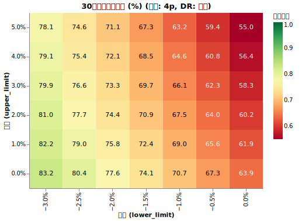
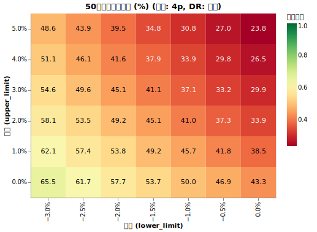
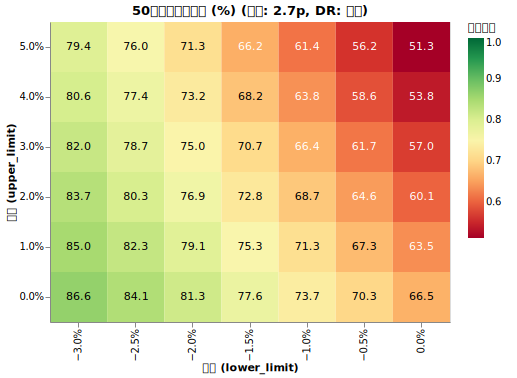
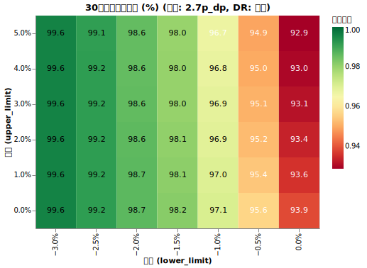
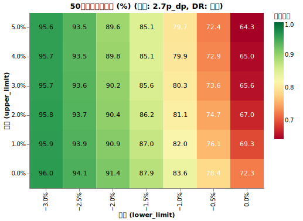
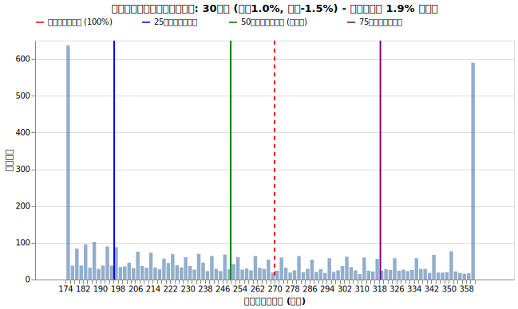
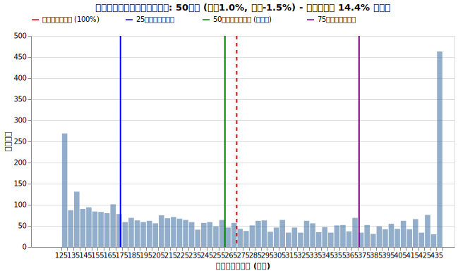

# 支出制限: ダイナミック・スペンディング戦略とガードレール戦略

<!--
DO NOT DELETE:

再現手順

python3 src/dynamic_spending_grid_main.py --exp_name 4p
python3 src/analyze_dynamic_spending_grid_main.py  --exp_name 4p

python3 src/dynamic_spending_grid_main.py --exp_name 2.7p
python3 src/analyze_dynamic_spending_grid_main.py  --exp_name 2.7p

python3 src/dynamic_spending_grid_main.py --exp_name 2.7p_dp
python3 src/analyze_dynamic_spending_grid_main.py  --exp_name 2.7p_dp

python3 src/dynamic_spending_grid_main.py --exp_name 1p_1.5p_spend
python3 src/analyze_dynamic_spending_grid_main.py  --exp_name 1p_1.5p_spend
-->

今までのシミュレーションでは「資産が減少していても支出のペースを絶対守る」という前提がありました。しかし現実では、資産が目減りしている時は支出を抑えようとするはずです。これを考慮に入れた戦略がヴァンガード社の提案するダイナミック・スペンディング（動的支出）です。

この戦略では、毎年一定額を取り崩すのではなく、前年の支出額を基準として増減の上限と下限を設けます。運用が好調な年は生活水準を上げる上限を設け、不調な年は生活水準を少し下げる下限を設けることで、資産が底をつくのを防ぎます。

!!! abstract "重要なポイント"
    * **初期の「目標支出率」の設定が生存確率を決定づける。** 支出を動的に調整するルールを設けても、ベースとなる目標支出率（4%など）が高すぎれば、長期間の生存を確保することは極めて難しい。
    * **生存確率の改善には「下限（削減）」の設定が最も大きな影響を与える。** 運用不調時に生活費を削る下限の設定は、好調時に支出を増やす上限の設定よりも、資産を長持ちさせる効果が圧倒的に高い。
    * **ダイナミックリバランスは支出増による生存リスクを緩和する。** 資産配分の最適化を組み合わせることで生存確率はさらに10〜19%向上し、生活水準の向上と資産の維持を両立しやすくなる。
    * **資産の寿命を延ばす代償として、購買力低下のリスクを伴う。** 枯渇を防ぐための支出削減を続けると、実質的な購買力が初期の6〜7割まで低下する可能性があるため、余裕を持った計画が不可欠である。

これと似た戦略として[ガードレール戦略](#付録-ガードレール戦略)というものもあります。それも付録で紹介します。

## ダイナミック・スペンディング（動的支出）戦略の紹介と出典

このサイト「日本版リタイア後の取り崩し戦略 〜 4%ルールを信じるな」では様々な条件を吟味して4%ルールの不備を指摘してきました。

4%ルールは「アメリカにおける、30年生存確率を上げるための戦略」として開発されましたが、「4%ルールっておかしいよね」という話は海外でも挙げられています。ヴァンガード社が 2021年に出した [Fuel for the F.I.R.E.: Updating the 4% rule for early retirees (英語pdf)](https://www.vanguardmexico.com/content/dam/intl/americas/documents/mexico/en/fuel-for-the-fire.pdf) では以下の4%ルールの問題点を指摘しています。

1. **リタイア期間の想定が30年であること**

    このサイトでは常に50年の情報をお届けしています。

1. **投資信託の手数料などが考慮されていない**

    [信託報酬の影響](trust_fee.md) の回で触れました。オルカン等の超低手数料の場合はあまり気にしなくても大丈夫ですが、1%などの手数料の商品だと生存確率が大幅に下がることを見ました。

1. **アメリカ資産へ偏りすぎていて国際分散投資の効果が含まれていない**

    [S&P500 vs. オルカン](sp500_vs_acwi.md) の回で触れましたが、オルカンが誕生して以降アメリカの方が成績が良かったので、相対的に国際分散投資の魅力はまだ数字で見られていないのが現状です。

1. **市場の状況に関わらず「初年度の4%相当額にインフレ率を加えて引き出し続ける」という引き出し戦略**

    ==これが今回のテーマです！==

さて、その PDF では、生存確率を上げる戦略として**ダイナミック・スペンディング**を提案しています。出典は[From assets to income: A goals-based approach to retirement spending (2018, 英語pdf)](https://www.firstlinks.com.au/uploads/whitepapers/Vanguard-assets-to-income-wp.pdf)。

仕組みの肝となる考え方は「暴落などで資産が目減りしている時は出費を抑える努力をしよう」という、ある意味真っ当なアイデアです。

### 戦略の詳細

実際には以下のような戦略を年初に行い、その年の年支出を決定します。

* 昨年の支出を $Y$円 とする
* インフレ率を考慮した今年の想定支出を $Y_{target}$円とする
    * 例えば昨年1月の物価からみた今年1月の物価の上昇率を $Y$に掛ける
* 今年の支出の上限を $(Y_{target} + 5\%)$円、下限を $(Y_{target} - 1.5\%)$ とする
* 今年の支出の目標値を (総資産 × $4\%$) とする
* 目標値が下限〜上限のなかに入っていればその値を、はみ出していたら上限か下限値を使う

!!! info "具体例"

    仮に昨年の支出が400万円だとします。物価が1年で2%上昇していた場合、今年の想定支出は408万円となります。その場合、今年の支出の上限は 428.4万円 (= 408 × 1.05)、下限は401.9万円 (= 408 × 0.985) となります。運用の結果資産が変動しますが、今年1月の総資産によって次の年の支出を決めます。

    * 9,600万円の場合 → 支出目標額は 384万円 (= 9,600 × 4%)。下限を下回ったので、支出は401.9万円とする。
    * 10,400万円の場合 → 支出目標額は 416万円 (= 10,400 × 4%)。下限〜上限の範囲内なので、支出は416万円とする。
    * 10,800万円の場合 → 支出目標額は 432万円 (= 10,800 × 4%)。上限を超えたので、支出は428.4万円とする。

このような流れとなります。このうち、自分が設定できるパラメータは3つです。

* 目標年支出率: 上記の場合4%です。
* 上限値・下限値: 上記の場合 +5%, -1.5%です。

これによって、**運用が好調なときは支出を伸ばし、不調なときは無理ない範囲で支出を減らしていくことを目指します。**

## 実験1: ダイナミック・スペンディング単体の効果 〜 4%ルールの場合

ではこのダイナミック・スペンディングの効果をシミュレーションで確かめてみましょう。

!!! info "シミュレーションの条件"

    * **初期資産**: 1億円
    * **投資先**: オルカン100% (期待リターン7%, リスク15%, 信託報酬 0.05775%)
    * **為替リスク**: USDJPY (期待リターン0%, リスク10.53%)
    * **インフレ率**: [AR(12)粘着モデル](cpi.md#実験3インフレの粘着性自己相関の影響)
    * **初期出費額**: 400万円 (目標支出率4%)
    * **税率**: 20.315%
    * **シミュレーション期間**: 50年
    * **試行回数**: 5000回

上記の条件に固定したうえで、ダイナミック・スペンディングの**上限（2%〜6%）**と**下限（2%〜-2%）**の組み合わせをすべて試しました。

インフレ率はボラティリティの入ったモデルを使い、5000のシナリオの中には物価高騰パターンや下降パターンなども入るようにします。

### 結果

30年後と50年後の生存確率（資産が枯渇せずに残っている確率）をヒートマップで確認します。

<figure>
  
  <figcaption>30年後の生存確率</figcaption>
</figure>

<figure>
  
  <figcaption>50年後の生存確率</figcaption>
</figure>

例えば、グラフの右下、上限が0%で下限が0%の戦略をとった場合の50年生存確率は43.3%です。上下限を固定するということは、ダイナミックスペンディングを全く行わずに物価上昇率に従う支出を行っていることになります。重要そうなところを取り出してみましょう。

| 手法 | 何もしない | 支出は落とさない 上限3%, 下限0% | ヴァンガード社の手法 上限5%, 下限-1.5% | 一番辛そう 上限0%, 下限-3% |
|---| --: | --: | --: | --: |
| 30年生存確率 | 63.9% | 58.3% | ==67.3%== | 83.2% |
| 50年生存確率 | 43.3% | 29.9% | ==34.8%== | 65.5% |

上限を0%としたまま下限を-3%（不調時は支出を*毎年*3%減らす）に変更すると、生存確率は43.3%から65.5%へと上昇します。これは、運用初期の暴落時に無理な取り崩しを控える「下限」と、運用好調時に生活水準を上げすぎない「上限」が、資産の寿命を延ばすために極めて有効に働いていることを示しています。

しかし、ヴァンガード社の手法(上限5%, 下限-1.5%)では、30年生存確率は少し上がりましたが(+3.4%)、50年生存確率はかなり下がりました(-9.5%)。これは、==そもそもの4%の取り崩し目標が危険だった==と解釈できます。そもそも4%ルールでは、何も支出調整をしない場合の50年生存確率は43.3%しかありません。せっかく総資産が伸びたり物価上昇率が低めになり年支出率が下がるケースであっても、無理やり危険な4%に調整してしまう戦略であったため、長期的には不利になったと考えられます。

## 実験2: ダイナミック・スペンディング単体の効果 〜 2.7%ルールの場合

では2.7%ルールというだいぶ支出率を下げた状態からスタートして、かつダイナミック・スペンディングの目標値も2.7%にしてみます。

### 結果

| 手法 | 何もしない | 支出は落とさない 上限3%, 下限0% | ヴァンガード社の手法 上限5%, 下限-1.5% | 一番辛そう 上限0%, 下限-3% |
|---| --: | --: | --: | --: |
| 30年生存確率 | 85.4% | 83.2% | ==89.1%== | 95.4% |
| 50年生存確率 | 66.5% | 57.0% | ==66.2%== | 86.6% 

ヴァンガード社の(5%, -1.5%)という基準では50年生存確率にはほぼ影響がありませんでした。

<figure>
  
  <figcaption>2.7% ルール、50年後の生存確率</figcaption>
</figure>

次の章で詳しく解説しますが、下限-1.5%に対して、上限5%というのは急に贅沢をしすぎで、これが長期の生存に悪影響を及ぼしています。よって、==上限1%, 下限-1.5%== 程度のライフスタイル (生存率 66.5% → 75.3%)が現実的で、かつヴァンガード社の手法よりも長期的には優れていると言えます。

### 考察：生存確率を決定づける「目標支出率」

実験1（4%ルール）と実験2（2.7%ルール）の結果を比較すると、生存確率に対して最も支配的な要因は、調整ルールの詳細よりも**「ベースとなる目標支出率の設定」**であることが明確になりました。

目標支出率が4%の場合、どのような調整を加えても50年生存確率を高い水準に保つことは困難です。一方で、目標支出率を2.7%まで下げることで、無調整でも生存確率は66.5%に達し、適切な調整を加えることで86.6%まで向上します。

ダイナミック・スペンディングは優れたリスク管理の手法ですが、ベースとなる支出率が高すぎる場合にはその効果も限定的です。まずは慎重な目標支出率を設定し、その上で運用状況に合わせた柔軟な調整を組み合わせることが、長期生存の鍵となります。

## 下限と上限のもつ効果の検証

上限と下限がそれぞれ生存確率にどの程度影響しているかを調べるため、2.7%ルールの時のシミュレーション結果（20年~50年生存確率）に対して数式によるフィッティングを行いました。

その結果以下のことがわかりました。

1. **下限（支出削減）の影響力は、常に上限（支出増加）を上回る**

    運用期間の長さにかかわらず、常に「運用不調時に生活費を削る」ことの方が「運用好調時に生活費の増加を抑える」ことよりも生存確率を高める効果があります。

2. **期間が長くなるほど、上限の設定も重要になる**

    20年や30年といった比較的短い期間では、上限の設定は生存確率にあまり影響しません。しかし、40年、50年と長くなるにつれて、運用好調時に生活水準を上げすぎないこと（上限の抑制）が、最終的な生存確率にとって無視できない重要な要素になっていきます。

??? info "フィッティング結果の詳細"

    シミュレーション結果に対して、以下の非線形モデルを当てはめました。
    
    $$
    \text{Survival Rate} = a \times (L - b)^c + d \times (U - e)^f + g
    $$
    
    *(※ L: 下限、U: 上限)*
    
    20年から50年までの各生存確率に対するフィッティング結果は以下の通りです。すべての期間において決定係数（$R^2$）が0.988以上となり、この数式で非常に高い精度で説明できることが確認できました。
    
    | 期間 | 近似式 | 決定係数 ($R^2$) |
    | :--- | :--- | :--- |
    | **20年** | $\text{Rate} = -100.00 \times (L + 0.0840)^{3.19} - 0.02 \times (U + 0.0217)^{0.16} + 1.0162$ | 0.9961 |
    | **30年** | $\text{Rate} = -21.07 \times (L + 0.0373)^{1.56} - 0.58 \times (U + 0.1948)^{0.26} + 1.3478$ | 0.9936 |
    | **40年** | $\text{Rate} = -12.00 \times (L + 0.0300)^{1.18} - 2.85 \times (U + 0.1601)^{0.10} + 3.2932$ | 0.9916 |
    | **50年** | $\text{Rate} = -12.13 \times (L + 0.0297)^{1.11} - 1.60 \times (U - 0.0009)^{0.87} + 0.8912$ | 0.9886 |
    
    **解析からの考察:**
    
    * **パラメータの変化**: 期間が延びるにつれて、上限（$U$）に係る係数（$d$）の絶対値が 0.02 から 1.60 へと徐々に大きくなっています。これは、長期間の生存には上限のコントロール（支出の過度な増加を防ぐこと）が徐々に重要になっていくことを数学的に示しています。
    * **下限の優位性**: すべての期間において、下限（$L$）に係る係数（$a$）は上限の係数よりも圧倒的に大きく、強い影響力を持っています。ただし、その関係性は初期の急激なカーブ（指数 $c=3.19$）から、徐々に線形（指数 $c \approx 1.1$）へと変化しています。

## 実験3: ダイナミックリバランスとの組み合わせ

前回の「[最適配分を繰り返すダイナミックリバランス](dynamic_rebalance.md)」では、目標年数と現在の支出率に応じて、株式（オルカン）と無リスク資産の最適な比率を毎年見直す戦略の有効性を確認しました。

ここでは、「ダイナミック・スペンディング（支出の動的調整）」と「ダイナミックリバランス（資産配分の動的調整）」を組み合わせてみます。

シミュレーション条件は実験2と全く同じ 2.7%ルールですが、今回は資産状況に合わせて毎年オルカンと無リスク資産の配分比率を最適化します。

!!! info "シミュレーションの条件"

    * **初期資産**: 1億円
    * **投資先**: オルカン100% (期待リターン7%, リスク15%, 信託報酬 0.05775%)
    * **為替リスク**: USDJPY (期待リターン0%, リスク10.53%)
    * **インフレ率**: [AR(12)粘着モデル](cpi.md#実験3インフレの粘着性自己相関の影響)
    * **初期出費額**: 400万円 (目標支出率4%)
    * **税率**: 20.315%
    * **シミュレーション期間**: 50年
    * **試行回数**: 5000回
    * ==**リバランス**: 毎年1回、残り年数と現在の支出率に基づいて、オルカンと無リスク資産の最適な配分比率を再計算し、ポートフォリオを組み替えます（開始1年後に最初の最適化が走ります）。==

この条件下で、実験1と同様にダイナミック・スペンディングの**上限（0%〜5%）**と**下限（-3%〜0%）**の組み合わせをすべて試しました。

### 結果

同様に、30年後と50年後の生存確率をヒートマップで確認します。

<figure>
  
  <figcaption>30年後の生存確率（ダイナミックリバランスあり）</figcaption>
</figure>

<figure>
  
  <figcaption>50年後の生存確率（ダイナミックリバランスあり）</figcaption>
</figure>

結果を見ると、ダイナミックリバランスを組み合わせることで、実験1（オルカン100%固定）よりも全体的に**生存確率が底上げされている**ことがわかります。

具体的な改善幅をいくつかの代表的な戦略で比較してみましょう。

| 手法 | 何もしない | 支出は落とさない 上限3%, 下限0% | ヴァンガード社の手法 上限5%, 下限-1.5% | 一番辛そう 上限0%, 下限-3% |
|---| --: | --: | --: | --: |
| リバランスなし 50年生存確率 | 66.5% | 57.0% | 66.2% | 86.6% |
| リバランス有り 50年生存確率 | 72.3% | 65.6% | 85.1% | 96.0% |
|生存確率の改善幅 | **+5.8%** | **+8.6%** | **+18.9%** | **+9.4%** |

ダイナミックリバランスが「残り年数」と「現在の支出率」に基づいて資産配分を最適化することで、支出の動的調整と強力な相乗効果を発揮することが確認できました。

特に注目すべきは、**ダイナミックリバランスが「上限（支出増加）による生存確率への悪影響」を大幅に緩和している**点です。リバランスなしのケースでは、好調時に支出を増やしすぎると長期的には生存確率を下げてしまいますが、資産配分を最適化（DR）することで、より安全に生活水準の向上を享受できることが数学的にも示されました。

しかし、どのような設定でも生存確率が100%になるわけではありません。数式による解析では、生存確率は依然として「下限（不調時の支出削減）」の設定に対して極めて高い感度を持っています。長期間の生存を確実なものにするためには、DRによる最適化を行いながらも、不調時には柔軟に支出を抑える姿勢が引き続き重要となります。

### 実質的な生活水準の低下

ここで、資産の推移だけでなく生活水準への影響についても考えます。**破産せずに生存できる代わりに、一体どれくらい支出を我慢しなければいけないのでしょうか？**

ダイナミック・スペンディングの下限（例えば-1.5%）は「名目ベース」の金額です。インフレ局面では生活の維持に必要な金額は年々上がっていくにも関わらず、支出額は名目ベースでさらに削られる可能性があるため、実質的な購買力が大きく低下するリスクがあります。

これを視覚化するため、2.7%ルール（初期270万円）に対して「上限+1%、下限-1.5% ＋ ダイナミックリバランス」という保守的な設定でシミュレーションを行い、「破産せずに生き残ったパス」において、*実質的な*支出額（つまり初年度の物価に換算した支出）がどのように分布しているかを確認しました。

<figure>
  
  <figcaption>30年後の実質支出分布（赤の破線は初期の生活水準 270万円）</figcaption>
</figure>

<figure>
  
  <figcaption>50年後の実質支出分布</figcaption>
</figure>

**グラフの見方:**

* **赤の破線**: 初期支出270万円の実質価値を100%とした「当初の生活水準」です。
* **青・緑・紫の実線**: 生き残った人たちの「実質支出額」の分布（25%、50%、75%パーセンタイル）です。

**実質的な購買力の変化:**

2.7%ルールという保守的な開始点とダイナミックリバランスを組み合わせることで、4%ルールの時のような「壊滅的な購買力低下」は避けられる傾向にあります。

* **30年後**: 生存パスの中央値は**249.9万円**（初期の約93%）となっており、多くの人が当初に近い生活水準を維持できています。ただし、下位25%の層は**196.3万円**（初期の約73%）まで実質支出が落ち込んでいます。
* **50年後**: 生存パスの中央値は**260.3万円**（初期の約96%）と、生存者に限れば長期的には生活水準が回復する傾向が見られます。これは、長期間生き残ったパスは運用が好調であったケースが多く、上限+1%の範囲内でも徐々に生活水準を戻せているためです。一方で、下位25%は**173.9万円**（初期の約64%）と、依然として厳しい節約を強いられています。

**結論:**
2.7%ルールとダイナミックリバランス、そして控えめな支出調整（上限1%）を組み合わせることで、資産の長寿命化と生活水準の維持を高いレベルで両立できる可能性が示されました。==しかし、運用の振るわなかった「生存者」は依然として購買力が初期の6〜7割まで低下する可能性があるため、余裕を持った計画が重要であることに変わりはありません。==

## 付録: ガードレール戦略

ダイナミック・スペンディングの考え方の源流とも言えるのが、2006年にジョナサン・ガイトン氏とウィリアム・クリンガー氏によって提唱された「ガードレール戦略」です（参考: [Decision Rules and Maximum Initial Withdrawal Rates](https://www.financialplanningassociation.org/sites/default/files/2021-11/2006%20-%20Guyton%20and%20Klinger%20-%20Decision%20Rules%20and%20SWR%20%281%29.PDF)）。

この戦略では、資産の増減に伴う支出の変更を「ガードレール」という仕組みに例え、以下の4つのルールで運用します。

### 支出の決定と調整のルール

* **基本の支出（引き出しルール）**: 初年度に引き出し率を決定し、以降は前年の支出額にインフレ率を加算した金額をベースとします。
* **支出を削る判断（資本保存ルール）**: 現在の引き出し率（支出額 ÷ 時価資産）が、初期設定の1.2倍を超えた場合、翌年の支出を10%削減します。
* **支出を増やす判断（繁栄ルール）**: 現在の引き出し率が初期設定の0.8倍を下回った場合、翌年の支出を10%増額します。
* **売却順序の管理（ポートフォリオ管理ルール）**: 目標比率を超過している資産クラスから優先的に売却し、出金と同時にリバランスを行います。

!!! info "ガードレール戦略の運用例"

    以下の条件でリタイアを開始したケースを想定します（簡略化のため、インフレ率は0%とします）。

    * **開始時点**: 資産1億円 / 支出450万円（初期引き出し率 4.5%）
    * **ガードレール設定**: 
        * 上限トリガー（3.6%以下）: 初期値 4.5% × 0.8
        * 下限トリガー（5.4%以上）: 初期値 4.5% × 1.2

    **シナリオA：運用が好調な局面**

    資産が1.3億円まで増加した場合の判定です。

    * 支出予定額：450万円
    * 現在の引き出し率：約3.46%（450 ÷ 13,000）
    * 判定：上限トリガー（3.6%）を下回ったため、翌年の支出額を10%増額し **495万円** とします。

    **シナリオB：市場の暴落と、その後の回復**

    資産が一度大きく減少し、その後に持ち直した場合の連続的な判定です。

    **1. 暴落時（資産が8,000万円に減少）**

    * 支出予定額：450万円
    * 現在の引き出し率：5.625%（450 ÷ 8,000）
    * 判定：下限トリガー（5.4%）を上回ったため、翌年の支出額を10%削減し **405万円** とします。

    **2. 回復時（資産が9,000万円に回復）**

    * 支出予定額：405万円（前年の削減を維持）
    * 現在の引き出し率：4.5%（405 ÷ 9,000）
    * 判定：ガードレールの範囲内（3.6% 〜 5.4%）に戻ったため、支出額は変更せず **405万円** のまま据え置きます。

### 戦略のパラメータ設定

一般的に以下の設定値が用いられます。

| パラメータ | 標準的な設定値 | 説明 |
| :--- | :--- | :--- |
| 初期引き出し率 | 4.0% 〜 5.0% | リタイア初年度の資産に対する支出割合 |
| 調整のトリガー | ±20% | 現在の引き出し率が初期値から乖離した際の閾値 |
| 調整幅 | 10% | トリガー発動時に増減させる支出額の割合 |

### ダイナミック・スペンディングとの違い

本編で紹介したヴァンガード社のダイナミック・スペンディングとは、主に以下の点が異なります。

* **調整の頻度と性質**: ダイナミック・スペンディングは毎年、資産総額に応じて滑らかに支出を変動させますが、ガードレール戦略は閾値を超えた時にだけ段階的に調整を行います。
* **基準の置き方**: ダイナミック・スペンディングは現在の総資産に一定率を掛けるという発想が強いのに対し、ガードレール戦略はインフレ調整後の前年支出を維持しようとする傾向が強く、そこからの乖離が限界に達した時に修正をかけます。

### 運用上の注意点

!!! warning "この戦略を検討する上で見過ごせないのが、**翌年の支出額を10%削減する**というルールの重さです。"

    名目ベースでの10%削減は、家計にとって極めて大きな下方修正となります。特にインフレが進行している局面では、実質的な購買力はさらに低下します。資産を守るための「ガードレール」は、裏を返せば、市場が回復するまで生活水準を大幅に落とし続けるという、精神的にも厳しい規律を求めるものであることは理解しておく必要があります。
