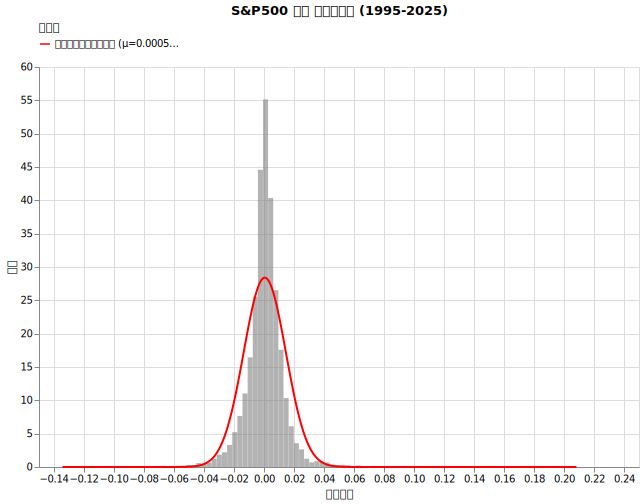
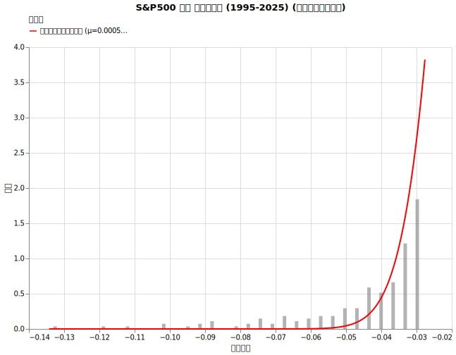
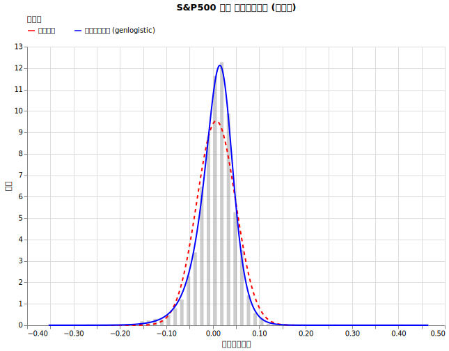
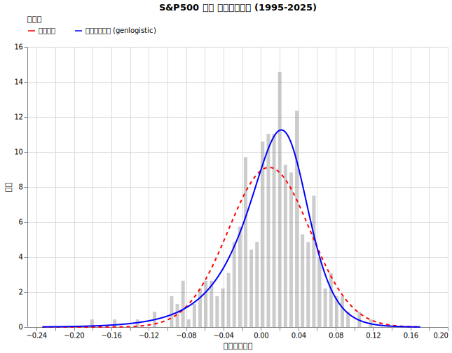
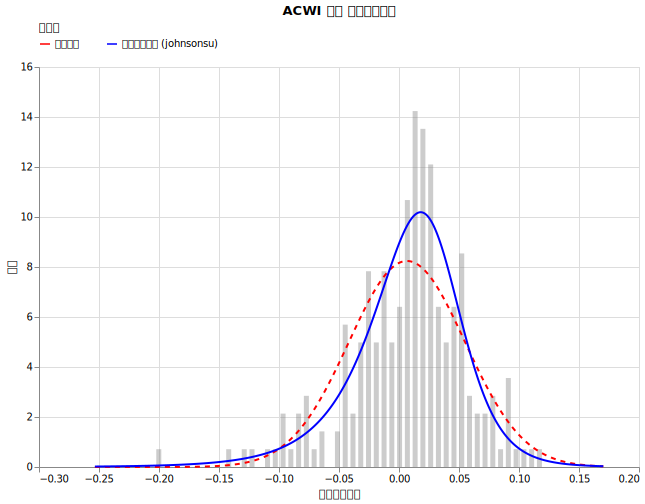
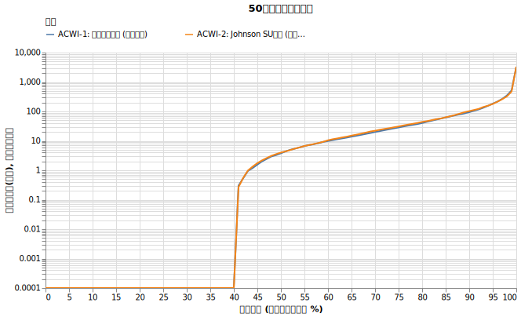
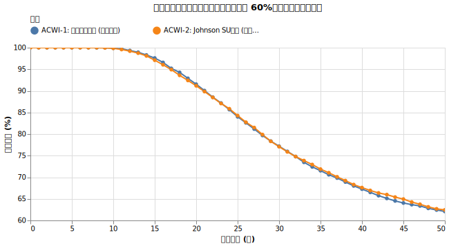

# ファットテール分布の影響

資産運用のシミュレーションにおいて、株価の変動を正規分布で仮定することが一般的です。しかし実際の相場では、正規分布の予測をはるかに超える頻度で大暴落や大暴騰が発生します。この極端な変動が起きやすい性質「ファットテール」を考慮に入れることで、より現実に即した取り崩しのリスクを評価できます。

!!! abstract "重要なポイント"
    * **実際の株価変動は正規分布ではない。** 理論上の予測よりもはるかに高い頻度で、大暴落や大暴騰（極端な値動き）が発生する「ファットテール」という特性を持つ。
    * **ファットテールを考慮すると、資産の枯渇確率が上昇する。** 大暴騰も起こるものの、長期間の取り崩しにおいては、大暴落によるダメージが大きく、50年後の枯渇確率は55.8%から57.0%へと悪化するなど、結果的に生存確率を押し下げる要因となる。
    * **正確なリスク評価には適切なモデルが必要。** 正規分布モデルでは極端なリスクを過小評価してしまうため、現実のデータにより適合する分布モデルを用いることが重要。

## ファットテール分布とは

インデックス投資の理論的な背景には「ランダム・ウォーク理論」がありますが、これは株価の値動きがランダムであり、その結果が正規分布に近づくという前提に基づいています。しかし、実際の株式市場のデータを見ると、リターンの分布は正規分布とは異なる特徴を示します。

具体的には、平均値付近にデータが集中しつつも、正規分布では起こり得ないような大きな変動（暴落や暴騰）が頻繁に発生します。この現象は「ハイピーク・ファットテール（尖度が高く、裾が厚い）」と呼ばれます。

### ファットテール分布を見てみる

S&P500の過去30年間の日次リターン（算術リターン）を正規分布と重ねて比較すると、そのズレが明確に確認できます。

!!! info "リターンの計算の種類"

    *   **算術リターン(Simple Return) ($R_t$):**　　$R_t = \frac{P_t - P_{t-1}}{P_{t-1}} = \frac{P_t}{P_{t-1}} - 1$
    *   **対数リターン(Log Return) ($r_t$):**　　$r_t = \ln\left(\frac{P_t}{P_{t-1}}\right) = \ln(1 + R_t)$

以下の表は、実際のデータと正規分布（理論値）における出現割合を比較したものです。平均的なリターンの出現割合は理論値の約1.6倍であるのに対し、-3σを超える大暴落の発生割合は理論値の7.4倍以上に達しています。

{!data/fat_tails/daily_outlier_table.md!}

裾の部分（暴落・暴騰の領域）を拡大したグラフを見ると、現実のデータが正規分布の曲線を大きく超えて外側に分布していることがわかります。正規分布に基づいた予測では、こうした極端な変動の頻度を過小評価してしまうリスクがあります。

### 対数リターンで計算するべき理由

!!! info "この章はマニアックなので飛ばしてもらっても構いません"

金融工学や資産運用のシミュレーション（ブラック・ショールズ・モデルなど）においては、算術リターン（Simple return）ではなく対数リターン（Log return）を用いることが世界的なスタンダードです。主な理由は以下の通りです。

??? info "1. 時間的な「加法性」と中心極限定理"

    算術リターンで複数期間（例：2ヶ月）のリターンを計算する場合、$(1 + R_1) \times (1 + R_2) - 1$ と「掛け算」をする必要があります。
    しかし、対数リターンの場合は $r_1 + r_2$ と単なる「足し算」で複数期間のリターンを表現できます。統計学においては「足し算」であることに巨大なメリットがあります。
    
    独立した確率変数（毎月のリターン）を「足し算」していくと、その合計は中心極限定理により正規分布に近づく性質を持っています。そのため、月次の「対数リターン」を長期間（例：12ヶ月）足し合わせた年次リターンもまた、正規分布（元の価格から見れば対数正規分布）として扱うことができ、長期間の期待値 $T\mu$ や分散 $T\sigma^2$ を単純に時間の掛け算で正確にスケールアップ（時間換算）できるという理論的利点があります。

??? info "2. 正規分布（統計モデル）との親和性が高い"

    算術リターンは、下限が -100% である一方で、上限は無限大（+200%など）であるため、本質的に「右に歪んだ」非対称な分布になります。これを左右対称な正規分布に当てはめようとすると無理が生じます。
    一方、対数リターンは $-\infty$ から $+\infty$ までの値を取ることができるため、正規分布などの統計モデルに当てはめるのにより適した形（より対称に近い形）をしています。

??? info "3. 負の資産額を作る可能性を排除できる"

    算術リターンを正規分布でモデリングすると、理論上「リターンが -150%」といった負の資産が発生する可能性が含まれてしまいます。
    これを防ぐために実装上でリターンを -100% で切り捨て（クリッピング）を行うと、分布の左側の裾（大損）だけが削り取られ、意図せずシミュレーション結果（平均リターン）が高く上ブレしてしまうバグの原因となります。
    「対数リターン」を用いるモデル（幾何ブラウン運動）では、価格が0を下回ることが数学的にあり得ず、このようなクリッピングの副作用を完全に回避できます。

### 日次リターンと月次リターン

本シミュレーションでは、日次リターンではなく月次リターンを採用しています。その主な理由は以下の通りです。

* 50年という長期間のシミュレーションにおいて、日単位の微細なモデルのズレが蓄積し、結果の精度が低下するのを防ぐためです。
* 計算負荷を抑え、シミュレーションの効率を高めるためです。
* 実際の資産取り崩しは月単位で行われることが一般的であり、月次リターンの方が現実に即しているためです。

統計学における「中心極限定理」によれば、独立な確率変数の和は、変数の数が増えるほど正規分布に近づきます。しかし、月次単位の集計であっても、依然として正規分布では説明しきれないファットテールの影響が残っています。

以下に、S&P500の月次リターンの分布と、正規分布および最適にフィットしたモデル（Best Fit）の比較のグラフを2つの期間で作りました。

* 全期間: 1871-03 ~ 2025-12
* 30年間: 1995-01 ~ 2025-12

いずれにおいても、正規分布よりも他の分布モデルの方がよりフィットしており (=BICが小さく)、月次単位でもファットテールの影響を考慮すべきであることがわかります。

## シミュレーション

オルカン（ACWI）を対象に、対数正規分布モデルと、ファットテールをより正確に反映したモデルを用いて、取り崩しの成功確率を比較します。

!!! info "シミュレーションの設定"
    * **初期資産**: 1億円
    * **投資先**: オルカンに100%投資（このモデルを今回変化させています）
    * **為替リスク**: あり（ドル円 リターン0%, リスク10.53% を合成）
    * **取り崩し額**: 毎年400万円（物価連動）
    * **物価上昇率**: 年率2%固定
    * **譲渡所得税**: 20.315%
    * **信託報酬**: 0.05775%

検証に使用する2つのモデルは以下の通りです。どちらも 2008-04 〜 2025-12の月次対数リターンにフィットさせて作りました。

| Model ID | 分布モデル | 月次パラメータ ($\mu_M$, $\sigma_M$) | 年率換算した 算術平均と標準偏差 | BIC |
| :--- | :--- | :--- | ---: | ---: |
| **ACWI-1** | 対数正規分布   (今までと同じ) | $\mu=0.006393$, $\sigma=0.048285$ | 9.47%, 18.38% | -685.50 |
| **ACWI-2** | Johnson SU   (ファットテール考慮)  | $a=0.598, b=1.597,$   $\text{loc}=0.033, \text{scale}=0.058$ | 9.50%, 18.42% | -695.84 |

<!-- TODO: Add link -->
!!! warning "以前の {リターン7%, リスク15%} とは違う値を使っています"

    これまでの章（為替リスクの検証など）では、オルカンのリターンを7%と保守的に設定していました。しかし本章では過去のデータに直接フィッティングを行っているため、期待リターンが約9.5%と高く設定されています。
    
    リターンが高く設定されているため、本章での50年破産確率（約57%）は為替の章（約62%）よりも低く（良く）出ていますが、これはファットテールの影響ではなく前提条件（ベースとなるリターン）の違いによるものです。章をまたいで破産確率の絶対値を直接比較しないようご注意ください。オルカンとして一体何の値を使うべきか、S&P500との比較などは[次の回](sp500_vs_acwi.md)で行います。==今回はファットテールの影響のみを見ていきます。==

どれくらいフィットしているか図示したグラフがこちらです。

特に **ACWI-2** (Johnson SUモデル [(scipy による英語解説)](https://docs.scipy.org/doc/scipy/reference/generated/scipy.stats.johnsonsu.html)) は、 ACWI-1 よりも低いBICを示しており（＝良い）、年率平均リターンを現実的な水準（9.50%）に保ちつつ、ファットテールの影響を最も適切に捉えています。Johnson SU は左右非対称の分布をうまく扱うことができます。

## 結果

5000回行った取り崩しのシミュレーションの結果は以下の通りです。

{!data/fat_tails/simulation_result.md!}

ファットテールをきちんと再現した場合、資金枯渇確率は

- 30年後で 35.8% → 37.0%
- 50年後で 55.8% → 57.0%

と若干増えています。

これを見ると、資産が落ちているのがわかります。

ファットテールは正規分布ではほぼ起こらないとされる暴落を再現しますが、同様に暴騰も再現します。それでも50年という期間で見ると資産を押し下げる効果があります。

生存確率は特に20~25年の経過年数で少し下がっています。

## 結論

実際の相場に見られる「ファットテール」をシミュレーションに組み込むと、正規分布を前提とした場合と比べて、資産が枯渇する確率がわずかに（数パーセント程度）上昇することが確認できました。

ファットテールな環境では、想定外の大暴騰が起こる一方で、大暴落も頻発します。資産を取り崩しながら運用するフェーズにおいて、下落局面での想定以上の大きなダメージは、その後の回復を困難にし、全体の生存確率を押し下げる要因となります。

==ファットテールを再現する取り崩しシミュレーションは少ないと思いますが、考慮しないと実際よりも生存確率が高めに出てしまうことを覚えておきましょう。==

## 付録: ファットテールモデルの扱い方の注意点

この章はマニアックです。

!!! warning "ファットテール分布をフィッティングする際の罠"

    シミュレーション用に現実のデータからファットテール分布（Johnson SUなど）のパラメータを推定する際、単純な最尤推定（Maximum Likelihood Estimation, MLE）を行うと、長期のシミュレーション結果が破綻する罠がいくつも存在します。モデル構築の際に直面した主な問題と、最終的な解決策は以下の通りです。

    * **左右対称な分布（Laplaceなど）は使ってはいけない**
    * **非対称な分布（Johnson SUなど）でも単純に平均パラメータを固定するだけでは計算がズレてしまう**
    * **最終的な解決策: 自由に最尤推定を行った後、理論的期待値が実績と一致するように分布全体をシフトさせる**

!!! failure "罠1: 左右対称な分布（Laplaceなど）を使うと年率リターンが異常になる"

    Laplace分布などを単純に最尤推定でフィッティングすると、リーマンショックのような「左側の極端な大暴落」のデータをうまく説明できるため、評価スコア（Log-Likelihood等）は高くなります（最もフィットしていると判定されやすい）。
    
    しかし、Laplace分布は左右対称であるため、左の裾を太くすると「現実には起きていない同レベルの大暴騰（右側のテール）」が起きる確率も強制的に高めてしまいます。結果として、シミュレーション上の年率平均リターンが19%など非現実的な値に跳ね上がってしまいます。現実の株式相場は負の歪度（暴落の方が急激）を持つため、**非対称な分布（Johnson SUやSkew-normalなど）**のみを選択する必要があります。

!!! failure "罠2: 単純に「平均パラメータ」を合わせるだけでは、長期のCAGRが壊れる"

    次に、非対称な分布（Johnson SUなど）を使用し、対数リターンの平均パラメータ（`loc`）を過去データの実績平均に強制的に固定してフィッティングを行いました。
    
    しかし、この方法でも50年後の資産額の中央値（CAGR）が、正規分布のシミュレーション結果と大きく乖離（2倍以上のズレ）してしまいました。非対称で複雑な分布においては、`loc`パラメータは分布全体の「平行移動」を意味するだけであり、分布そのものの「理論的な期待値」とは一致しないためです。単純に`loc`を固定するだけでは、結果的に分布全体の重心がズレてしまいます。

!!! success "最終的な解決策: 自由にフィットさせた後、理論的期待値を実績にシフトさせる"

    最終的に以下の手順をとることで、長期間の複利効果（CAGR）を過去実績に完全に固定しつつ、極端な暴落の頻度（テールの太さ）だけを正確に比較できるモデルを作成しました。

    1. まずパラメータに制約を設けず、自由に非対称分布（Johnson SUなど）をデータにフィッティングさせる（最適な形を探す）。
    2. そのフィットした分布が持つ「理論的な期待値」を計算する。
    3. 計算した理論的期待値と、過去データの実績平均との差分を計算し、その分だけ分布全体を平行移動（`loc`をシフト）させて、期待値を実績に完全に一致させる。