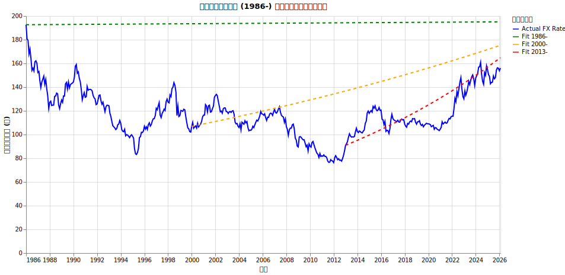
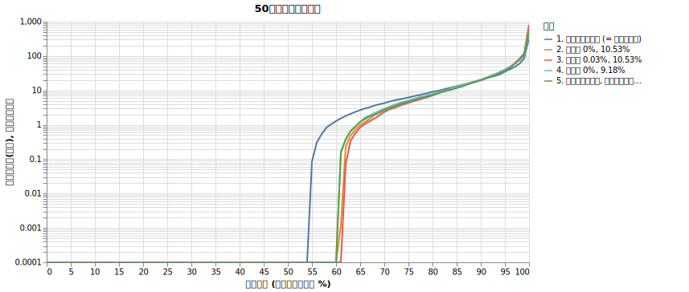
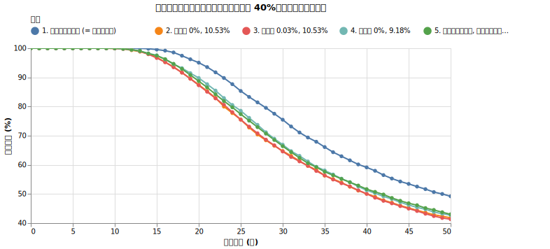

# 為替リスクが取り崩しに与える影響

オルカンでもS&P500でも日本円建てのリターン・リスクをきちんと扱っているシミュレーションは少ないです。為替リスクはどれくらいシミュレーションに影響するかを調べました。

!!! abstract "重要なポイント"
    * **為替リスクは生存確率を明確に低下させる。** 為替のボラティリティ（変動幅）が加わることで、長期的な生存確率が明確に悪化する（50年破産確率が54.4%から62.0%へと約7.6%上昇）。
    * **為替リスクは「ボラティリティの加算」として作用する。** 株価の変動リスクに為替の変動リスクが上乗せされ、ポートフォリオ全体のボラティリティが高まる。
    * 為替によるリターンの押し上げ（右肩上がりのトレンド）を期待するよりも、ボラティリティ増加のデメリットの方が長期的には支配的。

## 為替リスクとは何か

為替リスクとは、S&P500や全世界株式（オルカン）など、外貨建ての資産に投資する際に生じる、通貨間の交換レート（為替レート）の変動による不確実性のことです。海外の資産を購入する際は「円」を「外貨」に交換し、売却する際は再び「円」に戻すことになります。そのため、現地の株価そのものが値上がりしていても、その間に「円高・外貨安」が進んでいれば、円換算したときの資産価値は目減りしてしまいます。逆に「円安・外貨高」が進めば、資産価値が上乗せされることになります。

## 為替の歴史的推移とシミュレーションの前提

為替レートは、金利差、国の信用力（ファンダメンタルズ）、実需など、さまざまな要因が複雑に絡み合って決定されます。

過去の為替（ドル円）のデータがどのように推移してきたのか、月次データから年率換算したリターンとボラティリティを計算してみた結果が以下になります。

| 期間 | データポイント数 | 年率換算リターン | 年率換算リスク |
| :--- | :--- | :--- | :--- |
| 1986年以降（プラザ合意定着後） | 482ヶ月分 (40.2年) | 0.03% | 10.53% |
| 2000年以降（ゼロ金利・キャリートレード） | 314ヶ月分 (26.2年) | 1.90% | 9.46% |
| 2013年以降（アベノミクス異次元緩和） | 158ヶ月分 (13.2年) | 4.55% | 9.18% |

ボラティリティに関しては、どの期間をとってもおよそ9%〜10.5%程度と比較的安定していることがわかります。一方で、平均リターンは期間の取り方によって大きく異なります。

以下のグラフは、これらの計算結果をもとに、それぞれの期間の開始年を起点とし、計算された平均リターンに基づいて将来を予測した理論値（フィッティングライン）を描画したものです。

<small>データ元: [主要時系列統計データ表 | 日本銀行時系列統計データ検索サイト](https://www.stat-search.boj.or.jp/ssi/mtshtml/fm08_m_1.html)</small>

2000年以降や2013年以降の平均リターン（年率1.90%や4.55%）を前提とすると、将来のドル円レートが青天井で登っていく結果になってしまいます。為替相場において、一方的なトレンドが永遠に続くという仮定を置くのは非現実的です。

そのため、為替リスクを組み込むにあたり、**1986年以降の設定（年率換算リターン: 0.03%、年率換算リスク: 10.53%）**を使用します。これにより、為替によるリターンの押し上げという楽観的な期待を排除しつつ、為替特有の価格変動リスクのみを適切にシミュレーションへ反映させることができます。

!!! note "相関に関する仮定"
    本シミュレーションでは、世界株式（オルカン）の株価変動や物価上昇率と為替レートの変動には**相関がない（相関係数0）**と仮定して計算を行っています。
    <!--TODO: 購買力平価説の document を作ったらここをアップデートする-->

## シミュレーションによる検証

為替リスクが長期の生存確率に与える影響を検証するため、以下の条件でシミュレーションを行いました。

!!! info "シミュレーションの設定"
    * 初期資産: 1億円に設定し、オルカン（期待リターン7%、ボラティリティ15%）に100%投資
    * 取り崩し額: 毎年400万円
    * 物価上昇率: 2%固定
    * 譲渡所得税: 20.315%を計算する
    * 信託報酬: 0.05775%
    * **為替リスク**: ドル円の変動を考慮（設定によりリターンとリスクを変更）

この基本設定に対して、為替リスクの条件を変えた以下の5つのケースを比較します。

1. 為替リスクなし（ドル円固定）
2. ドル円のリスク・リターン = 0%, 10.53%
3. ドル円のリスク・リターン = 0.03%, 10.53% （1986年以降の実績）
4. ドル円のリスク・リターン = 0%, 9.18% （2013年以降のボラティリティ）
5. 比較: 為替リスクなしで、オルカンのリスク（ボラティリティ）を15%から18.3%に変更

### 結果

50年後の資産の分布と破産確率の推移は以下の通りです。

{!data/forex/result.md!}

表を見ると、「1. 為替リスクなし」の場合と比べて「2. ドル円のリスク 10.53%」を考慮した場合、50年破産確率が54.4%から62.0%へと悪化していることが確認できます。また、「5. オルカンリスク18.3%」という単純なボラティリティ加算のケースと「2」がほぼ同じ破産確率になっていることから、為替リスクは「ボラティリティの増加」として生存確率を押し下げていることが分かります。

### 資産分布の比較

### 生存確率の比較

## 考察

シミュレーション結果から、為替リスク（ボラティリティ）を考慮することで、生存確率が明確に低下していることがわかります。

### 為替リスクは「ボラティリティの加算」として効いてくる

「1. 為替リスクなし」と「2. ドル円のリスク 10.53%」を比較すると、30年破産確率は29.4%から38.6%へ、50年破産確率にいたっては54.4%から62.0%へと悪化しています。
また、平均リターンをわずかに上乗せした「3. ドル円 0.03%, 10.53%」でも結果はほとんど変わりません。

注目すべきは、「5. 為替リスクなし, オルカンリスク18.3%」のケースが、為替リスクを考慮したケース（2. や 3.）とほぼ同じ結果になっている点です。これは、為替リスクが単なる「ボラティリティの加算」として作用していることを裏付けています。

為替リスクは、株価の暴落と同じく「いつ起きるか」が読めないリスクです。為替のボラティリティを考慮に入れないシミュレーションは、将来の生存確率を楽観的に見積もりすぎてしまう危険性があります。

??? note "数学的な話：リスクの合成"

    株価の変動と為替の変動に相関がないと仮定すると、合成されたトータルリスク $\sigma_{total}$ は、それぞれの分散（標準偏差の2乗）の和の平方根で表されます。

    $$\sigma_{total} = \sqrt{\sigma_{stock}^2 + \sigma_{fx}^2}$$

    今回の設定（株 15%、為替 10.53%）を当てはめると：
    $$\sigma_{total} = \sqrt{0.15^2 + 0.1053^2} \approx \sqrt{0.0225 + 0.0111} \approx 0.183$$
    (約 18.3%)

    つまり、為替リスクが 10.53% 加わることで、全体のボラティリティは 15% から約 18.3% へと上昇します。ボラティリティが上がれば、それだけ「ボラティリティ・ドラッグ」によって長期的な中央値の成長率（幾何平均リターン）が押し下げられます。

    * 為替なし：$0.07 - \frac{0.15^2}{2} = 0.05875$ (5.875%)
    * 為替あり：$0.07 - \frac{0.183^2}{2} \approx 0.0533$ (約 5.33%)

    この年率約 0.5% の成長率の低下が、30年、50年という長期の取り崩しにおいて、破産確率を 10% 近く押し上げる要因となっています。

## 結論

資産形成期において、為替リスクはそこまで心配するものではありません。

参考: [為替リスクとは | 普通の人が資産運用で99点をとる方法とその考え方
](https://hayatoito.github.io/2020/investing/#8bda)

しかし、取り崩しにおいては、為替リスク自体がボラティリティを上げる効果があります。

[ボラティリティの影響](volatility.md)で解説したように、ボラティリティは上がれば上がるほど生存確率は減るので、==シミュレーションをするのであれば為替の影響は確実に考慮するべき点です。== 為替をきちんとシミュレーションするのでもいいですが、上で解説した合成リスクの値をリスクとして使うのがオススメです。
