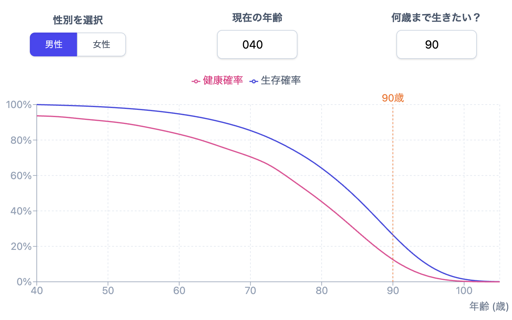
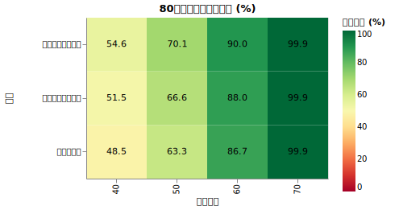
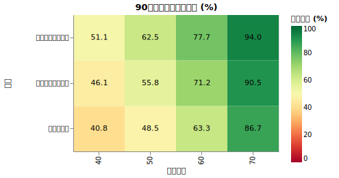
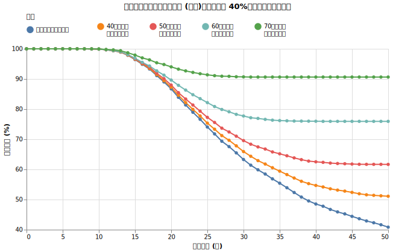
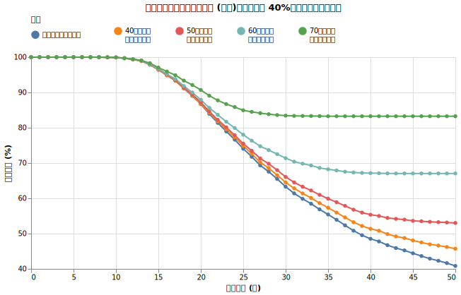

# 資産が枯渇する前に死亡するケースを考えてみる

今まで50年資産が枯渇しない確率などを計算してきました。生存率を上げる戦略として「あなたは途中で死ぬかも知れない」という確率を取り入れてみましょう。

つまり、「将来資産が枯渇するとしても、それ以前にあなたが死ぬような世界線は成功とみなす」という冗談のような、でも半分本気の考え方です。

ここまで考慮するライフシミュレーションはなかなか無いのではと思います。

!!! abstract "重要なポイント"

    * 「人生100年時代」という言葉があるが、100歳まで生きられるのは男性の約1.5%、女性の約6.5%
    * 「資産が枯渇する前に死んだ場合は成功とみなす」と90歳時点での成功確率は男性で8〜10%、女性で5〜8%上がる
    * [寿命・健康寿命予測ツール | たきびFIRE](https://takibi-fire.com/app/life-expectancy-calculator/) がオススメです。

## 寿命・健康寿命予測ツール

ライフプランシミュレーションをする時、何年まで生きることを想定しますか？ 「人生100年時代」という言葉が流行りましたが、実は100歳まで生きることは2026年現在では(特に男性では)かなり厳しいです。

[寿命・健康寿命予測ツール | たきびFIRE](https://takibi-fire.com/app/life-expectancy-calculator/) というツールを作りました。これはあなたの年齢と性別を入力すると、あなたと同じ年齢性別の人が何年後に何%生き残っているか、何％が健康かを表示します。

* 

このツールは厚生労働省が公表している[令和５年簡易生命表](https://www.mhlw.go.jp/toukei/saikin/hw/life/life23/)を用いました。

主なデータを見てみましょう。

|年齢|性別|80歳|85歳|90歳|95歳|100歳|
|---|---|--:|--:|--:|--:|--:|
|40歳|男|64.11%|47.03%|26.46%|9.32%|1.47%|
|    |女|82.13%|70.33%|50.66%|25.76%|6.48%|
|50歳|男|65.07%|47.73%|26.86%|9.46%|1.50%|
|    |女|82.86%|70.96%|51.11%|25.99%|6.54%|
|60歳|男|67.68%|49.65%|27.94%|9.84%|1.56%|
|    |女|84.59%|72.44%|52.18%|26.54%|6.68%|

## 100歳まで生きるシミュレーションもいいけれど

つまり、100歳まで生きられるのはあなたの同年代のうち、男性で約1.5%、女性で約6.5%となります。もちろん、これはあなたの同世代全体の話であり、あなたが何歳まで生きるかとは関係ありません。しかし、(特に男性の場合)90~100歳まで生きられるのは確率的には運がいい方といえます。

数%の確率で起こる暴落を気にするライフシミュレーションなのに、安易に100歳まで生きると考えるのはやめましょう。

## シミュレーションの実装

このセクションは完全に余談です。

「資産が枯渇する前に死んでしまったら成功とする」という状況を実装するためにちょっと面白い状況を作りました。

簡易生命表には年齢ごとの死亡率がわかっています。例えば「男性が70歳から71歳になる間に1.7%の人が死ぬ」というデータです。

自分のシミュレーターは月ごとに計算を行っているので、「毎月死ぬかも知れないサイコロを振って、当たりが出たら10億円手に入る」のような実装をしてみました。
70歳の人は毎月 0.14% (= $1 - (1.00 - 0.017)^\frac{1}{12}$) の確率で当たるサイコロを振ります。

資産が枯渇する前に死んだら、シミュレーション上では死ぬ代わりに10億円もらえるわけです。

## 実験：死亡率を考えるとどうなるか

今まで「資産が枯渇しない確率」を「生存確率」と呼んできましたが、今回はそれが紛らわしいので「成功確率」と書きます。

!!! info "固定条件"

    - 試行回数: 5,000回
    - 期間: 50年間
    - 初期資産: 1億円
    - 初期年間支出: 400万円 (支出率4%)
    - 投資先: オルカン100%（期待リターン7%、リスク15%、信託報酬 0.05775%）
    - 為替リスク: USDJPY（期待リターン0%、リスク10.53%）
    - インフレ率: 1.77% (固定)
    - 税率: 20.315%

!!! info "可変条件"

    - 資産が枯渇する前に死亡したら成功とみなすかどうか (2通り)
    - シミュレーション開始時の年齢 (40, 50, 60, 70歳)
    - 男性か女性か

5000個の未来を生成しているので、その中には早死するパターンも長生きするパターンも生成されます。

開始時の年齢が70歳の場合、全員35年以内に死にます (簡易生命表のデータが105歳までのため)。

### シミュレーション結果

80歳と90歳までに成功する （＝それまで生きて資産も破綻していない、または破綻する前に死ぬ）確率は以下のとおりでした。

表の見方としては、例えば2番目の表の左から2列目を読むと

*50歳の人が90歳まで40年間破綻しない確率は48.5%だけど、破綻する前に死んでしまう確率を考慮すると成功確率は女性56.0% (+7.5%)、男性62.1%(+13.6%)まであがる*

という意味です。逆に言うと、それだけシミュレーションが終わる前に死んでしまう人がいるということです。

**死亡率を考慮した場合としなかった場合の成功確率の推移**:

男性と女性に分けてグラフにしました。

- 

- 

## 考察

お遊びに近い話ではありますが、ちゃんと考慮すると結構成功確率があがります。

!!! warning "話半分に聞くべき理由"

    今回使ったのは簡易生命表です。同性の同世代の日本人を集めた集団の傾向を見ている数字であって、「あなたの死亡確率」ではありません。
    ライフシミュレーションを気にするのも大事ですが、それ以上にちゃんと健康習慣を気にしましょう。

## まとめ

* 「100歳まで生きると仮定」したシミュレーションも良いですが、100歳まで生きられる確率を知っておきましょう。
* [寿命・健康寿命予測ツール | たきびFIRE](https://takibi-fire.com/app/life-expectancy-calculator/) がオススメです。

