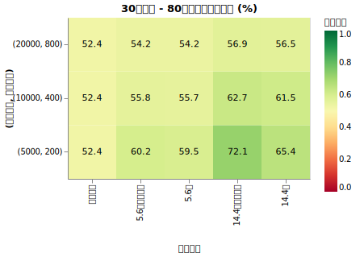
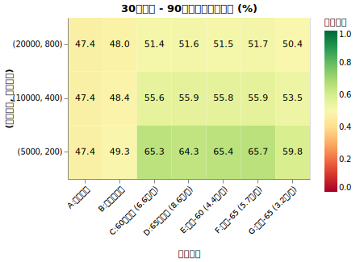
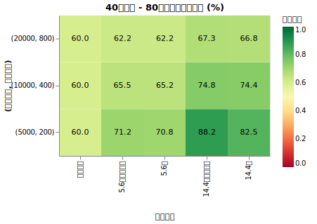
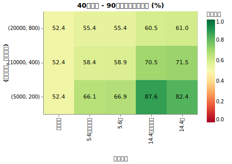
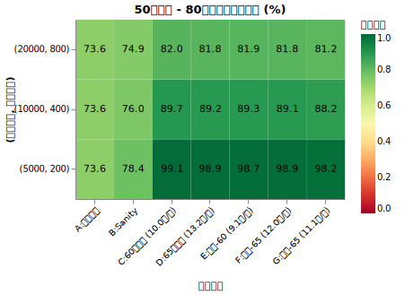
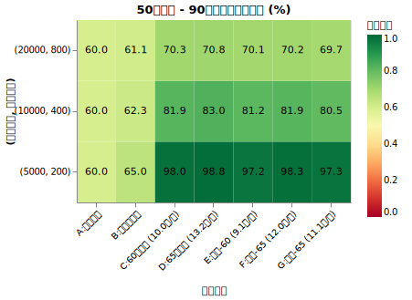
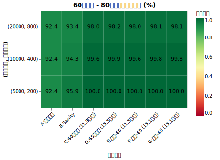
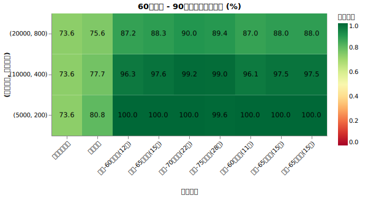

# 年金支払いと受給の効果

<!--
DO NOT DELETE:
python3 src/pension_grid_main.py
python3 src/analyze_pension_grid_main.py
-->

公的年金はリタイア後の貴重な収入源ですが、資産取り崩し戦略において公的年金はどれくらい大事なのでしょうか？

「ほぼ影響ないからシミュレーションでもあまり考えなくて良い」のか「とても影響あるからシミュレーションする時はきちんと考えましょう」なのかどちらなのか、分析しました。

!!! abstract "重要なポイント"
    * **年金の有無は、特に Lean FIRE などのケースで非常に大きな差を生む。** 月数万円の安定した収入があるだけで、長期的な生存確率は 15%〜40% 以上も向上する。高支出の人への影響も無視できない (40代で+5%, 50代で+9%)
    * **資産寿命を延ばす観点では、60歳からの「繰り上げ受給」が有力。** 受給総額の損得よりも、運用初期の資産の減り込みを抑える（収益配列リスクを和らげる）効果が大きいため、早い段階で収入を確保することがプラスに働きやすい。
    * **「現実的なキャッシュフロー」の考慮が大切。** 60歳での保険料支払いの終了や、免除制度の活用など、受け取る金額だけでなく「いつまで払うか」も含めてシミュレーションすると、生存確率に影響が出てくる。

## 年金の仕組みと受給額の目安

年金として受け取れる金額は、主に「加入期間」「現役時代の収入」「働き方」の3要素で決まります。

### 年金額を決める3つの要素

* **加入期間（納付月数）**: 20歳から60歳までの40年間のうち、何ヶ月保険料を納めたか。40年間すべて納めると、満額の老齢基礎年金を受け取れます。
* **現役時代の収入**: 会社員や公務員が加入する厚生年金は、現役時代の給与や賞与の額に応じて受給額が決まります。
* **年金の種類（働き方）**: 日本の年金制度は「2階建て」と呼ばれます。1階部分（国民年金）は全員共通で、2階部分（厚生年金）は会社員・公務員が上乗せで加入します。

### 働き方による受給額の違い（目安）

働き方の区分によって、受け取れる年金額には以下のような差が生じます。

| 働き方の区分 | 加入する年金 | 受給額の決まり方 | 月額の目安（平均） |
| :--- | :--- | :--- | :--- |
| **自営業・フリーランス** | 国民年金のみ | 納付期間のみ | 約5.6万円 |
| **会社員・公務員** | 国民年金 ＋ 厚生年金 | 納付期間 ＋ 現役時の年収 | 約14.4万円 |
| **専業主婦（夫）** | 国民年金のみ | 納付期間のみ | 約5.6万円 |

※月額の目安は、厚生労働省の統計などを基にした平均的な受給額です。会社員（14.4万円）の目安は、40年間勤務し平均年収が約500万円程度であった場合を想定しています。

??? info "受給額の具体的な計算式（シミュレーションで使用）"

    22歳から働き $N$ 歳まで就労（厚生年金加入）しリタイアしたとします。
    年収500万円（平均標準報酬額 約41.6万円）で $N-22$ 年間働いた場合の年金受給額（65歳受給開始・年額）の概算式は以下の通りです。

    **1. 厚生年金額（報酬比例部分）**

    *   計算式： $41.6万円 \times 0.005481 \times (N-22) \times 12 \approx 2.736 \times (N-22)$ 万円

    **2. パターン別：合計受給額（年額）**

    *   **完納（60歳まで納付）**: $81.6万 + 厚生年金額$
    *   **全額免除（リタイア後免除）**: $81.6万 \times \frac{(N-22) \times 12}{480} + 81.6万 \times \frac{(60 - N) \times 12}{480} \times \frac{1}{2} + 厚生年金額$
    *   **未納（リタイア後未納）**: $81.6万 \times \frac{(N-22) \times 12}{480} + 厚生年金額$

    <small>※計算を簡略化するため、一部係数を調整しています。また60歳繰り上げ受給の場合は、上記合計額の76%となります。</small>

### 物価上昇と「マクロ経済スライド」

年金には物価上昇に合わせて増額される仕組みがありますが、物価が上がった分だけそのまま増えるわけではありません。現役世代の減少や平均寿命の延びといった社会情勢に合わせて、年金の伸びを自動的に抑える「マクロ経済スライド」という調整機能が組み込まれています。

* **物価が上がった場合**: 原則として年金額も引き上げられますが、マクロ経済スライドによる調整分が差し引かれます。そのため、実質的な購買力は目減りしていきます。
* **物価が下がった場合**: 年金額も引き下げられます。ただし、前年の支給額を下回らないように調整される「名目下限措置」が適用される場合があります。

### 2024年度の改定例

近年の改定例を見ると、物価の上昇に対して年金の伸びが抑えられている実態がわかります。

| 指標 | 変動率・調整率 |
| :--- | :--- |
| 物価変動率 | +3.2％ |
| 賃金変動率（名目手取り） | +2.1％ |
| マクロ経済スライド（調整） | ▲0.2％ |
| **実際の年金改定率（基礎年金）** | **+1.9％** |

このように、年金はインフレにある程度対応できる設計になっていますが、生活実感としては少しずつ厳しくなる可能性があります。

## 繰り上げ受給の損得

年金の「繰り上げ受給」は、本来65歳から始まる受給を60歳から64歳の好きなタイミングに早める制度です。

### 減額率の仕組み

早く受け取れるメリットがある一方、受給額は一生涯減額されます。

* **減額率**: 受給を早める期間1ヶ月につき、0.4％ずつ減額される。
* **60歳0ヶ月で開始（5年繰り上げ）**: 0.4％ × 60ヶ月 ＝ **24％減**
* **63歳0ヶ月で開始（2年繰り上げ）**: 0.4％ × 24ヶ月 ＝ **9.6％減**

### メリットとデメリット

| | メリット | デメリット（注意点） |
| :--- | :--- | :--- |
| **受給開始を早める** | 早く現金が手に入る。65歳までの生活費や、元気なうちの趣味に使える。 | 一度決まった減額率は一生続く。長生きした場合には、受給総額で損をする可能性がある。 |
| **損益分岐点** | 80歳より前に亡くなる場合は、繰り上げた方が総額が多くなる。 | 81歳以上長生きする場合は、65歳開始の方が総額が多くなる。 |

## 実験：年金を含めた生存確率の検証

年金の有無や納付状況、受給時期が、リタイア後の資産寿命にどのような影響を与えるかを、より現実的な設定でシミュレーションしました。

!!! info "シミュレーションの共通条件"
    * **試行回数**: 5,000回
    * **期間**: 60年間
    * **投資先**: オルカン100%（期待リターン7%、リスク15%、信託報酬 0.05775%）
    * **インフレ率**: [AR(12) 粘着性モデル](cpi.md)（定常平均1.77%）を適用
    * **税率**: 20.315%

    <small>※今までは計算を簡略化するため物価上昇率はAR(12)粘着性モデルとだいたい同じ結果になる +1.77%の上昇率としてきました。今回はマクロ経済スライドもシミュレーションしたかった（物価が下がる可能性のある未来も考慮したい）ので複雑なモデルを使っています。</small>

!!! info "シミュレーションの可変条件"

    * S を初期年間支出として、以下のシナリオを試します。

    | 内容 | 支出(基本) | 保険料(〜60歳) | 受給開始 | 備考 |
    | :--- | :--- | :--- | :--- | :--- |
    | **A:**  年金制度なし | S | 0 | 受給なし | 従来の「年金が存在しない」世界。国民年金保険料を払わないし年金も受け取らない |
    | **B:**  受給しない | S - 21.5 | 21.5万 | 受給なし | 保険料だけ払い、受給しないケース。Aと違い60歳で支出が減る。 |
    | **C:**  納付・60歳 | S - 21.5 | 21.5万 | 60歳 | 60歳まで払い続け、繰り上げ受給。 |
    | **D:**  納付・65歳 | S - 21.5 | 21.5万 | 65歳 | 60歳まで払い続け、65歳から受給。 |
    | **E:**  免除・60歳 | S - 21.5 | 0 | 60歳 | リタイア後は全額免除を申請し、60歳受給。 |
    | **F:**  免除・65歳 | S - 21.5 | 0 | 65歳 | リタイア後は全額免除を申請し、65歳受給。 |
    | **G:**  未納・65歳 | S - 21.5 | 0 | 65歳 | リタイア後は未納(放置)し、65歳受給。 |

    * **初期資産と年間支出(S)**: (5000万円, 200万円), (1億円, 400万円), (2億円, 800万円)。すべて「支出率4%」の設定。
    * **基本生活費の調整**:
        * シナリオA以外では、初期年間支出を **S - 21.5万円** と設定します。
        * これは、国民年金保険料（年約21.5万円）を払っても、トータルの現金支出が S と同等になるように生活レベルを調整していることを意味します。
    * **リタイア開始年齢**: 30歳, 40歳, 50歳, 60歳

??? info "受給額の計算ロジックの詳細（現実的な仮定）"

    * **保険料**:
        * 初年度 21.5万/年。**60歳の誕生日前で支払いが終了**することを再現。
        * 物価(CPI)連動する。
    * **基礎年金（1階部分）**:
        * 満額を年 81.6万円（月6.8万円）として計算。
        * **免除(E/F)**: リタイア後の期間(N~60歳)は受給額が半分（国庫負担分）として加算。
        * **未納(G)**: リタイア後の期間は受給額に一切加算されない。
        * 上記の額は初年度における価値。2057年度まではマクロ経済スライドを適用 (CPIよりも少し下振れる)。終了後はCPIに完全連動。
    * **厚生年金（2階部分）**:
        * 22歳からリタイア(N歳)まで、年収500万円の会社員として働いたと仮定。
        * 年金額(65歳時点) = $2.736 \times (N-22)$ 万円 / 年。
        * 上記の額は初年度における価値。CPIに完全連動すると想定。(マクロ経済スライドは2026年に終了)
    * **繰り上げ調整**:
        * 60歳受給の場合は、厚生・基礎の両方を **76%**（月0.4%減額 × 60ヶ月）に減額。
    * **マクロ経済スライドの計算**:
        1.  基準となるCPIの月次変動率から、スライド調整分（年率0.5%を月次分解したもの）を差し引く。
        2.  調整後の名目受給額が前月の額を下回る場合は、前月の額を維持する（名目下限措置）。
        3.  この計算を毎月行い、受給額を更新する。

??? warning "現実と違う細かいポイント"

    * 初期資産として1億や2億持っている人が500万の収入だったと仮定しています。
    * 年金受給額と国民年金保険料は物価上昇率だけでなく、賃金上昇率にも影響されますが、無視しています。
    * 今回は [ダイナミックリバランス](dynamic_rebalance.md)、[ダイナミックスペンディング](dynamic_spending.md)、[年令による支出調整](retired_spending.md) などは行っていません。

### シミュレーション結果

リタイア開始年齢ごとの生存確率をヒートマップで示します。

*   **横軸（シナリオ）**: 前述の A〜G シナリオ。括弧内は受給開始時の名目年金月額。
*   **縦軸（資産・支出）**: (初期資産, 年間支出) の組み合わせ。
*   **値と色**: 指定したターゲット年齢（80歳または90歳）時点での生存確率(%)。緑に近いほど安全。

#### 30歳リタイア開始

#### 40歳リタイア開始

#### 50歳リタイア開始

#### 60歳リタイア開始

## 考察とポイント

今回の詳細なシミュレーションにより、いくつかの重要な事実が明らかになりました。

### 1. シミュレーションにおける年金のインパクト

まず特筆すべきは、年金が資産寿命に与えるインパクトの大きさです。
特に Lean FIRE（資産や支出が比較的少ないリタイア）を計画している場合、月数万円の安定収入が加わるだけで、50年〜60年といった長期の生存確率は劇的に向上します。

また、今回のシミュレーションで明らかになった重要なポイントとして、**「60歳で保険料の支払いが終わる」ことによるキャッシュフローの改善**があります。
シナリオA（年金なし）とシナリオB（保険料は払うが受給しない）を比較すると、Bの方が生存確率が高くなります。これは60歳以降に保険料負担が消えることで、実質的な生活費が下がるためです。
従来の「年金を無視した4%ルール」などの単純な計算に比べ、現実的なリタイア計画では、この「支払いの終了」と「受給の開始」という2段階のプラス効果を考慮する必要があります。

### 2. 繰り上げ受給(60歳)の有利さ

ほぼすべてのケースで、**65歳受給よりも60歳受給の方が生存確率が高く**なっています。
年金の総受取額で損得を考える「損益分岐点（約81歳）」の議論とは異なり、資産寿命の観点では、**「初期の資産減少をいかに防ぐか」**が成否を分けるため、早期のキャッシュフロー確保が極めて有効に機能します。

### 3. 免除制度の適用による影響

30代・40代といった早期にリタイアし、収入が一定以下となった場合、**「全額免除を受ける(E/F)」方が、無理に保険料を払い続ける(C/D)よりも生存確率にはプラスに働く**という結果が出ました。

*   保険料（年21.5万）を払わないことで、手元の運用資産の取り崩しを抑えられる。
*   若いうちの資産を守ることは、複利効果によって将来的に大きな差を生む。
*   将来の受給額は多少減るものの、90歳生存で見てもその差は限定的であり、運用資産を維持できるメリットが上回る。

ただし、[国民年金保険料の免除制度・納付猶予制度](https://www.nenkin.go.jp/service/kokunen/menjo/20150428.html)には所得要件などの適用条件があります。制度を正しく理解し、自身の状況に合わせて適切に判断することが重要です。

### 4. 年金の安定装置としての役割

マクロ経済スライド（年約0.5%の抑制）により、年金の実質的な価値はCPI（物価上昇）に比べると目減りしていきます。しかし、それを考慮してもなお、年金による「最低限のキャッシュフロー」の確保は強力な安全装置となります。
特に資産が少ないケースほど、年金の有無がリタイア計画の成否を分ける決定的な要因となります。

## まとめ

今回の結果はあくまで「取り崩しシミュレーションで年金を再現させたほうが良いか」がテーマです。

1.  **「支払いの終了」も考慮に入れる**: 60歳で保険料負担が消えることは、シミュレーション上の大きなプラス要因。
2.  **繰り上げ受給する**: 資産寿命の安全マージンを稼ぐなら、早めの受給開始がセオリー。
3.  **制度の正確な把握**: 免除制度などの活用を含め、自身の状況に基づいた現実的なキャッシュフローを想定する。
