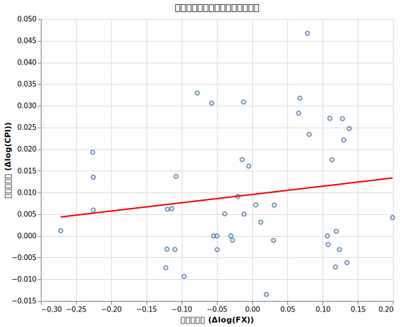
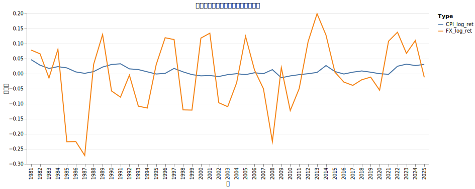

# 購買力平価とインフレの相関

日本の投資家にとって、円安に伴う輸入インフレは実質的な購買力を損なうリスクです。「為替が円安に振れた分、日本の物価が上がることで相殺される」という購買力平価の考え方について、その理論と現実の相関を検証しました。

!!! abstract "重要なポイント"
    * **為替変動とインフレ率の相関は考慮しない。** 過去45年間のデータにおいて、年次ベースの為替変動と日本のインフレ率の間に有意な相関は認められませんでした。シミュレーションでは両者を独立した変数として扱います。

## 購買力平価説（PPP）とは

経済学の教科書では、二国間のインフレ率の差が為替レートによって相殺されるという「購買力平価説（相対的PPP）」が説かれます。

理論上は以下の関係が成立するとされます。

$$ \text{為替レートの変化率} \approx \text{自国のインフレ率} - \text{外国のインフレ率} $$

例えば、日本のインフレ率が0%、米国のインフレ率が5%であれば、ドルが5%安くなる（円高になる）ことで日米の物価バランスが保たれるという理屈です。

### 理論と現実の乖離

この理論は長期（10〜20年単位）では通貨の「実質的な購買力」に収束する力として働きますが、短・中期では以下の要因によって全く機能しないことが多々あります。

1.  **金利差（キャリートレード）**: インフレが高い国は金利を上げるため、通貨安になるどころか、投資資金が流入して通貨高になることがあります（近年の円安ドル高の主因）。
2.  **資本移動の圧倒的規模**: 現代の為替取引の大部分はモノの売り買い（貿易）ではなく、金融資産の移動（投資・投機）です。
3.  **非貿易財**: 家賃やサービスなど、国境を越えて取引されないものは裁定取引が働かず、物価差が為替に反映されにくいです。

| 期間 | 評価 | 理由 |
| :--- | :--- | :--- |
| **短期（日次〜月次）** | ほぼ無関係 | ニュースや投機、需給で動くため。 |
| **中期（1〜5年）** | ほぼ無関係 | 金利差や景気サイクルの影響が強すぎるため。 |
| **長期（10年以上）** | 概ね収束する | 最終的には通貨の購買力に引き寄せられる。 |

## 実績データによる検証

1981年から2025年までの45年間の年次データを使用し、以下の回帰モデルで分析を行いました。

$$ \Delta \log(CPI)_t = a \cdot \Delta \log(FX)_t + b + \epsilon $$

ここで $\Delta \log(CPI)$ は日本の消費者物価指数の対数変化率、$\Delta \log(FX)$ はドル円レートの対数変化率を表します。

## 分析結果

回帰分析の結果、為替変動が日本のインフレ率に与える影響は極めて限定的であることが分かりました。

| 項目 | 分析結果 | 意味 |
| :--- | :--- | :--- |
| **a (傾き)** | 0.0191 | 為替が10%円安になってもインフレ率は約0.19%しか動かない |
| **b (切片)** | 0.0095 | ベースとなる年率インフレ率は約0.95% |
| **決定係数 ($R^2$)** | 0.0240 | インフレ変動のうち為替で説明できるのはわずか2.4% |
| **p値** | 0.3094 | 統計的に有意な相関はない |

為替の影響よりも、インフレ率そのものの特性が強く現れています。

*   **1次自己相関係数**: 0.6754

これはインフレ率に強い「粘着性」があることを示しています。前年のインフレ率が高いと、翌年も高くなりやすいという性質です。

## 結論: シミュレーションへの適用はしない

分析の結果、為替変動と年次のインフレ率の間に直接的な連動性は見られませんでした。このため、本プロジェクトのシミュレーションモデルでは以下の方針を採用します。

1.  **為替とインフレの独立性**: シミュレーション上、為替変動とインフレ率は無相関として扱う。
2.  **自己相関モデルの採用**: インフレ率の生成には自己相関（AR(1)）モデルを用い、「数年間インフレが持続する」といった時間軸の粘着性を再現する。
