<!--
This task file has a special format. Some of the comment parts are the instruction
for AI. The other parts are raw Markdown. The goal is to make a detailed report
for the 4% rule.

During this task, you are supposed to do the following:
- Overwrite uncommented parts of this file directly based on my request
- Write new Python files to do the simulation.

See also core.py, main.py, optimization_main.py for the context.

## Development policy

- 2-space indent
- pytype compatible 
- Use Japanese as code comment
- Make the code gradually
- When I ask something, stop editting the file and always respond to it in a chat
- Write tests
-->

<style>
details {
  margin-bottom: 1em;
  padding-left: 1em;
}
</style>

# 日本語版 4% ルール

<!--
TODO: ここに素敵な導入を入れるが、それは後で考える。
-->

## シミュレーションについて

<!--
TODO: ここに今回行うシミュレーションの設定について説明するが、それは後で考える。

月ごとのシミュレーションをしていることを明言。
-->

## ボラティリティの影響を知ろう

シンプルなライフプランのシミュレーションでありがちなのが、運用資産の運用利回り（リターン）のみを考慮するシミュレーションです。

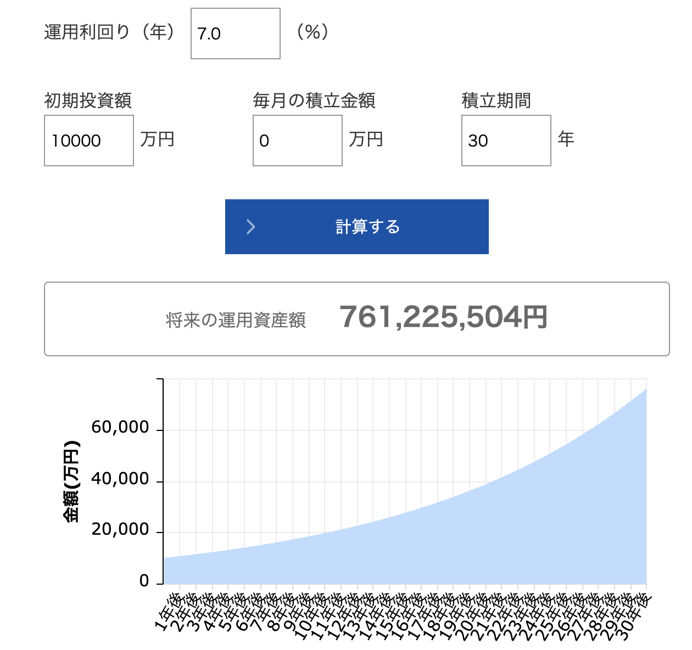<br>
[参考: 資産運用かんたんシミュレーション | アセットマネジメントOne](https://www.am-one.co.jp/shisankeisei/simulation.html)

上には1億円を7%固定運用した場合のグラフが表示されています。このように定率で伸びる資産が存在すれば上のグラフのように指数関数的に増えるわけですが、オルカンなど株系の資産はこのような値動きをすることはありません。

そもそも投資の世界における「リスク」や「ボラティリティ」という言葉は、日常的な「危険」という意味ではなく、「価格の振れ幅（変動の激しさ）」のことを指します。大きく値上がりする可能性もあれば、大きく値下がりする可能性もある、そのブレの大きさが「ボラティリティ」です。このドキュメントでは混同をなるべく避けるためリスクではなくボラティリティという言葉を使います。

でも世の中のライフプランのシミュレーションに、このボラティリティを考えないツールは非常に多いので、注意が必要です。

ボラティリティを考えないことがどれくらいまずいか、シミュレーションで調べてみました。

<!--
TODO: 7%,15% の場合の 50個のシミュレーションのグラフを描画。x-axis は年。y-axis は資産。
-->

例えばオルカンを初年度に1億円購入したとして50年運用したとします。仮に年リターンを7%, 年ボラティリティが0%, 11%, 13%, 15%, 17% と変えた時の資産価値は以下のようになります。

<!--
```
python volatility_main.py.
```

fills in the following placeholder and updates imgs/volatility_result.svg.
-->

<!--<volatility_main.py>-->

|              |   下位1% (だいぶ運が悪い) |   下位10% (運が悪い) |   下位25% (やや不運) |   中央値 (普通) |   上位25% (やや幸運) |   上位10% (運が良い) |
|:-------------|-----------------:|---------------:|---------------:|-----------:|---------------:|---------------:|
| オルカン, ボラ=0%  |           33.1億円 |         33.1億円 |         33.1億円 |     33.1億円 |         33.1億円 |         33.1億円 |
| オルカン, ボラ=11% |            4.0億円 |          9.0億円 |         14.8億円 |     24.4億円 |         40.1億円 |         62.3億円 |
| オルカン, ボラ=13% |            2.6億円 |          6.6億円 |         12.0億円 |     21.6億円 |         38.9億円 |         65.5億円 |
| オルカン, ボラ=15% |            1.6億円 |          4.8億円 |          9.5億円 |     18.8億円 |         37.0億円 |         67.5億円 |
| オルカン, ボラ=17% |            1.0億円 |          3.4億円 |          7.4億円 |     16.0億円 |         34.5億円 |         68.1億円 |

<!--</volatility_main.py>-->

ボラティリティがない場合は、50年で必ず資産が33.1倍になっていますね。しかし、ボラティリティが上がれば上がるほど、以下の傾向が見えてくるでしょう。
* 上位10%の良い運の場合、資産は33.1倍よりも(かなり)大きくなる
* 平凡な50%程度の運の持ち主の場合 (中央値)、資産は33.1倍よりも少なくなる
* 下位25%や10%の悪い運の場合、資産は33.1倍よりもかなり少なくなる

下のグラフは上の表で表示されていない数字も表示させたものです。横軸はあなたの運の良さ(パーセンタイル)。縦軸は最終資産額(対数スケール)です。

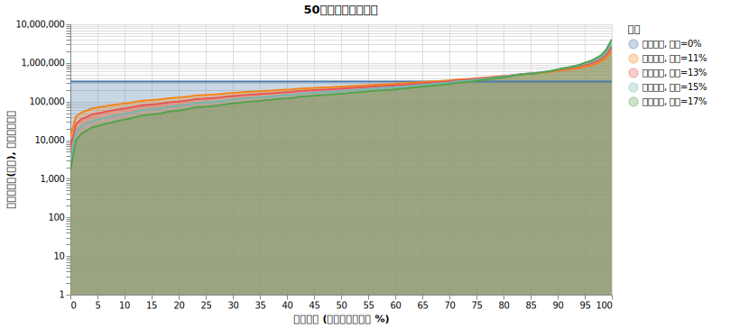<br>

上のグラフの青い横線はボラティリティがない場合です。他の場合の線とだいたい `70%` の場所で交わっていますね。つまり、高いボラティリティの商品を長期で掴んだ場合、ボラティリティがゼロの商品と比べてあなたが勝てる見込みは 30%くらいということです。逆の言い方をすればボラティリティを考慮しないシミュレーションをして「50年後に 33.1 倍になる！」と信じた場合、資産が本当に33.1倍以上になる確率は 30% しかありません。その30%の当たりを引いた時、高いボラティリティは強い資産ブーストになりますが、70%の大概の場合、高いボラティリティほどあなたの資産を抑え込みます。

<details>
<summary>数学的な話</summary>

資産の価格変動が対数正規分布に従うと仮定すると、算術平均リターン $\mu$ とボラティリティ $\sigma$ に対して、長期的な中央値の成長率（幾何平均リターン）はおおよそ $\mu - \frac{\sigma^2}{2}$ となります。

例えば、算術平均リターンが 7% ($\mu = 0.07$) であっても、ボラティリティが 17% ($\sigma = 0.17$) ある場合、長期的な成長率の中央値は $0.07 - \frac{0.17^2}{2} = 0.05555$ (約 5.56%) まで低下します。

ちなみにこの数値を使って50年後の資産を計算すると、初期資産1億円 $\times \exp(0.05555 \times 50) \approx 16.1$ 億円となり、上の表にあるシミュレーション結果の「16.0億円」とほぼ一致することがわかります。

これが、ボラティリティが高くなるほど「普通」の運の持ち主が得られる最終資産額（中央値）が下がってしまう数学的な理由です。

</details>

## `収入 > 支出` であり、運用にお金をどんどん回せる場合

さて、資産運用には2つのパターンがあります。
1. `収入 > 支出` であり、運用にお金をどんどん回せる
2. `収入 < 支出` であり、資産を取り崩さなければならない

`収入 > 支出` の場合の戦略は割と簡単で、**なるべくリターンが大きく、ボラティリティが低い商品を購入し、長期保有する**ことが重要となります。
S&P500 やオルカンが人気なのはリターンが大きく、分散投資の結果ボラティリティが低いためです。

「どちらがいいか」という話は、どちらを選んでもだいたい正解というのが答えです。オルカンの方がS&P500よりも僅かにリターンが低く、ボラティリティも低い程度であり、そんなことを気にするよりも
* 長期保有することと
* 入金力を上げること
* 暴落が来ても気にしないメンタルを作ること

の方が大事です。これに関しては

[普通の人が資産運用で99点をとる方法とその考え方](https://hayatoito.github.io/2020/investing/)

が大変詳しいので、ぜひ一読してみてください。

## `収入 < 支出` であり、資産を切り崩す場合

このドキュメントでは、主に取り崩し戦略、いわゆる **4%ルール**についてシミュレーション結果を元に深堀りします。

4%ルール（4パーセントルール）とは、リタイア後の資産運用において **「資産の4%ずつを切り崩して生活すれば、30年以上経過しても資産が底をつく確率は極めて低い」** という経験則のことです。

アメリカのトリニティ大学の研究者たちが提唱したため、「トリニティ・スタディ」とも呼ばれます。

この経験則には実は色々な前提がありますが、ここではそれには触れずに、まずはとても簡単な設定で4%ルールを見ていきましょう。

以下の4つのシナリオを比べます。

1. 「オルカン100% / 取り崩しなし」
   * 初年度に1億円をオルカン (リターン7%, ボラティリティ15%) に投資して、全く取り崩しせずに50年放置運用
1. 「現金100% / 400万円取り崩し」
   * 1億円の現金を全く運用せずに毎年400万円のペースで取り崩した場合です。当たり前ですが、25年後に破産します。
1. 「定率7%商品100% / 400万円取り崩し」
   * 初年度に1億円を奇跡の商品 (リターン7%, ボラティリティが**ゼロ!**)に投資して、毎年400万円のペースで現金化して取り崩した場合です。
1. 「オルカン100% / 400万円取り崩し」
   * オルカンを1億円(リターン7%, ボラティリティが**15%**)運用しながら、毎年400万円のペースで現金化して取り崩した場合です。

これらのシミュレーションの結果は以下のようになります。

<!--<simple_4p_main.py>-->

|                           |   下位1% (だいぶ運が悪い) |   下位10% (運が悪い) |   下位25% (やや不運) |   中央値 (普通) |   上位25% (やや幸運) |   上位10% (運が良い) |   10年破産確率 (%) |   20年破産確率 (%) |   30年破産確率 (%) |   40年破産確率 (%) |   50年破産確率 (%) |
|:--------------------------|-----------------:|---------------:|---------------:|-----------:|---------------:|---------------:|--------------:|--------------:|--------------:|--------------:|--------------:|
| 1. オルカン100% / 取り崩しなし      |            1.6億円 |          4.8億円 |          9.5億円 |     18.8億円 |         37.0億円 |         67.5億円 |          0.0% |          0.0% |          0.0% |          0.0% |          0.0% |
| 2. 現金100% / 400万円取り崩し     |            0.0億円 |          0.0億円 |          0.0億円 |      0.0億円 |          0.0億円 |          0.0億円 |          0.0% |          0.0% |        100.0% |        100.0% |        100.0% |
| 3. 定率7%商品100% / 400万円取り崩し |           14.8億円 |         14.8億円 |         14.8億円 |     14.8億円 |         14.8億円 |         14.8億円 |          0.0% |          0.0% |          0.0% |          0.0% |          0.0% |
| 4. オルカン100% / 400万円取り崩し   |            0.0億円 |          0.0億円 |          0.8億円 |      5.6億円 |         15.6億円 |         36.2億円 |          0.0% |          2.6% |          9.3% |         15.9% |         18.6% |

<!--</simple_4p_main.py>-->

下位1%, 10%, などの値は50年後の総資産です。「0.0億円」と書いてあるのは資金がシミュレーションの途中で枯渇して破産している場合です。「〜年破産確率」というのは、1000回のシミュレーション中、例えば20年や30年経った時点ですでに破産している確率です。

「定率7%商品」という奇跡の商品に投資している場合、投資の伸びが出費より常に大きいので、資産は指数関数的に上昇します。よくあるシンプルなシミュレーションでボラティリティを考慮していないと、「7%の伸びの商品を買っておけば4%の出費は余裕」という気持ちになりますよね。

しかし、実際にはボラティリティがあるので、結果は全く違います。「4. オルカン100% / 400万円取り崩し」を見ると、**4%ルールを信じて4%ずつ切り崩していっても、30年後に破産している確率は9.3%, 50年後に破産している確率は18.6%です。**

この破産確率のみをグラフにしたのが以下のグラフです。グラフでは「生存確率」= (100% - 破産確率) を表示しています。

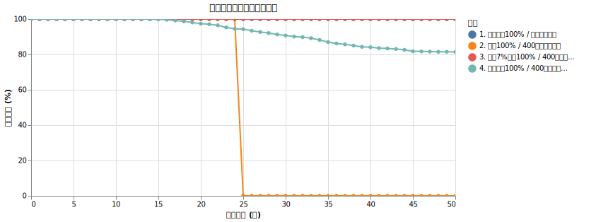

切り崩しをしていなかったら、下位25%の運の良さでも1億円が9.5億円になっていました。50年間400万円を出費するというのは合計2億円の出費で、9.5億よりはだいぶ低いはずです。それなのに、同じ額の切り崩しをした場合、下位25%の運の良さで50年後の資産が0.8億しかありません。なぜこんなに低いのでしょうか。

これは多くの場合、シミュレーションの初期に暴落が起きている場合です。

<!--
TODO: 破産が起きる時のシミュレーション番号を50個取り、オルカンの値動きを表すグラフを simple_4p_main.py に付け加える。
-->

初期に暴落が起きると、資産が目減りした上に、そこから400万円切り崩すことになります。長期投資は複利の効果で指数関数的な伸びを示すとされていますが、指数関数の伸びの爆発は資産が伸びた後半に強く反映されます。一度資産が減ってしまうとそこから回復するのには時間がかかります。時間がかかっている間の400万円の切り崩しが、さらに回復のスピードを遅くする、という流れが起きています。

IMPORTANT: 切り崩し生活で一番怖いのは、切り崩し生活を始めてすぐの暴落

さて「S&P500 やオルカンに投資していたら4%ルールで生きていける」というのは違う、ということが見えてきましたが、実際はもっと過酷です。今シミュレーションした状況は色々なものを単純化しています。色々あるなかで、まずは考慮しないとまずそうな項目がこちらです。

* 物価上昇率
* 譲渡所得税
* 投資信託等の手数料
* 為替リスク

これらの影響はどれくらいか、順々に見ていこうと思います。4%という数字を変えてみる話はその後で出てきます。

### 物価上昇率の影響は凄まじい

まずは物価上昇率です。物価上昇率（インフレ率）とは、ある期間において物価がどれくらい上がったかを示す割合のことです。厳密には、インフレ（インフレーション）は物価が継続的に上昇し、相対的に貨幣価値が下落する現象全体を指しますが、一般的には両者はほぼ同じ意味で使われます。

シミュレーションにおいて将来の物価上昇率を予測する際、一般的には **消費者物価指数(CPI)** を用いて近似することが妥当とされています。消費者物価指数とは、家計が購入する商品やサービスの価格変動を測定する重要な経済指標です。総務省統計局が毎月公表し、約700品目について基準年（現在は2020年）を100として指数化しています。私たちが日常生活で購入するモノやサービスの価格を幅広くカバーしているため、生活費の変動を測る上で最も適した指標と言えます。

ただし、CPIと実際の個人の体感物価には乖離があることには注意が必要です。例えば、医療費や介護費などはCPI全体の伸び率よりも高く上昇する傾向にあります。そのため、高齢になるにつれてこれらの支出割合が増える場合、個人の生活費はCPI以上に上昇していると感じる可能性があります。また、CPIは平均的な家計を想定しているため、個人のライフスタイルによっても影響の受け方は異なります。

こうした前提を踏まえた上で、標準的な生活費の変動をモデル化するため、今回のシミュレーションではCPIの変動率を用いて物価上昇率を計算します。

今回のシミュレーションでは、1970年から2025年までのCPIの実際のデータ（[政府統計の総合窓口 e-Stat](https://dashboard.e-stat.go.jp/timeSeriesResult?indicatorCode=0703010501010090000)）を使用し、過去の物価変動の歴史を反映させます。

ちなみに直近の動きを見ると、基準年である2020年を100とした場合、2025年には「112.0」まで上昇しています。つまり、たった5年間で私たちが普段買っているものの価格が平均して12%も上がったということであり、物価上昇が机上の空論ではなく現実の脅威であることがよくわかります。

<!--
Run `python analyze_cpi_main.py` to make this SVG file.
-->


この55年分のデータを使用すると

* 平均年次リターン: 2.4439%
* 年次リターンの標本標準偏差: 4.1382%

となります。それでは以下のケースをシミュレーションしてみましょう。全て「オルカン (リスク/リターン=7%/15%) に100%投資, 400万円取り崩し」を基本としていて、物価上昇率のみを変化させています。

1. 物価上昇なし
1. インフレ1%
1. インフレ1.5%
1. インフレ2%
1. インフレ2.44%
1. インフレ2.44% (標準偏差 4.13%)

これにより、毎年の出費のみが変わっています。

結果はこうなりました。

<!--<cpi_comp_main.py>-->

|                           |   下位1% (だいぶ運が悪い) |   下位10% (運が悪い) |   下位25% (やや不運) |   中央値 (普通) |   上位25% (やや幸運) |   上位10% (運が良い) |   10年破産確率 (%) |   20年破産確率 (%) |   30年破産確率 (%) |   40年破産確率 (%) |   50年破産確率 (%) |
|:--------------------------|-----------------:|---------------:|---------------:|-----------:|---------------:|---------------:|--------------:|--------------:|--------------:|--------------:|--------------:|
| 1. 物価上昇なし                 |            0.0億円 |          0.0億円 |          0.8億円 |      5.6億円 |         15.6億円 |         36.2億円 |          0.0% |          2.6% |          9.3% |         15.9% |         18.6% |
| 2. インフレ1%                 |            0.0億円 |          0.0億円 |          0.0億円 |      3.6億円 |         12.8億円 |         32.9億円 |          0.0% |          4.1% |         15.5% |         24.6% |         29.6% |
| 3. インフレ1.5%               |            0.0億円 |          0.0億円 |          0.0億円 |      2.4億円 |         11.1億円 |         30.3億円 |          0.0% |          5.1% |         19.1% |         29.6% |         37.5% |
| 4. インフレ2%                 |            0.0億円 |          0.0億円 |          0.0億円 |      1.1億円 |          9.3億円 |         27.6億円 |          0.0% |          6.5% |         23.1% |         36.8% |         44.1% |
| 5. インフレ2.44%              |            0.0億円 |          0.0億円 |          0.0億円 |      0.0億円 |          7.7億円 |         25.3億円 |          0.0% |          8.9% |         27.5% |         41.9% |         50.9% |
| 6. インフレ2.44% (標準偏差 4.13%) |            0.0億円 |          0.0億円 |          0.0億円 |      0.0億円 |          7.9億円 |         25.8億円 |          0.0% |          7.8% |         27.8% |         41.8% |         50.2% |

<!--</cpi_comp_main.py>-->

だいぶ恐ろしい数字が並んでいるのが見えますでしょうか？

インフレ率2%の場合、50年後に中央値がすでに破産しています。30年後の時点でも 23.1%のケースで破産しています。

ちなみに 2%のインフレ率の場合、400万円の出費は50年後には 1076万円 (x2.69倍) になっています。このため、早めに資産が増えていかないと厳しくなっていくという流れです。

詳しい生存確率は以下のようになっています。

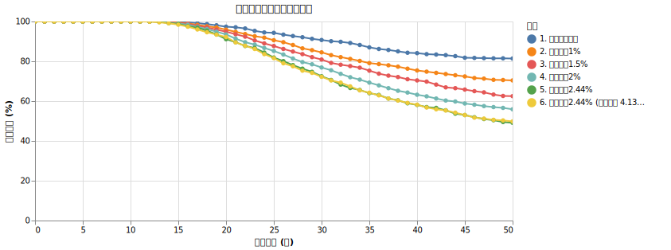

ちなみにインフレ率の標準偏差に関してですが、標準偏差が増えることはインフレ率自体が若干減ることと同じ作用があることが見受けられます。
実際、「インフレ2.44% (標準偏差 4.13%)」の状況は「インフレ2.44%」よりもマイルドですね。

<details>
<summary>数学的な話</summary>

これも先ほどの資産の成長と同じく、$\mu - \frac{\sigma^2}{2}$（ボラティリティ・ドラッグ）の数学的性質によるものです。

インフレ率に変動（標準偏差 $\sigma$）がある場合、長期間経過後の物価水準の中央値は、算術平均のインフレ率 $\mu$ ではなく、それより少し低い幾何平均 $\mu - \frac{\sigma^2}{2}$ に収束していきます。

つまり、インフレ率のブレが大きければ大きいほど、将来の物価水準の中央値は「下押し」されます。物価が（中央値としては）そこまで上がらないため、毎年の取り崩し額（生活費）の増加ペースも抑えられ、結果として資産の枯渇が少しだけ遅くなる、という現象が起きています。

</details>

**シミュレーションにおいて、物価上昇率を何％にするかは、生存確率に多大な影響があります。** 短期的な物価予想のニュースはありますが、長期的に見て物価がどうなるかはだれにもわかりません。とりあえず今後のシミュレーションでは 2% として固定にしておきます。

現段階で「オルカンを4%取り崩し、2%物価上昇率」の場合、破産確率は30年で23.1%, 50年で44.1% となりました。

### 譲渡所得税の影響も凄まじい

さて、投資で利益が出た場合、その利益に対して約20%（正確には20.315%）の税金（譲渡所得税）がかかります。この税金が4%ルールにどれほど重くのしかかるのか見ていきましょう。

投資信託などを取り崩す（売却する）際、売却した金額すべてに税金がかかるわけではありません。「買ったときの値段（取得費）」を差し引いた「利益（譲渡所得）」に対してのみ税金がかかります。

例えば、1億円で買った投資信託が値上がりして2億円になったとします。このとき、資産全体のうち「元本部分」が半分、「利益部分」が半分という状態になります。ここから生活費として400万円分を売却した場合、売却した400万円のうち半分（200万円）が元本部分、もう半分（200万円）が利益部分とみなされます。そして、この利益部分の200万円に対してのみ約20%の税金（約40万円）がかかります。

つまり、資産が大きく成長している時ほど、売却金額に対する利益の割合が高くなり、結果として納めるべき税金も高くなるという仕組みです。

本シミュレーションのでは、この税金計算を以下のようにモデル化しています。
* 売却時に「平均取得単価」と「売却口数」から譲渡所得（利益）を正確に計算する。
* 1年間（1月〜12月）の譲渡所得を合算し、利益が出ていればその約20%を税金として計算する。
* 計算された税金は、**翌年の1月に現金から支払われる**ものとする（つまりちょっとレアな「源泉徴収なし」という扱いです）。
* ※ 今回はシンプルさを優先し、譲渡損失の繰越控除（損した分を翌年以降の利益と相殺する仕組み）はシミュレーションに含めていません。また、シミュレーション最終年（50年後）に含み益があっても、それをすべて売却したと仮定した税金精算は行っていません。

なお、新NISA制度を活用すれば、一定の枠組みの中でこの譲渡所得税を非課税にすることができます。しかしここでは、「NISAを使った場合」を直接シミュレーションするのではなく、「譲渡所得税の有無が生存確率にどれほどの影響を与えるか」という点に絞って見ていきます。税金の重みを知ることで、NISAがいかに強力な制度であるかが逆に見えてくるはずです。

今回は「オルカン (リスク/リターン=7%/15%) に100%投資, 400万円取り崩し, 物価上昇率2%固定」を基準として

1. 譲渡所得税が 0%の場合 (NISA口座に相当)
1. 譲渡所得税が 20.315% の場合 (特別口座に相当)
1. 比較: 譲渡所得税を考慮しないが出費を20.315%に増やす
1. 比較: 譲渡所得税を考慮しないが出費を11.5%に増やす (理由は後述)

を比べてみましょう。結果は以下のようになります。

<!--<tax_comp_main.py>-->

|                           |   下位1% (だいぶ運が悪い) |   下位10% (運が悪い) |   下位25% (やや不運) |   中央値 (普通) |   上位25% (やや幸運) |   上位10% (運が良い) |   10年破産確率 (%) |   20年破産確率 (%) |   30年破産確率 (%) |   40年破産確率 (%) |   50年破産確率 (%) |
|:--------------------------|-----------------:|---------------:|---------------:|-----------:|---------------:|---------------:|--------------:|--------------:|--------------:|--------------:|--------------:|
| 1. 譲渡所得税を考慮しない            |            0.0億円 |          0.0億円 |          0.0億円 |      1.1億円 |          9.3億円 |         27.6億円 |          0.0% |          6.5% |         23.1% |         36.8% |         44.1% |
| 2. 譲渡所得税が 20.315%         |            0.0億円 |          0.0億円 |          0.0億円 |      0.0億円 |          6.7億円 |         23.1億円 |          0.0% |          7.1% |         28.6% |         44.0% |         53.5% |
| 3. 譲渡所得税は0%、出費を20.315%増やす |            0.0億円 |          0.0億円 |          0.0億円 |      0.0億円 |          4.9億円 |         20.8億円 |          0.0% |         14.7% |         37.5% |         52.9% |         60.4% |
| 4. 譲渡所得税は0%、出費を11.5%増やす   |            0.0億円 |          0.0億円 |          0.0億円 |      0.0億円 |          6.9億円 |         23.6億円 |          0.0% |         11.6% |         31.9% |         45.2% |         53.5% |

<!--</tax_comp_main.py>-->

まず結論を書きましょう。

* **譲渡所得の税を考慮しないシミュレーションは危険** (1. と 2. の比較)
* **譲渡所得の税を詳しく計算できない場合は出費を11.5%増やすのが近似** (2., 3., 4. の比較)

では詳しく見ていきます。

#### 譲渡所得の税を考慮しないシミュレーションは大変危険

まず 1. と 2. を比べると**30年後の破産確率は23.1%→28.6%, 50年後の破産確率は44.1%→53.5%** と、だいぶ増えます。

50年後の資産の分布は以下のようになります。

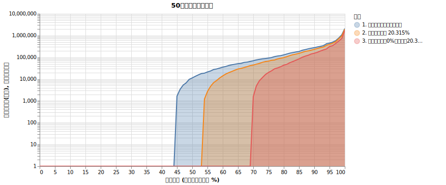

生存確率の詳細グラフは以下の通り。

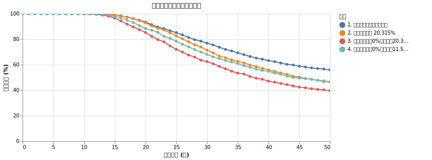

紺色のラインからオレンジのラインへと資産が下がっているのがわかりますね。

#### 譲渡所得の税を詳しく計算できない場合は出費を11.5%増やすのが近似

「2. 譲渡所得税が 20.315%」の代わりとして、「3. 譲渡所得税は0%、出費を20.315%増やす」場合をシミュレーションしてみると、後者のほうがはるかに破産確率が高く、過酷な結果になっていることがわかります。

これはなぜでしょうか？「利益に約20%の税金がかかるなら、最初から生活費が20%増えるのと同じくらいのダメージでは？」と直感的には思えるかもしれません。しかし、実際の譲渡所得税の仕組みには、資産の目減りを防ぐ**「自動的なブレーキ」**が備わっています。

その理由は以下の通りです。

1. **税金は「利益」に対してのみかかる**
   出費を単純に20.315%増やした場合、毎年必ず481万円強（400万円 × 1.20315）を取り崩すことになります。しかし実際の譲渡所得税は、売却した金額全体ではなく、そのうちの**利益部分（元本を上回って増えた分）**にしかかかりません。運用初期などで利益が少ないうちは、売却額に対する利益の割合が小さいため、支払う税金もごくわずかになります。
2. **暴落時（元本割れ時）には税金がゼロになる**
   これが最も重要なポイントです。切り崩し生活で一番怖い「運用初期の暴落」が起きた場合、保有資産は元本割れ（含み損）の状態になります。この状態で資産を売却しても利益は出ていないため、**譲渡所得税は一切かかりません。** つまり、資産が減って苦しい時には税金の負担が自動的にゼロになり、傷口が広がるのを防いでくれるのです。

一方、出費を固定で20%増やしてしまうと、暴落時にも容赦無く多額の資産を取り崩すことになり、回復不可能なほどのダメージ（Sequence of Return Risk）を受けてしまいます。

この結果から、「運用が順調で利益が出ている時にだけ税金を払う」という制度は、一見すると大きなコストに見えても、生活費が底上げされるケースに比べればはるかにマシ（生存確率を大きく下げない）であることがわかります。

「4. 譲渡所得税を考慮しないが出費を11.5%に増やす」のケースは50年後の破産確率が「2. 譲渡所得税が 20.315%」と同じになるように探した設定です。

上の破産確率グラフを見ると 2. と 4. で少し乖離しているのが見えますが、それはやはり譲渡所得税の影響はシミュレーションの前半では影響が薄いためです。ただ、譲渡所得をきちんとシミュレーションするツールは少ないので、近似したいのであれば「年出費を 11.5% 増やす」というのが一つの策かと思います。

### 信託報酬

さて、今までのシミュレーションは「オルカンのような何かリスク・リターン=(7%,15%)に従う金融商品」を扱っていましたが、現実的には投資信託には信託報酬がかかります。

信託報酬とは、投資信託を管理・運用してもらうための経費として、投資家が保有期間中に支払い続ける手数料のことです。私たちが毎日目にする投資信託の基準価額は、すでにこの信託報酬が日割りで差し引かれた後の金額になっています。

目標とするインデックス（たとえば全世界株式の指数など）自体には、このような運用コストは存在しません。そのため、どんなに優秀な運用会社がインデックスにピッタリ連動するように運用を行っても、信託報酬（およびその他の隠れコスト）の分だけ、実際の投資信託のリターンは目標インデックスから必ずマイナス方向へ乖離していくことになります。つまり、信託報酬は「確実に発生するマイナスのリターン」と言い換えることができます。

このわずかな手数料の差が、長期投資では複利の効果によって大きな差となって現れます。具体的な数字で乖離の大きさを確認してみましょう。

たとえば信託報酬が年率0.1%の投資信託があったとします。これが複利で引かれ続けると、目標インデックスに対して30年後には約3.0%（$1 - (1 - 0.001)^{30}$）、50年後には約4.9%（$1 - (1 - 0.001)^{50}$）の乖離が生まれます。これだけでも無視できない金額ですが、もし信託報酬が年率1.0%の商品を選んでしまった場合、30年後には約26.0%、50年後にはなんと約39.5%と、本来得られるはずだった資産の4割近くを手数料として失うことになります。長期投資において信託報酬の低さが極めて重要であると言われるのはこのためです。

それでは以下のケースをシミュレーションしてみましょう。全て
* 初年度にオルカン (リスク/リターン=7%/15%) に1億円一括投資
* 400万円取り崩し
* 物価上昇率2%
* 譲渡所得税を計算

を基本としていて、信託報酬のみを以下の値に変化させています。

1. 0%
1. 0.05775% (2026年3月時のeMAXIS Slim 全世界株式（オール・カントリー）)
1. 0.0.1133%　(2023年時のeMAXIS Slim 全世界株式（オール・カントリー）)
1. 1%
1. 2%

結果は以下のようになりました。

<!--<trust_fee_comp_main.py>-->

|                  |   下位1% (だいぶ運が悪い) |   下位10% (運が悪い) |   下位25% (やや不運) |   中央値 (普通) |   上位25% (やや幸運) |   上位10% (運が良い) |   10年破産確率 (%) |   20年破産確率 (%) |   30年破産確率 (%) |   40年破産確率 (%) |   50年破産確率 (%) |
|:-----------------|-----------------:|---------------:|---------------:|-----------:|---------------:|---------------:|--------------:|--------------:|--------------:|--------------:|--------------:|
| 1. 信託報酬=0%       |            0.0億円 |          0.0億円 |          0.0億円 |      0.0億円 |          6.7億円 |         23.1億円 |          0.0% |          7.1% |         28.6% |         44.0% |         53.5% |
| 2. 信託報酬=0.05775% |            0.0億円 |          0.0億円 |          0.0億円 |      0.0億円 |          6.3億円 |         22.2億円 |          0.0% |          7.5% |         29.4% |         44.5% |         54.4% |
| 3. 信託報酬=0.1133%  |            0.0億円 |          0.0億円 |          0.0億円 |      0.0億円 |          6.0億円 |         21.4億円 |          0.0% |          7.6% |         29.7% |         46.0% |         55.4% |
| 4. 信託報酬=1%       |            0.0億円 |          0.0億円 |          0.0億円 |      0.0億円 |          1.7億円 |         10.8億円 |          0.0% |         11.6% |         39.2% |         59.0% |         68.2% |
| 5. 信託報酬=2%       |            0.0億円 |          0.0億円 |          0.0億円 |      0.0億円 |          0.0億円 |          3.6億円 |          0.0% |         16.8% |         52.8% |         71.8% |         80.5% |

<!--</trust_fee_comp_main.py>-->

50年後の資産の分布は以下のようになります。

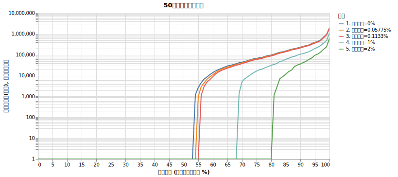

生存確率の詳細グラフは以下の通り。

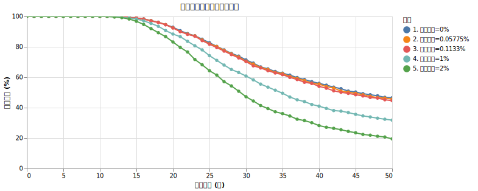

グラフで見ると、信託報酬0%（青線）と現在のオルカン水準の0.05775%（オレンジ線）は重なるようにピッタリと寄り添っており、30年後や50年後の破産確率への影響は数パーセント以内にとどまっていることが分かります。非常に良心的なコストであり、生存確率を大きく損なうことはありません。

しかし、信託報酬が「1%」や「2%」に上がるとどうなるでしょうか。
信託報酬が1%の場合、30年破産確率は0%の時の28.6%から39.2%へと急激に悪化します。50年破産確率に至っては68.2%と、およそ7割の確率で資金が底を突く結果となっています。さらに「2%」のぼったくり商品をつかんでしまった場合は、生存確率のグラフが滝のように落ち込み、30年で半数以上（52.8%）が破産し、50年後にはなんと80.5%が破産します。「たかが1%、2%の手数料」と軽く考えてはいけません。

上位25%の幸運なケース（資産が大きく増えるパターン）で見ても、信託報酬0%なら50年後に6.7億円残るはずの資産が、信託報酬1%では1.7億円にまで激減し、信託報酬2%ではゼロ（破産）になっています。手数料という名の「確実なマイナスリターン」は、複利の力で資産の寿命を容赦なく削り取っていくのです。

これが、4%ルールのような取り崩し戦略において、**徹底的に信託報酬の低いインデックスファンドを選ぶべき最大の理由**です。高いリターンを求めて手数料の高いアクティブファンドを選ぶことは、長期的には自分の首を絞めるリスクが高すぎるということが、このシミュレーションからハッキリとわかります。

### 為替リスク

<!--
TODO: この章のどこかにオルカンと為替は相関がないと仮定している話を入れる
-->

今までのシミュレーションは為替リスクを考慮に入れていませんでした。

為替リスクとは、S&P500や全世界株式（オルカン）など、外貨建ての資産に投資する際に生じる、通貨間の交換レート（為替レート）の変動による不確実性のことです。海外の資産を購入する際は「円」を「ドル」などの外貨に交換し、売却する際は再び「円」に戻すことになります。そのため、現地の株価そのものが値上がりしていても、その間に「円高・外貨安」が進んでいれば、円換算したときの資産価値は目減りしてしまいます。逆に「円安・外貨高」が進めば、資産価値が上乗せされることになります。

そもそも為替レートは何によって決まるのでしょうか。主に以下のような要因が複雑に絡み合って決定されます。

1. **金利差**: 資金はより高い利回りを求めて移動する性質があります。たとえばアメリカの金利が高く、日本の金利が低ければ、ドルで運用した方が有利になるため、円が売られてドルが買われやすくなり（円安・ドル高要因）ます。
2. **国の信用力（ファンダメンタルズ）**: その国の経済成長率、物価上昇率、財政状態などが通貨の信頼性に直結します。経済が強くインフレがコントロールされている国の通貨は、中長期的に買われやすくなります。
3. **実需（貿易や投資の決済）**: 企業が輸出入を行う際や、投資家が海外資産を売買する際に発生する、実体経済を伴う為替の需要です。日本の貿易赤字が拡大すれば、海外への支払いのために円を売って外貨を買う動きが強まり、円安要因となります。

為替の歴史を振り返ると、いくつかの重要な転換点が存在します。最も有名なのが1985年の**プラザ合意**です。当時、行き過ぎたドル高を是正するために先進5カ国（G5）が協調介入に合意し、これを機に急激な円高ドル安が進行しました。また、1999年のゼロ金利政策導入以降は、低金利の円を借りて高金利通貨で運用する「円キャリートレード」が定着しました。さらに直近では、2013年以降のアベノミクス（異次元金融緩和）を契機とした強い円安トレンドが発生するなど、金融政策の転換によって為替の構造は大きく変化してきました。

では、実際にこれらの期間で為替（ドル円）のデータがどのように推移してきたのか、過去の月次データから年率換算したリターン（mu）とボラティリティ（sigma）を計算してみた結果が以下になります。

| 期間 | データポイント数 | 年率換算リターン (mu) | 年率換算リスク (sigma) |
| :--- | :--- | :--- | :--- |
| 1986年以降（プラザ合意定着後） | 482ヶ月分 (40.2年) | 0.03% | 10.53% |
| 2000年以降（ゼロ金利・キャリートレード） | 314ヶ月分 (26.2年) | 1.90% | 9.46% |
| 2013年以降（アベノミクス異次元緩和） | 158ヶ月分 (13.2年) | 4.55% | 9.18% |

ボラティリティに関しては、どの期間をとってもおよそ9%〜10.5%程度と比較的安定していることがわかります。一方で、平均リターンは期間の取り方によって大きく異なります。

以下のグラフは、これらの計算結果をもとに、それぞれの期間の開始年を起点とし、計算された平均リターン(mu)に基づいて将来を予測した理論値（フィッティングライン）を描画したものです。


グラフの通り、2000年以降や2013年以降の平均リターン（年率1.90%や4.55%）を前提とすると、将来のドル円レートがフィッティングラインのように青天井で登っていく結果になってしまいます。為替相場において、一方的な金利差やトレンドが永遠に続くという仮定を置き、ドル円が数百円、数千円になると考えるのは非現実的です。

為替リスクを組み込むにあたり以下の1986年以降の設定を使用します。

* **年率換算リターン: 0.03%**
* **年率換算リスク: 10.53%**

この仮定を置くことで、為替によるリターンの押し上げ（右肩上がりのトレンド）という楽観的な期待を排除しつつ、年率約10.5%という為替特有の価格変動リスク（ボラティリティ）のみを適切にシミュレーションへ反映させることができます。

それでは以下のケースをシミュレーションしてみましょう。全て

* 初年度にオルカン (リスク/リターン=7%/15%) に1億円一括投資
* 400万円取り崩し
* 物価上昇率2%
* 譲渡所得税を計算
* 信託報酬は0.05775%

を基準としたうえで、以下を比較します。

1. 為替リスクなし (= ドル円固定)
1. ドル円のリスク・リターン=0%, 10.53%
1. 比較: ドル円のリスク・リターン=0.03%, 10.53%
1. 比較: ドル円のリスク・リターン=0%, 9.18%
1. 比較: 為替リスクなし, オルカンのリスクを15%→18.3%に変更

このシミュレーションではドル円のみ変えていて、1000パターンのオルカンの時系列データは変えていません。

<!--<fx_comp_main.py>-->

|                          |   下位1% (だいぶ運が悪い) |   下位10% (運が悪い) |   下位25% (やや不運) |   中央値 (普通) |   上位25% (やや幸運) |   上位10% (運が良い) |   10年破産確率 (%) |   20年破産確率 (%) |   30年破産確率 (%) |   40年破産確率 (%) |   50年破産確率 (%) |
|:-------------------------|-----------------:|---------------:|---------------:|-----------:|---------------:|---------------:|--------------:|--------------:|--------------:|--------------:|--------------:|
| 1. 為替リスクなし (= ドル円固定)     |            0.0億円 |          0.0億円 |          0.0億円 |      0.0億円 |          6.3億円 |         22.2億円 |          0.0% |          7.5% |         29.4% |         44.5% |         54.4% |
| 2. ドル円 0%, 10.53%        |            0.0億円 |          0.0億円 |          0.0億円 |      0.0億円 |          4.1億円 |         19.1億円 |          0.2% |         13.2% |         38.6% |         54.4% |         62.0% |
| 3. ドル円 0.03%, 10.53%     |            0.0億円 |          0.0億円 |          0.0億円 |      0.0億円 |          4.7億円 |         23.1億円 |          0.1% |         16.3% |         39.9% |         54.3% |         61.7% |
| 4. ドル円 0%, 9.18%         |            0.0億円 |          0.0億円 |          0.0億円 |      0.0億円 |          5.5億円 |         21.3億円 |          0.0% |         13.6% |         36.5% |         50.7% |         58.7% |
| 5. 為替リスクなし, オルカンリスク18.3% |            0.0億円 |          0.0億円 |          0.0億円 |      0.0億円 |          4.4億円 |         21.9億円 |          0.0% |         14.3% |         38.1% |         54.3% |         63.0% |

<!--</fx_comp_main.py>-->

50年後の資産の分布は以下のようになります。

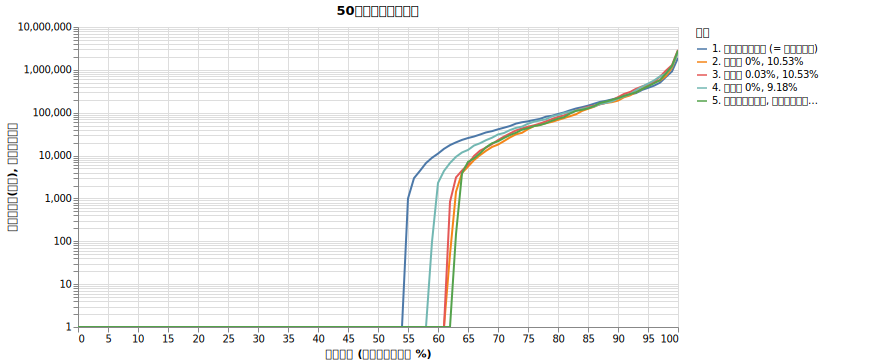

生存確率の詳細グラフは以下の通り。

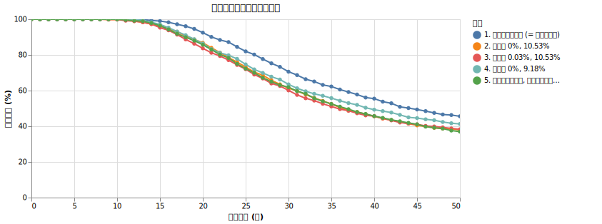

### 為替リスクは「ボラティリティの加算」として効いてくる

シミュレーションの結果を見ると、為替リスク（ボラティリティ）を考慮することで、生存確率が明確に低下していることがわかります。

1. **為替リスクなし (1.)** と **ドル円のリスク 10.53% (2.)** を比較すると、30年破産確率は 29.4% から 38.6% へ、50年破産確率にいたっては 54.4% から 62.0% へと悪化しています。
2. 平均リターンをわずかに上乗せした **3.** でも結果はほとんど変わりません。また、為替のボラティリティを 9.18% に下げた **4.** では破産確率がわずかに改善しています。
3. **為替リスクなし, オルカンリスク18.3% (5.)** は、合成リスク（18.3%, 後述）を直接シミュレーションしたものです。2. とほぼ同じ結果になっており、為替リスクが「ボラティリティの加算」として作用していることが裏付けられました。

つまり、為替による「リターンの押し上げ」を期待するよりも、為替がもたらす「ボラティリティの増加」のデメリットの方が支配的です。

この結果は、以下の数学的な背景と一致しています。

<details>
<summary>数学的な話：リスクの合成</summary>

株価の変動と為替の変動に相関がないと仮定すると、合成されたトータルリスク $\sigma_{total}$ は、それぞれの分散（標準偏差の2乗）の和の平方根で表されます。

$$\sigma_{total} = \sqrt{\sigma_{stock}^2 + \sigma_{fx}^2}$$

今回の設定（株 15%, 為替 10.53%）を当てはめると：
$$\sigma_{total} = \sqrt{0.15^2 + 0.1053^2} \approx \sqrt{0.0225 + 0.0111} \approx 0.183$$
(約 18.3%)

つまり、為替リスクが 10.53% 加わることで、全体のボラティリティは 15% から約 18.3% へと上昇します。ボラティリティが上がれば、それだけ「ボラティリティ・ドラッグ」によって長期的な中央値の成長率（幾何平均リターン）が押し下げられます。

* 為替なし：$0.07 - \frac{0.15^2}{2} = 0.05875$ (5.875%)
* 為替あり：$0.07 - \frac{0.183^2}{2} \approx 0.0533$ (約 5.33%)

この年率約 0.5% の成長率の低下が、30年、50年という長期の取り崩しにおいて、破産確率を 10% 近く押し上げる要因となっています。

</details>

為替リスクは、株価の暴落と同じく「いつ起きるか」が読めないリスクです。しかし、このシミュレーションからわかるように、為替のボラティリティを考慮に入れないシミュレーションは、将来の生存確率を楽観的に見積もりすぎてしまう危険性があることを示唆しています。

<!--
現金比率、無リスク資産の活用、老後の出費が減ること、年金、selling priority, リバランスなどは別項目で扱います。

ここまでで扱っていない話は
* 非連続な大型支出
* 社会保険料への影響
   * 特定口座（源泉徴収あり）で完結せず、利益を確定申告した場合や、資産運用を「所得」としてカウントする制度設計（国民健康保険料など）になっている場合、利益額に応じて保険料が跳ね上がります。
* 株価の「平均回帰性」の有無
   * もし平均回帰性が存在するならば、30〜50年という長期のスパンでは、ランダムウォークを仮定したシミュレーションよりも極端な失敗（破産）の確率が低くなる可能性があります。これは逆に生存確率を数%改善させる方向に働く「ポジティブな盲点」です。
-->

### ここまでのまとめ

取り崩しのシミュレーションをする時に、考慮するべきことはたくさんあります。そしてそれを真面目に計算すればするほど 4%の切り崩しでやっていける生存確率は下がっていきます。

今までの結果を一つにまとめてみましょう。以下の設定を比較していきます。

1. 1億を7%固定で伸びる商品に投資して毎年400万ずつ切り崩す
1. さらにボラティリティ(=15%)を設定する
1. さらに物価上昇率(=2%)を設定する
1. さらに譲渡所得税(=20.315%)を設定する
1. さらに信託報酬(=0.05775%)を設定する
1. さらに為替リスク(=10.5%)を設定する

結果は以下のようになります。

<!--<steps_comp_main.py>-->

|                      |   下位1% (だいぶ運が悪い) |   下位10% (運が悪い) |   下位25% (やや不運) |   中央値 (普通) |   上位25% (やや幸運) |   上位10% (運が良い) |   10年破産確率 (%) |   20年破産確率 (%) |   30年破産確率 (%) |   40年破産確率 (%) |   50年破産確率 (%) |
|:---------------------|-----------------:|---------------:|---------------:|-----------:|---------------:|---------------:|--------------:|--------------:|--------------:|--------------:|--------------:|
| 1. 7%固定運用 (リスク0)     |           14.8億円 |         14.8億円 |         14.8億円 |     14.8億円 |         14.8億円 |         14.8億円 |          0.0% |          0.0% |          0.0% |          0.0% |          0.0% |
| 2. ボラティリティ 15% を設定   |            0.0億円 |          0.0億円 |          0.8億円 |      5.6億円 |         15.6億円 |         36.2億円 |          0.0% |          2.6% |          9.3% |         15.9% |         18.6% |
| 3. 物価上昇率 2% を設定      |            0.0億円 |          0.0億円 |          0.0億円 |      1.1億円 |          9.3億円 |         27.6億円 |          0.0% |          6.5% |         23.1% |         36.8% |         44.1% |
| 4. 譲渡所得税 20.315% を設定 |            0.0億円 |          0.0億円 |          0.0億円 |      0.0億円 |          6.7億円 |         23.1億円 |          0.0% |          7.1% |         28.6% |         44.0% |         53.5% |
| 5. 信託報酬 0.05775% を設定 |            0.0億円 |          0.0億円 |          0.0億円 |      0.0億円 |          6.3億円 |         22.2億円 |          0.0% |          7.5% |         29.4% |         44.5% |         54.4% |
| 6. 為替リスク 10.5% を設定   |            0.0億円 |          0.0億円 |          0.0億円 |      0.0億円 |          3.9億円 |         22.5億円 |          0.3% |         14.3% |         40.0% |         54.0% |         62.5% |

<!--</steps_comp_main.py>-->

50年後の資産の分布は以下のようになります。

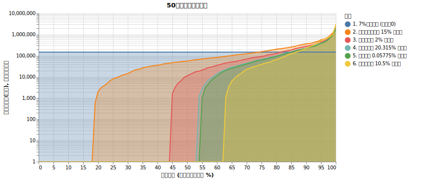

生存確率の詳細グラフは以下の通り。

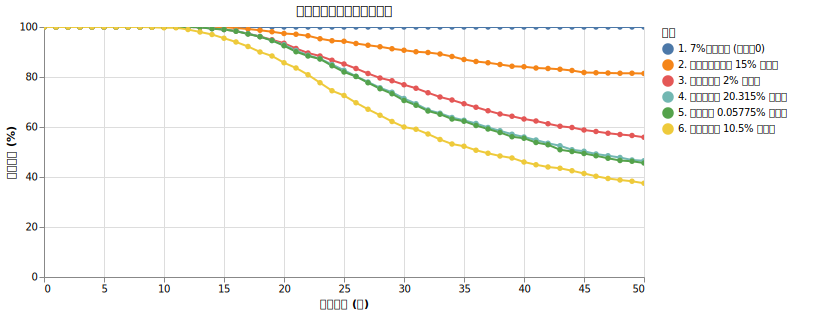

これを見ると「4%の出費で生きていける」という自信は消えていきそうです。

これ以降はこの低い生存確率を回復させるアイデアとその効果を検証していきます。

アメリカで考案されている元々の「4%ルールの設定」は実は上記の設定とは違います。

* S&P500と債権をある配分で持つ
* 対数正規分布で株価を生成するのではなく、過去の基準額の時系列に対して戦略を再現して生存確率を計算する
* 30年間の生存確率を気にする
* 支出を何％にするか色々試す

これで得られた結果が **「S&P500と債権を75%:25%に持って支出を4%にする」** というルールだったのです。

私たちも債権を組み入れましょう！と言いたいところですが、債権は利子の変化・基準額が株と逆相関・為替リスク、などの要素を確実にシミュレーションするのが難しいです。そこでまずは現金を持つ率を変えてみましょう。

### 現金を持つ

以前も述べたように、生存確率に大きく影響するのが、シミュレーションの前半で起きる暴落です。
それを避けるには現金の比率を上げるのが有効です。もちろんリターンは減りますが、大勝ちする必要はありません。

1億円の何%をオルカンにつぎ込むかで 100% ~ 50% まで変化させて比較していきます。物価上昇率、譲渡所得税、信託報酬、為替リスクは考慮します。

<!--<cash_ratio_comp_main.py>-->

|                   |   下位1% (だいぶ運が悪い) |   下位10% (運が悪い) |   下位25% (やや不運) |   中央値 (普通) |   上位25% (やや幸運) |   上位10% (運が良い) |   10年破産確率 (%) |   20年破産確率 (%) |   30年破産確率 (%) |   40年破産確率 (%) |   50年破産確率 (%) |
|:------------------|-----------------:|---------------:|---------------:|-----------:|---------------:|---------------:|--------------:|--------------:|--------------:|--------------:|--------------:|
| オルカン 100% / 現金 0% |            0.0億円 |          0.0億円 |          0.0億円 |      0.0億円 |          3.9億円 |         22.5億円 |          0.3% |         14.3% |         40.0% |         54.0% |         62.5% |
| オルカン 90% / 現金 10% |            0.0億円 |          0.0億円 |          0.0億円 |      0.0億円 |          3.6億円 |         21.6億円 |          0.2% |         13.9% |         40.2% |         54.4% |         62.9% |
| オルカン 80% / 現金 20% |            0.0億円 |          0.0億円 |          0.0億円 |      0.0億円 |          3.2億円 |         20.0億円 |          0.2% |         13.4% |         40.5% |         54.8% |         64.2% |
| オルカン 70% / 現金 30% |            0.0億円 |          0.0億円 |          0.0億円 |      0.0億円 |          2.6億円 |         17.7億円 |          0.0% |         13.0% |         41.6% |         57.3% |         65.8% |
| オルカン 60% / 現金 40% |            0.0億円 |          0.0億円 |          0.0億円 |      0.0億円 |          1.7億円 |         15.0億円 |          0.0% |         12.7% |         43.3% |         59.6% |         68.0% |
| オルカン 50% / 現金 50% |            0.0億円 |          0.0億円 |          0.0億円 |      0.0億円 |          0.8億円 |         11.4億円 |          0.0% |         12.3% |         46.2% |         64.4% |         72.0% |

<!--</cash_ratio_comp_main.py>-->

50年後の資産の分布は以下のようになります。

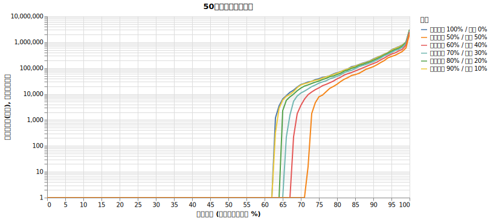

生存確率の詳細グラフは以下の通り。

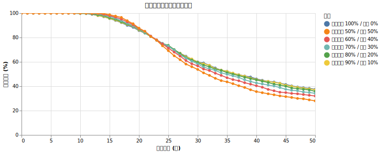

ちょっとわかりにくいかも知れませんが、生存確率のグラフは面白い結果を出しています。

* 22年目の破産確率はどのやりかたでもだいたい80%
* 現金をたくさん持つと22年目以前の破産確率を減らせる。ただし22年目以降の破産確率は増える

現金を持つことは、運用初期の暴落から身を守る『保険』として機能しますが、その保険料は『複利成長の放棄』と『インフレによる目減り』という形で支払われます。22年目付近で生存確率が逆転するのは、成長の遅れによる資産枯渇のリスクが、ボラティリティによる一時的な下落リスクを上回ってしまうためです。長期（30〜50年）の取り崩しにおいては、適度なリスクを取って資産を成長させ続けることが、安全策となります。

さて、

### リバランスの功罪

先ほどの結果は「一度決めた比率で、あとは成り行き（リバランスなし）」という設定でした。
しかし、一般的に資産運用では「定率リバランス（常に 80:20 の比率を保つように売買する）」が推奨されます。

このリバランスが、0%金利の現金と組み合わせた時にどう機能するかをシミュレーションしてみましょう。
基準として「オルカン 100%」も並べています。

<!--<cash_ratio_rebalance_comp_main.py>-->

|                     |   下位1% (だいぶ運が悪い) |   下位10% (運が悪い) |   下位25% (やや不運) |   中央値 (普通) |   上位25% (やや幸運) |   上位10% (運が良い) |   10年破産確率 (%) |   20年破産確率 (%) |   30年破産確率 (%) |   40年破産確率 (%) |   50年破産確率 (%) |
|:--------------------|-----------------:|---------------:|---------------:|-----------:|---------------:|---------------:|--------------:|--------------:|--------------:|--------------:|--------------:|
| オルカン 100% (リバランスなし) |            0.0億円 |          0.0億円 |          0.0億円 |      0.0億円 |          3.9億円 |         22.5億円 |          0.3% |         14.3% |         40.0% |         54.0% |         62.5% |
| オルカン 80% (リバランスなし)  |            0.0億円 |          0.0億円 |          0.0億円 |      0.0億円 |          3.2億円 |         20.0億円 |          0.2% |         13.4% |         40.5% |         54.8% |         64.2% |
| オルカン 80% (毎年リバランス)  |            0.0億円 |          0.0億円 |          0.0億円 |      0.0億円 |          0.4億円 |          7.0億円 |          0.0% |         12.1% |         43.0% |         62.8% |         73.0% |
| オルカン 70% (リバランスなし)  |            0.0億円 |          0.0億円 |          0.0億円 |      0.0億円 |          2.6億円 |         17.7億円 |          0.0% |         13.0% |         41.6% |         57.3% |         65.8% |
| オルカン 70% (毎年リバランス)  |            0.0億円 |          0.0億円 |          0.0億円 |      0.0億円 |          0.0億円 |          2.9億円 |          0.0% |         11.2% |         48.1% |         70.8% |         80.5% |
| オルカン 50% (リバランスなし)  |            0.0億円 |          0.0億円 |          0.0億円 |      0.0億円 |          0.8億円 |         11.4億円 |          0.0% |         12.3% |         46.2% |         64.4% |         72.0% |
| オルカン 50% (毎年リバランス)  |            0.0億円 |          0.0億円 |          0.0億円 |      0.0億円 |          0.0億円 |          0.0億円 |          0.0% |          9.4% |         65.9% |         88.0% |         95.5% |

<!--</cash_ratio_rebalance_comp_main.py>-->

衝撃的な結果が出ました。**0%金利の現金と組み合わせる場合、リバランスをすればするほど、長期の生存確率は大幅に低下します。**

例えば「オルカン 80%」の場合、リバランスをしない時の 50年破産確率は 64.2% ですが、毎年リバランスをすると 73.0% まで悪化します。
「オルカン 50%」に至っては、リバランスなしなら 72.0% ですが、リバランスをすると 95.5% と、ほぼ確実に破産します。

理由は明確です。
1. **成長の芽を摘んでいる**: 株が上がった時にリバランスで売却し、成長しない「現金」に移してしまうため、ポートフォリオ全体の成長力が削がれます。
2. **インフレ負けの固定化**: インフレ率 2% の世界で 0% の現金を一定比率持ち続けることは、確実に目減りする資産を常に補充し続けることを意味します。
3. **「成り行き」は自然なグライドパスになる**: リバランスをしない場合、株が成長すれば自然と「株比率」が高まっていきます。これが結果的に、長期で必要なリターンを確保するための「攻めの姿勢」へと自動的にシフトさせていたのです。

この結果から、4%ルールのような長期の取り崩しにおいて、**「リターンを生まない資産（現金）」との定率リバランスは、むしろ生存確率を下げるリスクがある**ことがわかります。

### 無リスク資産を持つ

さて、今まで「現金」と呼んでいたものは、金利が0%でインフレに負け続ける資産でした。しかし、現実の世界には「無リスク資産」と呼ばれる、価格変動が極めて小さく、かつ一定の利回りを得られる資産が存在します。

例えば、米国の短期国債（T-Bill）はその代表例です。ETFでは **BIL** (SPDR Bloomberg 1-3 Month T-Bill ETF) などが有名で、これらは米国の政策金利に連動した利回り（最近では 4〜5% 程度）を得ることができます。

現代ポートフォリオ理論では、リスク資産（株など）と無リスク資産（国債など）を組み合わせることで、期待リターンを維持しつつポートフォリオ全体のボラティリティを下げることができるとされています。

先ほどの「現金（金利0%）」を「無リスク資産（金利 4%）」に置き換えた場合、生存確率がどう変化するかを見てみましょう。インフレ率 2% に対して、利回り 4% ということは、実質リターンがプラスになる資産を持つということです。

シミュレーションの条件：
* インフレ率 2%
* 無リスク資産利回り：4%
* リバランスなし
* 無リスク資産による配当には譲渡所得税の源泉徴収がある (20.315%)。つまり実際の利回りは3.18%
* **現金化する順番はオルカンを優先し、無リスク資産は後で売る** (後述)

結果は以下の通りです。

<!--<zero_risk_comp_main.py>-->

|                |   下位1% (だいぶ運が悪い) |   下位10% (運が悪い) |   下位25% (やや不運) |   中央値 (普通) |   上位25% (やや幸運) |   上位10% (運が良い) |   10年破産確率 (%) |   20年破産確率 (%) |   30年破産確率 (%) |   40年破産確率 (%) |   50年破産確率 (%) |
|:---------------|-----------------:|---------------:|---------------:|-----------:|---------------:|---------------:|--------------:|--------------:|--------------:|--------------:|--------------:|
| オルカン 100% (基準) |            0.0億円 |          0.0億円 |          0.0億円 |      0.0億円 |          3.9億円 |         22.5億円 |          0.3% |         14.3% |         40.0% |         54.0% |         62.5% |
| オルカン 90%       |            0.0億円 |          0.0億円 |          0.0億円 |      0.0億円 |          2.9億円 |         19.4億円 |          0.0% |         11.6% |         40.2% |         56.4% |         64.9% |
| オルカン 80%       |            0.0億円 |          0.0億円 |          0.0億円 |      0.0億円 |          1.8億円 |         14.8億円 |          0.0% |          8.6% |         40.7% |         58.3% |         68.3% |
| オルカン 70%       |            0.0億円 |          0.0億円 |          0.0億円 |      0.0億円 |          0.7億円 |         11.4億円 |          0.0% |          5.6% |         40.7% |         61.3% |         71.0% |
| オルカン 60%       |            0.0億円 |          0.0億円 |          0.0億円 |      0.0億円 |          0.0億円 |          8.4億円 |          0.0% |          2.4% |         41.4% |         65.6% |         75.8% |
| オルカン 50%       |            0.0億円 |          0.0億円 |          0.0億円 |      0.0億円 |          0.0億円 |          5.0億円 |          0.0% |          0.2% |         42.1% |         70.9% |         80.7% |
| オルカン 40%       |            0.0億円 |          0.0億円 |          0.0億円 |      0.0億円 |          0.0億円 |          2.0億円 |          0.0% |          0.0% |         42.6% |         77.0% |         85.0% |
| オルカン 30%       |            0.0億円 |          0.0億円 |          0.0億円 |      0.0億円 |          0.0億円 |          0.0億円 |          0.0% |          0.0% |         44.8% |         84.1% |         90.9% |

<!--</zero_risk_comp_main.py>-->

50年後の資産の分布は以下のようになります。

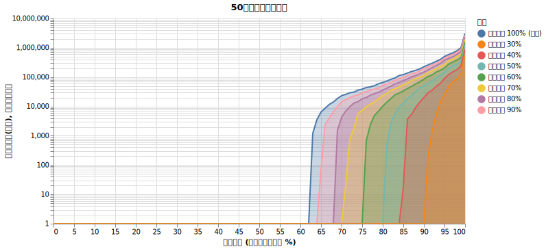

残念ながら無リスク資産を持っていても50年後の生存確率は減っていますね。

しかし生存確率の詳細グラフは面白い結果を出しています。

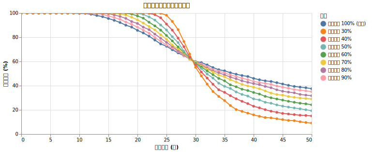

* 29年目の破産確率はどのやりかたでもだいたい63%
* 無リスク資産を持てば持つほど29年目以前の破産確率を減らせる。ただし29年目以降の破産確率は増える
* 20年目の生存確率はかなり増える

生存確率の推移を見ると、29年目付近に明確な「逆転」があることがわかります。

1. **30年までの生存（収益配列のリスクへの耐性）**:
   30年という期間では、最大の脅威は「運用初期の暴落」です。無リスク資産（実質利回り 約3.18%）を持つことで、暴落時に株を安値で売らずに済む「バッファ」が生まれます。トリニティ・スタディが30年を基準としていたため、債券を混ぜる有効性が強調されたのはこのためです。実際、30年破産確率は「オルカン 50%」の方が 100%株よりも低くなっています。

2. **50年までの生存（成長不足のリスク）**:
   しかし、50年という超長期では「複利成長の差」がすべてを支配します。
   * **維持に必要なリターン**: インフレ率 2% で 4% を取り崩すには、名目で約 6% 程度の利回りが必要です。
   * **期待リターンの差**: オルカン 100% なら 7% ですが、50/50 分散だとポートフォリオ全体の期待リターンは 5.1% 程度（0.5 * 7% + 0.5 * 3.18%）まで下がります。
   
   つまり、50/50 のポートフォリオは「短中期は安定しているが、長期的にはリターン不足で確実に枯渇する」という性質を持っています。30年なら安定性のメリットが成長不足のデメリットを上回りますが、50年というスパンでは成長不足が致命傷となるのです。

### 売る資産の順番を変えてみる

これまでのシミュレーションでは、生活費が必要になった際、「1. オルカンを売る」「2. それでも足りなければ無リスク資産を売る」という順番（株優先）で現金化していました。

これを逆にして、「1. 無リスク資産をまず売る」「2. 無リスク資産が底をついたらオルカンを売る」という順番（無リスク資産優先）に変えるとどうなるでしょうか。

シミュレーションの条件：
* インフレ率 2%
* 無リスク資産利回り：4%
* リバランスなし
* 無リスク資産による配当には譲渡所得税の源泉徴収がある (20.315%)。つまり実際の利回りは3.18%
* オルカンの割合を 100%, 80%, 70%, 50%
* 売る順番を2通り試す

<!--<zero_risk_priority_comp_main.py>-->

|                             |   下位1% (だいぶ運が悪い) |   下位10% (運が悪い) |   下位25% (やや不運) |   中央値 (普通) |   上位25% (やや幸運) |   上位10% (運が良い) |   10年破産確率 (%) |   20年破産確率 (%) |   30年破産確率 (%) |   40年破産確率 (%) |   50年破産確率 (%) |
|:----------------------------|-----------------:|---------------:|---------------:|-----------:|---------------:|---------------:|--------------:|--------------:|--------------:|--------------:|--------------:|
| オルカン 100% (基準)              |            0.0億円 |          0.0億円 |          0.0億円 |      0.0億円 |          3.9億円 |         22.5億円 |          0.3% |         14.3% |         40.0% |         54.0% |         62.5% |
| オルカン 80% (売却順: 1.株, 2.無リスク) |            0.0億円 |          0.0億円 |          0.0億円 |      0.0億円 |          1.8億円 |         14.8億円 |          0.0% |          8.6% |         40.7% |         58.3% |         68.3% |
| オルカン 80% (売却順: 1.無リスク, 2.株) |            0.0億円 |          0.0億円 |          0.0億円 |      0.0億円 |          3.4億円 |         20.6億円 |          0.1% |         12.3% |         39.6% |         53.8% |         62.8% |
| オルカン 70% (売却順: 1.株, 2.無リスク) |            0.0億円 |          0.0億円 |          0.0億円 |      0.0億円 |          0.7億円 |         11.4億円 |          0.0% |          5.6% |         40.7% |         61.3% |         71.0% |
| オルカン 70% (売却順: 1.無リスク, 2.株) |            0.0億円 |          0.0億円 |          0.0億円 |      0.0億円 |          3.2億円 |         19.4億円 |          0.0% |         11.1% |         38.8% |         54.4% |         63.6% |
| オルカン 50% (売却順: 1.株, 2.無リスク) |            0.0億円 |          0.0億円 |          0.0億円 |      0.0億円 |          0.0億円 |          5.0億円 |          0.0% |          0.2% |         42.1% |         70.9% |         80.7% |
| オルカン 50% (売却順: 1.無リスク, 2.株) |            0.0億円 |          0.0億円 |          0.0億円 |      0.0億円 |          2.0億円 |         14.1億円 |          0.0% |          5.5% |         37.7% |         56.5% |         65.8% |

<!--</zero_risk_priority_comp_main.py>-->

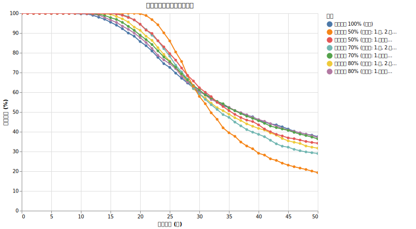

このシミュレーション結果から、以下の結論が導き出せます。

1. **無リスク資産を先に売るのが絶対に良い**:
   全ての資産配分において、無リスク資産を優先的に売却して生活費に充てるほうが、生存確率が高くなります。リターンの低い資産から順に消費し、高リターンが期待できる株をできるだけ長く運用し続けることが重要です。これは「矛（株）」を温存し、「盾（無リスク資産）」から先に使う戦略の有効性を証明しています。
2. **80%:20% は 50年生存に影響せず、20〜30年生存率を上げる**:
   「オルカン 80% / 無リスク資産 20%」の配分（無リスク資産から売却）は、50年後の生存確率を 100%株とほぼ同等（約63%）に保ったまま、20〜30年といった期間の生存確率を大幅に改善させます。
   * **20年破産確率**: 14.3% (100%株) → 12.3% (80/20)
   * **30年破産確率**: 40.0% (100%株) → 39.6% (80/20)
   （※10年破産確率で見ると 0.3% → 0.1% とさらに顕著な差が出ています）

つまり、**「少量の無リスク資産を持ち、それを優先的に取り崩す」**ことが、長期的な成長性を維持しつつリタイア初期の破綻リスク（収益配列のリスク）を回避するための、極めて合理的かつ有効な戦術となります。

### 無リスク資産のリバランスを考える

次に、現金の場合はうまくいかなかったリバランスを試してみましょう。

シミュレーションの条件：
* インフレ率 2%
* 無リスク資産利回り：4%
* オルカンの売却にも無リスク資産による配当にも譲渡所得税がかかる
* 売る優先度は無リスク資産
* オルカンの割合を 100%, 80%, 70%
* リバランスを1年ごとにする場合としない場合をためす

<!--<zero_risk_rebalance_comp_main.py>-->

|                    |   下位1% (だいぶ運が悪い) |   下位10% (運が悪い) |   下位25% (やや不運) |   中央値 (普通) |   上位25% (やや幸運) |   上位10% (運が良い) |   10年破産確率 (%) |   20年破産確率 (%) |   30年破産確率 (%) |   40年破産確率 (%) |   50年破産確率 (%) |
|:-------------------|-----------------:|---------------:|---------------:|-----------:|---------------:|---------------:|--------------:|--------------:|--------------:|--------------:|--------------:|
| オルカン 100% (基準)     |            0.0億円 |          0.0億円 |          0.0億円 |      0.0億円 |          3.9億円 |         22.5億円 |          0.3% |         14.3% |         40.0% |         54.0% |         62.5% |
| オルカン 80% (リバランスなし) |            0.0億円 |          0.0億円 |          0.0億円 |      0.0億円 |          3.4億円 |         20.6億円 |          0.1% |         12.3% |         39.6% |         53.8% |         62.8% |
| オルカン 80% (毎年リバランス) |            0.0億円 |          0.0億円 |          0.0億円 |      0.0億円 |          2.4億円 |         12.0億円 |          0.0% |          9.3% |         36.6% |         53.4% |         63.8% |
| オルカン 70% (リバランスなし) |            0.0億円 |          0.0億円 |          0.0億円 |      0.0億円 |          3.2億円 |         19.4億円 |          0.0% |         11.1% |         38.8% |         54.4% |         63.6% |
| オルカン 70% (毎年リバランス) |            0.0億円 |          0.0億円 |          0.0億円 |      0.0億円 |          1.4億円 |          8.1億円 |          0.0% |          7.6% |         33.9% |         54.2% |         66.4% |

<!--</zero_risk_rebalance_comp_main.py>-->

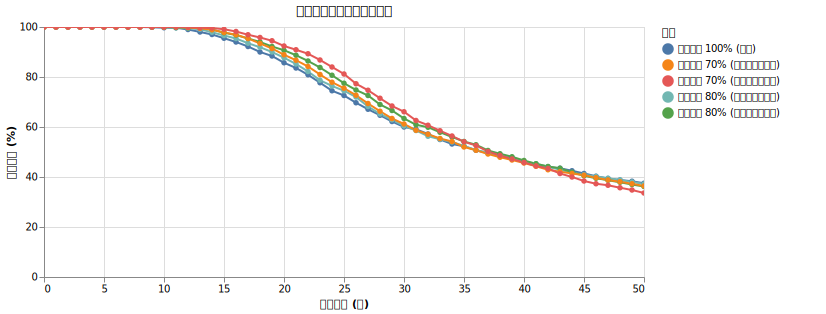

結果を見ると、**無リスク資産に十分な利回り（インフレ率を超える利回り）がある場合、リバランスは生存確率を助ける有効な手段になり得る**ことがわかります。

特に30年生存確率に注目すると：
* オルカン 80%：39.6% (リバランスなし) → 36.6% (毎年リバランス)
* オルカン 70%：38.8% (リバランスなし) → 33.9% (毎年リバランス)

と、明確な改善が見られます。

0%金利の現金ではリバランスが生存確率を大幅に下げていましたが、4%の無リスク資産（実質リターンがプラス）を使用する場合、リバランスによって「好調な株を売って、確実に増える安全資産を補充する」というサイクルが、中期的なポートフォリオの安定性を高めることに貢献しています。

ただし、50年という超長期で見ると、リバランスによる「株比率の維持」が、100%株に特化した時の爆発的な成長機会をわずかに削るため、生存確率はリバランスなしの時よりも数パーセント低下する傾向があります。それでも、30年生存率を優先するのであれば、十分な利回りのある無リスク資産を用いた定率リバランスは非常に有力な選択肢となります。

### リバランスの頻度

ではリバランスはどの程度の頻度で行うべきでしょうか？

シミュレーションの条件：
* インフレ率 2%
* 無リスク資産利回り：4%
* オルカンの売却にも無リスク資産による配当にも譲渡所得税がかかる
* 売る優先度は無リスク資産
* オルカンの割合を 80%
* リバランスの頻度を 1ヶ月, 3ヶ月, 1年, 2年, 5年, 10年

で比べてみます。

<!--<rebalance_freq_comp_main.py>-->

|                |   下位1% (だいぶ運が悪い) |   下位10% (運が悪い) |   下位25% (やや不運) |   中央値 (普通) |   上位25% (やや幸運) |   上位10% (運が良い) |   10年破産確率 (%) |   20年破産確率 (%) |   30年破産確率 (%) |   40年破産確率 (%) |   50年破産確率 (%) |
|:---------------|-----------------:|---------------:|---------------:|-----------:|---------------:|---------------:|--------------:|--------------:|--------------:|--------------:|--------------:|
| 1. リバランスなし     |            0.0億円 |          0.0億円 |          0.0億円 |      0.0億円 |          3.4億円 |         20.6億円 |          0.1% |         12.3% |         39.6% |         53.8% |         62.8% |
| 2. リバランス=1ヶ月ごと |            0.0億円 |          0.0億円 |          0.0億円 |      0.0億円 |          1.8億円 |          9.8億円 |          0.0% |          9.0% |         36.4% |         54.6% |         65.4% |
| 3. リバランス=3ヶ月ごと |            0.0億円 |          0.0億円 |          0.0億円 |      0.0億円 |          2.1億円 |         10.8億円 |          0.0% |          9.1% |         36.3% |         54.0% |         64.8% |
| 4. リバランス=1年ごと  |            0.0億円 |          0.0億円 |          0.0億円 |      0.0億円 |          2.4億円 |         12.0億円 |          0.0% |          9.3% |         36.6% |         53.4% |         63.8% |
| 5. リバランス=2年ごと  |            0.0億円 |          0.0億円 |          0.0億円 |      0.0億円 |          2.7億円 |         12.9億円 |          0.0% |          9.9% |         36.8% |         52.9% |         62.5% |
| 6. リバランス=5年ごと  |            0.0億円 |          0.0億円 |          0.0億円 |      0.0億円 |          3.2億円 |         15.2億円 |          0.1% |         10.7% |         38.5% |         52.9% |         62.6% |
| 7. リバランス=10年ごと |            0.0億円 |          0.0億円 |          0.0億円 |      0.0億円 |          3.5億円 |         18.3億円 |          0.1% |         12.4% |         38.8% |         53.2% |         62.6% |

<!--</rebalance_freq_comp_main.py>-->

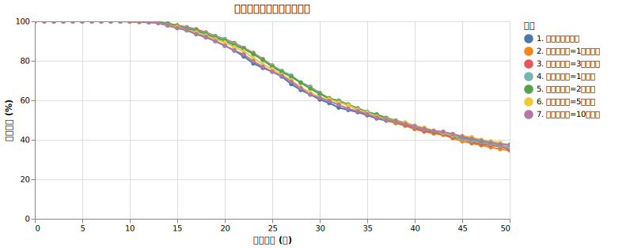

結果を見ると、リバランスの頻度は 37~39年後くらいまではいい影響、それ以降は悪い影響を及ぼしています。

* **20〜30年の短期的な生存（安定性）**: リバランスの頻度が高い（1ヶ月、3ヶ月、1年）ほど、20年、30年の破産確率は低く抑えられます。これはこまめに利益を確定して安全資産に移すため、収益配列リスク（運用初期の暴落）への耐性が高まるためです。
* **50年の長期的な生存（成長性）**: 一方で、50年という超長期の生存確率や、上位層の資産の伸びを見ると、リバランスの頻度が低い（1年、2年）ほど結果が良くなっています。頻繁すぎるリバランスは、「これからもっと伸びるはずの株の利益を早めに刈り取りすぎる」ことになり、複利による成長の足を引っ張ってしまうからです。また、毎回譲渡所得税がかかる設定であるため、こまめな利益確定は税金の支払い回数を増やし、手元に残る運用資金を減らす（税引きドラッグ）要因にもなっています。

これらのバランスを考慮すると、**1年に1回、あるいは数年に1回程度のリバランスが、短期的な暴落耐性と長期的な資産成長のバランスを取る上で最適な頻度**と言えそうです。

ただし、そこまで気にすることではなさそうです。

### 高齢になると支出が減るという話

さて、今度は支出のところに切り込んでいきましょう。

「4%ではなくて何%なのか」という部分はおいておいて、まずはシミュレーションで忘れがちな事実を入れてみます。それは **高齢になると支出が減る** という話です。

[家 計 調 査 報 告 家計収支編 2024年(令和６年)平均結果の概要](https://www.stat.go.jp/data/kakei/sokuhou/tsuki/pdf/fies_gaikyo2024.pdf) の p7 によると、二人以上の世帯の世帯主の年齢階級別消費支出額は以下の様になっています。

| 世帯主の年齢階級 | 世帯主の年齢 | 消費支出(円) |
| :--- | :--- | :--- |
| 40歳未満 | 34.4 | 280,451 |
| 40～49歳 | 44.8 | 331,134 |
| 50～59歳 | 54.2 | 356,946 |
| 60～69歳 | 64.6 | 311,392 |
| 70歳以上 | 77.6 | 252,781 |

もちろんあなたの世帯構成、性別、ローン、教育、病気によってさらに傾向は変わりますが、シミュレーションということでこのグラフの近似線を使って支出が上下することを仮定してみましょう。

<!--
```
python analyze_cost_main.py
```

fills in the following placeholder and updates imgs/cost_by_age.svg.
-->

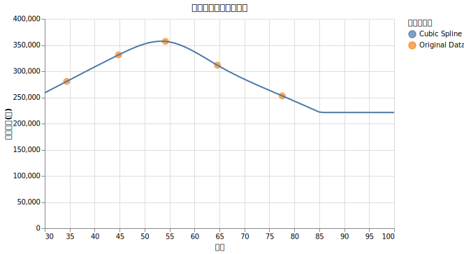

(86歳以上は221,056円で下げ止まると仮定してみました)

シミュレーションの条件：
* インフレ率 2%
* 無リスク資産利回り：4%
* オルカンの売却にも無リスク資産による配当にも譲渡所得税がかかる
* 売る優先度は無リスク資産
* オルカンの割合を 80%
* リバランスの頻度を 1年

に固定したうえで

* 支出は400万円が固定
* 30歳からの50年間の支出を再現
* 35歳からの50年間の支出を再現
* 40歳からの50年間の支出を再現
* 45歳からの50年間の支出を再現
* 50歳からの50年間の支出を再現
* 55歳からの50年間の支出を再現
* 60歳からの50年間の支出を再現

を比べてみます。ただし、初年度は400万円固定で、インフレの効果は折り込みます。

例えば「30歳からの50年間」の場合、400万円の支出は30歳の時の出費を表していて、それから支出がだんだん上昇してから下降する場合をシミュレーションします。「50歳からの50年間」の場合、400万円から下降していく場合をシミュレーションします。60歳から50年生きられる人はほぼいませんが、30年生存確率や40年生存確率を注目するのが目的です。

<!--<cost_per_age_comp_main.py>-->

|                 |   下位1% (だいぶ運が悪い) |   下位10% (運が悪い) |   下位25% (やや不運) |   中央値 (普通) |   上位25% (やや幸運) |   上位10% (運が良い) |   10年破産確率 (%) |   20年破産確率 (%) |   30年破産確率 (%) |   40年破産確率 (%) |   50年破産確率 (%) |
|:----------------|-----------------:|---------------:|---------------:|-----------:|---------------:|---------------:|--------------:|--------------:|--------------:|--------------:|--------------:|
| 1. 支出一定 (400万円) |            0.0億円 |          0.0億円 |          0.0億円 |      0.0億円 |          2.4億円 |         12.0億円 |          0.0% |          9.3% |         36.6% |         53.4% |         63.8% |
| 2. 30歳からの50年間   |            0.0億円 |          0.0億円 |          0.0億円 |      0.0億円 |          0.0億円 |          7.7億円 |          0.2% |         18.2% |         54.7% |         70.9% |         76.6% |
| 3. 35歳からの50年間   |            0.0億円 |          0.0億円 |          0.0億円 |      0.0億円 |          0.7億円 |          9.2億円 |          0.2% |         17.2% |         50.4% |         64.8% |         72.4% |
| 4. 40歳からの50年間   |            0.0億円 |          0.0億円 |          0.0億円 |      0.0億円 |          1.9億円 |         10.8億円 |          0.1% |         14.5% |         43.0% |         57.5% |         64.8% |
| 5. 45歳からの50年間   |            0.0億円 |          0.0億円 |          0.0億円 |      0.0億円 |          3.4億円 |         12.5億円 |          0.0% |         10.6% |         35.4% |         49.3% |         56.8% |
| 6. 50歳からの50年間   |            0.0億円 |          0.0億円 |          0.0億円 |      0.2億円 |          4.6億円 |         15.4億円 |          0.0% |          7.8% |         24.9% |         39.7% |         48.3% |
| 7. 55歳からの50年間   |            0.0億円 |          0.0億円 |          0.0億円 |      0.7億円 |          5.5億円 |         17.0億円 |          0.0% |          5.0% |         19.4% |         32.7% |         42.6% |
| 8. 60歳からの50年間   |            0.0億円 |          0.0億円 |          0.0億円 |      0.8億円 |          5.6億円 |         17.1億円 |          0.0% |          4.4% |         17.3% |         31.7% |         42.0% |

<!--</cost_per_age_comp_main.py>-->

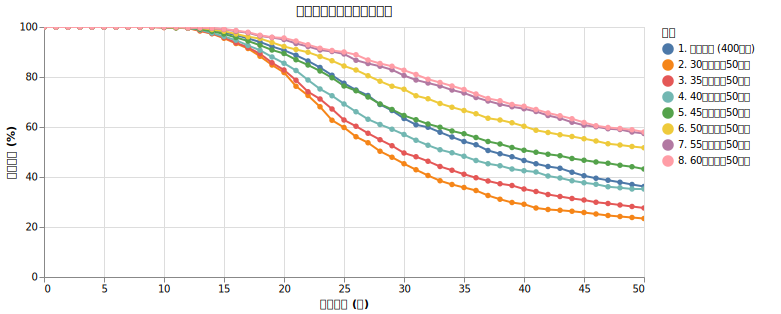

この結果から、リタイアを開始する年齢によって生存確率が大きく変わることがはっきりと分かります。

* **30代・40代のアーリーリタイアは非常に過酷**: 「支出一定（400万円）」のベースラインと比較して、「30歳からの50年間」や「40歳からの50年間」は破産確率が顕著に悪化しています（例えば30歳開始の30年破産確率は 54.7% にも達します）。これは、リタイア直後から50代半ばにかけて生活費の「増加トレンド」が続くためです。運用初期に一番資産を減らしたくない時期に、出費の増加が追い打ちをかけることになり、収益配列リスクが最悪の形で直撃してしまいます。
* **50代以降のリタイアは生存率が劇的に改善**: 一方、「50歳からの50年間」や「60歳からの50年間」を見ると、支出一定のベースラインを大きく上回る生存確率を記録しています。50代をピークとして、60代、70代と加齢に伴って消費支出が自然に減少していくため、後半の取り崩し圧力が和らぎます。その結果、運用資産の寿命が劇的に延びるのです。

アーリーリタイア（FIRE）を目指す際、若いうちの低い生活費をそのまま生涯続くものとしてシミュレーションしてしまうのは非常に危険です。逆に、50代後半や60代からの一般的なリタイアにおいては、「老後は思ったよりお金を使わない（使えない）」という加齢による自然な支出減が、資産の枯渇を防ぐ強力なセーフティネットとして機能することが分かります。