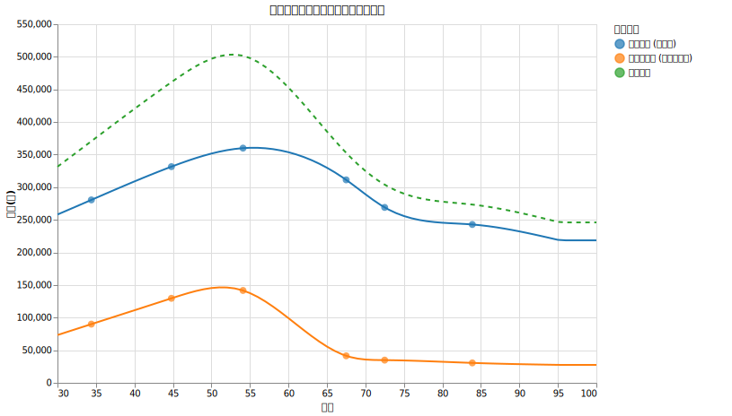
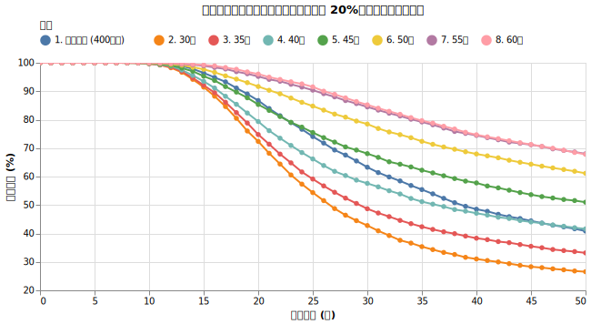
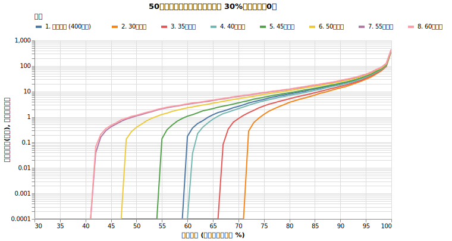
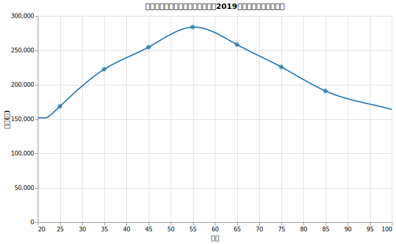

# 高齢になると支出が減るという話

<!--
DO NOT DELETE:
python3 src/analyze_retired_spending.py
python3 src/retired_spending_comp_main.py
-->

[ダイナミック・スペンディング](dynamic_spending.md) では支出を我慢して生存確率を上げる戦略を話してきました。実際支出を減らすのはどれくらい辛いのでしょうか。実は年齢によってはそれほど辛くない可能性もあります。

今回は、取り崩し戦略のシミュレーションで忘れがちな事実を深堀りします。それは**高齢になると支出が減る**という話です。
    
!!! abstract "重要なポイント"
    * **加齢に伴い生活費は減少傾向となる。** 家計調査の統計データによれば、50代をピークとして、60代、70代と年齢が上がるにつれて消費支出が減少することが示されている。
    * **若年でのリタイアは支出増加による資産寿命の短縮に注意。** 30代や40代でのリタイアは、その後の数十年間にわたる支出の増加傾向が運用初期の資産を圧迫し、生存確率を大幅に低下させる。
    * **中年でのリタイアは自然な支出減が資産の枯渇を抑える。** 50代後半以降のリタイアでは、加齢による支出の低下が取り崩し額を減らすため、結果として長期的な生存確率が高くなる。

ただし今回の実験は世帯人数が２人以上の場合の話です。単身世帯の人の話は最後に載せます。

## 年齢による支出の推移

[家計調査報告 家計収支編 2024年(令和６年)平均結果の概要 (pdf)](https://www.stat.go.jp/data/kakei/sokuhou/tsuki/pdf/fies_gaikyo2024.pdf) から消費支出 (生活費)と非消費支出 (税・保険料) のデータを取ってきました。

**世帯主が勤めている世帯（二人以上）**の世帯主の年齢階級別消費支出額は以下の様になっています。

| 年齢階級 | 世帯主の年齢 | 非消費支出 (税・保険料) | 消費支出 (生活費) | 可処分所得 (手取り) |
| :--- | :---: | :---: | :---: | :---: |
| 40歳未満 | 34.4歳 | 90,018円 | 280,544円 | 516,522円 |
| 40～49歳 | 44.8歳 | 129,607円 | 331,526円 | 571,000円 |
| 50～59歳 | 54.1歳 | 141,647円 | 359,951円 | 569,251円 |
| 60歳以上 | 65.9歳 | 77,571円 | 308,660円 | 410,039円 |
| （平均） | 113,586円 | 325,137円 | 522,569円 |

**二人以上の世帯のうち「65歳以上の無職世帯」**の家計収支は以下のようでした。

| 年齢階級 | 消費支出 (生活費) | 非消費支出 (税・保険料) | 可処分所得 (手取り) |
| :--- | :---: | :---: | :---: |
| **65歳以上平均** | **259,295円** | **33,232円** | **233,097円** |
| **65～69歳** | 311,281円 | 41,405円 | 266,336円 |
| **70～74歳** | 269,015円 | 34,824円 | 240,596円 |
| **75歳以上** | 242,840円 | 30,558円 | 221,948円 |

### 年齢ごとの支出の推移のグラフ

滑らかな曲線で繋いでみたのが以下のグラフです。消費支出（生活費）と非消費支出（税・保険料）の両方を考慮しています。

(生命表に基づき75歳以上の平均年齢を83.9歳と推計し、高年齢域での支出はそれ以降なだらかに下げ止まると仮定しました)

==今までのシミュレーションは、ダイナミックスペンディング以外の話は全て4%の支出と物価上昇率ばかり考えていて、ライフスタイルの変化は一切考えていませんでした。==

このグラフの近似線を使って支出が上下するとした場合、ライフシミュレーションにどのような影響があるのでしょうか。

!!! warning ""
    もちろん実際の支出は、世帯構成、性別、ローン、教育、病気、介護などによって傾向は変わります。今回は支出の変化のパターンをシミュレーションに組み込んだ際にどれくらい影響があるのかを検証します。

## 実験

!!! info "シミュレーションの固定条件"

    * **初期資産**: 1億円
    * **投資先**: オルカン100% (期待リターン7%, リスク15%, 信託報酬 0.05775%)
    * **為替リスク**: USDJPY (期待リターン0%, リスク10.53%)
    * **インフレ率**: 1.77%
    * **初期出費額**: 400万円
    * **税率**: 20.315%
    * **シミュレーション期間**: 50年
    * **試行回数**: 5000回

にしたうえで

!!! info "シミュレーションで変える条件"

    * 支出は400万円が固定
    * 開始時の想定年齢を変えて50年間の支出を再現
      * 30歳, 35歳, 40歳, 45歳, 50歳, 55歳, 60歳

を比べてみます。ただし、初年度は400万円固定で、インフレの効果は織り込みます。

例えば「30歳からの50年間」の場合、400万円の支出は30歳の時の出費を表していて、それから支出がだんだん上昇してから下降する支出パターンをシミュレーションします。「50歳からの50年間」の場合、400万円から下降していく場合をシミュレーションします。60歳から50年生きられる人はほぼいませんが、30年生存確率や40年生存確率を注目するのが目的です。

## シミュレーション結果

[結果の詳細な表](data/retired_spending/result.md)

### 生存確率の推移

!!! warning "グラフの読み方に注意"

    * 一番下のオレンジ色は初年度に30歳だった人の生存確率です。「経過年数=30年」というのはその人が60歳になった時の話です。
    * 一番上のピンク色は初年度に60歳だった人の生存確率です。「経過年数=30年」というのはその人が90歳になった時の話です。
    * 真ん中辺りの紺色は400万円を物価上昇率に合わせて支出していく人の生存確率です。

### 50年後の資産の分布

## 考察

この結果から、リタイアを開始する年齢によって生存確率が大きく変わることがはっきりと分かります。

* **30代・40代のアーリーリタイアは非常に過酷**: 「支出一定（400万円）」のベースラインと比較して、「30歳からの50年間」や「40歳からの50年間」は破産確率が顕著に悪化しています（例えば30歳開始の30年破産確率は 52.4% にも達します）。これは、リタイア直後から50代半ばにかけて生活費の「増加トレンド」が続くためです。運用初期に一番資産を減らしたくない時期に、出費の増加が追い打ちをかけることになり、リタイア直後の資産が不安定な時期に支出が増えることは、長期的な資産運用にとって大きなマイナスとなり、当初の取り崩し計画を維持することが困難になります。
* **45以降のリタイアは生存率が劇的に改善**: 一方、「50歳からの50年間」や「60歳からの50年間」を見ると、支出一定のベースラインを大きく上回る生存確率を記録しています。50代をピークとして、60代、70代と加齢に伴って消費支出が自然に減少していくため、後半の取り崩し圧力が和らぎます。その結果、運用資産の寿命が劇的に延びるのです。

アーリーリタイア（FIRE）を目指す際、若いうちの低い生活費をそのまま生涯続くものとしてシミュレーションしてしまうのは非常に危険です。逆に、50代後半や60代からの一般的なリタイアにおいては、「老後は思ったよりお金を使わない（使えない）」という加齢による自然な支出減が、資産の枯渇を抑える要因になっていることが分かります。

## 単身世帯の場合

単身世帯においても、50代をピークとして支出が減少する傾向は同様に見られます。[2019年全国家計構造調査](https://www.stat.go.jp/data/zenkokukakei/2019/pdf/gaiyou0305.pdf) に基づく、単身世帯の年齢階級別消費支出(生活費)は以下の通りです。

| 年齢階級 | 消費支出 (生活費) | 特徴 |
| :--- | :---: | :--- |
| 30歳未満 | 168,552円 | 住居費負担が最大 (24.1%) |
| 30～39歳 | 222,432円 | |
| 40～49歳 | 254,475円 | 教育費（仕送り等）の発生 |
| 50～59歳 | 283,725円 | **支出のピーク** |
| 60～69歳 | 258,284円 | |
| 70～79歳 | 225,799円 | 食料・保健医療の割合が増加 |
| 80歳以上 | 190,818円 | |

単身世帯は二人以上世帯に比べ、住居費の固定費負担が重い一方で、教育費や家族関連の支出が少ないため、全体的な支出水準は低くなります。しかし、40代・50代における支出の伸びは無視できないレベルであり、早期リタイアを計画する際にはこの「単身世帯なりの支出の山」を考慮する必要があります。

!!! info "単身世帯データの限界"
    単身世帯に関する詳細な統計データは、二人以上世帯に比べてサンプル数が少なく、特に現役世代の「非消費支出（税・保険料）」を含めた総支出の時系列推移は、公的統計からも明確な把握が困難なのが実情です。2024年（令和6年）に公表された最新の家計調査報告においても、単身世帯については全体の平均値や「65歳以上の無職世帯」の詳細な内訳が示されるにとどまっており、現役世代を含めた網羅的な年齢階級別データとしては、2019年の構造調査が現時点でのベストエフォートとなります。
