# 取り崩し期と積立期は全く違う：収益率配列のリスク

[「ボラティリティが長期投資に与える影響」](volatility.md)では、価格変動（リスク）が運用の結果を大きく左右することを確認しました。しかし、資産を「取り崩す」段階に入ると、単なる価格変動以上の深刻な問題が発生します。それが「収益率配列のリスク（Sequence of Returns Risk）」です。

!!! abstract "重要なポイント"
    - 収益率配列のリスクとは、リターンの順番が資産の寿命を左右するリスクのこと。
    - 取り崩しを行わない運用ではリターンの順番は最終結果に影響しない。一方、取り崩しを行う運用では、初期に資産を大きく減らすと、その後の市場回復による恩恵を十分に受けられなくなる。
    - **破綻の主な要因は「運用開始直後の暴落や停滞」と「想定利回りを下回る長期的な低成長」の2パターン。**

## 最終運用結果が同じでも取り崩し結果は変わる

[ボラティリティの分析](volatility.md#シミュレーション結果最終資産額)において、年率リターン7%、ボラティリティ15%で50年間運用（取り崩しなし）した場合、中央値の資産額は約18.3億円（初期1億円）になることを示しました。

5000回のシミュレーション中、最終的にこの「中央値付近（15〜21.6億円）」に到達するパターンが726回あったのですが、その中から、ランダムに抽出した推移が以下の図です。

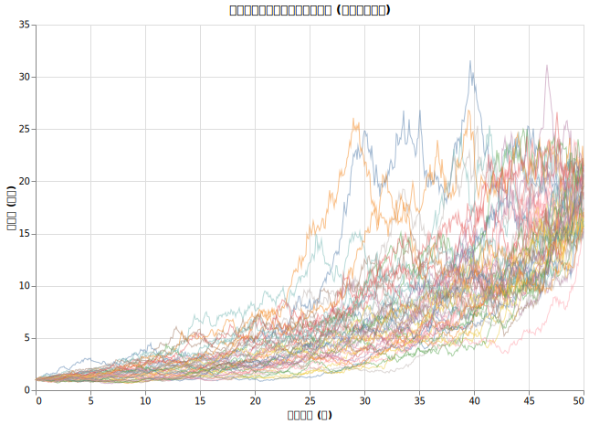

最終的な金額はほぼ同じですが、途中の経過は全く異なります。前半に大きく増やして後半に停滞するケースもあれば、前半は横ばいで後半に急成長するケースもあります。前半の動きを詳しく見るために、縦軸を対数スケールにしたものが以下です。

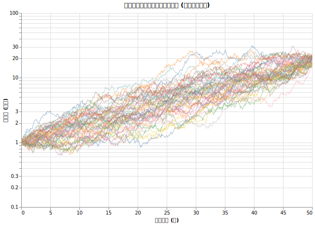

取り崩しを行わないのであれば、これらのパスはどれも「50年で約18倍になった例」です。しかし、ここに「定額の取り崩し」が加わると、話は一変します。

## 取り崩し途中で資産が枯渇するからくり

先ほどの中央値に到達した（取り崩しなしなら18倍に資産が増えていたはずの）ケースにおいて、もし毎年400万円 (正確には毎月33.33万円)を定額で取り崩していたらどうなったでしょうか。

なんと726回中50回は途中で資産が枯渇する結果となりました。

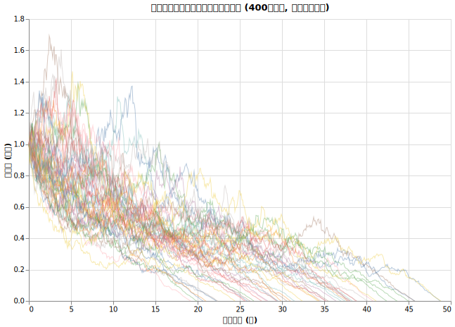

驚くべきことに、取り崩しがなければ約18億円に達していたはずのケースで、途中で資産が底をつき、枯渇することがあるということです。なぜこのようなことが起きるのでしょうか。その時の市場（指数）の動きを重ねて見てみます。

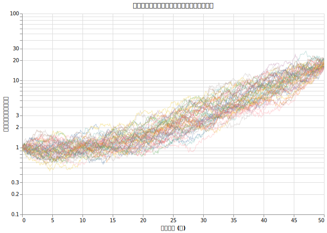

上の図では個々のパスが重なって見づらいため、市場指数の分布（10%, 50%, 90% パーセンタイル）を表示したものが以下です。

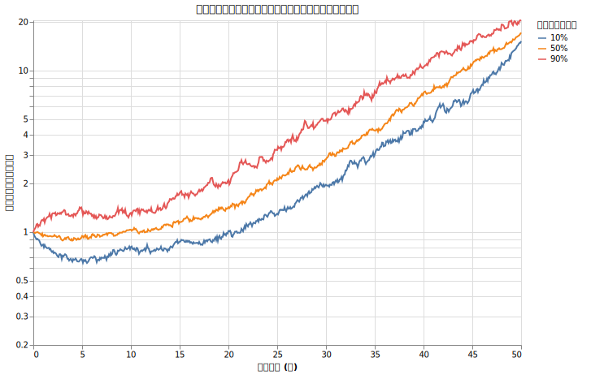

!!! warning "注意"

    様々なケースでの資産推移の分布を各年ごとに計算しているので「赤線や青線をずっと辿る」ということではありません。「資産が枯渇している場合の値動きはだいたいこの赤線と青線の中を動いている」という解釈が正しいです。

資産が枯渇したケースでは、運用開始から20年が経過しても、市場指数が初期値の1〜2倍程度に留まるなど、極めて低迷していることがわかります。

### 成功したケースとの対比

一方で、同じ「取り崩しなしなら資産が中央値付近に到達した」グループの中で、資金が枯渇しなかったケースの市場指数の分布を見てみます。

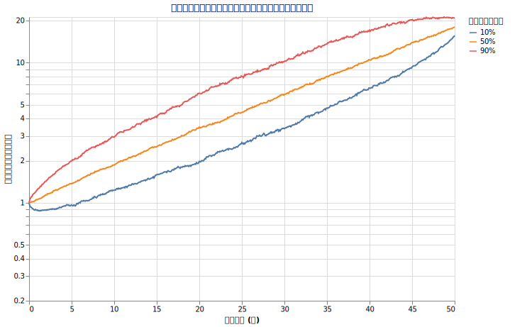

成功したケースでは、下位10%のラインであっても、運用初期段階で指数が順調に上昇し、資産を維持できる水準にあることがわかります。

市場が下がっている時期に生活費のために資産を売却すると、保有シェアが急激に減少します。一度減ってしまったシェアは、その後に市場がどれだけ回復しても元には戻りません。これが「収益率配列のリスク」の正体です。積立期であれば安く買えるチャンスだった下落相場が、取り崩し期には深刻な損失に変わります。

## 資産枯渇のタイミングと市場環境

今まで「取り崩しをしていなかったら50年で18億円付近になっていた」ケース (726ケース) を重点的に見てきましたが、今度はより広い条件下（年リターン7%、ボラティリティ15%、400万取り崩し、5000ケース）での生存確率と、資産が枯渇した時期別の市場環境を分析します。

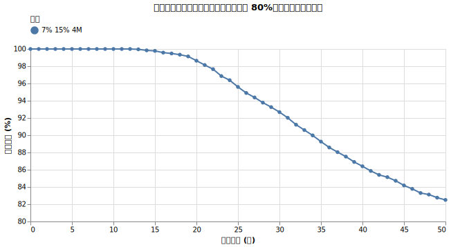

この設定では、50年後の生存確率は約80%です。裏を返せば約20%で資産が枯渇しますが、それがどの時期の市場環境に起因しているかを確認していきましょう。

以下は、資産が枯渇した時期ごとに、対象者が直面していた市場指数の推移（10%, 50%, 90% パーセンタイル）をまとめたものです。

1-10年までに資産が枯渇したケースはありませんでした。

### 11-20年で資産が枯渇したケース

5000中68ケース (1.3%) を元にした分布図です。

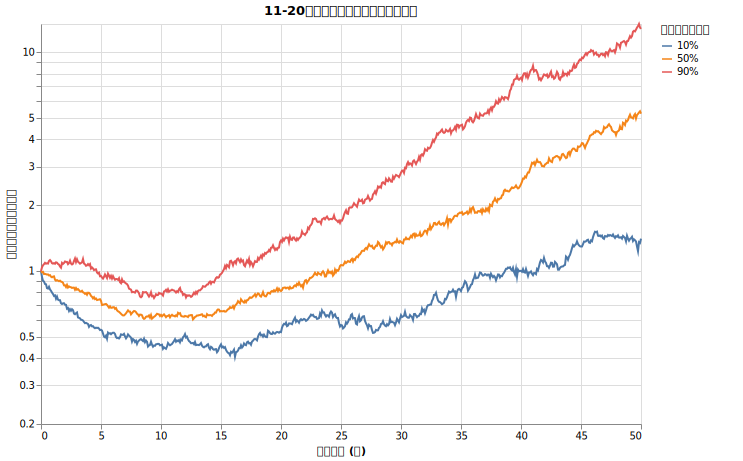

開始直後から15年目にかけて激しい暴落や低迷が続いています。パーセンタイル線が示す通り、この時期に資産が枯渇した人の大半が、運用初期に極めて厳しい市場環境に直面していました。

### 21-30年で資産が枯渇したケース

5000中298ケース (5.7%) を元にした分布図です。

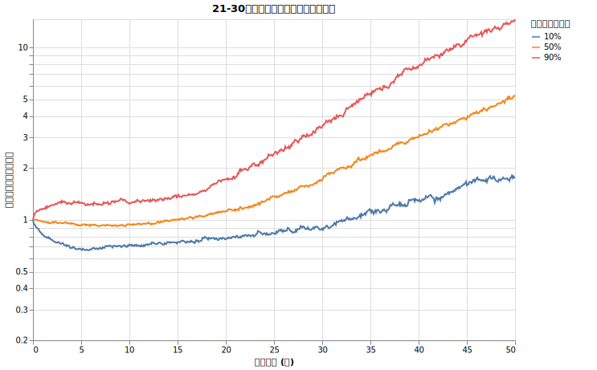

5年目から18年目付近まで市場が停滞しています。この間に資産を大きく削り取られ、その後の市場回復が資産の復活に間に合わなかったことを示しています。

### 31-40年で資産が枯渇したケース

5000中314ケース (6.2%) を元にした分布図です。

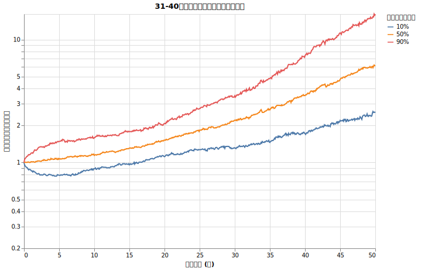

中央値（50%ライン）は緩やかに上昇していますが、28年で2倍（年率約2.5%）という伸びは、期待リターン7%を大きく下回っています。長期にわたる下振れが、じわじわと資産を枯渇させたパターンです。

### 41-50年で資産が枯渇したケース

5000中195ケース (3.9%) を元にした分布図です。

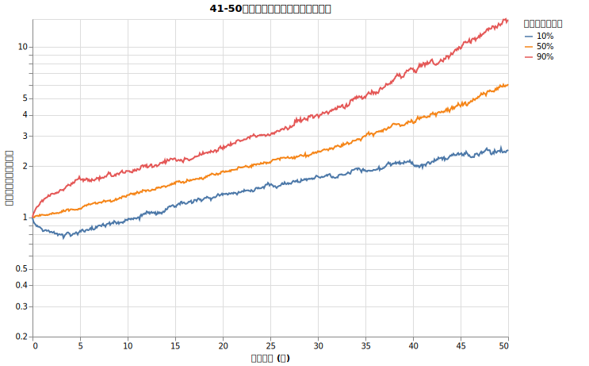

31-40年で資産が枯渇するケースと似ていますが、年率約3.1%（22年で2倍）と、わずかにマシな推移を辿ったことで延命したものの、最終的に力尽きています。

## 結論：リタイア直後の市場環境と成長の継続性がすべてを決める

分析の結果、資産の寿命を決定づけるのは「リタイア直後の市場環境」と「資産成長の継続性」であることが分かりました。資産が枯渇するパターンは、主に以下の二つに集約されます。

!!! failure "短期〜中期の資産枯渇（5〜15年）"
    運用開始直後の10〜15年間に暴落や停滞が発生するケースです。初期に資産を大きく減らすことで、その後の市場回復が資産の復活に間に合いません。

!!! failure "長期の資産枯渇（31〜50年）"
    市場は緩やかに上昇しているものの、年率3%前後など期待リターン（7%）を大きく下回る成長が数十年にわたって続くケースです。定額取り崩しに対して資産の成長が追いつかず、時間をかけて資産が底をつきます。

一方で、最初の10〜20年を順調な相場で過ごせた場合は、その後に暴落が来ても積み上がった資産の力で資産の枯渇を回避できています。

取り崩しにおいて警戒すべきは、リタイア直後の不調と、想定を下回る長期的な低成長です。

*   **積立期**：リターンの順番は最終結果に影響しません。
*   **取り崩し期**：リターンの順番が重要です。前半の不調や下振れは、後半の好調で取り返すことが困難です。

リタイア後の計画では、平均リターンだけでなく、初期の不調や期待リターンの半分しか達成できないシナリオへの備え（現金の確保や動的な取り崩し戦略など）が不可欠です。
