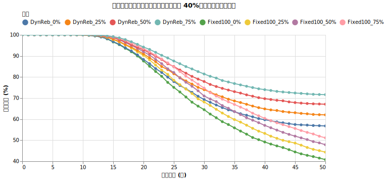
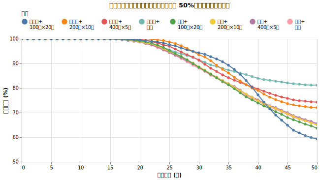
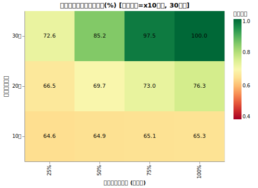
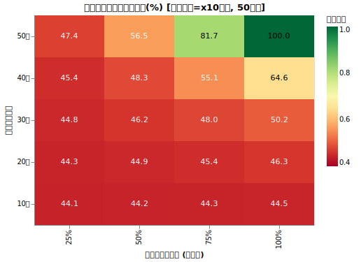
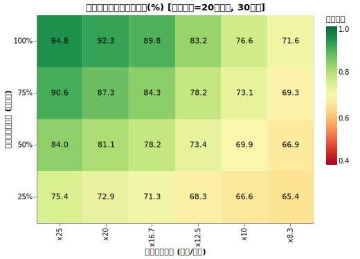
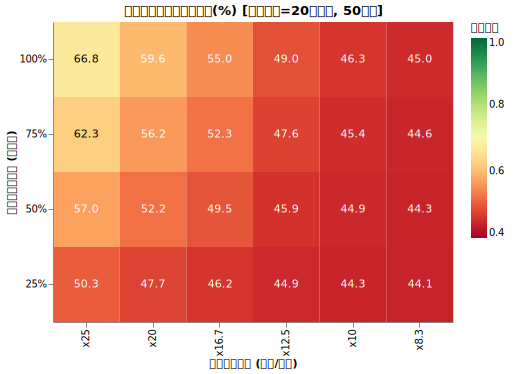

# サイドFIRE

<!--
DO NOT DELETE.

実験1&2
- python3 src/side_fire_comp_main.py

実験3 (少し時間がかかる)
- python3 src/side_fire_cond_grid_main.py
- python3 src/analyze_side_fire_cond_main.py
-->

サイドFIREは、好きな仕事で少しだけ稼ぎながら資産を取り崩して生活するスタイルです。リタイア初期の労働収入が、長期的な資産の維持にどのような影響を与えるかをシミュレーションで検証しました。

!!! abstract "重要なポイント"
    * **初期の労働収入は長期の生存確率を大きく向上させる。** 最初の5年間に生活費の半分を稼ぐだけで、50年後の生存確率は約10%改善する。
    * **運用初期の資産減少を抑えることが重要である。** 取り崩し額を減らすことで、市場暴落時の影響を抑え、その後の資産成長を助ける効果がある。
    * **収入を得る期間やタイミングによって効果が異なる。** 短期的な破産を避けるには長く稼ぐのが有効だが、長期的な資産額を増やすには早めに稼いで投資に回すのが有利になる。
    * **「危険になったら働く」手法も有効。** その場合一番重要なのは「働ける年数 × 稼げる量」。働ける年数が少ないと、結局その後の暴落に耐えられない。「年支出率がこれまで上がったら働く」という閾値も次に重要に要素だった。

## 生存確率を上げるという視点で見るサイドFIRE

リタイア後の課題は、[収益配列リスク (Sequence of Return Risk)](sequence.md)への対応です。取り崩し運用におけるリスクは、大きく分けて2つのパターンがあります。一つは運用初期に市場が暴落して資産を大きく減らしてしまうパターン、もう一つは資産が底をつくわけではないものの、想定より資産が伸びない期間が長く続くパターンです。

いずれの場合も、初期に資産を大きく減らすと、その後の相場回復による利益を得にくくなり、資産が底をつく可能性が高まります。

サイドFIREによる労働収入には、初期の資産取り崩し額を抑える効果があります。これにより、単に収入分が増える以上の好影響を資産の維持にもたらします。

## 実験 1: 初期の労働収入の金額の影響

最初の5年間に生活費の一部を労働収入で補った場合、その後の50年間にどのような差が出るかをシミュレーションしました。

!!! info "シミュレーションの共通条件"
    * **試行回数**: 5,000回
    * **期間**: 50年間
    * **初期資産**: 1億円
    * **初期年間支出**: 400万円 (支出率4%)
    * **投資先**: オルカン100%（期待リターン7%、リスク15%、信託報酬 0.05775%）
    * **為替リスク**: USDJPY（期待リターン0%、リスク10.53%）
    * **インフレ率**: 1.77% (固定) <!-- TODO: これも AR に変えて実験 -->
    * **税率**: 20.315%

!!! info "シミュレーションの可変条件"

    * 最初の5年間の労働収入（サイドFIRE収入）のレベルを以下の通り変化させます。

    | シナリオ | 労働収入（年額） | 期間 | 備考 |
    | :--- | :--- | :--- | :--- |
    | **0%** | 0万円 | - | 完全な不労所得生活 (Full FIRE) |
    | **25%** | 100万円 | 最初の5年 | 生活費の25%を労働で賄う |
    | **50%** | 200万円 | 最初の5年 | 生活費の50%を労働で賄う |
    | **75%** | 300万円 | 最初の5年 | 生活費の75%を労働で賄う |

    * **運用戦略**:
        * **オルカン100%**: 全期間、オルカン100%で運用。
        * **[ダイナミックリバランス](dynamic_rebalance.md)**: 資産状況と残り年数に応じて、オルカンと無リスク資産（利回り4%）の比率を最適化。

### シミュレーション結果

労働収入の金額と、資産運用戦略ごとの生存確率を比較しました。

{!data/side_fire/exp1.md!}

<figure>
  
  <figcaption>収入レベル別の生存確率の推移です。最初の5年間の収入が長期にわたり効果を発揮します。</figcaption>
</figure>

### 考察

シミュレーションの結果から、労働収入の効果が確認できます。最初の5年間に生活費の半分（50%）を稼ぐだけで、50年後の生存確率は 40.8% から 47.9%（オルカン100%時）へと約7ポイント向上します。ダイナミックリバランスを併用した場合は、56.8% から 67.1% へと10ポイント以上改善します。

5年間の労働が長期的な結果に影響するのは、運用初期に資産を維持できたためです。維持された資産がその後の45年間、複利で成長し続けます。サイドFIREは、リタイアの開始時期を遅らせるのと同様の効果があり、その期間も運用を継続できるメリットがあります。

## 実験 2: 「細く長く」か「太く短く」か

合計で2,000万円を稼ぐ場合に、短期間で集中して稼ぐのと、長期間かけて少しずつ稼ぐのとでは、どちらが有利かを検証しました。

!!! info "シミュレーションの共通条件"
    * 実験1と同じ設定（試行回数5,000回、資産1億円、支出400万円など）を使用します。
    * **総受取額**: 労働収入の総額を **2,000万円** に固定します。

!!! info "シミュレーションの可変条件"

    * 2,000万円の受け取り方を以下の通り変化させます。

    | シナリオ | 受け取り方 | 期間 | 備考 |
    | :--- | :--- | :--- | :--- |
    | **Baseline (一括)** | 初月に一括 | 1ヶ月 | 最初に2,000万円の追加資産がある状態 |
    | **400万 × 5年** | 年間400万円 | 5年間 | 生活費を全額労働で賄う（資産を減らさない） |
    | **200万 × 10年** | 年間200万円 | 10年間 | 生活費の半分を10年稼ぐ |
    | **100万 × 20年** | 年間100万円 | 20年間 | 生活費の1/4を20年稼ぐ |

    * **運用戦略**:
        * **オルカン100%**
        * **ダイナミックリバランス**

### シミュレーション結果

{!data/side_fire/exp2.md!}

<figure>
  
</figure>

### 考察

シミュレーション結果には、安全性と資産増加の間の関係が見られます。

1. **オルカン100%で運用する場合**
   20年時点の生存確率で見ると、年間100万円を20年稼ぎ続ける「細く長く」 スタイルが最も安全です。毎月の安定した収入により、運用初期の下落時にも資産を過度に減らさずに済みます。一方、50年後の資産残高で見ると、最初に一括で資産がある状態の方が有利です。これは早い段階で投資に回すことで、長期的な複利の効果をより多く受けられるためです。

2. **ダイナミックリバランスを併用する場合の比較**
   ダイナミックリバランスを併用すると、どのシナリオでも50年後の生存確率が 70%〜77% まで改善します。特に「一括受給と動的リバランス」を組み合わせた場合に、最も高い生存確率を記録しました。これは、早い段階で大きな資産を確保することで、資産配分の調整に余裕が生まれるためと考えられます。つまり「短く太く」稼ぎたいですね。

リタイア直後の資産減少を避けたい場合は、少額でも長期間稼ぎ続ける方法が有効です。一方で、長期的な資産額を増やしたいのであれば、早い段階で集中して稼ぎ、適切な資産配分戦略と組み合わせるのが合理的です。

## 実験 3. 危険になったときのみ働く

サイドFIREの１つの方法として、「危険になったときのみ働いて生活を維持する」という考え方がありそうです。

これは[ダイナミックスペンディング](dynamic_spending.md)で紹介した「資産が下がってきたら支出を無理のない範囲で減らす」というアイデアと似ていますが、支出を減らすのではなく収入を増やすアイデアとなります。

このアイデアの具体例として、以下のアイデアを試します。

* **危険になった時とはいつか:** *総資産÷(前年の)年支出* の値がある値 $X$ を下回ったら働き始めるとします。例えば1億円総資産で年支出が400万の(4%ルールの)人はその逆数の25となりますが、総資産が6000万まで減った時は、その値は15となります。危険かどうかの判定は毎年年初に1回行います。年初にはその年の年支出はまだ分からないので、計算には前年の年支出を使います。
* **どれくらい働くか:** 必ず1年働くとします。
* **いつまで働けるとするか:** シミュレーション開始から $Y$ 年は働けるものとします。高齢になったら働けないことを再現するためのパラメータです。
* **どれくらい稼ぐか:** 年支出の $Z$% を手取りとして稼ぐとします。稼げる額は物価上昇率に比例するとします。

!!! info "シミュレーションの共通条件"
    * 実験1と同じ設定（試行回数5,000回、資産1億円、支出400万円、オルカン100%など）を使用します。
    * **物価上昇率**: [AR(12)粘着性モデル](cpi.md)を用い、物価が下がるケースも再現します。
    * 生存確率を上げる他の施策 (ダイナミックリバランスや年金等)は行いません。

!!! info "シミュレーションの可変条件"

    上記の $X$, $Y$, $Z$ として以下の値を全部試してみました。

    * **総資産 / (前年の)年支出** の危険判定 ($X$): x25, x20, x16.7, x12.5, x10, x8.3
    * **いつまで働けるか** ($Y$): 10年, 20年, 30年, 40年, 50年
    * **どれだけ稼げるか = 労働収入 / 年支出** ($Z$): 25%, 50%, 75%, 100%

### シミュレーション結果

3つパラメータがあるので、ある一つのパラメータを固定して図示してみます。

**危険判定を X = x10 とした時の30年後の生存確率ヒートマップ**

ちなみに全く働かない時の30年後の生存確率は64.3%でした。

右上の生存確率100%は、「その気になれば今から30年後であっても年支出100%分稼げる人」の場合で、その場合100%の生存確率でした。ある意味当たり前といえます。

逆に左下は「今から10年は働けるけど支出の25%しか稼げない人」の場合で、64.3%→64.6% の微々たる影響しか有りません。

**危険判定を X = x10 とした時の50年後の生存確率ヒートマップ**

同じヒートマップの50年後の生存確率を見てみましょう。

50年の場合、全く働かない生存確率は44.0%でした。

「ちょっと働く程度では影響が少ない」という状況がさらに強くなっているように見られます。

仮に10年バリバリ働けたとしても、そもそも4%支出では長期間生存しにくい設定なので、焼け石に水といったところでしょうか。

**働ける年数を Y = 20年 とした時の30年後の生存確率ヒートマップ**

今度は働ける年数を固定してみます。

当然の結果と言えますが、左側の X が高い場合、つまりすぐに危険だと感じて働き始める場合は生存確率が上がります。

一番左のx25は、4%ルールでは足りないと常に感じている人の場合です。ちなみにその場合でも生存確率が100%近くにならない理由は

* 働ける年数が20年の場合を見ているので、21~30年目に暴落が起きているケースがある
* Zが100%でない場合は、支出の方が収入より大きいので、1~20年目でも徐々に切り崩しが発生している

ためです。

**働ける年数を Y = 20年 とした時の50年後の生存確率ヒートマップ**

やはり20年しか働かないせいで、21~50年目に耐えられないケースが増えているのが見られます。

### 解析: X, Y, Z のどれが重要か

シミュレーションの結果に対し、どのパラメータが生存確率に最も影響を与えているかをステップワイズ分析（重要な特徴量を一つずつ選んでいく手法）で検証しました。

その結果、50年後の生存確率（$P_{50}$）は以下の順で説明できることが分かりました。

| 順位 | 特徴量 | 寄与度 ($R^2$) | 物理的な意味 |
| :--- | :--- | :--- | :--- |
| **1** | **$Y \cdot Z$** | **+73.9%** | **総労働キャパシティ:** 「何年働けるか × いくら稼げるか」の総量。安全性の土台となります。 |
| **2** | **$X$** | **+13.5%** | **トリガーの敏感さ:** 早期介入の効果。$X$が大きい（＝資産が多い段階で働き始める）ほど、生存確率が高まります。 |
| **3** | **$Z / X$** | **+2.2%** | **収入の有効性:** 働き始めた時の資産残高 (= 支出 × X) と収入 (=支出 × Z)のバランス。資産が減りすぎてからでは、高い収入でも手遅れになるケースを補正します。 |

#### コア特徴量の解釈

1.  **最も重要なのは「総額」 ($Y \cdot Z$):**
    サイドFIREの安全性において、最大の要因は「生涯で最大いくら稼ぐポテンシャルがあるか」です。このモデルでは、**「生活費の50%を20年稼ぐ」ことと「生活費の100%を10年稼ぐ」ことは、統計的にほぼ同等の防御力**を持ちます。

2.  **次に重要なのは「タイミング」 ($X$):**
    総労働キャパシティが同じであっても、それをいつ使い始めるかで効率が劇的に変わります。$X$ の項が示す通り、生存確率はトリガーの閾値に対して比例の形で向上します。つまり、**「資産が底をつきそうになってから慌てて働く（低い$X$）」よりも、「少し減った段階で早めに手を打つ（高い$X$）」方が、効率的**となります。

3.  **予測の正確性:**
    これらの特徴量を用いた2次多項式モデルは、$R^2 \approx 0.96$ という非常に高い精度で生存確率を予測できます。これは、サイドFIREの成否が運任せではなく、これら3つのパラメータの組み合わせによって数学的にかなり予測可能であることを示しています。

#### 結論

生存確率を 100% に近づけるための優先順位は以下の通りです：

1.  **キャパシティの確保:** 長く働けるスキルや、高い時間単価を維持すること。
2.  **早めのトリガー:** 「x25（4%）」や「x20（5%）」といった、資産が十分にある段階で柔軟に働き始めるルールを持つこと。

この2つを組み合わせることで、収益配列リスクを効果的に封じ込めることが可能です。

## まとめ

サイドFIREは、FIREまでの時間を短くするだけでなく、リタイア後の資産を維持するための有効な手段です。

* **月10万円の収入の効果**：年間120万円の収入は、4%の利回りを想定すると3,000万円の資産を保有しているのと同等の効果があります。
* **初期の安定化**：最初の数年間に労働収入を得ることで、運用の初期段階を安定して過ごすことができます。

サイドFIREする時「ではいったいいくら稼げば良いのか」と考える人もいると思います。今回は4%の支出の場合のみ考えていますが、結局は「どこまで稼いだら生存確率が何％になるか」をシミュレーションするのが良さそうです。
