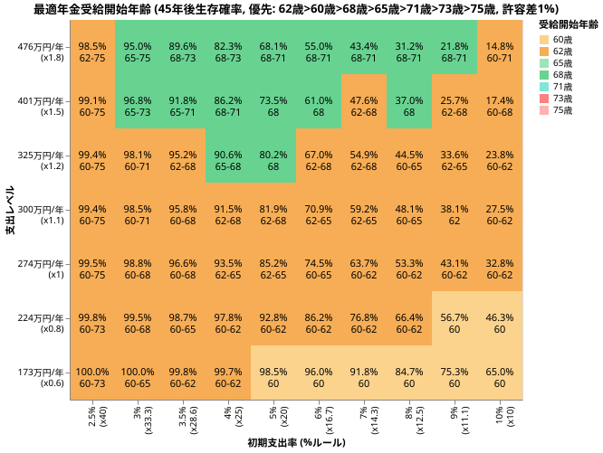
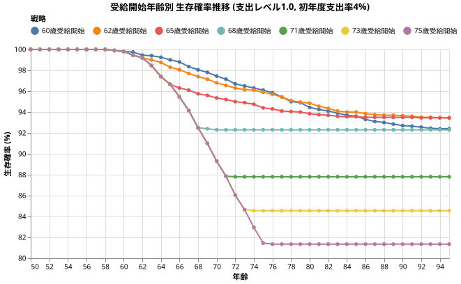
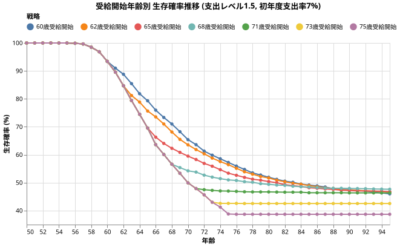
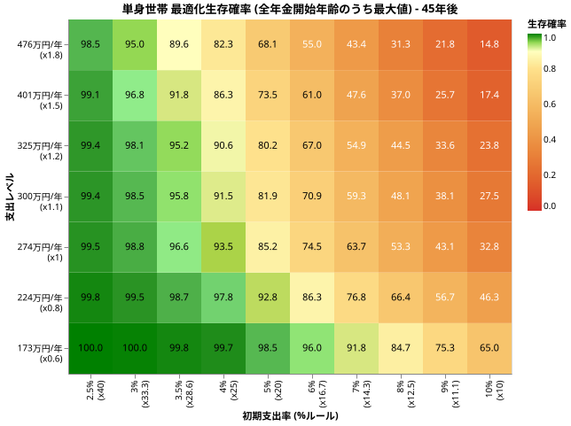
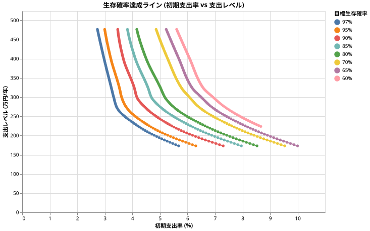
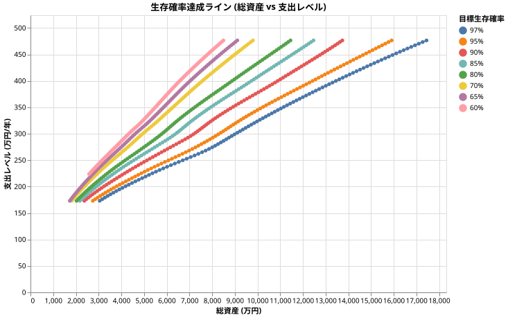

# 50歳からの取り崩しの最適戦略は<wbr/>何%ルールなのか<wbr/>(単身世帯・LEAN FIRE編)

<!--
DO NOT DELETE:
python3 src/single_50yr_grid_main.py --exp_type optimal-pension
python3 src/analyze_single_50yr_grid_main.py --exp_type optimal-pension            
-->

本稿では、支出額が少なめの (例: 単身世帯、または倹約生活を行うLEAN FIRE) 50歳からの取り崩し戦略を検証し、最適戦略を提示します。

資産取り崩し額が370万以上の場合は [2人以上世帯での50歳取り崩し戦略](all_50yr.md) を参考にして下さい。

結論として、生存確率は支出レベルに強く依存します。

!!! abstract "重要なポイント"
    * **年金の最適受給タイミングは年支出額・年支出率に依存する**。年支出が400万以下のケースにおいて年金の占める効果は大きい。最適タイミングはリタイア後の状況によって違うので、実験1の結果を参照すること。
    * **資産額と支出額から生存確率を算出可能**。目標とする生存確率に応じた最適な支出額を導き出す公式やツールを作成した。実際の戦略も紹介。

戦略だけ知りたい方は[50歳の最適戦略ガイド](#50歳の最適戦略ガイド)へ進んでください。

## 50歳から取り崩しを開始し95歳まで破綻しない確率を最大化する

ちなみに現在50歳の人が95歳まで生きられる人は男性で9.46%, 女性で25.99%です ([寿命・健康寿命予測ツール | たきびFIRE](https://takibi-fire.com/app/life-expectancy-calculator/))。

45年という取り崩し期間において、生存確率を上げるために個人ができることは主に以下の3点です。

* 年金の受給タイミングの最適化
* ライフプランに合わせたリバランス（資産配分の変更）
* 状況に応じた支出の調整

これらの要素を組み合わせた、最適な戦略を検証しました。

!!! info "シミュレーション共通条件"

    * **シミュレーション期間**: 45年 (50歳最初〜95歳最初)
    * **投資先**:
        * オルカン ([ファットテールを考慮し](fat_tails.md)、[S&P500から補完した悲観的なモデル](sp500_vs_acwi.md), [信託報酬 0.05775%](trust_fee.md))
        * ゼロリスク資産 [(利回り4%)](zero_risk.md)
    * **(V1) ダイナミックリバランス**: [最適配分を繰り返す](dynamic_rebalance.md) の時に求めた「毎年同じ支出レベルを維持する場合に特化した最適化関数」を使い、毎年年初に残り年数と年間支出から求めた最適配分にリバランスする戦略。
    * **為替リスク**: [USDJPY (期待リターン0%, リスク10.53%)](forex.md)
    * **インフレ率**: [AR(12)粘着モデル (平均1.77%)](cpi.md)
    * **税率**: [20.315%](tax.md)
    * **支出**: [単身世帯の国民平均支出のカーブ](retired_spending.md#単身世帯の年齢による支出の推移)に沿って穏やかに減っていく
    * **年金**: 年158.2万円 (65歳受給時のベース)、ただし受給タイミングを変える
        * 50歳から60歳までの10年間、1号国民年金保険料 (年21.5万円) を支払う
        * 基礎年金: 満額81.6万
        * 厚生年金: 76.6万円 (= 2.736 × 28年), 年収500万相当 (22歳〜49歳まで勤務)
        * マクロ経済スライドを考慮
    * **SIDE FIRE**: [しない。働かない前提。](side_fire.md)
    * **死亡率**: [考慮しない](mortality.md)

支出の推移は無職単身世帯の以下のグラフに比例するとします。

!!! warning "加味していない条件"

    * NISA, iDeco の非課税枠の詳細は考慮せず、一律の税率を適用
    * 年金にかかる所得税・住民税
    * 生活防衛資金の確保（別途確保を推奨）

## 実験1: 50歳リタイアに特化した年金受取りの戦略を探す

[「年金支払いと受給の効果」](pension.md)の回では「60歳から繰上げ受給を開始する」が最適だと解説しましたが、その時は4%ルール固定で、老後の支出低下を加味していませんでした。今回は50歳からの支出カーブを再現しながら、色々な資産額・支出率のもとで、年金の受け取り戦略を解析します。

!!! info "シミュレーション可変条件"

    * **初期年支出の倍率**: あなたの50歳時の想定年支出。単身世帯の50歳の平均支出274万を1倍とした時の倍率。
    * **初期支出率 (何％ルールか)**: 3% から 25%ルールまで検証。
    * **[年金受給タイミング](pension.md)**: 50, 62, 65, 68, 71, 75歳で検証。
        参考:
        * 50歳から繰上げ受給を開始 (繰上げ・24%減少) → 年141万円 (約月11.7万)
        * 65歳から受給 → 年185.6万円 (約月15.5万)
        * 70歳 繰下げ・42%増加 → 年263.6万円 (約月22万)
        * 75歳 繰下げ・84%増加 → 年341.5万円 (約月28.5万)

!!! warning ""

    このシミュレーションでは、4%の支出率というのは初年度のみです。それ以降は[支出率のカーブ](retired_spending.md#年齢ごとの支出の推移のグラフ)と物価上昇率によって決まります。

### 実験1の結果

全パターンを試行した結果、95歳時点の生存確率は以下のようになりました。

!!! info "ヒートマップの読み方"

    縦軸は50歳時点での年間支出、横軸は何%ルールで取り崩しを開始するかを表しています。

    例えば「7%ルール」「300万」の地点を見ると、

    *50歳時に年300万の支出だった人が7%ルール（総資産 4285万円）で取り崩すと、95歳までの生存確率は 59.2% でした。最適戦略は "62歳~65歳受給" でした。*

    という意味です。細かい数値を見ると50歳, 62歳, ... 75歳の生存確率はわずかに違うのですが、細かい違いを気にすると結論が出しづらいので、(生存確率の最大値 - 1%) に入る戦略を全てヒートマップ内に表示しています。

こう見ると、

* オレンジの部分は 62歳受給が最適
* 残りの一部に、60歳・68歳が最適な部分がある

というように、一般化がしにくいことがわかります。

具体的に何が起きているのか時系列で見てみましょう。

まずは**総資産6850万、初年度年支出 274万 (4%)の場合**です。

これを見ると、62~65歳が最適な理由として

* 68歳以降の受け取りだと、受け取り開始までに生存確率が下がりすぎてしまう
* 60歳受け取りだと、収入が少ないせいで60歳以降の低下がダメージとなる

というのがわかります。

次は**総資産5728万、初年度年支出 401万 (7%)の場合**です。

最終的な生存確率はどの受給タイミングであっても50%を下回ります。

グラフで分かるように、支出率が高い場合は年金の受給タイミングはそこまで差を作らないことがわかります。

!!! tips "万人向けの年金受給タイミングはない"

    つまり、年支出額と総資産によって最適な年金受給タイミングは変わります。

    自分にあった受給タイミングに関しては上のヒートマップを参考にして下さい。

## 解析: 単身50歳リタイアの最適戦略の「公式」を探す

さて、ここで年金受給タイミングを色々変えた時の最大値だけを取り出してみましょう。

「年支出額が上がれば上がるほど、初期総資産が下がれば下がるほど、生存確率が下がる」という当たり前の結果ではありますが、目をこらすと、反比例の双曲線が現れているのがわかるでしょうか。

例えば生存率97%を取りそうな場所、90%を取りそうな場所、などをうまく補間 (PCHIPを使いました) して線を結ぶとこのようになります。

この曲線を変換して、x=総資産、y=50歳の支出にするとこうなります。

驚くほど直線的な関係が確認できますね。

??? info "なぜこれが驚きなのかの詳しい解説"

    今回のシミュレーションはとても複雑な現象を扱っています。

    * オルカンの株価はファットテールを加味した複雑な値動きを使っていて、レアな大暴落も再現します。
    * 物価上昇率も粘着モデル (AR(12)) を使い、物価上昇も下落も再現します。
    * 年支出額は50歳から国民の平均に従い徐々に下がるグラフとなっています。これは全く数学的ではない動き方をします。
    * 年金受給額も物価上昇＋マクロ経済スライドを考慮した値動きになっています。
    * その上で、毎年オルカンと無リスク資産をうまくリバランスしています。
    * 実際に得られた確率を3次曲線で補完した97%生存ライン、などが上記のグラフです。

### 資産と支出の公式

ここまで綺麗だと、公式が作れてしまいます。

`Spend` を初年度支出、`M` を総資産とすると

| 目標生存確率 | Spendを求める公式 | R2 Score |
| --: | --- | --- |
| 97% | Spend = M の 2.12% + 109万円 | 0.9989 |
| 95% | Spend = M の 2.31% + 110万円 | 0.9994 |
| 90% | Spend = M の 2.65% + 112万円 | 0.9996 |
| 80% | Spend = M の 3.20% + 114万円 | 0.9988 |
| 70% | Spend = M の 3.78% + 111万円 | 0.9986 |

R2 Score というのは、この公式のデータへのマッチ具合を表していて、0.998 はほぼパーフェクトな直線であったことを示しています。

==この公式は以下の使い方ができます。==

#### 総資産と目標生存確率から支出額を求める

例えばあなたの総資産が3000万だとします。この時、95歳開始時点で97%生存できるような初年度支出額は

$$
3000\text{万} \times  2.12\% + 109 = 173 \text{万}
$$

ということがわかります。

#### 支出額と目標生存確率から総資産を求める

逆に初年度支出を250万にして、95歳開始時点で90%の生存確率にするプランを選ぶなら、

$$
250\text{万} = \text{総資産} \times 2.65\% + 112\text{万}
$$

を解いて

$$
\text{総資産} = (250 - 112) / 2.65\% = 5207\text{万}
$$

ということがわかります。

### 戦略を計算・評価するツール

そんなのまどろっこしいよ！という人のために簡易ツールを作りました。

簡易版なので上の表に載せた数字と少しずれますが、全ての生存確率で計算できるようにしてあります。

「計算モード」を選んでから入力して下さい。

<iframe 
  src="./retire_formula.html?data=single_50yr" 
  width="100%" 
  height="400" 
  frameborder="0" 
  scrolling="no" 
  style="max-width: 500px; display: block; margin: 0 auto; border: none;"
></iframe>

??? info "技術的な詳細：内部で使っている詳しい計算式"

    色々なモデルを試した結果、Spendを求める公式の一次式の係数 $\alpha$ と $\beta$ を Logit (L) の

    $$
    \alpha = 1 / (a * L + b)
    $$

    $$
    \beta = c * L + d
    $$

    という式でフィッティングさせると、生存確率50~98%のデータ上で R2=0.990 という適合度の高い結果となったので、そのモデルを使って計算しています。

このツールを使うと、例えば、**50歳時点で平均的な支出額274万を目指す場合、生存確率95%で必要な総資産は7103万円 (3.9%ルール)、98%で必要な総資産は8,336万円 (3.2%ルール)となっています。**

### 50歳リタイアで考慮するべき点

50歳からの取り崩し戦略では以下の点に注意しましょう。

* **支出の推移**: 平均的な単身世帯での消費支出のピークは50歳近辺なので、緩やかですが徐々に実質出費が減っていきます。これを事前に織り込むことが大事です。
* **厚生年金の減少**: 50歳で仕事をやめるため厚生年金が減ります。
* **年金の受給タイミング**: その人の支出レベルと総資産によって最適な受給タイミングが変わります。
* **支出レベル**: 50歳時点の支出レベルが低い人のほうが長期生存確率が格段に上がっていきます。「4％ルール」などというルールは支出レベルに依存するので、鵜呑みにしてはいけません。

## 50歳の最適戦略ガイド

以上のまとめとして、具体的な戦略を詳しく解説します。

### 1. 無リスク資産の設定

この戦略は税引前4%程度の利回りが期待できる無リスク資産をポートフォリオに組み込むことを想定しています。

詳細は[日本国内における「無リスク・低ボラティリティ資産」の候補](zero_risk_options.md)を参考にして下さい。

### 2. 自分のライフプランを算出する

1. 現在の総資産（税引き後評価額）を把握します。
2. 50歳時点での年支出を想定します。

### 3. このシミュレーションの想定と沿っているかを確認する

1. 今回のシミュレーションでは50歳以降のあなたの消費支出(税・保険料以外の支出)がだいたい[この記事の前半に示した青線](#50歳から取り崩しを開始し95歳まで破綻しない確率を最大化する)に**比例して**沿うことを仮定しています。つまり、物価上昇率を除いた実質支出が50歳をピークに85歳まで緩やかに支出が低下していきます。この仮定があなたに合っているか確認して下さい。
2. 今回のシミュレーションではあなたの平均年収が500万と仮定して厚生年金を算出しています。どれくらいずれているかで、生存確率が変わることを承知おき下さい。

### 4. 自分の生存確率を確認する

[上記のツール](#戦略を計算評価するツール)を使って「許容される初年度の支出額」を計算します。

* 例えば税抜き総資産が5000万で、年支出が274万とすると、95歳生存確率は79.9%となります。これを許容するかどうかを検討する必要があります。
* どんな戦略をとっても、あなたが目にするのはシミュレーションが出す95歳時の生存確率です。つまり ==最終的に重要になってくるのが**あなたは何％の生存確率で満足するか**という部分です。==

    この「確率」というのは、「いくつものシナリオを仮想的に作った時、何％で資金枯渇しないかどうか」という数字です。しかし、現実にはそのうちの一つのシナリオしか経験しません。95%で安心していても、運が悪ければ5%の枯渇パターンを引くかもしれません。生存確率が10%だとしても、運が良い結果になるかもしれません。
    
    この「何％で満足するか」という数字は人による部分です。例えばあなたが97%の生存確率の戦略で満足できなければ、より資産を増やすか、支出を減らす努力が必要です。例えば50%の生存確率で満足できるのであれば、必要な資産もだいぶ楽観的にできるでしょう。

* それを理解したうえで、例えば生存確率79.9%が嫌であれば、支出を下げる努力をしてみましょう。「総資産と目標生存確率から支出額を求める」という計算モードを使うと、生存確率を指定して支出額を求めることができます。例えば 95%の生存確率に上げるためには年支出を225万まで下げる必要があります。それが可能かどうか検討しましょう。

* とはいえ、この「満足できる数字」をきちんと決めることは難しいかと思います。大事なのは、この確率を時々気にしながら生活をすることかと思います。例えば **「確率が下がってきたら支出を抑えてみる」** という風に、**将来のあなたは戦略を変えられる**ということも忘れてはいけません。

### 5. 毎年年初に資産配分を最適化する

年初に、以下のツールに従ってオルカンと無リスク資産を配分します。

あなたの支出レベル (50歳時点での取り崩し額) によって結果が変わるので、近い数字を選んで下さい。

<iframe 
  src="optimal_ratio_calc.html" 
  width="100%" 
  class="optimal-ratio-calculator" 
  frameborder="0" 
  scrolling="no" 
  style="max-width: 500px; display: block; margin: 0 auto; border: none;"
></iframe>

!!! info "実際の流れ"

    例えば50歳の総資産額が5000万で、予想支出が274万の時は年間支出率を5.5%、目標寿命を45年にします。
    推奨オルカン比率が100.0%なので、年初に100%オルカンにします。税抜き後274万となるように毎月取り崩します。

    次の年51歳の総資産が仮に税抜き後総資産が5060万となり、予想支出が275万となった時は、年間支出率を5.4%、目標寿命を44年にします。

    この様に、毎年目標寿命を減らしながら使っていきます。

!!! warning ""

    この最適オルカン比率ツールは「毎年名目出費が変わらないライフプラン」に最適化したツールです。
    50歳の時に年間支出率を5.5%、目標寿命を45年を入力すると、期待生存確率22.7%と出ますが、それは今後年金を受け取ることが考慮されていないからです。

### 6. 年金を受け取るタイミングを覚えておく

[実験1の結果](#実験1の結果)を参考にして下さい。

ここまでの戦略を行えば、最初のツールで求めた生存確率に達することができます。

!!! warning "生活防衛資金の確保"
    このシミュレーションは、医療費や冠婚葬祭などの予期せぬ大きな出費を想定していません。シミュレーションで使う「総資産」とは別に、数ヶ月以上を賄える生活防衛資金を現金で確保しておくことを強く推奨します。

## まとめ

平均的な年274万の支出の場合、総資産約7,100万 (3.8%ルール)で95歳生存確率が95%となります。しかし、支出レベルを例えば年230万まで下げた場合、総資産5,210万 (4.4%ルール)で95歳生存確率が95%となるように、支出レベルを下げることが非常に効果的となります。

あなたが50歳付近であれば、まずは一度[戦略を計算・評価するツール](#戦略を計算評価するツール)で試算してみて下さい。どれだけ現状が楽観的か悲観的かがわかるかと思います。

あなたが50歳以前であれば、50歳到達時点でどのような状態になっていたいか、の指針になるかもしれません。

今回は試しませんでしたが、年金受給のタイミングを確定させると、[ライフプラン（将来の支出）を確定させ、リバランス戦略を最適化する](spend_aware_dynamic_rebalance.md) 戦略を取ることができます。[2人以上世帯の50歳の取り崩し戦略](all_50yr.md)で詳しく解説しているので、参考にしてみて下さい。
