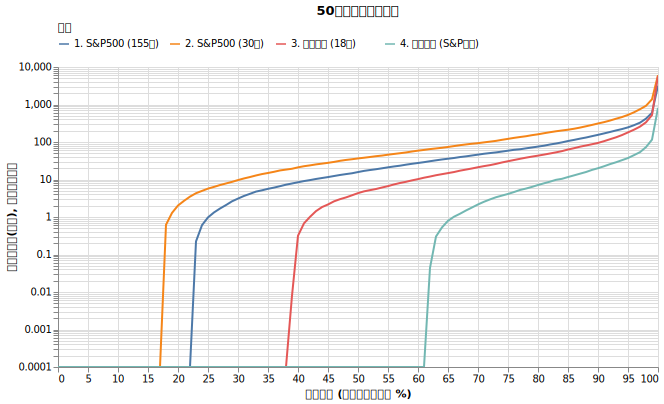
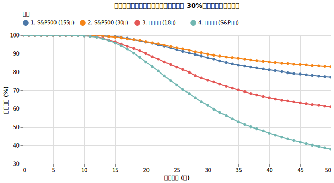

# S&P500 vs. オルカン ~ 取り崩し戦略に差はあるのか？

S&P500と全世界株式（オルカン）。資産形成期においてはこの二つのどちらを選んでも大きな差はないと言われます。しかし、資産を取り崩しながら生活する「リタイア後」のフェーズにおいては、その僅かな特性の違いが生存確率に無視できない影響を与える可能性があります。

本記事では、最新の統計モデルと150年以上にわたる歴史データを駆使し、取り崩し戦略における「S&P500 vs. オルカン」の真実をシミュレーションによって解き明かします。

## S&P500 とオルカン

インデックス投資の2大投資先といえば S&P500 とオルカンでしょう。

|商品名|連動指数|信託報酬|年率リターン|年率リスク|Yahoo ファイナンス|
|---|---|--:|--:|--:|---|
|eMAXIS Slim 全世界株式オール・カントリー（通称：オルカン）|MSCIオール・カントリー・ワールド・インデックス (ACWI)|0.05775%|22.93%|15.61%|[リンク](https://finance.yahoo.co.jp/quote/0331418A)|
|eMAXIS Slim 米国株式（S&P500）|S&P500指数|0.0814%|20.52%|13.29%|[リンク](https://finance.yahoo.co.jp/quote/03311187)|

<small>信託報酬・リターン・リスクの値は 2026/03/24 時点の過去5年の実績のものです。</small>

==資産形成期において==「どっちがいいの？」という議論はとてもよく出てきますが、「正直どちらでも良い」というのが私の意見です。どちらも信託報酬が安く、時価総額加重平均を使っていて分散投資がよくできています。パフォーマンスもお互い強く相関しています。

[米国株（S&P500など）と全世界株式、どちらのインデックスファンドがよいのでしょうか? | 普通の人が資産運用で99点をとる方法とその考え方](https://hayatoito.github.io/2020/investing/#0c60) がわかりやすい解説だと思います。

==しかし、取り崩し戦略においては、僅かな差が生存確率に左右するという例をたくさん見てきました。==
詳しくは[「取り崩し期と積立期は全く違う：収益率配列のリスク」](sequence.md)をご覧ください。

## 株価予測に用いるモデル・データの長さ

S&P500 やオルカンの将来の値動きを予想しようにも、様々な効果を加味しないといけません。この章は細かいので飛ばしてもらっても構いません。

??? question "日次データか月次データか → 月次データ"

    日々の株価の値動きは完全にランダム（独立）ではなく、前の日の影響を強く受けやすい性質があります。例えば「大きく動いた翌日はまた大きく動きやすい」といった**ボラティリティ・クラスタリング**と呼ばれる現象（GARCHなどのモデルで扱われます）といったミクロな構造（ノイズ）が詰まっています。月次データを使うことで、こうした日次のノイズが相殺・緩和されることを期待します。また50年のシミュレーションの計算コストを大幅に減らすことができます。

??? question "対数正規分布を使うか、ファットテールを捉えられるモデルを使うか → ファットテール"

    株価の対数リターンのデータは、正規分布を想定したときには決して起きなさそうな暴落をたくさん含んでいます。[ファットテールの影響](fat_tails.md)の回で紹介した通り、対数正規分布モデルを使ったシミュレーションが楽観的な結果を出してしまうので、ファットテールを扱えるモデルを用いたいです。

??? question "何年分のデータを使って計算するか → 複数試す"

    S&P500 は 1871年02月以降の月次のデータと、1989年以降の日次のデータが存在します。(155年分)

    ファットテールを考えるなら、大恐慌やブラックマンデーなどの暴落が入っている長期間のデータを使ったほうがよいと考えます。もちろん「金本位制」や「馬車と鉄道」などの時代のリターンを今に当てはめていいのか、という疑問はありますが、50年のシミュレーションをする場合には、そういう時代の構造変化自体も今後起きうるイベントとみなせることにメリットがあるかと思います。

    比較として1996~2025年の30年間から得たモデルも使ってみようと思います。

    対して、オルカンは 2008/03/28以降の日次のデータが存在します。(18年分)

    オルカンに関しては18年から得たモデルとともに、もう一つ、S&P500 との相関を取ることで、そこから残差を補完するモデルを使ってみます。狙いとしては、155年分のデータから得られるファットテールの再現をオルカンでもすることです。

??? question "Mean-Reverting GBM を使うべきか → 使わない"

    平均回帰型幾何ブラウン運動（MR-GBM）は、価格が上がりすぎたら下がり、下がりすぎたら上がるといった「中心（平均）に戻ろうとする力」を考慮したモデルです。詳細は [Mean Reverting GBM | つくだに | note.com](https://note.com/golden_inago/n/nf3b36fbe44dd) で詳しく解説されています。

    実際に今回のデータ（S&P500の150年分、30年分、ACWIの18年分）を使って月次ベースでのフィッティングを試みたところ、いずれのケースにおいても**有意な平均回帰性は検出されませんでした**。

    この結果から、今回のシミュレーションでは無理に複雑な平均回帰モデルを導入せず、標準的なランダムウォーク（幾何ブラウン運動）をベースに据えるのが妥当であると判断しました。

## シミュレーション

これまでの検証を踏まえ、ファットテールを考慮したモデルを用いて、S&P500とオルカンの取り崩しシミュレーションを比較します。

!!! info "シミュレーションの設定"
    * **初期資産**: 1億円
    * **投資先**: ==S&P500モデル2つ、オルカンモデル2つのうち一つに100%投資==
    * **為替リスク**: あり（ドル円 リターン0%, リスク10.53% を合成）
    * **取り崩し額**: 毎年400万円（物価連動）
    * **物価上昇率**: 年率2%固定
    * **譲渡所得税**: 20.315%
    * **信託報酬**: S&P500: 0.0814%, オルカン: 0.05775%

歴史的なデータ期間の違いや近似モデルがどう影響するかを見るため、以下の4パターンを比較します。

### 検証する4つのモデルと年率統計（為替・信託報酬合成前）

| モデル | 対象期間 | 分布モデル | 年率期待リターン | 年率リスク |
| :--- | :--- | :--- | ---: | ---: |
| **1. S&P500 (155年)** | 1871〜2025 | genlogistic | 10.34% | 15.00% |
| **2. S&P500 (30年)** | 1996〜2025 | genlogistic | 11.70% | 17.21% |
| **3. オルカン (18年)** | 2008〜2025 | johnsonsu | 9.55% | 18.41% |
| **4. オルカン (S&P近似)** | 155年相当 | Correlation | 7.05% | 15.77% |

??? info "年率期待リターン・リスクは推定値です"

    月次リターンの分布モデルから10万回のサンプリング（乱数生成）を行い、得られた月次リターンを年率に換算して算術平均と標準偏差を計算しています。

??? info "モデル4の近似方法"

    モデル4は、重複期間（2008〜2025年）の S&P500 と オルカンの相関関係（回帰式）を求め、それを S&P500の155年データ（モデル1）に当てはめることで擬似的にオルカンの長期データを再現したモデルです。

    $$ \text{(オルカンの対数リターン)} = 1.0269 \times \text{SP500 (モデル1)の対数リターン} - 0.002907 + \text{Noise} $$

    ノイズ（Noise）部分には、実際の残差の分布に最も適合した Dweibull分布（二重ワイブル分布）を採用しています。

ちなみによくオルカンのリターン・リスクは {7%, 15%} と言われれています。出典がどこはよくわかりませんが、モデル4. がそれに近い値を出しました。

## 結果

5000回行った取り崩しのシミュレーションの結果は以下の通りです。

{!data/sp500_acwi/sp500_vs_acwi_result.md!}

グラフで見ると以下のようになります。

## 考察

シミュレーション結果および統計モデルの数値から、いくつかの発見がありました。

### モデル4（近似オルカン）の破産確率が高い理由

!!! warning "モデル4の50年破産確率は 64.7% と、他のモデルに比べて悪化しています。"

この主な要因は「期待リターンの低さ（7.05%）」にあります。

これは以下のように解釈できます。

*   **直近30年のS&P500は155年平均より高かった:** モデル2（30年）のリターンが11.70%であるのに対し、モデル1（155年）は10.34%と落ち着いています。
*   **近似モデル(回帰モデル)の解釈:** オルカンのデータが存在する直近18年間において、S&P500はオルカンよりも年率で約3.5%高いリターンを出していました（回帰式の切片 (-0.002907) がマイナスであることに相当）。
*   この相関関係を、そのまま155年の長期（リターンが低い時代も含む 10.34%）に適用したため、オルカンの長期リターンが 10.34% - 3.5% ≒ 7% として算出されました。

### 分散投資によるボラティリティ低減の有無

!!! warning "「オルカンは分散投資をしているため、S&P500単体よりもボラティリティが低くなる」と良く言われますが、データは異なる傾向を示しています。"

1. モデル2（S&P500直近30年: 17.21%）とモデル3（オルカン直近18年: 18.41%）を比較すると、計測期間においてオルカンの方がボラティリティが大きくなっています。
2. モデル4の回帰式（$ACWI = 1.0269 \times SP500 + \dots$）の回帰係数が1を超えています。これはS&P500の変動幅に対してオルカンの変動幅が増幅されていることを示します。

この結果は、「分散効果」よりも「非米国市場のボラティリティの高さ」が影響していると考えられます。米国大型株（S&P500）の市場流動性や基盤が相対的に強固であるため、他国の株式をポートフォリオに組み込むことが、結果として全体のボラティリティを上げる要因として働いています。

## 取り崩し期におけるオルカンとS&P500の比較

「オルカンの方が分散されているのでリスクが低い」という考え方は、資産形成期においては実用上問題ありません。しかし、取り崩し期においては前提が変わります。

取り崩し期に影響を与えるのはボラティリティの高さ（[収益率配列のリスク](sequence.md)）です。今回のデータが示すように、オルカンはS&P500よりもボラティリティが高い傾向にあります。ボラティリティが高い資産を取り崩すと、下落局面で多くの口数を売却することになり、その後の回復が遅れます。

分散されているという理由だけでオルカンを選択した場合、取り崩しフェーズにおいて想定以上の破産確率となる可能性があります。

## S&P500とオルカンのどちらを選ぶべきか

!!! danger "今回のシミュレーション結果でわかることは、「どのモデルを今後の予測として信じるか」で結果が大きく変わるということです。"

S&P500でも、30年のデータを信じるか、155年のデータを信じるかで生存確率が変わります。オルカンの18年を元にした予測を信じるか、155年用に補完するかでも大きく異なりました。採用する期間やモデルによって結果が大きく異なります。==最終的には「どのデータを今後の予測として信じるか」という判断になります。==

ここ最近30年の米国市場の好調が今後も続くと考えるのであれば、モデル2（S&P500 30年）の低い破産確率を参考にしたらよいでしょう。ただし、直近30年のS&P500は155年の長期平均よりも高いリターンを出していたという事実は認識しておく必要があります。

一方で、S&P500への集中投資にはリスクもあります。モデル4（オルカン近似）の結果は、「直近18年間は米国が他国よりも高いリターンを出していた」というデータに基づいて計算されています。今後50年の間に時代構造が変化し、新興国や他地域が米国のリターンを上回る時代が訪れた場合、S&P500単体のボラティリティが上昇し、リターンが低迷する可能性があります。

過去の実績を重視してS&P500を選択する戦略も、将来の米国市場の低迷に備えてオルカンを選択する戦略も、それぞれに根拠があります。取り崩しにおいては、自身の想定するシナリオに合わせたモデルを選び、必要に応じて現金の比率を高めるなどの対策を併用することが重要です。