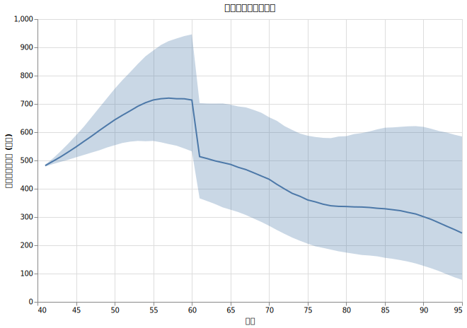
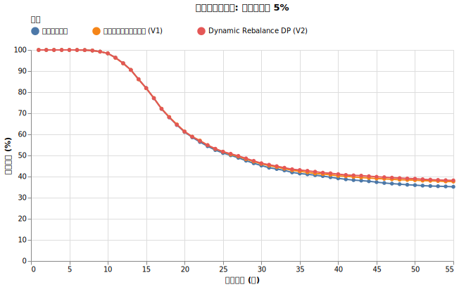
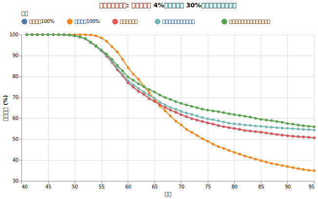
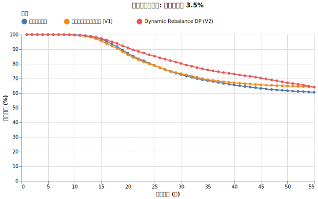
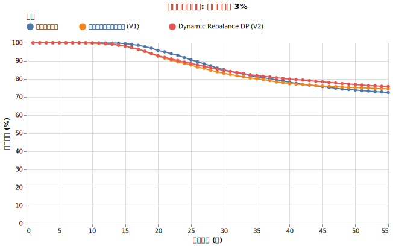
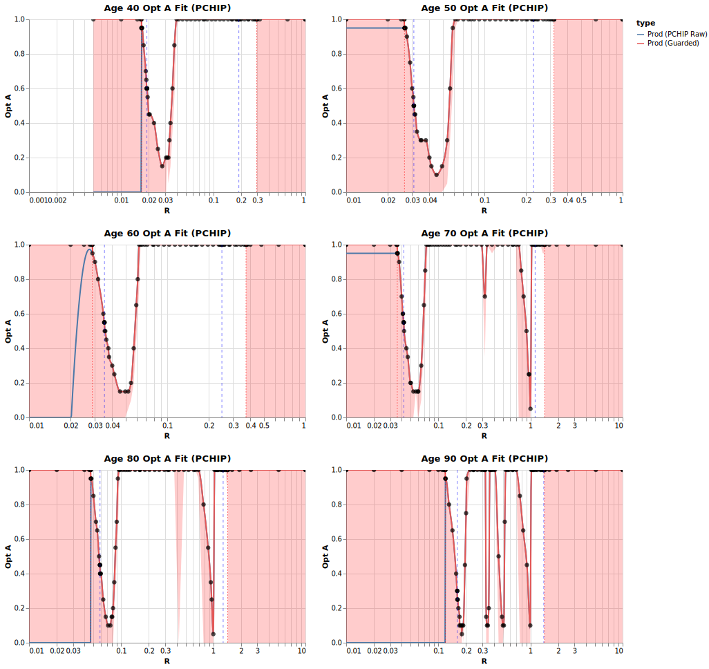
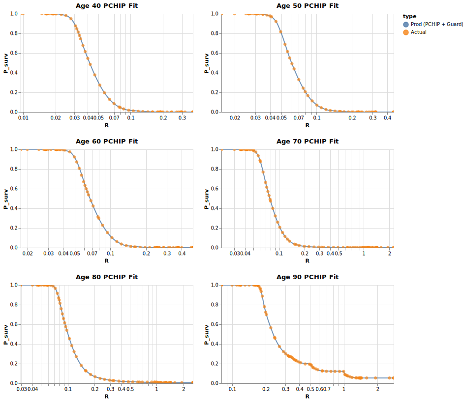

# ライフプランに基づく動的資産配分（進化版ダイナミックリバランス）

<!--
DO NOT DELETE:

$ src/dynamic_rebalance_dp_grid_main.py --exp_name dp_comp
$ src/dynamic_rebalance_dp_grid_main.py --exp_name dump_withdraw
$ src/analyze_dynamic_rebalance_dp_grid_main.py --exp_name dump_withdraw

-->

[高齢になると支出が減る](retired_spending.md)で紹介したように、60歳を超えると国民年金保険料の支払いが終わったり、早めの年金受給ができたり、そもそも消費支出が減少していきます。この事実を知っておくと、以前紹介した[最適配分を繰り返す(ダイナミックリバランス)](dynamic_rebalance.md)もより賢くできると思い、進化版の戦略を作りました。

アイデアの肝としては、例えば「60歳まで資金が枯渇しなければかなり余裕になる」という事実がわかっている場合、それを当面の目標に据えて全世界株式（オルカン）と無リスク資産の割り振りを行ったほうがお得だという考え方です。逆に、60歳にどういう状態であれば枯渇しそう、というのが分かっていれば事前にそれを避ける戦略を取れるかも、という期待があります。

## 戦略の概要

まず前提として、目標年数までの必要取り崩し額 (= 支出 - 収入) を現在の物価のままで見積もります。

* 基本となる消費支出がどう推移するか、先に全部計画を立てます
    * 生活費、子供への支出、旅行、贅沢など、医療など全て先に確定させます
    * 何歳から年金を開始するか、他にどういう収入があるかも確定させます

毎年年始にオルカンと無リスク資産の割り当てを変えますが、将来の必要取り崩し額の推移を基にして、自分のプランに対して最適の割り当て関数をシミュレーションで求めます。

$N$ を年齢として、$X_{N}$ を $N$歳開始時の税抜き総資産、$Y_{N-1}$ を$N-1$歳の時の取り崩し額とします。$N$歳開始時には $N$歳での取り崩し額は確定していません。これは物価上昇率が1年でどう推移するかわかっていないためです。そこで

$$Y_{N} = Y_{N-1} * (\text{想定の取り崩し額の伸び}) * (\text{保守的に見積もった物価上昇率})$$

を求め、

$$N\text{歳開始時のオルカンの比率の最適割り当て} = A(\text{年齢}=N, \text{悲観的支出率}=\frac{Y_N}{X_N})$$

を計算してくれるような 割り当て関数 $A()$をシミュレーションで求めます。[アルゴリズムは複雑なので付録として最後に記載しました](#付録-割り当て関数のアルゴリズムの詳細)。動的計画法に興味がある方はご参照ください。

## 実験

!!! info "シミュレーション共通条件"

    * **シミュレーション期間**: 55年 (40歳〜95歳)
    * **投資先**:
        * オルカン ([ファットテールを考慮し](fat_tails.md)、[S&P500から補完した悲観的なモデル](sp500_vs_acwi.md), [信託報酬 0.05775%](trust_fee.md))
        * ゼロリスク資産 [(利回り4%)](zero_risk.md)
    * **為替リスク**: [USDJPY (期待リターン0%, リスク10.53%)](forex.md)
    * **インフレ率**: [AR(12)粘着モデル (平均1.77%)](cpi.md)
    * **税率**: [20.315%](tax.md)
    * 40歳にアーリーリタイアした想定
        * **年金保険料**: 40歳から60歳まで国民年金保険料を支払い (約20.4万/年)。
    * **年金受給**: 60歳から前倒し受給を開始。
        * 基礎年金 + 厚生年金 = 年約99.4万円 (前倒し24%減少)
        * マクロ経済スライドを考慮

先に支出を決める前提なので、2人以上の世帯の国民平均支出推移の[グラフの緑の点線](retired_spending.md#年齢ごとの支出の推移のグラフ)に沿うような支出を想定します。

今回シミュレーションする実際の取り崩し額(=支出 - 年金収入)の物価上昇率を考慮した後の推移グラフは以下のようになります。真ん中の線は中央値、上下のエリアは25, 75パーセンタイルを表しています。

60歳で急に取り崩し額が減るのは国民年金保険料の支払いが終わり年金の受給を開始するからです。

物価上昇のボラティリティを[粘着モデル](cpi.md#実験3インフレの粘着性自己相関の影響)で反映させているため、例えば90歳の時に、運が悪けば取り崩し額が年620万になっているかもしれないし、運が良ければ140万になっているかもしれません。

比較するのは以下の戦略です。

1. **オルカン100%**:

    常にオルカン100%にします。

2. **無リスク資産100%**:

    常に無リスク資産100%にします。税引き後の実質3.8%の配当で生きていける「限界年数」を調べます。

3. **固定最適比率**:

    初年度の時点での目標年数と支出割合から得られる最適なリバランス比率を計算し、その比率は固定のまま毎年リバランスを行う戦略。

4. **ダイナミック最適比率**:

    ==ライフプランを知らずに、「年支出が固定・物価上昇率が一定」という想定== で得られた最適な比率に基づき、1年ごとにリバランスを行う。その時点での残りの目標年数と現在の支出割合から最適な比率を再計算し、それに合わせて毎年ポートフォリオを変更する戦略。

5. **ライフプランに基づくダイナミック最適比率 (今回の手法)**:
    
    ==ライフプランを基に得られた最適な比率== に基づき、1年ごとにリバランスを行う。その時点での残りの目標年数と現在の支出割合から最適な比率を再計算し、それに合わせて毎年ポートフォリオを変更する戦略。

このうち 2 と 3 は[最適配分を繰り返す](dynamic_spending.md)の回で出てきたものと一緒です。ただし、今回は支出が年齢ごとに上がる時期と下がる時期があるところが違います。

## 結果

物価上昇率考慮前の支出のプランが固定されている前提のため、40歳の初年度の年支出 482万円が固定となっています。

そこで初年度の支出率のみを変化させて比べてみました。これは初年度の総資産を変えることと同じです。

### 「5%ルール」の場合 (総資産 9642万の場合)

結果はこうなりました。20倍の資産ではそもそも高い生存確率は見込めません。

この場合、固定最適比率はオルカン100%で行くことになるので青の線は赤と一致します。

40~55歳で支出自体が増えるので、前半でジリ貧になり、リバランス戦略に関わらず生存確率が低下していっていると想定されます。

### 「4%ルール」の場合 (総資産 1億2052万の場合)

結果はこうなりました。

この場合でも、固定最適比率はオルカン100%で行くことになるので青の線は赤と一致します。以前の「ライフプランを無視した最適リバランス」(水色)よりも「ライフプランを考慮した最適リバランス」(緑)の方が全体的に上回っています。

### 「3.5%ルール」の場合 (総資産 1億3774万の場合)

結果はこうなりました。

水色と緑の比較が注目ポイントです。「ライフプランを考慮した最適リバランス」が特に60~85歳のあたりの生存確率をあげていることがわかります。

ちなみに無リスク資産だけにしても95歳までで50%生きられるのをどう見るかですが、無リスク資産の配当3.8%に対し、3.5%の支出と平均1.77%の物価上昇率で徐々に目減りしているのと、70歳以降支出が減っていることが影響しています。50%生きられているのは物価がそこまで上昇しなかった場合と想定されます。

### 「3%ルール」の場合 (総資産 1億6070万の場合)

結果はこうなりました。

「ライフプランを考慮した最適リバランス」が特に60~85歳のあたりの生存確率をあげていることがわかります。

グラフの形は似ていますが、描画範囲が変わっていて、そもそもの確率が上がっています。

## 考察

将来の支出・収入が(現在の価値で)決まっている場合、たとえ物価上昇率やインデックスにボラティリティが有ったとしても、目標年齢に合わせた最適配分率を逆算で計算できることがわかりました。

結果として「将来の支出推移を考慮する最適配分」の方が「考慮しない最適配分」よりも、取り崩し額が下がる60歳の生存確率を上げ、その効果が85~90歳まで伸びていることがグラフから見られます。

これは「将来支出が減ると分かっているから無理して早めにリスクを取らなくて良い」などの戦略を自動的に織り込んでいると考えられます。

## まとめ

今回の発見は取り崩し戦略での重要なことを問いかけてくれていると思います。

!!! tip "ライフプランを先に考える重要性"

    例えばお小遣いを貯めて何か買い物をする時、「あれを買いたいから、後何円貯めないといけなくて、後何か月待たないといけない」という計画を立てると思います。つまり、買いたい物が決まって、戦略が決まります。

    アーリーリタイアの取り崩し戦略も同じだと思います。「どういう生活をしたいか」、具体的に「何歳の時にいくらくらい支出するか」というライフプランが決まると、そこから逆算していくら必要かが分かるという手法があるよ、というのが今回の発見です。物価上昇率やインデックスの値動きなどのせいで、最終的な戦略は「確率付き」になってしまうのがお小遣いとの違いです。

    4%ルールは「年支出の何倍の資産を稼いだら後は大丈夫」という考え方ですが、それは未来をあまり考えなくなってしまう作戦だと思います。本来そうではなく、「いつにこういう支出があるから運用込みで現時点でいくら必要」という視点でいきたいですね。

## 付録: 割り当て関数のアルゴリズムの詳細

この戦略の裏側では、**動的計画法**という手法を用いて、将来の全期間を見据えた現在の最適解を計算しています。

### 1. 逆算による最適化（逆行誘導）

通常のシミュレーションは「今」から「将来」に向かって進みますが、このアルゴリズムは逆に **「95歳」から「40歳」へと遡りながら** 各年齢での最適割り当てを導き出します。

1.  **最終年（95歳）の判定:**
    
    95歳開始時点の「予測支出率 $R$」と「オルカン比率 $A$」のあらゆる組み合わせをテストします。

    各組み合わせごとに、2000パターンの市場変動・物価変動（パス）で12ヶ月間の運用をシミュレートします。この際、その年齢で予定されている具体的な支出や年金収入（物価スライドを織り込み済み）を反映させます。

    シミュレーションの結果、資金が枯渇していなければ「生存」とし、生存確率を求めます。その後、各支出率ごとに

    * $A_N(R)$: 支出率に対して最適な割り当てを返す関数
    * $P_N(R)$: 支出率に対して生存確率を返す関数

    が求まります。

2.  **年齢ごとの再帰的な計算:**

    次に94歳に対して、同じくその時の「支出率 $R$」と「オルカン比率 $A$」のあらゆる組み合わせを同様にシミュレーションします。

    そうすると、94歳が終わった瞬間の総資産 $X_{95}$ と94歳の取り崩し額 $Y_{94}$ が求まります。

    実際にはそこから $Y_{95}$ を予測するのですが、CPI の平均と分散からいくつか CPI が平均よりも上になる場合も下になる場合も含めサンプル ($\text{CPI}_j$)を取り、

    $$Y_{95} = Y_{94} \times (\text{予め決めた 94→95歳の取り崩し額の変化率}) \times \text{CPI}_j$$

    とします。そして、先程求めた $P_{95}(R)$ を使い

    $$P_{94}(R) = \frac{\sum_{i=1}^{2000} \sum_{j} Prob(\text{CPI}_i) * P_{95} (Y_{95,i} / X_{95,i})}{2000}$$

    のようにシミュレーションで求めます。つまり「94歳のシミュレーションを行った結果95歳初期の状態はこうなるから、その確率はさっき求めたものを使う」という処理を行うことで「その1年を生き延びた後、さらに寿命（95歳末）まで生存する確率」が導かれます。

    そして結果を支出率 $R$ ごとにまとめることで、$R$ に対して最も高い生存確率を実現するオルカン比率 $A$ を「最適解」として記録します。その結果 $A_{94}(R)$ と $P_{94}(R)$が求まります。
    
3.  **再帰の終了:**

    このプロセスを35歳まで繰り返すことで、将来のあらゆるライフイベント（定年、年金開始、支出の増減）を織り込んだ、各年齢における最適な	「最適割り当て表」が完成します。

### 3. 高精度なモデル化と補間

シミュレーション結果を実用的な関数に落とし込むため、以下の工夫を凝らしています。

*   **単調性を保つ補間（PCHIP）:**

    得られる $P_N$ はやや分かりやすい単調減少グラフになりますが、$A_N$ は非線形な複雑な形になります。そのため、PCHIPを用い、生データから補完する方法を用いています。

*   **適応的サンプリング:**

    全探索は時間がかかるので、$A$ の値が劇的に変わる「崖」のような領域を自動で見つけ出し、重点的にシミュレーションを行うことで、計算量を抑えつつ高い精度を実現しています。

### 4. 「絶対成功」の判定

もし無リスク資産の運用益だけで一生の支出をカバーできるほど資産が積み上がった場合、それは「投資の上がり」です。これも支出を先に決めておくことで先に求めることが可能になります。

*   **倍率 $M_N$ の計算:** 「今年の支出の何倍あれば、無リスク資産だけで一生生存できるか」という倍率 $M_N$ をDPの過程で算出します。
*   **パス依存のガード:** シミュレーション実行中、そのパスの実際のインフレ状況に合わせて必要な資産額をリアルタイムで判定します。
*   **余剰資金の最大活用:** 「逃げ切り」に必要な分を確保した上で、余った資金は積極的にオルカンに配分し、さらなる資産の増大（遺産など）を狙います。

## 付録: 最適関数の結果の複雑さ

40~90歳の時点での「何％ルールを取ったときの最適オルカン割り当て率」($A_{N}$) は以下のようになりました。

40~90歳の時点での「何％ルールを取ったときの生存確率」($P_{N}$) は以下のようになりました。

例えば、各左上のグラフに注目すると

* 40歳の時に3% ルール (総資産1億6800万)でスタートする時、オルカンへの最適配分は20%。それで開始した場合の予想95歳生存確率は90%くらい。
* 40歳の時に4% ルール (総資産1億2600万)でスタートする時、オルカンへの最適配分は100%。それで開始した場合の予想95歳生存確率は58%くらい。

というデータが得られていることがわかります。

「ある時点ではオルカン100%でいいけど、この支出率の時だけはオルカン率を下げないといけない」という複雑なルールが導かれていることがわかります。

ちなみにここで得られた $P$ の関数は、実際にシミュレーションした時の生存確率とは若干異なります。主な原因はオルカン売却時の譲渡所得税の取り扱い（特に取得費の計算）が後ろ向き動的計画法ではうまく扱えないためです。
