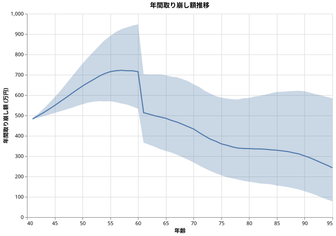
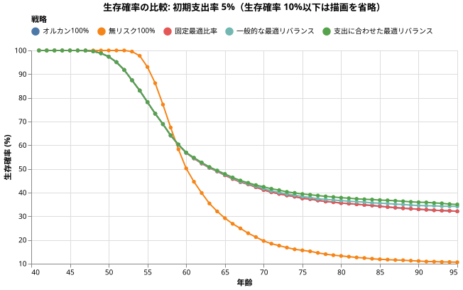
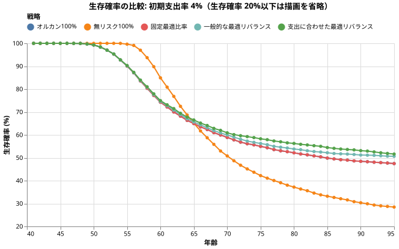
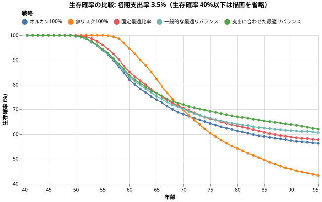
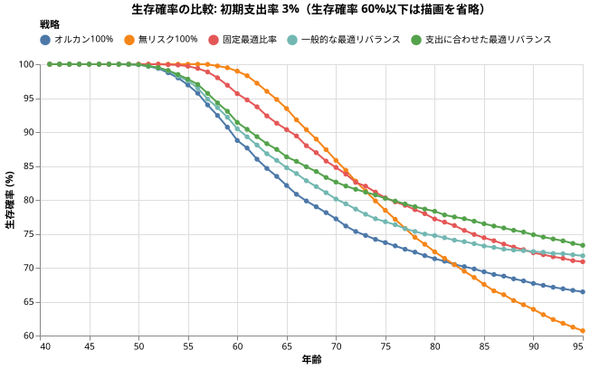
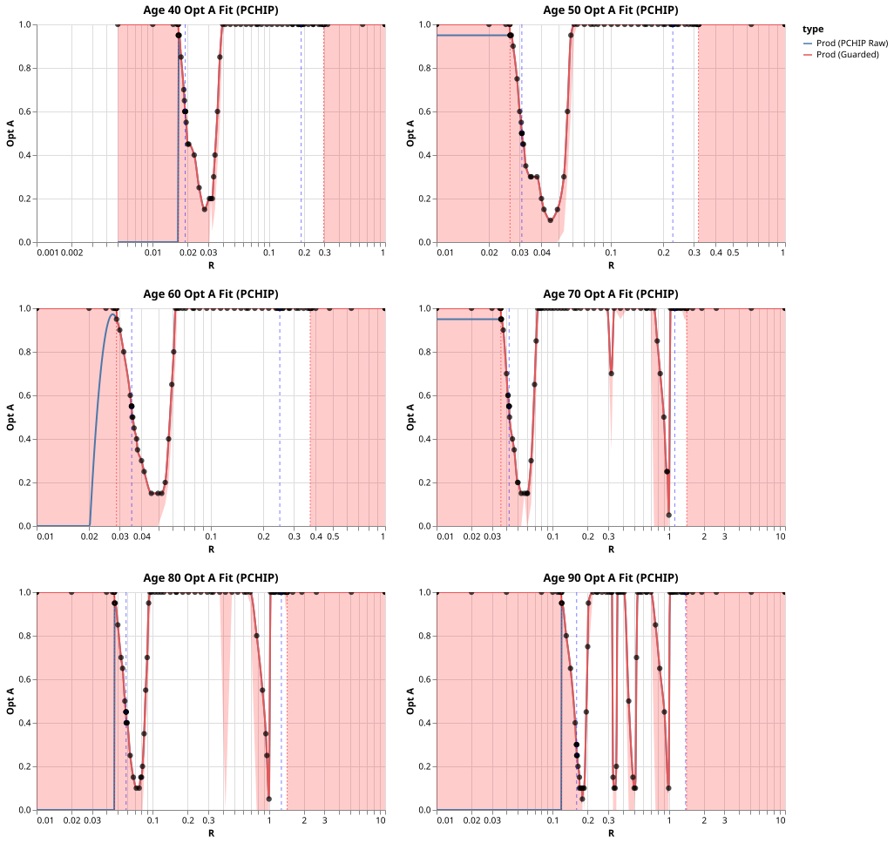
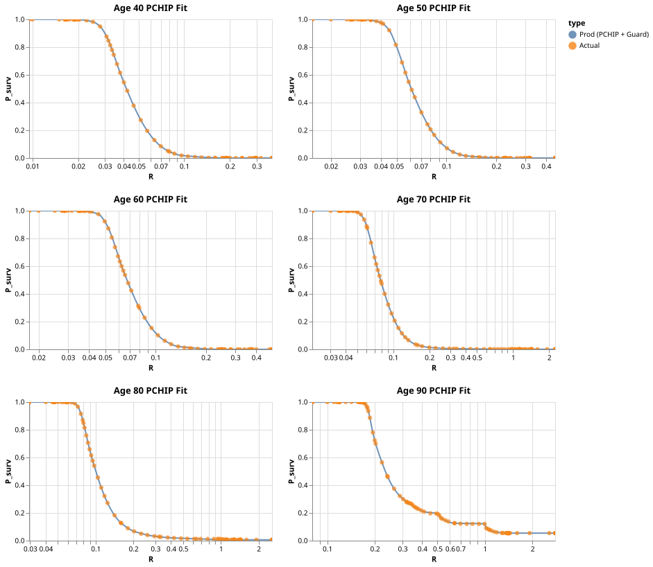

# ライフプランに基づく動的資産配分（進化版ダイナミックリバランス）

<!--
DO NOT DELETE:

$ python3 src/dynamic_rebalance_dp_grid_main.py --exp_name dp_comp
$ python3 src/dynamic_rebalance_dp_grid_main.py --exp_name dump_withdraw
$ python3 src/analyze_dynamic_rebalance_dp_grid_main.py --exp_name dump_withdraw

-->

[高齢になると支出が減る](retired_spending.md)で紹介したように、60歳を超えると国民年金保険料の支払いが終わったり、早めの年金受給ができたり、そもそも消費支出が減少していきます。この事実を知っておくと、以前紹介した[最適配分を繰り返す(ダイナミックリバランス)](dynamic_rebalance.md)もより賢くできると思い、進化版の戦略を作りました。

アイデアの肝としては、例えば「60歳以降は年金保険料の支払いが終わり、年金の受給も開始することができるため、かなり余裕になる」というライフプランがわかっている場合、「60歳の時点でこれくらいの資産状態でありたい」ということが計算できるのではないか、という考えです。それが分かれば、60歳のチェックポイントに向けて全世界株式（オルカン）と無リスク資産の割り振りを行ったほうがお得だという考え方です。逆に、60歳にどういう状態であれば枯渇しそう、というのが分かっていれば事前にそれを避ける戦略を取れるかも、という期待があります。

## アルゴリズムの概要

正確なアルゴリズムに関しては[付録](#付録-割り当て関数のアルゴリズムの詳細) に記載しました。この章ではその考え方・気持ちだけ抜粋します。

まず前提として、今回は95歳開始時の生存確率を上げる最適戦略を考えます。

==そして、そのために95歳までの必要取り崩し額 (= 支出 - 収入) を現在の物価のまま(実質価格)で見積もります。==

* 基本となる消費支出がどう推移するか、先に全部計画を立てます
    * 生活費、子供への支出、娯楽、医療など全て先に確定させます
    * 何歳から年金を開始するか、他にどういう収入があるかも確定させます

**その状態で「94歳開始時点にどうありたいか」を計算します。**

「94歳開始時点の総資産が $X_{94}$ の時にその資産の $A_{94}$ %をオルカンに割り当てると生存できる確率は何％か」を様々な $X_{94}$, $A_{94}$ に対して1年分だけシミュレーションを行います。そうすると 94歳時の状況に応じた最適な割り当て戦略や、その戦略を取った後の生存確率が求まります。(厳密には物価上昇率が絡みますが、付録を参照して下さい)。

**その次に「93歳開始時点にどうありたいか」を計算します。**

「93歳開始時点の総資産が $X_{93}$ の時にその資産の $A_{93}$ %をオルカンに割り当てると生存できる確率は何％か」を計算したいわけです。様々な $X_{93}$, $A_{93}$ に対して1年分だけシミュレーションを行うと、94歳開始時の資産状況がわかります。それがわかれば、先程の「94歳時の状況」の計算結果を使って生存確率が求まります。これにより、93歳時の状況に応じた最適な割り当て戦略や、その戦略を取った後の生存確率が求まります。

**その次に「92歳開始時点にどうありたいか」を計算します。**

この計算を繰り返すことで、現在の年齢までの全ての年齢で最適な割り当て戦略が求まる仕組みです。

!!! success "この仕組みの強み"

    この仕組みの強みは、例えば「60歳から年金保険料の支払いがなくなり老齢年金の受け取りを開始するため、取り崩し額が急に減る」といった場合に、59歳の最適割り当てが、その60歳の状況に応じて計算できる点です。逆に言えば、将来の支出が分かっているからこそ「59歳で支出率が高いからと言って悲観的になるべきではない。60歳以降支出が減るから、いまからでもゼロリスク資産の割り当てを増やすべき」などの戦略が取れるようになります。

!!! failure "この仕組みの弱み"

    逆に弱みは、前もって全ての収入や支出を確定しないといけないことと、計算に時間がかかることです。だいたい1つのライフプランに対して1年分の計算に10秒かかるため、45歳から95歳開始までの最適割り当てを計算するのに10分くらいかかります。

## 実験

!!! info "シミュレーション共通条件"

    * **シミュレーション期間**: 55年 (40歳〜95歳)
    * **投資先**:
        * オルカン ([ファットテールを考慮し](fat_tails.md)、[S&P500から補完した悲観的なモデル](sp500_vs_acwi.md), [信託報酬 0.05775%](trust_fee.md))
        * ゼロリスク資産 [(利回り4%)](zero_risk.md)
    * **為替リスク**: [USDJPY (期待リターン0%, リスク10.53%)](forex.md)
    * **インフレ率**: [AR(12)粘着モデル (平均1.77%)](cpi.md)
    * **税率**: [20.315%](tax.md)
    * 40歳にアーリーリタイアした想定
        * **年金保険料**: 40歳から60歳まで国民年金保険料を支払い (約20.4万/年)。
    * **年金受給**: 60歳から繰上げ受給を開始。
        * 基礎年金 + 厚生年金 = 年約99.4万円 (前倒し24%減少)
        * マクロ経済スライドを考慮

先に支出を決める前提なので、2人以上の世帯の国民平均支出推移の[グラフの緑の点線](retired_spending.md#年齢ごとの支出の推移のグラフ)に沿うような支出を想定します。

今回シミュレーションする実際の取り崩し額(=支出 - 年金収入)の物価上昇率を考慮した後の推移グラフは以下のようになります。真ん中の線は中央値、上下のエリアは25, 75パーセンタイルを表しています。

60歳で急に取り崩し額が減るのは国民年金保険料の支払いが終わり年金の受給を開始するからです。

物価上昇のボラティリティを[粘着モデル](cpi.md#実験3インフレの粘着性自己相関の影響)で反映させているため、例えば90歳の時に、運が悪けば取り崩し額が年620万になっているかもしれないし、運が良ければ140万になっているかもしれません。

比較するのは以下の戦略です。

1. **オルカン100%**:

    常にオルカン100%にします。

2. **無リスク資産100%**:

    常に無リスク資産100%にします。税引き後の実質3.8%の配当で生きていける「限界年数」を調べます。

3. **固定最適比率**:

    初年度の時点での目標年数と支出割合から得られる最適なリバランス比率を計算し、その比率は固定のまま毎年リバランスを行う戦略。

4. **ダイナミック最適比率**:

    ==ライフプランを知らずに、「年支出が固定・物価上昇率が一定」という想定== で得られた最適な比率に基づき、1年ごとにリバランスを行う。その時点での残りの目標年数と現在の支出割合から最適な比率を再計算し、それに合わせて毎年ポートフォリオを変更する戦略。

5. **ライフプランに基づくダイナミック最適比率 (今回の手法)**:
    
    ==ライフプランを基に得られた最適な比率== に基づき、1年ごとにリバランスを行う。その時点での残りの目標年数と現在の支出割合から最適な比率を再計算し、それに合わせて毎年ポートフォリオを変更する戦略。

このうち 2 と 3 は[最適配分を繰り返す(ダイナミックリバランス)](dynamic_spending.md)の回で出てきたものと一緒です。ただし、今回は支出が年齢ごとに上がる時期と下がる時期があるところが違います。

## 結果

物価上昇率考慮前の支出のプランが固定されている前提のため、40歳の初年度の年支出 482万円が固定となっています。

そこで初年度の支出率のみを変化させて比べてみました。これは初年度の総資産を変えることと同じです。

### 「5%ルール」の場合 (総資産 9642万の場合)

結果はこうなりました。20倍の資産ではそもそも高い生存確率は見込めません。

この場合、固定最適比率はオルカン100%で行くことになるので青の線は赤と一致します。

40~55歳で支出自体が増えるので、前半でジリ貧になり、リバランス戦略に関わらず生存確率が低下していっていると想定されます。

### 「4%ルール」の場合 (総資産 1億2052万の場合)

結果はこうなりました。

この場合でも、固定最適比率はオルカン100%で行くことになるので青の線は赤と一致します。以前の「ライフプランを無視した最適リバランス」(水色)よりも「ライフプランを考慮した最適リバランス」(緑)の方が全体的に上回っています。

### 「3.5%ルール」の場合 (総資産 1億3774万の場合)

結果はこうなりました。

水色と緑の比較が注目ポイントです。「ライフプランを考慮した最適リバランス」が特に60~85歳のあたりの生存確率をあげていることがわかります。

ちなみに無リスク資産だけにしても95歳までで50%生きられるのをどう見るかですが、無リスク資産の配当3.8%に対し、3.5%の支出と平均1.77%の物価上昇率で徐々に目減りしているのと、70歳以降支出が減っていることが影響しています。50%生きられているのは物価がそこまで上昇しなかった場合と想定されます。

### 「3%ルール」の場合 (総資産 1億6070万の場合)

結果はこうなりました。

「ライフプランを考慮した最適リバランス」が特に60~85歳のあたりの生存確率をあげていることがわかります。

グラフの形は似ていますが、描画範囲が変わっていて、そもそもの確率が上がっています。

## 考察

将来の支出・収入が(現在の価値で)決まっている場合、たとえ物価上昇率やインデックスにボラティリティが有ったとしても、目標年齢に合わせた最適配分率を逆算で計算できることがわかりました。

結果として「将来の支出推移を考慮する最適配分」の方が「考慮しない最適配分」よりも、取り崩し額が下がる60歳の生存確率を上げ、その効果が85~90歳まで伸びていることがグラフから見られます。

これは「将来支出が減ると分かっているから無理して早めにリスクを取らなくて良い」などの戦略を自動的に織り込んでいると考えられます。

## まとめ

今回の発見は取り崩し戦略での重要なことを問いかけてくれていると思います。

!!! tip "ライフプランを先に考える重要性"

    例えばお小遣いを貯めて何か買い物をする時、「あれを買いたいから、後何円貯めないといけなくて、後何か月待たないといけない」という計画を立てると思います。つまり、買いたい物が決まって、戦略が決まります。

    アーリーリタイアの取り崩し戦略も同じだと思います。==「どういう生活をしたいか」を買うと考えましょう。== 具体的に「何歳の時にいくらくらい支出するか」というライフプランが決まると、そこから逆算していくら必要かが分かるという手法があるよ、というのが今回の発見です。物価上昇率やインデックスの値動きなどのせいで、最終的な戦略は「確率付き」になってしまいますが、それでも戦略は立てられます。

    4%ルールは「年支出の何倍の資産を稼いだら後は大丈夫」という考え方ですが、それは未来をあまり考えなくなってしまう作戦だと思います。本来そうではなく「いつにこういう支出があるから運用込みで現時点でいくら必要」という視点でいきたいですね。

---

## 付録: 割り当て関数のアルゴリズムの詳細

この戦略の裏側では、**動的計画法**という手法を用いて、将来の全期間を見据えた現在の最適解を計算しています。

### 1. 逆算による最適化（逆行誘導）

通常のシミュレーションは「今」から「将来」に向かって進みますが、このアルゴリズムは逆に **「94歳」から「40歳」へと遡りながら** 各年齢での最適割り当てを導き出します。

1.  **最終年（94歳）の判定:**
    
    94歳開始時点の「予測支出率 $R$」と「オルカン比率 $A$」のあらゆる組み合わせをテストします。

    各組み合わせごとに、2000パターンの市場変動・物価変動（パス）で12ヶ月間の運用をシミュレートします。この際、その年齢で予定されている具体的な支出や年金収入（物価スライドを織り込み済み）を反映させます。

    シミュレーションの結果、資金が枯渇していなければ「生存」とし、生存確率を求めます。その後、各支出率ごとに

    * $A_N(R)$: 支出率に対して最適な割り当てを返す関数
    * $P_N(R)$: 支出率に対して生存確率を返す関数

    が求まります。

2.  **年齢ごとの再帰的な計算:**

    次に93歳に対して、同じくその時の「支出率 $R$」と「オルカン比率 $A$」のあらゆる組み合わせを同様にシミュレーションします。

    そうすると、93歳が終わった瞬間の総資産 $X_{94}$ と93歳の取り崩し額 $Y_{93}$ が求まります。

    実際にはそこから $Y_{94}$ を予測するのですが、単純な「前年の支出 × 変化率」ではなく、**過去データから構築した重回帰モデル (AR(1) Residual-Based Regression)** を用いて予測します。

    $$Y_{94} = a \times \text{CPI}_{93} + b \times \text{CPI}_{94} + c + \text{Residual}$$

    ここで、$\text{CPI}_{93}$ と $\text{CPI}_{94}$ は、シミュレーションの各パスが経験している固有の物価（当期首と次期首のCPI）であり、すでに既知の値として利用します。これにより、「インフレが激しいパスでは、予測される支出額も高止まりする」という自己相関が正しく評価されます。

    しかし、現実の支出は物価と完全に一致して推移するわけではありません。モデルで説明しきれない現実の支出のブレ（不確実性）を反映するため、単なるランダムなノイズではなく、**回帰分析の実際の残差分布から、正規分布の確率（0.13%, 2.27%, 15.8%, 50%, 84.1%, 97.7%, 99.8%）に対応する7つの経験的なパーセンタイル値 (Residual)** を抽出してベースの予測値に加算し、7つの支出シナリオ $Y_{94, j}$ を生成します。

    これらを用いて、7つのシナリオそれぞれにおける予測生存確率を計算し、合算します。この合算時に用いる重み $W_j$ は、正規分布の理論値（0.6%など）を固定で使うのではなく、**「実際の全シミュレーションパスが、7つの予測シナリオの隙間（8つの領域）のどこに分布したか」という経験的な確率を事前計算し、動的に割り当てます**。これにより、現実のファットテール（極端なインフレや暴落）や、高齢になって支出が0円に下限クリップされることによる確率の歪みが完全に補正され、DPオプティマイザがテールリスクを極めて精緻に評価できるようになります。

    $$P_{93}(R) = \frac{1}{2000} \sum_{i=1}^{2000} \sum_{j=1}^{7} W_j \times P_{94} (Y_{94,i,j} / X_{94,i})$$

    このように「インフレのパス依存性」と「支出固有のブレ」の両方を織り込むことで、「その1年を生き延びた後、さらに寿命（94歳末）まで生存する確率」がより堅牢に導かれます。
    
3.  **再帰の終了:**

    このプロセスを35歳まで繰り返すことで、将来のあらゆるライフイベント（定年、年金開始、支出の増減）を織り込んだ、各年齢における最適な	「最適割り当て表」が完成します。

### 3. 高精度なモデル化と補間

シミュレーション結果を実用的な関数に落とし込むため、以下の工夫を凝らしています。

*   **単調性を保つ補間（PCHIP）:**

    得られる $P_N$ はやや分かりやすい単調減少グラフになりますが、$A_N$ は非線形な複雑な形になります。そのため、PCHIPを用い、生データから補完する方法を用いています。

*   **適応的サンプリング:**

    全探索は時間がかかるので、$A$ の値が劇的に変わる「崖」のような領域を自動で見つけ出し、重点的にシミュレーションを行うことで、計算量を抑えつつ高い精度を実現しています。

### 4. 「絶対成功」の判定と目標ベースの最適化

もし無リスク資産の運用益だけで一生の支出をカバーできるほど資産が積み上がった場合、それは「投資の上がり」です。支出計画からこれを逆算し、**堅牢な勝利しきい値 (Robust Winning Threshold: $W_N$)** として定義します。

*   **Gross Spend ベースのしきい値計算:** 「今年の総支出の何倍あれば、無リスク資産だけで一生生存できるか」という倍率 $M_N$ をDPの過程で算出します。年金受給などで急減する「正味支出」ではなく、安定した「総支出 (Gross Spend)」を分母にすることで、計算を安定化させています。
*   **目標ベースのタイブレーク:** 資産が十分にあり、生存確率がほぼ100%（0.999以上）に達する領域では、単にリスクを最小化するのではなく、「将来必要になる資金の70パーセンタイル値（やや保守的な目標 $W_N$）を超える確率」が最も高くなるようにオルカン比率を選択します。
*   **余剰資金の最大活用:** シミュレーション実行中、自身のパスのインフレ状況に合わせて $W_N$ をリアルタイムで判定し、それを超えた「逃げ切り」の余剰資金については、さらなる資産増大を狙って積極的にオルカンに配分します。

### 5. ランタイム（シミュレーション実行時）の挙動

事前に計算したDPの「最適割り当て表」を使って実際に毎年リバランスを行う際にも、ノイズに強い工夫がされています。

*   **トレンドに基づく支出率 $R$ の逆算:** その年の「実際の正味支出額 ÷ 総資産」をそのまま支出率 $R$ として表を引くわけではありません。実際の支出には単年のノイズが含まれるため、**前年と今年の実際のCPIを用いてAR(1)モデルから「今年の期待支出額」を逆算**し、それを用いて $R$ を決定します。これにより、モデルが学習したトレンドに沿った、より安定した比率を選択できます。

## 付録: 最適関数の結果の複雑さ

40~90歳の時点での「何％ルールを取ったときの最適オルカン割り当て率」($A_{N}$) は以下のようになりました。

40~90歳の時点での「何％ルールを取ったときの生存確率」($P_{N}$) は以下のようになりました。

例えば、各左上のグラフに注目すると

* 40歳の時に3% ルール (総資産1億6800万)でスタートする時、オルカンへの最適配分は20%。それで開始した場合の予想95歳生存確率は90%くらい。
* 40歳の時に4% ルール (総資産1億2600万)でスタートする時、オルカンへの最適配分は100%。それで開始した場合の予想95歳生存確率は58%くらい。

というデータが得られていることがわかります。

「ある時点ではオルカン100%でいいけど、この支出率の時だけはオルカン率を下げないといけない」という複雑なルールが導かれていることがわかります。

ちなみにここで得られた $P$ の関数は、実際にシミュレーションした時の生存確率とは若干異なります。主な原因はオルカン売却時の譲渡所得税の取り扱い（特に取得費の計算）が後ろ向き動的計画法ではうまく扱えないためです。
