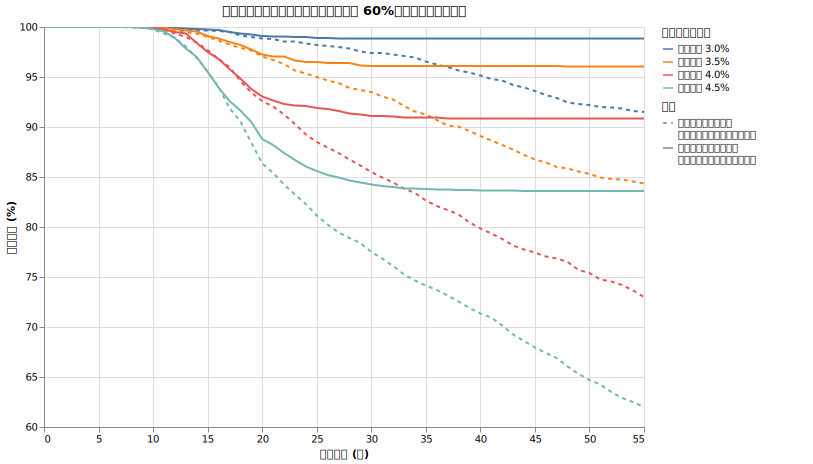
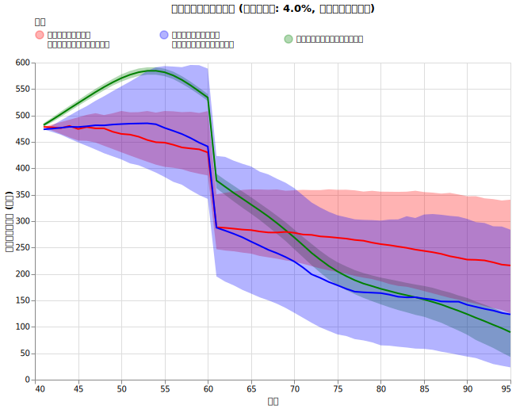
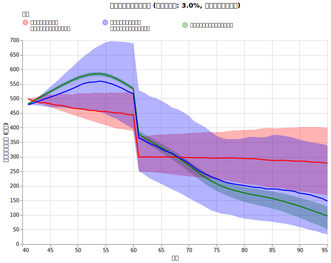

# ライフプランを考慮した動的支出（生存確率ベースのガードレール）

<!--
DO NOT DELETE:

python3 src/spend_aware_dynamic_spending_grid_main.py --exp_name v1_v2_comp
python3 src/analyze_spend_aware_dynamic_spending_main.py --exp_name v1_v2_comp
-->

[ライフプランに基づく動的資産配分（進化版ダイナミックリバランス）](spend_aware_dynamic_rebalance.md)では、将来の支出や収入の予定が分かっている場合に、全世界株式（オルカン）と無リスク資産の配分を最適化する手法を検討しました。資産の配分がライフプランに合わせて調整できるのであれば、支出の額についても同様の考え方で最適化できるはずです。

本記事では、将来のキャッシュフローを考慮した上で、生存確率を直接の指標として用いる新しい動的支出の仕組みについて解説します。

## 支出率ではなく生存確率を目標にする

これまでの[ダイナミックスペンディング（動的支出）](dynamic_spending.md)では、現在の資産残高に対して「目標とする支出率（例えば4%）の範囲に収める」という基準で支出を調整していました。しかし、この方法にはいくつかの課題があります。

一つは、目標とする支出率の根拠が必ずしも明確ではない点です。もう一つは、将来受給する公的年金や、予定されている大きな支出（住宅リフォームや介護費用など）を、現在の支出ルールに反映させることが難しい点です。

これに対し、[進化版ダイナミックリバランス](spend_aware_dynamic_rebalance.md)を検討する過程で、年齢 $N$ において支出率 $R$ を選択した時の生存確率 $P_N(R)$ を計算できるようになりました。この生存確率には、将来の年金収入やライフイベントに伴う支出の変化がすべて含まれています。

「資産の何%を取り崩すか」を考える代わりに、「95歳まで資産を維持できる確率」を目標の指標とすることで、将来の計画をより正確に反映した支出管理が可能になります。

!!! info "具体例：年金受給直前の暴落"

    58歳の時に市場が暴落し、資産が大きく減少したケースを考えます。この人は60歳から公的年金の受給が始まる予定です。

    * **支出率ベースの動的支出**: 現在の資産額が減ったため、目標支出率との乖離を防ぐために支出を大きく削減する（我慢を強いる）判断をします。
    * **生存確率ベースの動的支出**: 2年後に年金が始まるという将来情報を知っているため、現在の資産が一時的に減っても「95歳までの生存確率」はそれほど低下していないと判定します。その結果、不要な支出削減を避け、生活水準を維持することができます。

このように、生存確率を指標にすることで「将来の安心が確保されているなら、今の生活を過度に切り詰めなくてよい」という合理的な判断が自動的に行われます。

## 生存確率に基づく支出の調整ルール

毎年の年始に現在の資産と予定支出から生存確率 $p$ を計算し、以下のルールに従ってその年の支出額を決定します。

* **生存確率が下限（例：85%）を下回った場合**: 計画の維持が難しくなるリスクが高まったと判断し、生存確率が 85% に回復するまで支出額を削減します。ただし、生活への影響を考慮し、一度に削減する幅は最大 1.0% までとします。
* **生存確率が上限（例：97%）を上回った場合**: 資産が過剰に残る可能性が高いと判断し、生存確率が 97% に下がるまで支出額を引き上げます。ただし、一度に増額する幅は最大 2.0% までとします。
* **それ以外の場合**: 前年の支出額を維持し、物価上昇に合わせた調整のみを行います。

!!! info "生存確率ベースのガードレール運用例"

    以下の条件で運用を開始したケースを想定します（簡略化のため、インフレ率は0%とします）。

    * **開始時点**: 生存確率 92%（ガードレール範囲内 85% 〜 97%） / 支出 400万円
    * **調整ルール**: 上限 97% を超えたら増額（最大 +2.0%）、下限 85% を下回ったら削減（最大 -1.0%）

    **シナリオA：運用が好調な局面**

    資産が増加し、生存確率が 98% まで上昇した場合の判定です。

    * 現在の生存確率：98%
    * 判定：上限（97%）を上回ったため、生存確率を 97% に戻すための支出額を計算します。計算の結果、2.0% 以上増やしても問題ないことが分かったため、上限である 2.0% 増額し、翌年の支出を **408万円** とします。

    **シナリオB：市場の暴落と、その後の回復**

    資産が大きく減少し、その後に持ち直した場合の連続的な判定です。

    **1. 暴落時**
    * 現在の生存確率：82%
    * 判定：下限（85%）を下回ったため、生存確率を 85% に戻すための支出額を計算します。計算の結果、1.0% の削減で生存確率が 85% 以上になると分かったため、1.0% 削減して翌年の支出を **396万円** とします。

    **2. 回復時**
    * 現在の生存確率：88%
    * 判定：ガードレールの範囲内（85% 〜 97%）に戻ったため、支出額は変更せず **396万円** のまま据え置きます。

### 戦略のパラメータ設定

本記事のシミュレーションでは、以下の設定値を基準としています。

| パラメータ | 設定値 | 説明 |
| :--- | :--- | :--- |
| 生存確率の下限 ($P_{low}$) | 85% | この値を下回ると支出の削減を検討する閾値 |
| 生存確率の上限 ($P_{high}$) | 97% | この値を上回ると支出の増額を検討する閾値 |
| 調整幅の下限（削減） | -1.0% | 1年間に削減する支出額の最大幅 |
| 調整幅の上限（増額） | +2.0% | 1年間に増額する支出額の最大幅 |

## 実験

この戦略の効果を確かめるため、[ライフプランを考慮した資産配分](spend_aware_dynamic_rebalance.md) を前提とした上で、二つの支出戦略を比較します。

### シミュレーション条件

!!! info "共通設定"
    * **シミュレーション期間**: 55年 (40歳〜95歳)
    * **投資先**:
        * オルカン ([ファットテールを考慮し](fat_tails.md)、[S&P500から補完した悲観的なモデル](sp500_vs_acwi.md), [信託報酬 0.05775%](trust_fee.md))
        * ゼロリスク資産 [(利回り4%)](zero_risk.md)
    * **リバランス**: [ライフプランに基づくダイナミック最適比率](spend_aware_dynamic_rebalance.md)
    * **為替リスク**: [USDJPY (期待リターン0%, リスク10.53%)](forex.md)
    * **インフレ率**: [AR(12)粘着モデル (平均1.77%)](cpi.md)
    * **税率**: [20.315%](tax.md)
    * **ライフプラン（40歳リタイア想定）**: 
        * **年金保険料**: 60歳まで国民年金保険料を支払い (約20.4万円/年)
        * **年金受給**: 60歳から前倒し受給を開始 (基礎年金 + 厚生年金 = 約99.4万円/年。マクロ経済スライド考慮)
        * **ベース支出**: [年齢ごとの支出推移](retired_spending.md)に従う

### 比較対象の戦略

1. **支出率ベースの動的支出 (ライフプランを考慮しないダイナミックスペンディング)**:

    年始の資産残高に基づき、あらかじめ設定した「目標支出率」に対して現在の支出が収まるよう調整する戦略です。将来の年金受給時期などは考慮せず、現在の資産状況のみを見て、ベース支出を **上限 +1.0% / 下限 -1.5%** の範囲内で増減させます。

2. **生存確率ベースの動的支出 (今回の手法)**:

    年始に計算された生存確率に基づき、それが **85% 〜 97%** の範囲に収まるよう調整する戦略です。将来のキャッシュフローが自動的に計算に組み込まれます。支出の調整幅は **上限 +2.0% / 下限 -1.0%** とします。

### 実験パラメータ

初期の支出額（初期支出率）を以下の5パターンで変化させ、それぞれの戦略での生存確率と取り崩し額の推移を確認します。

* **初期支出率**: 3.0%, 3.5%, 4.0%, 4.5%, 5.0%

## 結果

### 生存確率の比較

経過年数ごとの生存確率の推移を以下に示します。

すべての初期支出設定において、生存確率ベースの動的支出は支出率ベースの動的支出よりも高い生存確率を維持しています。特に初期支出率が 4.0% 以上の設定において、生存確率の維持能力に大きな差が現れています。

また、生存確率ベースの手法では、25年目（65歳）以降、年金の受給開始やそれまでの支出調整が奏功し、生存確率がほぼ低下しなくなる（安定する）傾向が確認できます。

### 実質取り崩し額の推移

初期支出率 4.0% の場合における、「実質取り崩し額」の推移比較です。

ここでいう「実質取り崩し額」とは、物価上昇の影響を除いた初年度の価値換算での額（購買力）を指します。また、想定される支出から公的年金などの収入を差し引いた、実際にポートフォリオから引き出す必要のある正味の金額を対象としています。

グラフ内の緑色の線（ベースライン）は、動的な調整を一切行わずに計画通りの生活を維持した場合の取り崩し額を示しています。

**グラフの読み方**:
* **中央の太線**: 全試行の中央値（p50）。
* **周囲の塗りつぶしエリア**: 上位25%（p75）から下位25%（p25）までの分布範囲。

[以前の考察](dynamic_spending.md#考察生存確率を決定づける目標支出率)でも述べたように、40歳時点で初年度支出率 4.0% というのは非常に厳しいスタートです。シミュレーション内で初年度の予測生存確率は約54%と算出されるため、市場が大きく上振れない限り、この手法は生存確率85%を目指して毎年 1.0% ずつの支出削減（我慢）を強いることになります。

実際、グラフを見ると、60歳（経過年20年）時点でのベースライン（予定取り崩し額）は約540万円ですが、生存確率ベースの中央値（p50）は約440万円、下位25%（p25）は約350万円まで落ち込んでいます。下位25%のケースでは36%もの支出削減を強いられていることになります。これは、初期に設定した 4.0% という支出率が、40歳時点の資産規模に対して過大であったことを示しています。

比較として、より安定した運用が可能な **初期支出率 3.0%** の場合の推移も掲載します。

3.0% で開始した場合は安全余裕があります。生存確率ベースの手法でもベースラインに近い取り崩し額を維持しやすくなっていることがわかります。

これは、シミュレーション内部での95歳生存確率は初年度からすでに90%以上になっているためで、支出の削減をすぐには必要としないためです。ただし、暴落や高騰があった場合には支出額を適切に調整していることが、分布の幅から読み取れます。

## 考察

### 戦略の目的の違い：目標支出率か、生存確率か

以前紹介した支出率ベースの戦略は、現在の資産の一定割合（ターゲット比率）を維持するように調整を行います。そのため、その先の将来に渡って資産が維持できるかに関わらず、資産が増えれば支出を増やし、減れば減らすという挙動をとります。

一方、今回提案する生存確率ベースの戦略は、常に「95歳までの生存確率」を直接の目標としています。この目的の違いが、長期間の運用結果に差をもたらします。

### 安全性を優先した支出調整

生存確率ベースの動的支出は、常に将来を見据えた安全性を監視しています。

運用が好調であっても、それが将来の生存確率を目標上限（97%）以上に引き上げない限り、不要な支出増額は抑制されます。逆に、リスクが顕在化した場合には早期に支出を抑制し、生存確率 85% を維持しようと動きます。

結果として、生存確率ベースの手法は、支出をベースラインに近い水準で安定させつつ、必要な時だけ調整を行うことで、長期的な生存確率を大幅に改善させています。

### 結論：初期の生存確率こそが最も重要

今回の実験における最大の教訓は、支出調整の手法以上に「初期の生存確率の設定」が重要であるという点です。

確かに「生存確率ベースの動的支出」は、4.0% という高い支出率から開始しても90%以上の生存確率を達成しています。しかし、その裏側では運用の振るわないケースにおいて30%を超える大幅な生活水準の低下を強いています。

一方で、最初から生存確率が 85%〜97% の範囲に収まるような保守的な支出率（例：3.0%）でスタートした場合には、この手法は生活水準を安定させつつ将来の安心を確保するための、非常に現実的で優れた戦略となります。

「状況が悪化したら生存確率に基づいて即座に支出を絞る」という規律を運用に組み込むことは有効ですが、過度な我慢を前提とするのではなく、まずは余裕を持った計画でスタートすることが長期リタイア生活の鍵となります。
