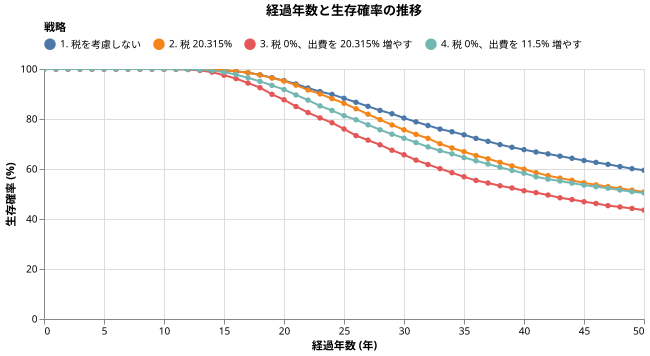
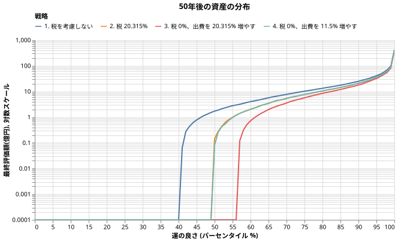

# 譲渡所得税が取り崩しに与える影響

<!-- DO NOT DELETE:
python3 src/tax_comp_main.py
-->

取り崩しを行い投資信託を売ると譲渡所得税がかかります。2026年時点で20.315%（所得税15%、復興特別所得税0.315%、住民税5%）の税率となっており、復興特別所得税は2037年まで続きます。この税率を無視したシミュレーションが多いですが、無視して大丈夫でしょうか？

!!! abstract "重要なポイント"
    * **譲渡所得税を考慮しないシミュレーションは生存確率を高く見積もりすぎてしまうため危険。**今回の設定では、考慮しない場合に比べて50年後の破産確率が約9%悪化した
    * 税金は売却額全体ではなく「利益」に対してのみかかる。暴落時（元本割れ時）には税金がゼロになる自動的なブレーキが働く。
    * 税金をシミュレーションに入れるには、取得費の正確な取り扱いが必要で少し煩雑。ただし他に良い近似がないのできちんと組み込むべき

## 利益にのみ税金がかかる仕組み

投資信託などを取り崩す（売却する）際、売却した金額すべてに税金がかかるわけではありません。「買ったときの値段（取得費）」を差し引いた「利益（譲渡所得）」に対してのみ税金がかかります。

例えば、1億円で買った投資信託が値上がりして2億円になったとします。このとき、資産全体のうち「元本部分」が半分、「利益部分」が半分という状態になります。ここから生活費として400万円分を売却した場合、売却した400万円のうち半分（200万円）が元本部分、もう半分（200万円）が利益部分とみなされます。そして、この利益部分の200万円に対してのみ約20%の税金（約40万円）がかかります。

つまり、資産が大きく成長している時ほど、売却金額に対する利益の割合が高くなり、結果として納めるべき税金も高くなるという仕組みです。

また、同じ年内に複数の売却を行い、利益が出る売却と損失が出る売却があった場合、それらを相殺（損益通算）した後の純利益に対して税金が計算されます。

??? note "シミュレーションにおける税金計算の実装"

    本シミュレーションでの税金計算は、以下のように実装しています。

    * **月次での損益通算と年次での集計:** 毎月の取り崩しで発生した売却損益（利益と損失）を累積し、1月から12月までの利益と損失を合算します。
    * **税金の支払いタイミング:** 12月末時点で年間の合計損益がプラス（利益が出ている）場合、その利益に対して税金を計算し、翌年の1月に現金から支払います。
    * **損失の繰越控除:** 実際の税制では損失を最大3年間繰り越す仕組みがありますが、実装が複雑になるため本シミュレーションでは実装していません。年末の時点で合計損益がマイナスの場合は損失を翌年に繰り越さず、0にリセットしています。損失が繰り越されない分、翌年以降に利益が出た際に税金が多く見積もられるため、実際よりもやや厳しい結果が出やすくなっています。

## シミュレーションによる検証

税金が長期の生存確率に与える影響を検証するため、以下の条件でシミュレーションを行いました。

!!! info "シミュレーションの設定"
    * 初期資産: 1億円
    * 投資先: オルカン（期待リターン7%、ボラティリティ15%）に100%投資
    * 取り崩し額: 毎年400万円
    * 物価上昇率: 1.77%固定

この基本設定に対して、以下の4つのケースを比較します。

!!! info "可変設定"

    1. 譲渡所得税を考慮しない（税率0%、NISA口座などに相当）
    2. 譲渡所得税 20.315% を計算する（特定口座などに相当）
    3. 比較: 譲渡所得税を考慮しないが、毎年の出費を20.315%増やす
    4. 比較: 譲渡所得税を考慮しないが、毎年の出費を11.5%増やす

    3. と 4. は「税金のきちんとしたシミュレーションをする代わりに、支出をX%上げることで代用できないか」という近似を求めるための設定です。

### シミュレーションの結果

50年後の生存確率の推移は以下の通りでした。

青色の税金を考慮していない場合に比べて、オレンジの税をきちんと計算する場合は、
30年後の生存確率は80.4%から75.7%へ、50年後の生存確率は59.5%から50.8%へと明確に悪化していることがわかります。

50年後の資産分布は以下の通りでした。

「1. 」と比べて「2. 」が右に寄っていることから、破綻確率が上がり残り資産が少なくなっていることが読み取れます。

つまり税金による資産への影響は大きいと言えます。

### 税金の計算をさぼれるか

税金のきちんとしたシミュレーションをさぼるために行った 3. と 4. の設定です。

* 「3. 税 0%、出費を 20.315% 増やす」場合は50年生存確率が43.5%にまで悪化しており、実際の税制よりもはるかに厳しい結果となっていることが分かります。これは、実際の税金制度には資産の目減りを防ぐブレーキ機能が備わっているためと考えられます。

    固定で出費を増やしてしまうと、運用初期の暴落時など資産が減っている苦しい時にも容赦なく多額の資金を取り崩すことになります。一方、実際の税金は「利益」にしかかからないため、暴落時（元本割れ時）には税金がゼロになり、傷口が広がるのを防ぎます。

* 「4. 税 0%、出費を 11.5% 増やす」場合は50年破産確率が49.6%となり、「2. 税 20.315%」の場合とほぼ同じ結果になっています。「11.5%」という値は50年生存確率が同じになるように選んだ結果ですが、グラフを見ると、シミュレーションの前半でだいぶ2つのグラフは乖離しています。これは運用前半では税金の影響がまだ小さいためと考えられます。

    つまり、なかなか良い近似とは言えなさそうです。

## 結論

譲渡所得税は長期の取り崩しにおける生存確率を確実に引き下げます。 ==税金を考慮しないシミュレーション結果を鵜呑みにせず、厳しめに見積もる必要があります。== また、利益が出ている時だけ税金を払うという仕組みは、暴落時の取り崩しダメージを抑える役割を果たしており、出費が一律に増えるのとは異なる特性を持っています。

税金の計算は取得費の考慮が必要となり少し煩雑ですが、近似しにくいのできちんとシミュレーションに組み込みましょう。
