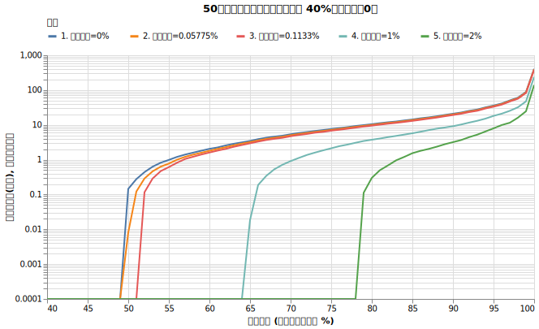
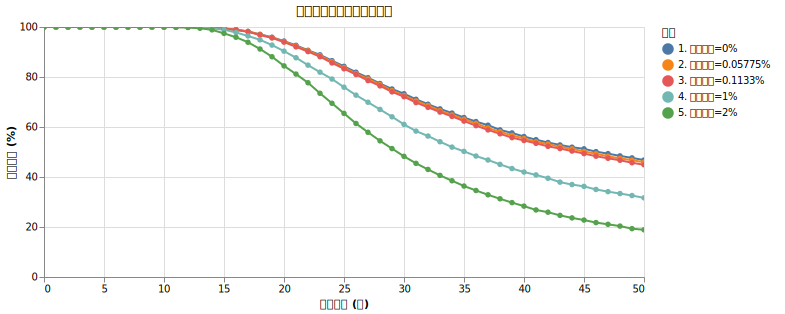

# 信託報酬が取り崩しに与える影響

これまでのシミュレーションは「リスク15%、リターン7%の金融商品」を前提としていましたが、現実の投資信託には信託報酬がかかります。切り崩し戦略で信託報酬はどれくらい重要か調べました。

!!! abstract "重要なポイント"
    * **信託報酬は「確実に発生するマイナスのリターン」として作用し、長期投資では複利効果により大きな影響を及ぼします。**
    * 現在のオルカン水準（0.05775%）であれば、生存確率を大きく損なうことはありません。
    * 一方、信託報酬が1%や2%の商品を選んでしまうと、数十年後の生存確率は急激に悪化します。

## 信託報酬によるリターンの乖離

信託報酬とは、投資信託の管理・運用の経費として保有期間中に支払い続ける手数料のことです。日々公表される基準価額は、すでに信託報酬が差し引かれた後の金額となっています。

目標とするインデックスには運用コストが存在しないため、信託報酬は「確実に発生するマイナスのリターン」として作用し、実際の投資信託のリターンはインデックスからマイナス方向へ乖離します。このわずかな手数料の差は、長期投資において複利効果により大きな影響を及ぼします。

たとえば、信託報酬が年率0.1%の場合、目標インデックスに対して30年後に約3.0%（$1 - (1 - 0.001)^{30}$）、50年後には約4.9%（$1 - (1 - 0.001)^{50}$）の乖離が生じます。信託報酬が年率1.0%であれば、30年後に約26.0%、50年後には約39.5%の乖離となり、本来得られたはずの資産の約4割を失う計算になります。

## シミュレーションによる検証

信託報酬が長期の生存確率に与える影響を検証するため、以下の条件でシミュレーションを行いました。

!!! info "シミュレーションの設定"
    * 初期資産: 1億円
    * 投資先: オルカン（期待リターン7%、ボラティリティ15%）に100%投資
    * 取り崩し額: 毎年400万円
    * 物価上昇率: 1.77%固定
    * 譲渡所得税: 20.315%を計算する

この基本設定に対して、信託報酬のみを以下の5つのパターンに変化させて比較します。

1. 0%
2. 0.05775%（2026年3月時点のeMAXIS Slim 全世界株式（オール・カントリー））
3. 0.1133%（2023年時点のeMAXIS Slim 全世界株式（オール・カントリー））
4. 1%
5. 2%

??? note "シミュレーションにおける信託報酬計算の実装"

    * **年率の月次換算:** 設定された年率の信託報酬を12で割り、月次の信託報酬率を算出します。
    * **毎月の価格への反映:** 毎月の資産の変動（リターン）を掛け合わせる際に、そのリターンの倍率から直接月次の信託報酬率を差し引くことで、基準価額の目減りを再現しています。（`倍率 = 1.0 + (レバレッジ × リターン) - 月次信託報酬率`）

### 結果

50年後の資産の分布と破産確率の推移は以下の通りです。

{!data/trust_fee/result.md!}

表を見ると、信託報酬0%と現在のオルカン水準である0.05775%の推移はほぼ一致しており、50年後の破産確率への影響も1%未満にとどまることが確認できます。一方、信託報酬が1%や2%に上昇すると、生存確率は急激に悪化します。

### 資産分布の比較

信託報酬1%（水色）や2%（緑色）の線は、0%（青色）と比べて右寄りに分布しており、資産が大きく減少していることがわかります。

### 生存確率の比較

信託報酬が高くなるにつれて、生存確率のグラフが急激に下へと落ち込んでいくことが確認できます。

## 考察

シミュレーション結果から、以下の事実が確認できます。

### 現在の低コストファンドは非常に優秀

信託報酬0%と現在のオルカン水準（0.05775%）の推移はほぼ一致しており、30年後や50年後の破産確率への影響も数パーセント以内にとどまります。現在の水準であれば、生存確率を大きく損なうことはありません。

### 1%以上の信託報酬は致命的

信託報酬0%と1%を比べると、30年破産確率は24.3%から35.4%へ、50年破産確率は49.2%から64.8%へと悪化します。信託報酬2%の場合、30年で約半数（48.3%）が破産し、50年後には78.5%が破産する結果となります。わずか数パーセントの手数料の違いが、長期的な生存確率を大きく左右しています。

## 結論

信託報酬は確実に発生するマイナスのリターンであり、長期の取り崩し戦略においては、==信託報酬を極力低く抑えることが資産寿命を維持する上で極めて重要です。== 手数料の高い商品を選ぶことは、それだけで大きなリスク要因となります。
