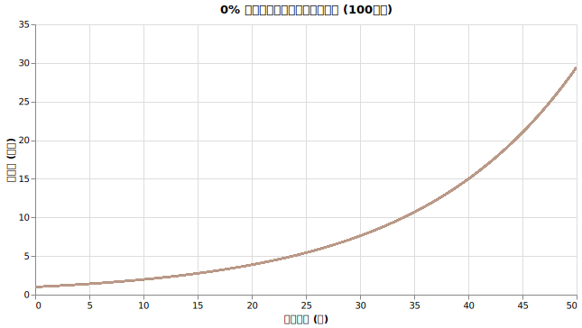
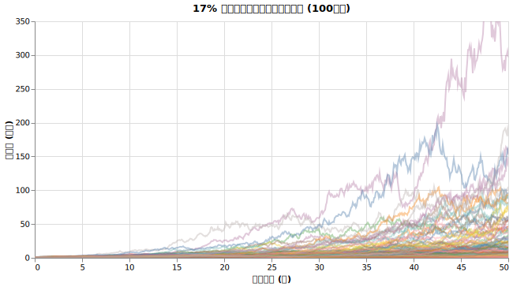
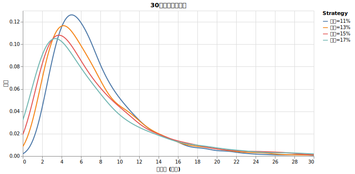
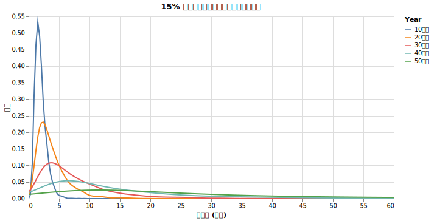
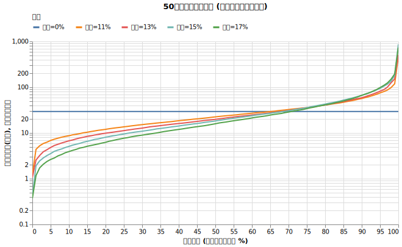
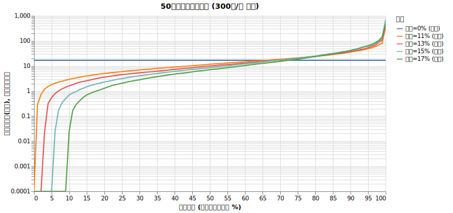

# ボラティリティが長期投資に与える影響

資産運用・取り崩しのシミュレーションにおいて、ボラティリティ（価格の振れ幅）を考慮しないことは、現実とかけ離れた楽観的な予測を導きます。 ==ボラティリティの組み込みはシミュレーションにおいて必須です==。

!!! abstract "重要なポイント"
    * 投資における「リスク」は危険性ではなく、価格の上下の振れ幅（ボラティリティ）を指す。
    * **リターンが同じでも、ボラティリティが高いほど運用結果の中央値は低くなる。**例えば、算術リターン7%でもボラティリティが17%あると、実際の成長率（幾何平均）は約5.5%まで低下する。
    * **毎年一定の利回りで増え続けるという固定リターンのシミュレーションは現実と乖離した楽観的な結果を生む。**固定リターンの場合と同等かそれ以上に資産が成長する確率は約30%しかない。
    * **運用しながら定額を取り崩す場合、ボラティリティの影響で資産が枯渇する確率が大きく上がる。**初期資産の4%相当分を物価上昇を考えず50年間取り崩す場合、ボラティリティ0%なら資産は枯渇しないが、ボラティリティ15%の環境下では17%の確率で資産が枯渇する。

## 背景：なぜボラティリティを考慮すべきか

ライフプランシミュレーションでは、運用利回り（リターン）を固定値として扱っているものが多いです。しかし、株式などの資産は一定の比率で滑らかに増え続けることはありません。

投資の世界では、この価格の振れ幅を「ボラティリティ」と呼びます。一般的に「リスク」という言葉は危険性を指しますが、金融理論ではこのボラティリティのことをリスクと定義します。ボラティリティを無視したシミュレーションは、常に平均的なリターンが得られると仮定するため、現実の資産推移に比べて極めて楽観的な予測となります。

ボラティリティを考慮しないことが、将来の計画においてどれほど不確実性を無視した行為であるか、具体的な数値で確認していきます。

## 検証：ボラティリティの変化による資産推移の差
初期資産1億円を年リターン7% (オルカン想定) で50年間運用した場合を想定し、ボラティリティ（0%〜17%）の違いが最終資産額にどう影響するかをシミュレーションしました。今回は全く取り崩ししていません。

### モンテカルロシミュレーション

モンテカルロシミュレーションとは、乱数を用いて確率的な事象を繰り返し計算し、将来の可能性の分布を求める手法です。今回の分析では、毎月のリターンが一定の確率分布（対数正規分布）に従うと仮定し、数千回以上の試行を行うことで、将来の資産額のブレ幅を可視化しています。

実際にどのような値動きをするのか見てみましょう。ボラティリティ0%の資産推移はこちらです。

価格の変動がないため、すべての試行が同じ経路をたどり、一直線に資産が増加します。これは現実にはあり得ない、理想的な状況を仮定した場合の結果です。

現実の株式相場に近い、ボラティリティ17%の資産推移を確認します。

試行ごとに値動きが大きく異なり、最終的な資産額に巨大なばらつきが生じています。一直線に増えることはなく、長期的に低迷する期間や、逆に急激に上昇する期間が含まれます。

次に、30年後の資産額の分布をボラティリティ別に比較したヒストグラムを示します。

ボラティリティ0%の場合は全てのケースで8億円になるので、グラフからは除外してあります。ボラティリティが高くなるにつれて分布が左側（資産額が少ない方向）に偏りながら、右側（資産額が多い方向）へ長く裾野が広がっていく様子がわかります。

さらに、年率7%・ボラティリティ15%の設定で、運用期間（10年〜50年）による分布の変化を示した結果が以下の図です。

運用期間が長くなるほど、結果のばらつき（リスク）はさらに拡大し、不確実性が高まっていくことが確認できます。つまり、運が良ければ資産が大きく増える可能性はありますが、そうならない確率のほうが高いです。

### シミュレーション結果（最終資産額）

さて、運の良さごとに実際の50年後の資産額を見てみましょう。

{!data/volatility/result.md!}

このように結果がブレるのは、価格が下落した際に元の水準に戻るためには、下落率よりも大きな上昇率が必要になる（例：50%下落すると100%の上昇が必要）という数学的性質があるためです。ボラティリティが高いほど、この「負の複利効果」が強まり、全体の中央値が押し下げられます。

具体的にどういう風に価格が動くのかを図示したものが以下となります。

### 運の良さと資産額の関係
横軸に運の良さ（パーセンタイル）、縦軸に50年後の最終資産額（対数スケール）を示した結果はこちらです。

横軸は、シミュレーション結果を最も不運なケース（左端）から最も強運なケース（右端）まで並べたものです。右端5%のケースでは資産は100億円を超え、資産が100倍になることを示しています。

もともと1億円からスタートしているため、極端に運が悪いケースを除き、50年後には元の1億円を上回る結果となっています。しかし、ボラティリティの大きさによって、資産が大きく増える確率は異なります。

**資産が10倍になる確率**

{!data/volatility/prob_10x.md!}

**資産が100倍になる確率**

{!data/volatility/prob_100x.md!}

表から分かるように、資産が10倍程度に増える（適度な成功）確率はボラティリティが低い方が高いです。一方で、資産が100倍に達する（大成功）確率はボラティリティが高い方が高くなります。

## 分析結果
シミュレーションから、以下の事実が分かります。

1. **ボラティリティは中央値を引き下げる**
   
    ボラティリティが高くなるほど、中央値（運が普通の場合の結果）はボラティリティ0%の場合よりも低くなります。これは、幾何平均が算術平均を下回るという数学的性質によるものです。

2. **「期待通り」になる確率は低い**
   
    ボラティリティ0%のライン（グラフの青い横線）と他の条件が交差するのは、おおよそ上位30%の地点です。つまり、固定リターンの予測を達成できる確率は約3割しかありません。

3. **高ボラティリティは大成功の要因になる**
   
    運が非常に良い（上位10%以上）場合に限り、高いボラティリティは資産を大きく増加させる要因となります。

## 切り崩しを行った場合

これまでのシミュレーションは「運用のみ」で取り崩しを行わないケースでしたが、運用しながら定期的に一定額を取り崩す場合、ボラティリティの影響はさらに大きくなります。インフレや税金を考慮せず、毎年400万円を**定額**(インフレなし)で取り崩した場合のシミュレーションを行った結果はこちらです。
    
{!data/volatility/withdrawal_result.md!}

0.0億円という数字が見えますが、**これはシミュレーションの途中で資産が枯渇している場合です**。ボラティリティ=0%だと決して資金は枯渇しないどころか12.7億まで増えるわけですが、ボラティリティが高ければ高いほど資産枯渇の割合が高まるのがわかりますね。

グラフで見てみましょう。

左下の、y=0.0001のラインに接してしまっている部分は資産枯渇の状況です。ボラティリティ=15%の場合(水色の線)、50年の間に17%の確率で破産しているのがわかります。

ボラティリティが低いほど資産の枯渇（0円以下になること）を回避できる確率が高くなります。逆にボラティリティが高い場合、下落局面で定額を取り崩すことで資産額が急減し、その後の回復局面でも元本が減っているために上昇の恩恵を受けにくくなります。

結果として、同じ平均リターンであっても、ボラティリティが高い環境下での固定額取り崩しは、資産の寿命を大きく縮める要因となります。

ボラティリティは運用結果の中央値を押し下げますが、取り崩しにおいてはリターンが「いつ」発生するか、つまり収益率の順序も極めて重要です。これについては[収益率配列のリスク](sequence.md)にまとめました。

<!--
TODO: Add links to other md files.

この実験ではボラティリティの威力を見るために、現実世界の様々な要素を無視しています。 -> cpi.md
-->

## シミュレーションの数学的な背景

本シミュレーターの内部的な計算方法と、なぜボラティリティが資産の中央値を押し下げるかについての数学的な解説です。

??? なぜボラティリティが上がると中央値が下がるのか

    投資信託の目論見書などで「リターン7%、リスク（ボラティリティ）15%」と記載されている場合、これは通常、過去の月次または日次の「単純リターン（算術平均）」を年率換算した数値とその標準偏差を指します。

    算術平均リターンとは、ある期間の価格変化率（$\frac{価格_{t+1}}{価格_t} - 1$）の単なる平均値です。
    
    しかし、長期的な資産形成において実際に手元に残る金額（最も確率が高い中央値）に直結するのは「幾何平均リターン」です。
    
    幾何平均リターンとは、複数期間にわたる複利効果を考慮した、1期間あたりの平均成長率のことです。各期間のリターンを $R_i$ としたとき、以下の数式で定義されます。

    $$\left( \prod_{i=1}^{n} (1 + R_i) \right)^{\frac{1}{n}} - 1$$

    長期運用では価格が下落した際に元の水準に戻るためには、下落率よりも大きな上昇率が必要になる（例：50%下落すると100%の上昇が必要）ため、複利の幾何平均リターンは必ず算術平均リターンより低くなります。この幾何平均リターンによって計算される運用結果が、確率分布における「最もありふれた結果（中央値）」と一致します。

    算術平均リターンを $\mu$、その標準偏差（ボラティリティ）を $\sigma$ とした場合、幾何平均リターン $g$ は、近似的に以下の式で表されます。

    $$g \approx \mu - \frac{\sigma^2}{2}$$

    この式が示す通り、算術平均リターン $\mu$ が一定でも、ボラティリティ $\sigma$ が大きくなるほど右辺のマイナス項が大きくなります。これが、ボラティリティが高いほど最終的な資産額の中央値が低くなる数学的な理由です。

??? 価格のマイナス化を防ぐシミュレーション計算手法

    シミュレーターを自作する際、単純リターン（算術平均）が正規分布に従うと仮定して乱数（サンプリング）を生成すると、2つの問題が生じます。

    1. **価格がマイナスになる可能性**
        正規分布はマイナス無限大まで値を取るため、単純リターンが-100%（-1.0）を下回る確率が存在します。これにより、株式の価格がゼロを下回るという現実にはあり得ない事態が発生します。
    2. **長期的なリターンの乖離**
        単純リターンをそのまま毎月掛け合わせると、長期のシミュレーションにおいてリターンが過大評価される傾向があります。

    これを避けるため、金融工学（ブラック・ショールズ・モデルなど）では、一般的に資産価格の推移を「幾何ブラウン運動（GBM）」としてモデル化します。GBMでは、対数リターン（$\ln\frac{価格_{t+1}}{価格_t}$）が正規分布に従うと仮定します。これにより、価格は自然にゼロで下限が切られ、マイナスになりません。

    本シミュレーターでは、入力された年次の算術リターン（$\mu$）と算術ボラティリティ（$\sigma$）から、直接GBMのパラメータ（対数リターンの期待値 $\mu_{log}$ とボラティリティ $\sigma_{log}$）に正確に変換し、月次の価格推移を生成しています。ここで求める $\mu_{log}$ が、シミュレーション上の厳密な幾何平均リターン（連続複利ベース）に相当します。

    **変換式と計算の具体例**

    $$\sigma_{log} = \sqrt{\ln\left(1 + \left(\frac{\sigma}{1 + \mu}\right)^2\right)}$$

    $$\mu_{log} = \ln(1 + \mu) - \frac{\sigma_{log}^2}{2}$$

    例えば、年率算術リターン 7% ($\mu = 0.07$)、算術ボラティリティ 17% ($\sigma = 0.17$) の場合：

    $$\sigma_{log} = \sqrt{\ln\left(1 + \left(\frac{0.17}{1.07}\right)^2\right)} \approx 0.1578$$

    $$\mu_{log} = \ln(1.07) - \frac{0.1578^2}{2} \approx 0.06766 - 0.01245 \approx 0.0552 \text{ (5.52%)}$$

    ここで求まった $\mu_{log}$ (5.52%) が、シミュレーションにおける資産成長の**中央値のベースとなる利回り**です。この利回りで50年運用した結果（$\exp(0.0552 \times 50)$）は資産約15.8倍となり、シミュレーション結果の中央値と概ね一致します。

    1ヶ月の期間を $dt = 1/12$ とすると、月次の価格変化率 $R_m$ は以下の式で生成されます。

    $$R_m = \exp\left( \mu_{log}dt + \sigma_{log}\sqrt{dt}Z \right) - 1$$

    ここで、$Z$ は標準正規分布に従う乱数です。この計算を毎月繰り返すことで、指定された算術平均リターンとボラティリティを保ちつつ、価格がマイナスにならない現実的な資産推移を再現しています。

