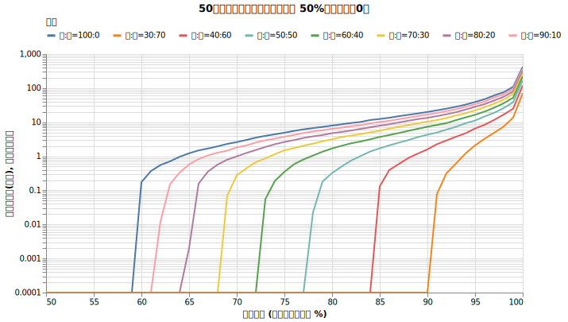
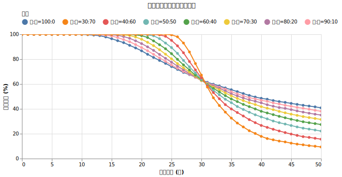
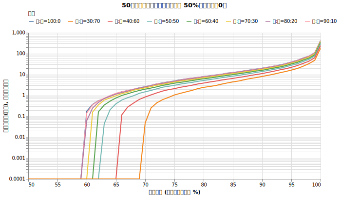
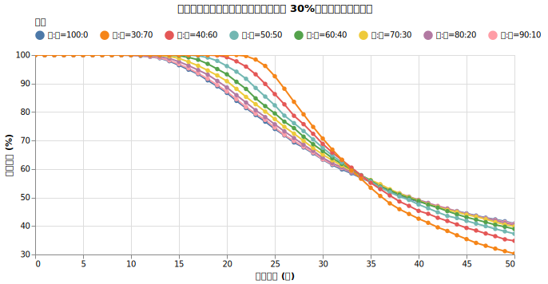

# 生存確率を上げる戦略： 無リスク資産を持つ

現金とは異なり、利回りのある「無リスク資産」をポートフォリオに組み入れた場合、生存確率にどのような影響があるでしょうか。本記事では、米国の短期国債などを想定した無リスク資産の保有効果と、その取り崩し順序の重要性を検証します。

!!! abstract "重要なポイント"
    * **実質リターンがプラスの無リスク資産は、現金よりも生存確率を高める。** インフレ率を上回る実質リターンがある資産を持つことで、資産の枯渇を大幅に遅らせることが可能。
    * **取り崩しの順序が生存確率を左右する。** 無リスク資産を「後に残す」のではなく「先に使う」ことで、運用初期の暴落リスク（収益率配列のリスク）から成長資産を守ることができる。
    * **超長期の運用では成長資産の比率が重要。** 50年以上の超長期を想定する場合、無リスク資産の比率を高めすぎると、インフレと取り崩しのペースに追いつけなくなるリスクが生じる。

## 無リスク資産とは

さて、今まで「現金」と呼んでいたものは、金利が0%でインフレに負け続ける資産でした。しかし、現実の世界には「無リスク資産」と呼ばれる、価格変動が極めて小さく、かつ一定の利回りを得られる資産が存在します。

例えば、米国の短期国債（T-Bill）はその代表例です。ETFでは **BIL** (SPDR Bloomberg 1-3 Month T-Bill ETF) などが有名で、これらは米国の政策金利に連動した利回り（最近では 4〜5% 程度）を得ることができます。国内であれば、厳密には無リスクではありませんが、J-REIT（不動産投資信託）やインフラファンド、あるいは高格付けの社債なども、価格変動をある程度抑えつつ3〜5%程度の安定した利回りを狙えるアセットクラスとして候補になります。

現代ポートフォリオ理論では、リスク資産（株など）と無リスク資産（国債など）を組み合わせることで、期待リターンを維持しつつポートフォリオ全体のボラティリティを下げることができるとされています。

先ほどの「現金（金利0%）」を「無リスク資産（金利 4%）」に置き換えた場合、生存確率がどう変化するかを見てみましょう。インフレ率 2% に対して、利回り 4% ということは、実質リターンがプラスになる資産を持つということです。

## 実験1: オルカンを先に切り崩す

この実験では、まず初年度に1億円をオルカンと無リスク資産に割り振ります。

切り崩す際にはオルカンを先に使い切り、その後で無リスク資産を取り崩していく戦略を検証します。

!!! info "シミュレーションの設定"
    * **初期資産**: 1億円
    * **投資先**: オルカン (7%, 15%) + 無リスク資産 (利回り 4%)
    * **取り崩し額**: 毎年400万円 (物価連動)
    * **物価上昇率**: 年率 1.77% 固定
    * **譲渡所得税**: 20.315% (無リスク資産の利回りにも適用)
    * **信託報酬**: 0.05775% (オルカンのみ)

これらの設定の中で、以下を変更します。

!!! info "試した設定"
    * 初期資産のうち何%をオルカンに割り当てるか (100% 〜 30%)
    * 現金化の優先順位: オルカン → 無リスク資産

!!! tip "シミュレーション内部の補足"
    * 無リスク資産は年利回り4%相当の配当が毎月配られますが、譲渡所得税が源泉徴収されます
    * 無リスク資産の金額も、配当の金額も為替とは連動しません。配当利回りも固定の理想的な無リスク資産だとします。
    * 無リスク資産を取り崩す際、価額が変わらないため譲渡所得は発生しません。

### 結果

シミュレーションの結果は以下の通りです。

{!data/zero_risk/exp1_result.md!}

### 考察

内部的には複雑なシミュレーションをしていますが、とてもきれいなグラフが出てきました。

[現金比率のシミュレーション](cash_ratio.md)の時と同じ、「ある年を境に傾向が変わる」現象が確認できます。

**無リスク資産を持てば持つほど31年目までの生存確率は上がり、31年以降の生存確率が下がる**という現象が見られます。

1. **31年までの生存（初期の暴落への耐性）**:
   31年という期間では、主な破綻要因は「運用初期の暴落」です。無リスク資産（実質利回り 約3.18%）の利払いにより、下落局面で株を売却せずに済みます。トリニティ・スタディが30年を基準としていたため、債券を組み入れる有効性が示されたのはこのためです。実際、30年破綻確率は「オルカン 50%」の方が 100%株よりも低くなっています。

2. **50年までの生存（成長不足のリスク）**:
   しかし、50年という超長期では「複利成長の差」が生存確率を決定します。
   * **維持に必要なリターン**: インフレ率 1.77% で 4% を取り崩すには、名目で約 5.77% 程度の利回りが必要です。
   * **期待リターンの差**: オルカン 100% なら 7% ですが、50/50 分散だとポートフォリオ全体の期待リターンは 5.1% 程度（0.5 * 7% + 0.5 * 3.18%）まで下がります。
   
つまり、50/50 のポートフォリオは「短中期は安定しているが、長期的にはリターン不足で確実に枯渇する」という性質を持っています。30年なら安定性のメリットが成長不足のデメリットを上回りますが、50年というスパンでは成長不足が資産枯渇の直接的な原因となります。

## 実験2: 無リスク資産を先に切り崩す

実験2では、実験1の設定はほとんど一緒で、資産を売る順番だけを変えます。まず無リスク資産を優先的に取り崩し、それが底をついてからオルカンを売却する戦略を検証します。

### 結果

シミュレーションの結果は以下の通りです。

{!data/zero_risk/exp2_result.md!}

### 考察

こちらも「ある年を境に傾向が変わる」という点では結果は似ています。

**無リスク資産を持てば持つほど34年目までの生存確率は上がり、34年以降の生存確率が下がる**という現象が見られます。

実験1と実験2を比較すると、**「無リスク資産を先に使う（実験2）」方が、長期的な生存確率が大幅に高くなる**ことがわかります。

例えばオルカン50%・無リスク資産50%の構成で比較すると、以下のようになります：

*   **30年破産確率**: 実験1 (36.1%) vs **実験2 (32.6%)**
*   **50年破産確率**: 実験1 (77.9%) vs **実験2 (62.7%)**

なぜこれほどの差が出るのでしょうか？その理由は「期待リターンの高い資産をいつ手放すか」にあります。

株を先に売る戦略（実験1）は、リターンの源泉である株を先に手放します。そのため、最終的に「インフレ率（1.77%）＋取り崩し率（4%）」の出費よりも低い、利回り（3.18%）の資産だけが残るからです。この状態では、数学的に必ず資産がゼロに向かって減り続けます。

一方、無リスク資産を先に使う戦略（実験2）は、長期の生存確率を上げることができます。無リスク資産を、運用初期の支出に充てることで、株の安値売りを回避できるからです。その間に株が成長すれば、後半の取り崩しに耐える資産を残せる可能性が高まります。

## 結論：目標とする年数で戦略が変わる

今回の検証から分かるのは、目標とする期間によって最適な戦略が変わるという事実です。

生存確率が逆転する「31年」や「34年」という数字は、今回の設定（利回り4%、インフレ1.77%など）に基づく結果であり、不変の定数ではありません。期待リターンやインフレ率が変われば、この分岐点も前後します。

重要なのは数字そのものではなく、短中期と超長期では資産が枯渇する要因が異なる点です。

30年程度の生存を目標とするなら、無リスク資産を一定割合持ち、それを温存する戦略（実験1）でも、100%株より高い生存率を確保できます。運用初期の変動を吸収できれば、30年という期間であれば資産を維持できる可能性が高いためです。

しかし、50年以上の生存を目指すなら、無リスク資産は「最後に残すもの」ではなく「最初に使い切るもの」として扱う必要があります。利回りの低い資産を最後に残しても、インフレと定額取り崩しの合計を利回りが下回れば、資産寿命は数学的に尽きてしまうためです。

無リスク資産を組み入れる場合は、運用初期の価格変動を吸収するためのバッファーとして使い切り、長期的な成長は株に任せるのが合理的な判断です。

