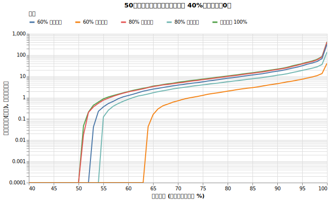
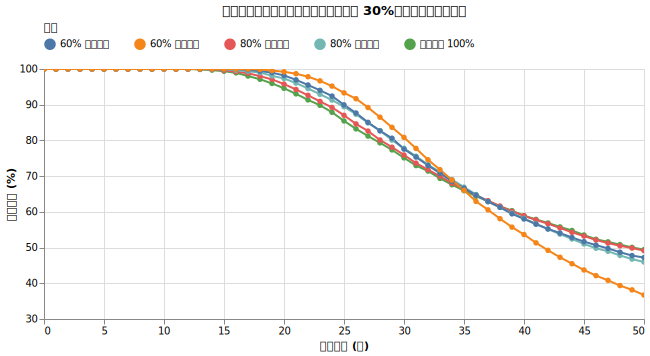
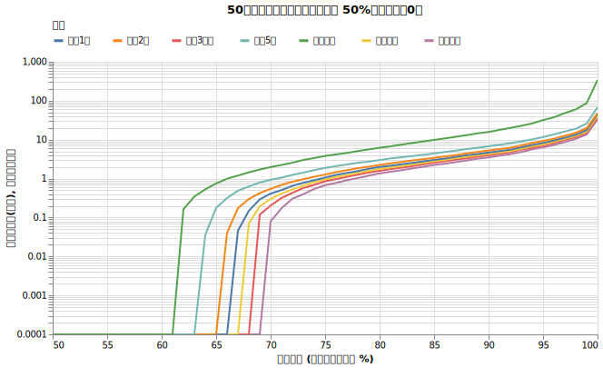
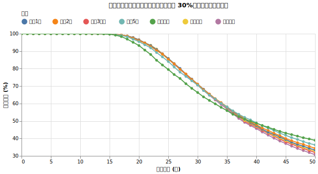

# 無リスク資産とのリバランス

[現金とのリバランス](cash_rebalance.md)では、リバランスを行うことで長期的な生存確率が低下することを確認しました。では、利回りのある無リスク資産（4%）を組み合わせた場合、リバランスの効果はどう変わるでしょうか。

!!! abstract "重要なポイント"
    * **無リスク資産とのリバランスは、30年程度の生存確率を向上させる。** 現金（利回り0%）の場合とは異なり、利回りのある資産とのリバランスは中期間の安定に役立つ。
    * **目標とする運用期間によって最適な戦略が分かれる。** 中期間ならリバランスが有効だが、50年を超えるような超長期ではリバランスをしない方が生存確率は高くなる。今回のシミュレーション（利回り4%・インフレ1.77%）では36~38年目にその分岐点が現れた。
    * **超長期ではリバランスをせず、株式比率の上昇を受け入れる方が合理的。** 期待リターンの高い株式の比率が自然に増えていく状態を維持することが、50年以上の資産枯渇を防ぐ。

## 実験1: リバランスの有無と資産比率

オルカン（株式）と無リスク資産（4%）の比率を変え、リバランスの効果を検証します。売却順序は「無リスク資産を先に使う」で固定しています。

!!! info "シミュレーションの設定"
    * **初期資産**: 1億円
    * **投資先**: オルカン (7%, 15%) + 無リスク資産 (利回り 4%)
    * **為替リスク**: あり（ドル円 0%, 10.53%）
    * **取り崩し額**: 毎年400万円（物価連動）
    * **物価上昇率**: 年率 1.77%固定
    * **譲渡所得税**: 20.315%
    * **信託報酬**: 0.05775%

!!! info "試した設定"
    * オルカンの比率（100%、80%、60%）
    * リバランスの有無（毎年リバランスする、まったくしない）
    * 売却順序：無リスク資産を先に使う

### 結果

{!data/zero_risk_rebalance/rebalance_effect_result.md!}

### 考察

この章で何度も出てきている「ある年を境に傾向が変わる」現象が確認できます。

1. **38年目以前では無リスク資産を増やし、リバランスを行うほど生存確率が上昇する**:

   * オレンジ (毎年リバランス)と紺色 (リバランス無し)を比べると、リバランスする方が38年目生存確率が格段に上がっています。
   * オレンジ (オルカン60%)と水色 (オルカン80%)を比べると、60%の方が38年目生存確率が格段に上がっています。

1. **38年目以降では全く逆の傾向**

   * 38年目以降ではオルカン100%、無リスク資産一切無しの方が生存確率が上がっています。無リスク資産を増やしたり、リバランスをすればするほど生存確率は下がります。

これは[「現金のリバランス」](cash_rebalance.md)で見た現象と同様です。名目4%の取り崩しに加えて1.77%のインフレが進む環境では、資産を維持するために名目で約5.77%以上の利回りが必要です。利回り4%の無リスク資産は、単体ではこのペースに追いつけず、長期的には資産枯渇の要因となります。リバランスによって、より高い成長が期待できる株式から無リスク資産へ資金を移し続けることは、ポートフォリオ全体の期待リターンを下げ、50年時点の生存確率を低下させる結果を招きます。

## 実験2: リバランスの頻度

次に、オルカン 60% / 無リスク資産 40% のポートフォリオにおいて、リバランスの頻度が生存確率に与える影響を検証します。売却順序は「無リスク資産を先に使う」で固定しています。

### 結果

{!data/zero_risk_rebalance/rebalance_freq_result.md!}

### 考察

これも同じく36年前後を境に戦略の効果が反転しています。

*   **36年目まで**: リバランスを行うことで、生存確率が高くなる傾向があります。ただし頻度による差はわずかです。
*   **36年目以降**: 逆に、リバランスの頻度が高ければ高いほど、生存確率は低下します。リバランスをしない、あるいは5年などの低い頻度で行う方が、長期的な生存確率を高めています。

これは、中期的にはポートフォリオの安定化が効く一方で、長期的には高リターン資産の比率を高めることが資産枯渇を防ぐ鍵になることを示しています。

## 結論

[「現金比率をリバランスする」](cash_rebalance.md)の検証では、リバランスを行うこと自体が不利な戦略であるという結論でした。しかし、利回り4%の無リスク資産を用いる場合、その結論は「目標とする期間」によって変わります。

現金と無リスク資産の最も大きな違いは、戦略の優位性が逆転するまでの期間です。

*   **現金（利回り0%）の場合**: 約23年でオルカン100%が優位になる。
*   **無リスク資産（利回り4%）の場合**: 約36〜38年までリバランス戦略の優位性が続き、それ以降はオルカン100%が優位になる。

この結果は、自分が何年先の生存確率を重視するかで、取るべき戦略が明確に分かれることを示しています。

*   **30年程度の生存を目標とする場合**: 無リスク資産を組み入れ、定期的にリバランスを行うことで、運用初期の暴落に対する安定性を高めることができます。
*   **50年以上の超長期を目標とする場合**: リバランスをせず、株式の成長による比率上昇を受け入れる方が、最終的な生存確率を高めることができます。

無リスク資産を持つことは短中期の安定に役立ちますが、長期的には株式のリターンに追いつけず、資産が尽きる確率を上げます。自分の目指す運用期間に合わせて、資産構成とリバランスの有無を選択する必要があります。
